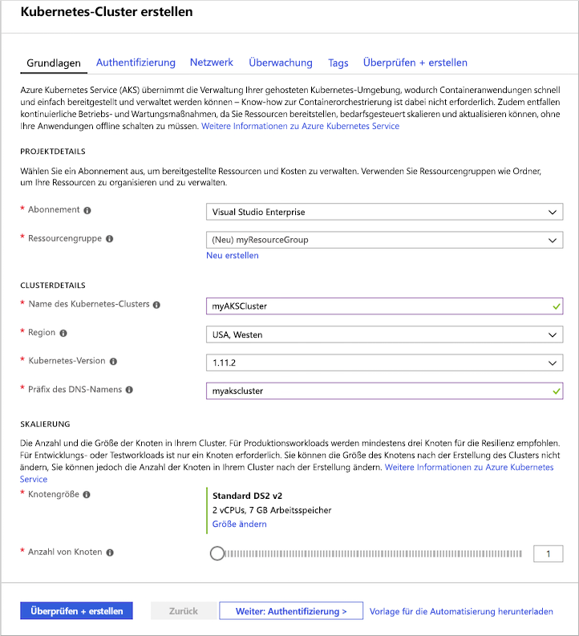
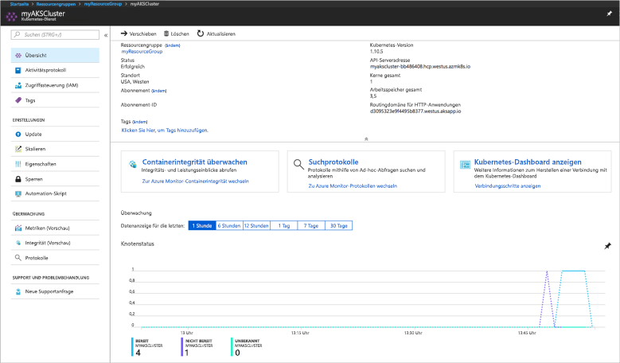
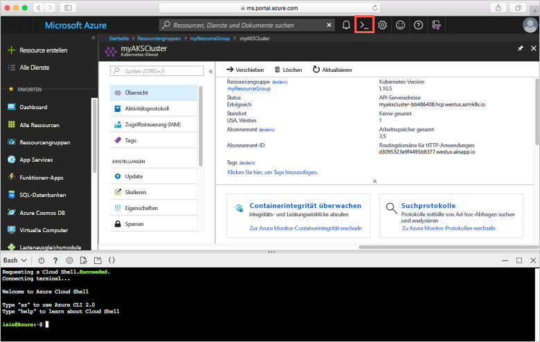
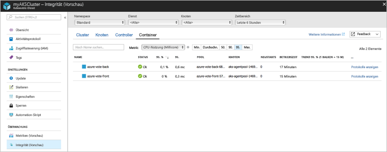
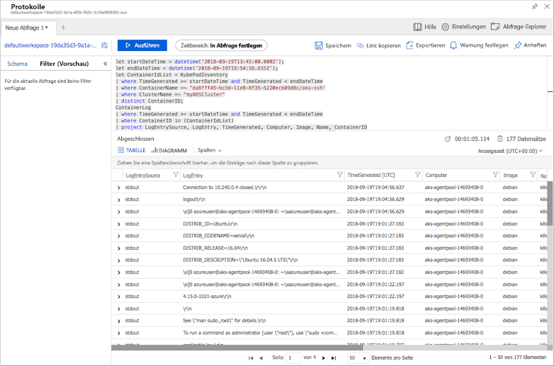

# <a name="quickstart-deploy-an-azure-kubernetes-service-aks-cluster-using-the-azure-portal"></a>Schnellstart: Bereitstellen eines AKS-Clusters (Azure Kubernetes Service) über das Azure-Portal

Azure Kubernetes Service (AKS) ist ein verwalteter Kubernetes-Dienst, mit dem Sie schnell Cluster bereitstellen und verwalten können. In dieser Schnellstartanleitung stellen Sie einen AKS-Cluster mit dem Azure-Portal bereit. In dem Cluster wird eine Anwendung mit mehreren Containern ausgeführt, die ein Web-Front-End und eine Redis-Instanz enthält. Sie erfahren dann, wie Sie den Zustand des Clusters und der Pods überwachen können, in denen Ihre Anwendung ausgeführt wird.


Für diese Schnellstartanleitung werden Grundkenntnisse in Bezug auf die Kubernetes-Konzepte vorausgesetzt. Weitere Informationen finden Sie unter [Grundlegende Kubernetes-Konzepte für Azure Kubernetes Service (AKS)][kubernetes-concepts].

Wenn Sie kein Azure-Abonnement besitzen, können Sie ein [kostenloses Konto](https://azure.microsoft.com/free/?WT.mc_id=A261C142F) erstellen, bevor Sie beginnen.

## <a name="sign-in-to-azure"></a>Anmelden bei Azure

Melden Sie sich unter https://portal.azure.com beim Azure-Portal an.

## <a name="create-an-aks-cluster"></a>Erstellen eines AKS-Clusters

Klicken Sie im Azure-Portal oben links auf **+ Ressource erstellen** > **Kubernetes Service**.

Führen Sie zum Erstellen eines AKS-Clusters die folgenden Schritte aus:

1. **Grundlagen**: Konfigurieren Sie die folgenden Optionen:
   - *PROJEKTDETAILS*: Wählen Sie ein Azure-Abonnement und dann eine Azure-Ressourcengruppe aus, bzw. erstellen Sie eine Ressourcengruppe, z.B. *myResourceGroup*. Geben Sie unter **Kubernetes cluster name** (Name des Kubernetes-Clusters) einen Namen ein, etwa *myAKSCluster*.
   - *CLUSTERDETAILS*: Wählen Sie eine Region, eine Kubernetes-Version und ein DNS-Namenspräfix für den AKS-Cluster aus.
   - *SKALIERUNG*: Wählen Sie eine VM-Größe für die AKS-Knoten aus. Die VM-Größe kann **nicht** geändert werden, sobald ein AKS-Cluster bereitgestellt wurde.
       - Wählen Sie die Anzahl von Knoten für die Bereitstellung im Cluster aus. Legen Sie für diese Schnellstartanleitung für **Anzahl von Knoten** die Option *1* fest. Die Knotenanzahl **kann** nach der Clusterbereitstellung angepasst werden.
    
     

     Klicken Sie auf **Weiter: Authentifizierung**, wenn der Vorgang abgeschlossen ist.

1. **Authentifizierung**: Konfigurieren Sie die folgenden Optionen:
   - Erstellen Sie einen neuen Dienstprinzipal, oder *konfigurieren* Sie einen vorhandenen. Bei der Verwendung eines vorhandenen Dienstprinzipalnamens müssen Sie die SPN-Client-ID und das Geheimnis angeben.
   - Aktivieren Sie die Option für die rollenbasierte Zugriffssteuerung (Role-Based Access Control, RBAC) für Kubernetes. Diese RBAC-Funktionen ermöglichen eine präzisere Steuerung des Zugriffs auf die im AKS-Cluster bereitgestellten Kubernetes-Ressourcen.

     Standardmäßig werden *Basis*-Netzwerke verwendet, und Azure Monitor für Container ist aktiviert. Wählen Sie **Überprüfen + erstellen** und danach **Erstellen**.

Es dauert einige Minuten, bis der AKS-Clusters erstellt wurde und für die Verwendung bereit ist. Ist dieser Vorgang abgeschlossen, navigieren Sie zur Ressourcengruppe für den AKS-Cluster (etwa *myResourceGroup*), und wählen Sie die AKS-Ressource aus, beispielsweise *myAKSCluster*. Das AKS-Clusterdashboard wird wie im folgenden Beispielscreenshot angezeigt:



## <a name="connect-to-the-cluster"></a>Verbinden mit dem Cluster

Verwenden Sie zum Verwalten eines Kubernetes-Clusters den Kubernetes-Befehlszeilenclient [kubectl][kubectl]. Der `kubectl`-Client ist in Azure Cloud Shell vorinstalliert.

Öffnen Sie die Cloud Shell mit der Schaltfläche oben rechts im Azure-Portal.



Mit dem Befehl [az aks get-credentials][az-aks-get-credentials] können Sie `kubectl` für die Verbindungsherstellung mit Ihrem Kubernetes-Cluster konfigurieren. In diesem Befehl werden die Anmeldeinformationen heruntergeladen und wird die Kubernetes-Befehlszeilenschnittstelle für deren Verwendung konfiguriert. Im folgenden Beispiel werden Anmeldeinformationen für den Clusternamen *myAKSCluster* in der Ressourcengruppe *myResourceGroup* abgerufen:

```azurecli-interactive
az aks get-credentials --resource-group myResourceGroup --name myAKSCluster
```

Verwenden Sie zum Überprüfen der Verbindung mit Ihrem Cluster den Befehl [kubectl get][kubectl-get], um eine Liste der Clusterknoten zu erhalten.

```azurecli-interactive
kubectl get nodes
```

Die folgende Beispielausgabe zeigt den in den vorherigen Schritten erstellten Knoten. Vergewissern Sie sich, dass der Knoten den Status *Bereit* hat:

```
NAME                       STATUS    ROLES     AGE       VERSION
aks-agentpool-14693408-0   Ready     agent     15m       v1.11.5
```

## <a name="run-the-application"></a>Ausführen der Anwendung

Eine Kubernetes-Manifestdatei definiert einen gewünschten Zustand (Desired State) für den Cluster – also beispielsweise, welche Containerimages ausgeführt werden sollen. In dieser Schnellstartanleitung wird ein Manifest verwendet, um alle Objekte zu erstellen, die zum Ausführen der Azure Vote-Anwendung benötigt werden. Dieses Manifest umfasst zwei [Kubernetes-Bereitstellungen][kubernetes-deployment]: eine für die Azure Vote-Python-Beispielanwendungen und eine für eine Redis-Instanz. Außerdem werden zwei [Kubernetes-Dienste][kubernetes-service] erstellt: ein interner Dienst für die Redis-Instanz und ein externer Dienst, über den aus dem Internet auf die Azure Vote-Anwendung zugegriffen wird.

> [!TIP]
> In dieser Schnellstartanleitung führen Sie die manuelle Erstellung und Bereitstellung Ihrer Anwendungsmanifeste im AKS-Cluster durch. Bei Szenarien mit mehr Praxisnähe können Sie [Azure Dev Spaces][azure-dev-spaces] verwenden, um Ihren Code direkt im AKS-Cluster schnell zu durchlaufen zu debuggen. Sie können Dev Spaces übergreifend für Betriebssystemplattformen und Entwicklungsumgebungen nutzen und mit anderen Teammitgliedern zusammenarbeiten.

Erstellen Sie eine Datei namens `azure-vote.yaml`, und fügen Sie die folgende YAML-Definition ein. Erstellen Sie in Azure Cloud Shell die Datei mit `vi` oder `Nano` wie auf einem virtuellen oder physischen System:

```yaml
apiVersion: apps/v1
kind: Deployment
metadata:
  name: azure-vote-back
spec:
  replicas: 1
  selector:
    matchLabels:
      app: azure-vote-back
  template:
    metadata:
      labels:
        app: azure-vote-back
    spec:
      containers:
      - name: azure-vote-back
        image: redis
        resources:
          requests:
            cpu: 100m
            memory: 128Mi
          limits:
            cpu: 250m
            memory: 256Mi
        ports:
        - containerPort: 6379
          name: redis
---
apiVersion: v1
kind: Service
metadata:
  name: azure-vote-back
spec:
  ports:
  - port: 6379
  selector:
    app: azure-vote-back
---
apiVersion: apps/v1
kind: Deployment
metadata:
  name: azure-vote-front
spec:
  replicas: 1
  selector:
    matchLabels:
      app: azure-vote-front
  template:
    metadata:
      labels:
        app: azure-vote-front
    spec:
      containers:
      - name: azure-vote-front
        image: microsoft/azure-vote-front:v1
        resources:
          requests:
            cpu: 100m
            memory: 128Mi
          limits:
            cpu: 250m
            memory: 256Mi
        ports:
        - containerPort: 80
        env:
        - name: REDIS
          value: "azure-vote-back"
---
apiVersion: v1
kind: Service
metadata:
  name: azure-vote-front
spec:
  type: LoadBalancer
  ports:
  - port: 80
  selector:
    app: azure-vote-front
```

Stellen Sie die Anwendung über den Befehl [kubectl apply][kubectl-apply] bereit, und geben Sie den Namen Ihres YAML-Manifests an:

```azurecli-interactive
kubectl apply -f azure-vote.yaml
```

In der folgende Beispielausgabe sind die erfolgreich erstellten Bereitstellungen und Dienste aufgeführt:

```
deployment "azure-vote-back" created
service "azure-vote-back" created
deployment "azure-vote-front" created
service "azure-vote-front" created
```

## <a name="test-the-application"></a>Testen der Anwendung

Wenn die Anwendung ausgeführt wird, macht ein Kubernetes-Dienst das Anwendungs-Front-End im Internet verfügbar. Dieser Vorgang kann einige Minuten dauern.

Verwenden Sie zum Überwachen des Fortschritts den Befehl [kubectl get service][kubectl-get] mit dem Argument `--watch`.

```azurecli-interactive
kubectl get service azure-vote-front --watch
```

Die externe IP-Adresse (*EXTERNAL-IP*) für den Dienst *azure-vote-front* wird zunächst als *ausstehend* angezeigt.

```
NAME               TYPE           CLUSTER-IP   EXTERNAL-IP   PORT(S)        AGE
azure-vote-front   LoadBalancer   10.0.37.27   <pending>     80:30572/TCP   6s
```

Sobald die externe IP-Adresse (*EXTERNAL-IP*) von *ausstehend* in eine tatsächliche öffentliche IP-Adresse geändert wurde, wird, verwenden Sie `CTRL-C`, um die `kubectl`-Überwachung zu beenden. Die folgende Beispielausgabe zeigt eine gültige öffentliche IP-Adresse, die dem Dienst zugewiesen ist:

```
azure-vote-front   LoadBalancer   10.0.37.27   52.179.23.131   80:30572/TCP   2m
```

Öffnen Sie die externe IP-Adresse Ihres Diensts in einem Webbrowser, um die Azure Vote-App in Aktion zu sehen.


## <a name="monitor-health-and-logs"></a>Überwachung von Integrität und Protokollen

Bei der Erstellung des Clusters wurde Azure Monitor für Container aktiviert. Mit dieser Überwachungsfunktion werden Integritätsmetriken für den AKS-Cluster und für im Cluster ausgeführte Pods bereitgestellt.

Es dauert möglicherweise einige Minuten, bis diese Daten im Azure-Portal aufgefüllt werden. Wenn Sie den aktuellen Status, die Betriebszeit und die Ressourcennutzung für die Azure Vote-Pods anzeigen möchten, navigieren Sie wieder zur AKS-Ressource (etwa *myAKSCluster*) im Azure-Portal. Sie können dann wie folgt auf den Integritätsstatus zugreifen:

1. Wählen Sie auf der linken Seite unter **Überwachung** die Option **Erkenntnisse** aus.
1. Wählen Sie oben die Option **+ Filter hinzufügen**.
1. Wählen Sie *Namespace* als Eigenschaft, und wählen Sie dann die Option *\<All but kube-system\>* (Alles außer kube-system).
1. Wählen Sie die Anzeige **Container**.

Die Container *azure-vote-back* und *azure-vote-front* werden angezeigt. Dies wird im folgenden Beispiel veranschaulicht:



Wenn Sie Protokolle für den Pod `azure-vote-front` anzeigen möchten, klicken Sie auf der rechten Seite der Containerliste auf den Link **Containerprotokolle anzeigen**. Diese Protokolle enthalten die Datenströme *stdout* und *stderr* aus dem Container.



## <a name="delete-cluster"></a>Löschen von Clustern

Wenn der Cluster nicht mehr benötigt wird, löschen Sie die Clusterressource. Bei diesem Vorgang werden alle zugeordneten Ressourcen gelöscht. Dieser Vorgang kann im Azure-Portal ausgeführt werden, indem Sie auf dem AKS-Clusterdashboard auf die Schaltfläche **Löschen** klicken. Alternativ dazu kann der Befehl [az aks delete][az-aks-delete] in Cloud Shell genutzt werden:

```azurecli-interactive
az aks delete --resource-group myResourceGroup --name myAKSCluster --no-wait
```

> [!NOTE]
> Wenn Sie den Cluster löschen, wird der vom AKS-Cluster verwendete Azure Active Directory-Dienstprinzipal nicht entfernt. Schritte zum Entfernen des Dienstprinzipals finden Sie unter den [Überlegungen zum AKS-Dienstprinzipal und dessen Löschung][sp-delete].

## <a name="get-the-code"></a>Abrufen des Codes

In dieser Schnellstartanleitung wurden vorab erstellte Containerimages verwendet, um eine Kubernetes-Bereitstellung zu erstellen. Der dazugehörige Anwendungscode, die Dockerfile-Datei und die Kubernetes-Manifestdatei sind auf GitHub verfügbar.

[https://github.com/Azure-Samples/azure-voting-app-redis][azure-vote-app]

## <a name="next-steps"></a>Nächste Schritte

In dieser Schnellstartanleitung haben Sie einen Kubernetes-Cluster und eine Anwendung mit mehreren Containern dafür bereitgestellt.

Weitere Informationen zu Azure Container Service sowie ein vollständiges Beispiel vom Code bis zur Bereitstellung finden Sie im Kubernetes-Clustertutorial.

> [!div class="nextstepaction"]
> [AKS-Tutorial][aks-tutorial]

<!-- LINKS - external -->
[azure-vote-app]: https://github.com/Azure-Samples/azure-voting-app-redis.git
[kubectl]: https://kubernetes.io/docs/user-guide/kubectl/
[kubectl-apply]: https://kubernetes.io/docs/reference/generated/kubectl/kubectl-commands#apply
[kubectl-get]: https://kubernetes.io/docs/reference/generated/kubectl/kubectl-commands#get
[kubernetes-documentation]: https://kubernetes.io/docs/home/

<!-- LINKS - internal -->
[kubernetes-concepts]: concepts-clusters-workloads.md
[az-aks-get-credentials]: /cli/azure/aks?view=azure-cli-latest#az-aks-get-credentials
[az-aks-delete]: /cli/azure/aks#az-aks-delete
[aks-monitor]: ../monitoring/monitoring-container-health.md
[aks-network]: ./concepts-network.md
[aks-tutorial]: ./tutorial-kubernetes-prepare-app.md
[http-routing]: ./http-application-routing.md
[sp-delete]: kubernetes-service-principal.md#additional-considerations
[azure-dev-spaces]: https://docs.microsoft.com/azure/dev-spaces/
[kubernetes-deployment]: concepts-clusters-workloads.md#deployments-and-yaml-manifests
[kubernetes-service]: concepts-network.md#services
