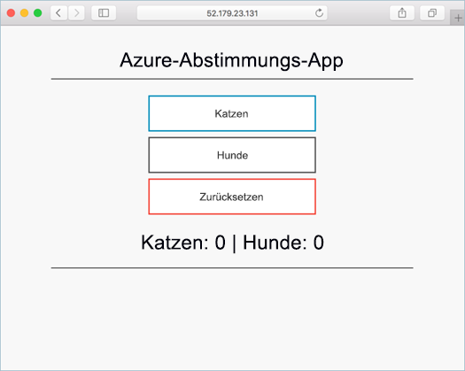

# <a name="deploy-an-azure-container-service-aks-cluster"></a>Bereitstellen eines Azure Container Service-Clusters

In dieser Schnellstartanleitung wird ein ACS-Cluster mithilfe der Azure CLI bereitgestellt. Anschließend wird im Cluster eine Anwendung mit mehreren Containern ausgeführt, die ein Web-Front-End und eine Redis-Instanz umfasst. Nach Abschluss des Vorgangs kann auf die Anwendung über das Internet zugegriffen werden.



In dieser Schnellstartanleitung wird davon ausgegangen, dass Sie grundlegend mit den Konzepten von Kubernetes vertraut sind. Ausführliche Informationen zu Kubernetes finden Sie in der [Kubernetes-Dokumentation]( https://kubernetes.io/docs/home/).

[!INCLUDE [cloud-shell-try-it.md](../../includes/cloud-shell-try-it.md)]

Wenn Sie die CLI lokal installieren und verwenden möchten, müssen Sie für diesen Schnellstart die Azure CLI-Version 2.0.20 oder höher ausführen. Führen Sie `az --version` aus, um die Version zu finden. Informationen zum Durchführen einer Installation oder eines Upgrades finden Sei bei Bedarf unter [Installieren der Azure CLI]( /cli/azure/install-azure-cli).

## <a name="enabling-aks-preview-for-your-azure-subscription"></a>Aktivieren der AKS-Vorschau für Ihr Azure-Abonnement
Während AKS in der Vorschau ist, erfordert das Erstellen neuer Cluster ein Featureflag für Ihr Abonnement. Sie können dieses Feature für eine beliebige Anzahl von Abonnements anfordern, die Sie verwenden möchten. Verwenden Sie den Befehl `az provider register` zum Registrieren des AKS-Anbieters:

```azurecli-interactive
az provider register -n Microsoft.ContainerService
```

Nach dem Registrieren können Sie jetzt einen Kubernetes-Cluster mit AKS erstellen.

## <a name="create-a-resource-group"></a>Erstellen einer Ressourcengruppe

Erstellen Sie mit dem Befehl [az group create](/cli/azure/group#create) eine Ressourcengruppe. Eine Azure-Ressourcengruppe ist eine logische Gruppe, in der Azure-Ressourcen bereitgestellt und verwaltet werden.

Im folgenden Beispiel wird am Standort *westus2* eine Ressourcengruppe mit dem Namen *myResourceGroup* erstellt.

```azurecli-interactive
az group create --name myResourceGroup --location westus2
```

Ausgabe:

```json
{
  "id": "/subscriptions/00000000-0000-0000-0000-000000000000/resourceGroups/myResourceGroup",
  "location": "westus2",
  "managedBy": null,
  "name": "myResourceGroup",
  "properties": {
    "provisioningState": "Succeeded"
  },
  "tags": null
}
```

## <a name="create-aks-cluster"></a>Erstellen eines ACS-Clusters

Im folgenden Beispiel wird ein Cluster mit dem Namen *myK8sCluster* erstellt.

```azurecli-interactive
az aks create --resource-group myResourceGroup --name myK8sCluster --agent-count 1 --generate-ssh-keys
```

Nach einigen Minuten ist die Ausführung des Befehls abgeschlossen, und es werden Informationen zum Cluster im JSON-Format zurückgegeben.

## <a name="connect-to-the-cluster"></a>Verbinden mit dem Cluster

Verwenden Sie zum Verwalten eines Kubernetes-Clusters den Kubernetes-Befehlszeilenclient [kubectl](https://kubernetes.io/docs/user-guide/kubectl/).

Wenn Sie Azure Cloud Shell verwenden, ist „kubectl“ bereits installiert. Führen Sie für eine lokale Installation den folgenden Befehl aus.


```azurecli
az aks install-cli
```

Führen Sie den folgenden Befehl aus, um „kubectl“ für die Verbindungsherstellung mit Ihrem Kubernetes-Cluster zu konfigurieren. Dieser Schritt dient dazu, Anmeldeinformationen herunterzuladen und die Kubernetes-Befehlszeilenschnittstelle für ihre Verwendung zu konfigurieren.

```azurecli-interactive
az aks get-credentials --resource-group myResourceGroup --name myK8sCluster
```

Verwenden Sie zum Überprüfen der Verbindung mit Ihrem Cluster den Befehl [kubectl get](https://kubernetes.io/docs/user-guide/kubectl/v1.6/#get), um eine Liste der Clusterknoten zu erhalten.

```azurecli-interactive
kubectl get nodes
```

Ausgabe:

```
NAME                          STATUS    ROLES     AGE       VERSION
k8s-myk8scluster-36346190-0   Ready     agent     2m        v1.7.7
```

## <a name="run-the-application"></a>Ausführen der Anwendung

Eine Kubernetes-Manifestdatei definiert einen gewünschten Zustand (Desired State) – also beispielsweise, welche Containerimages ausgeführt werden sollen. In diesem Beispiel wird ein Manifest verwendet, um alle Objekte zu erstellen, die zum Ausführen der Azure Vote-Anwendung benötigt werden.

Erstellen Sie eine Datei mit dem Namen `azure-vote.yml`, und fügen Sie den folgenden YAML-Code ein: Wenn Sie in Azure Cloud Shell arbeiten, kann diese Datei mit vi oder Nano wie bei Verwendung eines virtuellen oder physischen Systems erstellt werden.

```yaml
apiVersion: apps/v1beta1
kind: Deployment
metadata:
  name: azure-vote-back
spec:
  replicas: 1
  template:
    metadata:
      labels:
        app: azure-vote-back
    spec:
      containers:
      - name: azure-vote-back
        image: redis
        ports:
        - containerPort: 6379
          name: redis
---
apiVersion: v1
kind: Service
metadata:
  name: azure-vote-back
spec:
  ports:
  - port: 6379
  selector:
    app: azure-vote-back
---
apiVersion: apps/v1beta1
kind: Deployment
metadata:
  name: azure-vote-front
spec:
  replicas: 1
  template:
    metadata:
      labels:
        app: azure-vote-front
    spec:
      containers:
      - name: azure-vote-front
        image: microsoft/azure-vote-front:redis-v1
        ports:
        - containerPort: 80
        env:
        - name: REDIS
          value: "azure-vote-back"
---
apiVersion: v1
kind: Service
metadata:
  name: azure-vote-front
spec:
  type: LoadBalancer
  ports:
  - port: 80
  selector:
    app: azure-vote-front
```

Führen Sie die Anwendung mithilfe des Befehls [kubectl create](https://kubernetes.io/docs/user-guide/kubectl/v1.6/#create) aus.

```azurecli-interactive
kubectl create -f azure-vote.yml
```

Ausgabe:

```
deployment "azure-vote-back" created
service "azure-vote-back" created
deployment "azure-vote-front" created
service "azure-vote-front" created
```

## <a name="test-the-application"></a>Testen der Anwendung

Im Zuge der Anwendungsausführung wird ein [Kubernetes-Dienst](https://kubernetes.io/docs/concepts/services-networking/service/) erstellt, der das Anwendungs-Front-End über das Internet verfügbar macht. Dieser Vorgang kann einige Minuten dauern.

Verwenden Sie zum Überwachen des Fortschritts den Befehl [kubectl get service](https://kubernetes.io/docs/user-guide/kubectl/v1.6/#get) mit dem Argument `--watch`.

```azurecli-interactive
kubectl get service azure-vote-front --watch
```

Die *externe IP-Adresse* für den Dienst *azure-vote-front* wird zunächst als *ausstehend* angezeigt.

```
NAME               TYPE           CLUSTER-IP   EXTERNAL-IP   PORT(S)        AGE
azure-vote-front   LoadBalancer   10.0.37.27   <pending>     80:30572/TCP   6s
```

Sobald die *externe IP-Adresse* nicht mehr *ausstehend* ist, sondern eine *IP-Adresse* angezeigt wird, verwenden Sie `CTRL-C`, um die kubectl-Überwachung zu beenden.

```
azure-vote-front   LoadBalancer   10.0.37.27   52.179.23.131   80:30572/TCP   2m
```

Nun können Sie zu der externen IP-Adresse navigieren und die Azure Vote-App anzeigen.


## <a name="delete-cluster"></a>Löschen von Clustern
Wenn der Cluster nicht mehr benötigt wird, können Sie mit dem Befehl [az group delete](/cli/azure/group#delete) die Ressourcengruppe, den Containerdienst und alle zugehörigen Ressourcen entfernen.

```azurecli-interactive
az group delete --name myResourceGroup --yes --no-wait
```

## <a name="get-the-code"></a>Abrufen des Codes

In dieser Schnellstartanleitung wurden vorab erstellte Containerimages verwendet, um eine Kubernetes-Bereitstellung zu erstellen. Der dazugehörige Anwendungscode, die Dockerfile-Datei und die Kubernetes-Manifestdatei sind auf GitHub verfügbar.

[https://github.com/Azure-Samples/azure-voting-app-redis](https://github.com/Azure-Samples/azure-voting-app-redis.git)

## <a name="next-steps"></a>Nächste Schritte

In dieser Schnellstartanleitung haben Sie einen Kubernetes-Cluster und eine Anwendung mit mehreren Containern dafür bereitgestellt.

Weitere Informationen zu Azure Container Service sowie ein vollständiges Beispiel vom Code bis zur Bereitstellung finden Sie im Kubernetes-Clustertutorial.

> [!div class="nextstepaction"]
> [Verwalten eines ACS-Clusters](./tutorial-kubernetes-prepare-app.md)
