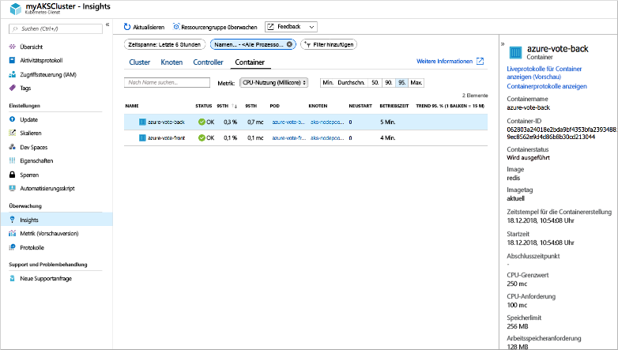
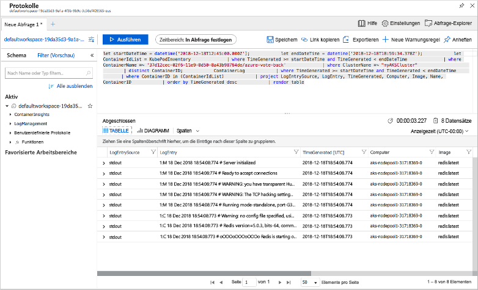

# <a name="quickstart-deploy-an-azure-kubernetes-service-aks-cluster-using-the-azure-cli"></a>Schnellstart: Bereitstellen eines AKS-Clusters (Azure Kubernetes Service) über die Azure-Befehlszeilenschnittstelle

Azure Kubernetes Service (AKS) ist ein verwalteter Kubernetes-Dienst, mit dem Sie schnell Cluster bereitstellen und verwalten können. In dieser Schnellstartanleitung stellen Sie einen AKS-Cluster über die Azure-Befehlszeilenschnittstelle bereit. In dem Cluster wird eine Anwendung mit mehreren Containern ausgeführt, die ein Web-Front-End und eine Redis-Instanz enthält. Sie erfahren dann, wie Sie den Zustand des Clusters und der Pods überwachen können, in denen Ihre Anwendung ausgeführt wird.


Für diese Schnellstartanleitung werden Grundkenntnisse in Bezug auf die Kubernetes-Konzepte vorausgesetzt. Weitere Informationen finden Sie unter [Grundlegende Kubernetes-Konzepte für Azure Kubernetes Service (AKS)][kubernetes-concepts].

Wenn Sie kein Azure-Abonnement besitzen, können Sie ein [kostenloses Konto](https://azure.microsoft.com/free/?WT.mc_id=A261C142F) erstellen, bevor Sie beginnen.

[!INCLUDE [cloud-shell-try-it.md](../../includes/cloud-shell-try-it.md)]

Wenn Sie die Befehlszeilenschnittstelle lokal installieren und verwenden möchten, benötigen Sie für diese Schnellstartanleitung mindestens Version 2.0.52 der Azure-Befehlszeilenschnittstelle. Führen Sie `az --version` aus, um die Version zu finden. Wenn Sie eine Installation oder ein Upgrade ausführen müssen, finden Sie unter [Installieren von Azure CLI 2.0][azure-cli-install] Informationen dazu.

## <a name="create-a-resource-group"></a>Erstellen einer Ressourcengruppe

Eine Azure-Ressourcengruppe ist eine logische Gruppe, in der Azure-Ressourcen bereitgestellt und verwaltet werden. Wenn Sie eine Ressourcengruppe erstellen, müssen Sie einen Speicherort angeben. An diesem Speicherort werden die Metadaten der Ressourcengruppe gespeichert. Darüber hinaus werden dort die Ressourcen in Azure ausgeführt, wenn Sie während der Ressourcenerstellung keine andere Region angeben. Erstellen Sie mit dem Befehl [az group create][az-group-create] eine Ressourcengruppe.

Das folgende Beispiel erstellt eine Ressourcengruppe mit dem Namen *myResourceGroup* am Standort *eastus*.

```azurecli-interactive
az group create --name myResourceGroup --location eastus
```

Die folgende Beispielausgabe zeigt, dass die Ressourcengruppe erfolgreich erstellt wurde:

```json
{
  "id": "/subscriptions/<guid>/resourceGroups/myResourceGroup",
  "location": "eastus",
  "managedBy": null,
  "name": "myResourceGroup",
  "properties": {
    "provisioningState": "Succeeded"
  },
  "tags": null
}
```

## <a name="create-aks-cluster"></a>Erstellen eines ACS-Clusters

Erstellen Sie mithilfe des Befehls [az aks create][az-aks-create] einen AKS-Cluster. Im folgenden Beispiel wird ein Cluster mit dem Namen *myAKSCluster* erstellt. Azure Monitor für Container wird auch mit dem Parameter *--enable-addons monitoring* aktiviert.

```azurecli-interactive
az aks create \
    --resource-group myResourceGroup \
    --name myAKSCluster \
    --node-count 1 \
    --enable-addons monitoring \
    --generate-ssh-keys
```

Nach wenigen Minuten ist die Ausführung des Befehls abgeschlossen, und es werden Informationen zum Cluster im JSON-Format zurückgegeben.

## <a name="connect-to-the-cluster"></a>Verbinden mit dem Cluster

Verwenden Sie zum Verwalten eines Kubernetes-Clusters den Kubernetes-Befehlszeilenclient [kubectl][kubectl]. Bei Verwendung von Azure Cloud Shell ist `kubectl` bereits installiert. Verwenden Sie für die lokale Installation von `kubectl` den Befehl [az aks install-cli][az-aks-install-cli]:

```azurecli
az aks install-cli
```

Mit dem Befehl [az aks get-credentials][az-aks-get-credentials] können Sie `kubectl` für die Verbindungsherstellung mit Ihrem Kubernetes-Cluster konfigurieren. Mit diesem Befehl werden die Anmeldeinformationen heruntergeladen, und die Kubernetes-Befehlszeilenschnittstelle wird für deren Verwendung konfiguriert.

```azurecli-interactive
az aks get-credentials --resource-group myResourceGroup --name myAKSCluster
```

Verwenden Sie zum Überprüfen der Verbindung mit Ihrem Cluster den Befehl [kubectl get][kubectl-get], um eine Liste der Clusterknoten zu erhalten.

```azurecli-interactive
kubectl get nodes
```

Die folgende Beispielausgabe zeigt den in den vorherigen Schritten erstellten Knoten. Vergewissern Sie sich, dass der Knoten den Status *Bereit* hat:

```
NAME                       STATUS   ROLES   AGE     VERSION
aks-nodepool1-31718369-0   Ready    agent   6m44s   v1.9.11
```

## <a name="run-the-application"></a>Ausführen der Anwendung

Eine Kubernetes-Manifestdatei definiert einen gewünschten Zustand (Desired State) für den Cluster – also beispielsweise, welche Containerimages ausgeführt werden sollen. In dieser Schnellstartanleitung wird ein Manifest verwendet, um alle Objekte zu erstellen, die zum Ausführen der Azure Vote-Anwendung benötigt werden. Dieses Manifest umfasst zwei [Kubernetes-Bereitstellungen][kubernetes-deployment]: eine für die Azure Vote-Python-Beispielanwendungen und eine für eine Redis-Instanz. Außerdem werden zwei [Kubernetes-Dienste][kubernetes-service] erstellt: ein interner Dienst für die Redis-Instanz und ein externer Dienst, über den aus dem Internet auf die Azure Vote-Anwendung zugegriffen wird.

> [!TIP]
> In dieser Schnellstartanleitung führen Sie die manuelle Erstellung und Bereitstellung Ihrer Anwendungsmanifeste im AKS-Cluster durch. Bei Szenarien mit mehr Praxisnähe können Sie [Azure Dev Spaces][azure-dev-spaces] verwenden, um Ihren Code direkt im AKS-Cluster schnell zu durchlaufen zu debuggen. Sie können Dev Spaces übergreifend für Betriebssystemplattformen und Entwicklungsumgebungen nutzen und mit anderen Teammitgliedern zusammenarbeiten.

Erstellen Sie eine Datei namens `azure-vote.yaml`, und fügen Sie die folgende YAML-Definition ein. Bei Verwendung von Azure Cloud Shell kann diese Datei mit `vi` oder `nano` erstellt werden – genau wie bei der Verwendung eines virtuellen oder physischen Systems:

```yaml
apiVersion: apps/v1
kind: Deployment
metadata:
  name: azure-vote-back
spec:
  replicas: 1
  selector:
    matchLabels:
      app: azure-vote-back
  template:
    metadata:
      labels:
        app: azure-vote-back
    spec:
      nodeSelector:
        "beta.kubernetes.io/os": linux
      containers:
      - name: azure-vote-back
        image: redis
        resources:
          requests:
            cpu: 100m
            memory: 128Mi
          limits:
            cpu: 250m
            memory: 256Mi
        ports:
        - containerPort: 6379
          name: redis
---
apiVersion: v1
kind: Service
metadata:
  name: azure-vote-back
spec:
  ports:
  - port: 6379
  selector:
    app: azure-vote-back
---
apiVersion: apps/v1
kind: Deployment
metadata:
  name: azure-vote-front
spec:
  replicas: 1
  selector:
    matchLabels:
      app: azure-vote-front
  template:
    metadata:
      labels:
        app: azure-vote-front
    spec:
      nodeSelector:
        "beta.kubernetes.io/os": linux
      containers:
      - name: azure-vote-front
        image: microsoft/azure-vote-front:v1
        resources:
          requests:
            cpu: 100m
            memory: 128Mi
          limits:
            cpu: 250m
            memory: 256Mi
        ports:
        - containerPort: 80
        env:
        - name: REDIS
          value: "azure-vote-back"
---
apiVersion: v1
kind: Service
metadata:
  name: azure-vote-front
spec:
  type: LoadBalancer
  ports:
  - port: 80
  selector:
    app: azure-vote-front
```

Stellen Sie die Anwendung über den Befehl [kubectl apply][kubectl-apply] bereit, und geben Sie den Namen Ihres YAML-Manifests an:

```azurecli-interactive
kubectl apply -f azure-vote.yaml
```

In der folgende Beispielausgabe sind die erfolgreich erstellten Bereitstellungen und Dienste aufgeführt:

```
deployment "azure-vote-back" created
service "azure-vote-back" created
deployment "azure-vote-front" created
service "azure-vote-front" created
```

## <a name="test-the-application"></a>Testen der Anwendung

Wenn die Anwendung ausgeführt wird, macht ein Kubernetes-Dienst das Anwendungs-Front-End im Internet verfügbar. Dieser Vorgang kann einige Minuten dauern.

Verwenden Sie zum Überwachen des Fortschritts den Befehl [kubectl get service][kubectl-get] mit dem Argument `--watch`.

```azurecli-interactive
kubectl get service azure-vote-front --watch
```

Die externe IP-Adresse (*EXTERNAL-IP*) für den Dienst *azure-vote-front* wird zunächst als *ausstehend* angezeigt.

```
NAME               TYPE           CLUSTER-IP   EXTERNAL-IP   PORT(S)        AGE
azure-vote-front   LoadBalancer   10.0.37.27   <pending>     80:30572/TCP   6s
```

Sobald die externe IP-Adresse (*EXTERNAL-IP*) von *ausstehend* in eine tatsächliche öffentliche IP-Adresse geändert wurde, wird, verwenden Sie `CTRL-C`, um die `kubectl`-Überwachung zu beenden. Die folgende Beispielausgabe zeigt eine gültige öffentliche IP-Adresse, die dem Dienst zugewiesen ist:

```
azure-vote-front   LoadBalancer   10.0.37.27   52.179.23.131   80:30572/TCP   2m
```

Öffnen Sie die externe IP-Adresse Ihres Diensts in einem Webbrowser, um die Azure Vote-App in Aktion zu sehen.


## <a name="monitor-health-and-logs"></a>Überwachung von Integrität und Protokollen

Beim Erstellen des AKS-Clusters wurde Azure Monitor für Container aktiviert, um Integritätsmetriken für die Clusterknoten und die Pods zu erfassen. Diese Integritätsmetriken sind im Azure-Portal verfügbar.

Führen Sie die folgenden Schritte aus, um den aktuellen Status, die Betriebszeit und die Ressourcennutzung für die Azure Vote-Pods anzuzeigen:

1. Öffnen Sie in einem Webbrowser das Azure-Portal [https://portal.azure.com][azure-portal].
1. Wählen Sie Ihre Ressourcengruppe aus, z.B. *myResourceGroup*, und wählen Sie anschließend Ihren AKS-Cluster, z.B. *myAKSCluster*.
1. Wählen Sie auf der linken Seite unter **Überwachung** die Option **Erkenntnisse** aus.
1. Wählen Sie oben die Option **+ Filter hinzufügen**.
1. Wählen Sie *Namespace* als Eigenschaft, und wählen Sie dann die Option *\<All but kube-system\>* (Alles außer kube-system).
1. Wählen Sie die Anzeige **Container**.

Die Container *azure-vote-back* und *azure-vote-front* werden angezeigt. Dies wird im folgenden Beispiel veranschaulicht:



Wenn Sie Protokolle für den Pod `azure-vote-front` anzeigen möchten, klicken Sie auf der rechten Seite der Containerliste auf den Link **Containerprotokolle anzeigen**. Diese Protokolle enthalten die Datenströme *stdout* und *stderr* aus dem Container.



## <a name="delete-cluster"></a>Löschen von Clustern

Wenn der Cluster nicht mehr benötigt wird, entfernen Sie mit dem Befehl [az group delete][az-group-delete] die Ressourcengruppe, den Containerdienst und alle zugehörigen Ressourcen.

```azurecli-interactive
az group delete --name myResourceGroup --yes --no-wait
```

> [!NOTE]
> Wenn Sie den Cluster löschen, wird der vom AKS-Cluster verwendete Azure Active Directory-Dienstprinzipal nicht entfernt. Schritte zum Entfernen des Dienstprinzipals finden Sie unter den [Überlegungen zum AKS-Dienstprinzipal und dessen Löschung][sp-delete].

## <a name="get-the-code"></a>Abrufen des Codes

In dieser Schnellstartanleitung wurden vorab erstellte Containerimages verwendet, um eine Kubernetes-Bereitstellung zu erstellen. Der dazugehörige Anwendungscode, die Dockerfile-Datei und die Kubernetes-Manifestdatei sind auf GitHub verfügbar.

[https://github.com/Azure-Samples/azure-voting-app-redis][azure-vote-app]

## <a name="next-steps"></a>Nächste Schritte

In dieser Schnellstartanleitung haben Sie einen Kubernetes-Cluster und eine Anwendung mit mehreren Containern dafür bereitgestellt.  [Zugreifen auf das Kubernetes-Webdashboard][kubernetes-dashboard] für den Cluster, den Sie gerade erstellt haben.

Weitere Informationen zu Azure Container Service sowie ein vollständiges Beispiel vom Code bis zur Bereitstellung finden Sie im Kubernetes-Clustertutorial.

> [!div class="nextstepaction"]
> [AKS-Tutorial][aks-tutorial]

<!-- LINKS - external -->
[azure-vote-app]: https://github.com/Azure-Samples/azure-voting-app-redis.git
[kubectl]: https://kubernetes.io/docs/user-guide/kubectl/
[kubectl-apply]: https://kubernetes.io/docs/reference/generated/kubectl/kubectl-commands#apply
[kubectl-get]: https://kubernetes.io/docs/reference/generated/kubectl/kubectl-commands#get
[azure-dev-spaces]: https://docs.microsoft.com/azure/dev-spaces/

<!-- LINKS - internal -->
[kubernetes-concepts]: concepts-clusters-workloads.md
[aks-monitor]: https://aka.ms/coingfonboarding
[aks-tutorial]: ./tutorial-kubernetes-prepare-app.md
[az-aks-browse]: /cli/azure/aks?view=azure-cli-latest#az-aks-browse
[az-aks-create]: /cli/azure/aks?view=azure-cli-latest#az-aks-create
[az-aks-get-credentials]: /cli/azure/aks?view=azure-cli-latest#az-aks-get-credentials
[az-aks-install-cli]: /cli/azure/aks?view=azure-cli-latest#az-aks-install-cli
[az-group-create]: /cli/azure/group#az-group-create
[az-group-delete]: /cli/azure/group#az-group-delete
[azure-cli-install]: /cli/azure/install-azure-cli
[sp-delete]: kubernetes-service-principal.md#additional-considerations
[azure-portal]: https://portal.azure.com
[kubernetes-deployment]: concepts-clusters-workloads.md#deployments-and-yaml-manifests
[kubernetes-service]: concepts-network.md#services
[kubernetes-dashboard]: kubernetes-dashboard.md
