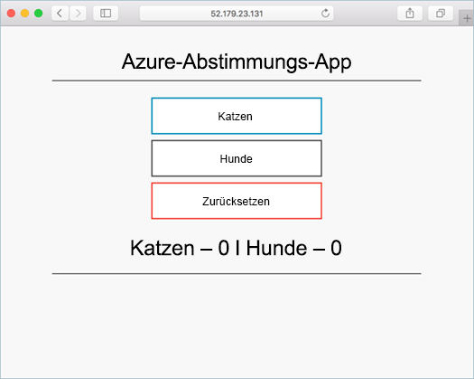

# <a name="tutorial-run-applications-in-azure-kubernetes-service-aks"></a>Tutorial: Ausführen von Anwendungen in Azure Kubernetes Service (AKS)

Kubernetes bietet eine verteilte Plattform für containerbasierte Anwendungen. Sie erstellen Ihre eigenen Anwendungen und Dienste in einem Kubernetes-Cluster, stellen diese bereit und lassen den Cluster die Verfügbarkeit und Konnektivität verwalten. In diesem Tutorial – Teil 4 von 7 – wird eine Beispielanwendung in einem Kubernetes-Cluster bereitgestellt. Folgendes wird vermittelt:

> [!div class="checklist"]
> * Aktualisieren einer Kubernetes-Manifestdatei
> * Ausführen einer Anwendung in Kubernetes
> * Testen der Anwendung

In weiteren Tutorials wird diese Anwendung erweitert und aktualisiert.

Für diese Schnellstartanleitung werden Grundkenntnisse in Bezug auf die Kubernetes-Konzepte vorausgesetzt. Weitere Informationen finden Sie unter [Grundlegende Kubernetes-Konzepte für Azure Kubernetes Service (AKS)][kubernetes-concepts].

## <a name="before-you-begin"></a>Voraussetzungen

In vorherigen Tutorials wurde eine Anwendung in ein Containerimage gepackt, das Image wurde in Azure Container Registry hochgeladen, und es wurde ein Kubernetes-Cluster erstellt.

Für dieses Tutorial benötigen Sie die vorab erstellte Kubernetes-Manifestdatei `azure-vote-all-in-one-redis.yaml`. Diese Datei wurde in einem vorherigen Tutorial mit dem Anwendungsquellcode heruntergeladen. Stellen Sie sicher, dass Sie das Repository geklont und Verzeichnisse im geklonten Repository geändert haben. Wenn Sie diese Schritte nicht ausgeführt haben und dies jetzt nachholen möchten, sollten Sie mit [Tutorial 1: Erstellen von Containerimages][aks-tutorial-prepare-app] beginnen.

Für dieses Tutorial müssen Sie mindestens Version 2.0.53 der Azure CLI ausführen. Führen Sie `az --version` aus, um die Version zu finden. Wenn Sie eine Installation oder ein Upgrade ausführen müssen, finden Sie unter [Installieren von Azure CLI 2.0][azure-cli-install] Informationen dazu.

## <a name="update-the-manifest-file"></a>Aktualisieren der Manifestdatei

In diesen Tutorials speichert eine Azure Container Registry (ACR)-Instanz das Containerimage für die Beispielanwendung. Zum Bereitstellen der Anwendung müssen Sie den Imagenamen in der Kubernetes-Manifestdatei aktualisieren, sodass er den ACR-Anmeldeservernamen enthält.

Rufen Sie den ACR-Anmeldeservernamen mit dem Befehl [az acr list][az-acr-list] wie folgt auf:

```azurecli
az acr list --resource-group myResourceGroup --query "[].{acrLoginServer:loginServer}" --output table
```

Die im ersten Tutorial geklonte Beispielmanifestdatei aus dem Git-Repository verwendet den Anmeldeservernamen *microsoft*. Vergewissern Sie sich, dass Sie sich im geklonten *azure-voting-app-Redis*-Verzeichnis befinden, und öffnen Sie dann die Manifestdatei mit einem Text-Editor, z. B. `vi`:

```console
vi azure-vote-all-in-one-redis.yaml
```

Ersetzen Sie *microsoft* durch Ihren ACR-Anmeldeservernamen. Der Imagename befindet sich in Zeile 51 der Manifestdatei. Im folgenden Beispiel wird der standardmäßige Imagename angezeigt:

```yaml
containers:
- name: azure-vote-front
  image: microsoft/azure-vote-front:v1
```

Geben Sie Ihren eigenen ACR-Anmeldeservernamen an, sodass Ihre Manifestdatei wie im folgenden Beispiel aussieht:

```yaml
containers:
- name: azure-vote-front
  image: <acrName>.azurecr.io/azure-vote-front:v1
```

Speichern und schließen Sie die Datei. Verwenden Sie in `vi` den Befehl `:wq`.

## <a name="deploy-the-application"></a>Bereitstellen der Anwendung

Verwenden Sie zum Bereitstellen Ihrer Anwendung den Befehl [kubectl apply][kubectl-apply]. Dieser Befehl analysiert die Manifestdatei und erstellt die definierten Kubernetes-Objekte. Geben Sie die Beispielmanifestdatei wie im folgenden Beispiel an:

```console
kubectl apply -f azure-vote-all-in-one-redis.yaml
```

Die folgende Beispielausgabe zeigt die Ressourcen, die erfolgreich im AKS-Cluster erstellt wurden:

```
$ kubectl apply -f azure-vote-all-in-one-redis.yaml

deployment "azure-vote-back" created
service "azure-vote-back" created
deployment "azure-vote-front" created
service "azure-vote-front" created
```

## <a name="test-the-application"></a>Testen der Anwendung

Wenn die Anwendung ausgeführt wird, macht ein Kubernetes-Dienst das Anwendungs-Front-End im Internet verfügbar. Dieser Vorgang kann einige Minuten dauern.

Verwenden Sie zum Überwachen des Fortschritts den Befehl [kubectl get service][kubectl-get] mit dem Argument `--watch`.

```console
kubectl get service azure-vote-front --watch
```

Die *EXTERNAL-IP*-Adresse für den Dienst *azure-vote-front* wird zunächst als *ausstehend* angezeigt:

```
azure-vote-front   10.0.34.242   <pending>     80:30676/TCP   7s
```

Sobald die *EXTERNAL-IP*-Adresse von *ausstehend* in eine tatsächliche öffentliche IP-Adresse geändert wurde, wird, verwenden Sie `CTRL-C`, um die `kubectl`-Überwachung zu beenden. Die folgende Beispielausgabe zeigt eine gültige öffentliche IP-Adresse, die dem Dienst zugewiesen ist:

```
azure-vote-front   10.0.34.242   52.179.23.131   80:30676/TCP   2m
```

Öffnen Sie die externe IP-Adresse Ihres Diensts in einem Webbrowser, um die Anwendung in Aktion zu sehen:



Wurde die Anwendung nicht geladen, liegt möglicherweise ein Autorisierungsproblem mit Ihrer Imageregistrierung vor. Verwenden Sie den Befehl `kubectl get pods`, um den Status Ihrer Container anzuzeigen. Wenn die Containerimages nicht per Pull abgerufen werden können, finden Sie unter [Zugreifen per Kubernetes-Geheimnis](https://docs.microsoft.com/azure/container-registry/container-registry-auth-aks#access-with-kubernetes-secret) weitere Informationen.

## <a name="next-steps"></a>Nächste Schritte

In diesem Tutorial wurde eine Azure Vote-Beispielanwendung in einem Kubernetes-Cluster in AKS bereitgestellt. Es wurde Folgendes vermittelt:

> [!div class="checklist"]
> * Aktualisieren einer Kubernetes-Manifestdatei
> * Ausführen einer Anwendung in Kubernetes
> * Testen der Anwendung

Fahren Sie mit dem nächsten Tutorial fort, wo Sie erfahren, wie eine Kubernetes-Anwendung und die zugrunde liegende Kubernetes-Infrastruktur skaliert werden.

> [!div class="nextstepaction"]
> [Scale Kubernetes application and infrastructure][aks-tutorial-scale] (Skalieren einer Kubernetes-Anwendung und -Infrastruktur)

<!-- LINKS - external -->
[kubectl-apply]: https://kubernetes.io/docs/reference/generated/kubectl/kubectl-commands#apply
[kubectl-create]: https://kubernetes.io/docs/reference/generated/kubectl/kubectl-commands#create
[kubectl-get]: https://kubernetes.io/docs/reference/generated/kubectl/kubectl-commands#get

<!-- LINKS - internal -->
[aks-tutorial-prepare-app]: ./tutorial-kubernetes-prepare-app.md
[aks-tutorial-scale]: ./tutorial-kubernetes-scale.md
[az-acr-list]: /cli/azure/acr
[azure-cli-install]: /cli/azure/install-azure-cli
[kubernetes-concepts]: concepts-clusters-workloads.md
[kubernetes-service]: concepts-network.md#services
