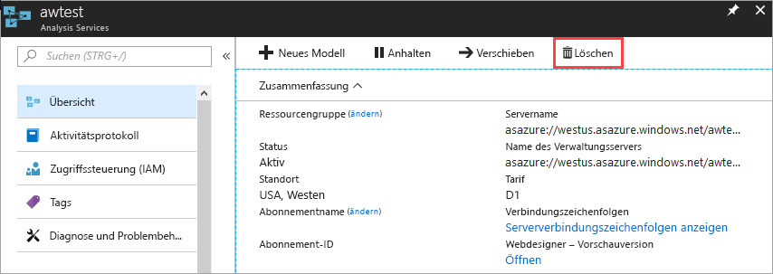

# Schnellstart: Erstellen eines Analysis Services-Servers im Azure-Portal

Diese Schnellstartanleitung erläutert, wie eine Analysis Services-Serverressource in Ihrem Azure-Abonnement mithilfe des Portals erstellt wird.

## Voraussetzungen 

* **Azure-Abonnement:** Besuchen Sie die Webseite [Kostenlose Azure-Testversion](https://azure.microsoft.com/offers/ms-azr-0044p/), und erstellen Sie ein Konto.
* **Azure Active Directory**: Ihr Abonnement muss einem Azure Active Directory-Mandanten zugeordnet sein. Und Sie müssen bei Azure mit einem Konto in diesem Azure Active Directory angemeldet sein. Weitere Informationen finden Sie unter [Authentifizierung und Benutzerberechtigungen](analysis-services-manage-users.md).

## Anmelden beim Azure-Portal 

[Melden Sie sich beim Portal an.](https://portal.azure.com)

## Erstellen eines Servers

1. Klicken Sie auf **+ Ressource erstellen** > **Daten + Analysen** > **Analysis Services**.

    

2. Füllen Sie in **Analysis Services** die erforderlichen Felder aus, und klicken Sie dann auf **Erstellen**.
   
   * **Servername:** Geben Sie einen eindeutigen Namen ein, mit dem auf den Server verwiesen wird.
   * **Abonnement**: Wählen Sie das Abonnement aus, das diesem Server zugeordnet wird.
   * **Ressourcengruppe**: Erstellen Sie eine neue Ressourcengruppe, oder wählen Sie eine bereits vorhandene Ressourcengruppe aus. Ressourcengruppen sind darauf ausgelegt, Sie beim Verwalten einer Sammlung von Azure-Ressourcen zu unterstützen. Weitere Informationen finden Sie unter [Ressourcengruppen](../azure-resource-manager/resource-group-overview.md).
   * **Standort:** An diesem Standort des Azure-Rechenzentrums wird der Server gehostet. Wählen Sie einen Standort in der Nähe Ihrer größten Benutzerbasis aus.
   * **Tarif:** Wählen Sie einen Tarif aus. Wenn Sie Tests durchführen und die Beispielmodelldatenbank installieren möchten, wählen Sie den kostenlosen Tarif **D1** aus. Weitere Informationen finden Sie unter [Azure Analysis Services – Preise](https://azure.microsoft.com/pricing/details/analysis-services/). 
    * **Administrator**: Dies ist standardmäßig das Konto, mit dem Sie angemeldet werden. Sie können ein anderes Konto aus Ihrem Azure Active Directory auswählen.
    * **Einstellung „Sicherungsspeicher“**: Optional. Wenn Sie bereits über ein [Speicherkonto](../storage/common/storage-introduction.md), verfügen, können Sie es als Standardkonto für die Sicherung der Modelldatenbank angeben. Sie können später auch Einstellungen zum [Sichern und Wiederherstellen](analysis-services-backup.md) angeben.
    * **Speicherschlüssel-Ablaufdatum**: Optional. Geben Sie einen Ablaufzeitraum für den Speicherschlüssel an.

Das Erstellen des Servers dauert normalerweise weniger als eine Minute. Wenn Sie **Add to Portal** (Zu Portal hinzufügen) ausgewählt haben, navigieren Sie zu Ihrem Portal, um den neuen Server anzuzeigen. Oder navigieren Sie zu **Alle Dienste** > **Analysis Services**, um zu überprüfen, ob der Server bereit ist.

## Bereinigen von Ressourcen

Löschen Sie Ihren Server, wenn Sie ihn nicht mehr benötigen. Klicken Sie auf der Seite **Übersicht** Ihres Servers auf **Löschen**. 

 

## Nächste Schritte
In diesem Schnellstart haben Sie gelernt, wie Sie einen Server in Ihrem Azure-Abonnement erstellen. Da Sie nun über einen Server verfügen, können Sie durch Konfigurieren einer (optionalen) Serverfirewall zur Sicherheit beitragen. Außerdem können Sie Ihrem Server direkt über das Portal ein einfaches Beispieldatenmodell hinzufügen. Ein Beispielmodell ist hilfreich, wenn Sie sich mit dem Konfigurieren von Modelldatenbankrollen und dem Testen von Clientverbindungen vertraut machen. Fahren Sie mit dem Tutorial zum Hinzufügen eines Beispielmodells fort, um mehr zu erfahren.

> [!div class="nextstepaction"]
> [Schnellstart: Konfigurieren einer Serverfirewall – Azure-Portal](analysis-services-qs-firewall.md)   
> [!div class="nextstepaction"]
> [Tutorial: Tutorial: Hinzufügen eines Beispielmodells](analysis-services-create-sample-model.md)
