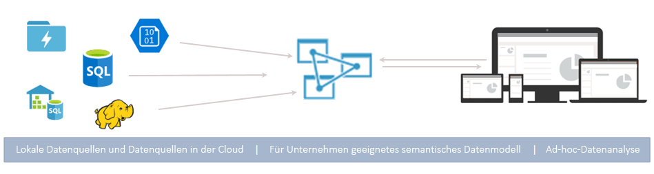
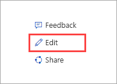

# Was ist Azure Analysis Services?

Azure Analysis Services ist eine vollständig verwaltete PaaS-Komponente (Platform-as-a-Service), über die für Unternehmen geeignete Datenmodelle in der Cloud bereitgestellt werden. Verwenden Sie die erweiterten Mashup- und Modellierungsfeatures, um Daten aus verschiedenen Datenquellen zu kombinieren, Metriken zu definieren und Ihre Daten in einem einzelnen, vertrauenswürdigen Datenmodell (semantisch und tabellarisch) zu schützen. Das Datenmodell ermöglicht Benutzern das einfachere und schnellere Durchsuchen von sehr großen Datenmengen für Ad-hoc-Datenanalysen.

**Video:** In [Azure Analysis Services Overview](https://sec.ch9.ms/ch9/d6dd/a1cda46b-ef03-4cea-8f11-68da23c5d6dd/AzureASoverview_high.mp4) (Übersicht über Azure Analysis Services) wird beschrieben, wie Azure Analysis Services zu den allgemeinen BI-Funktionen von Microsoft passt.

## Schnelle Betriebsbereitschaft

Über das Azure-Portal können Sie innerhalb weniger Minuten [einen Server erstellen](analysis-services-create-server.md). Und mit Azure Resource Manager-[Vorlagen](../azure-resource-manager/resource-manager-create-first-template.md) und PowerShell lassen sich Server unter Verwendung einer deklarativen Vorlage erstellen. Mit einer einzelnen Vorlage können Sie Serverressourcen sowie andere Azure-Komponenten (z.B. Speicherkonten und Azure Functions) bereitstellen. 

**Video:** In [Automating deployment](https://channel9.msdn.com/series/Azure-Analysis-Services/AzureAnalysisServicesAutomation) (Automatisieren der Bereitstellung) wird näher beschrieben, wie Sie Azure Automation zum Beschleunigen der Servererstellung verwenden können.

Azure Analysis Services arbeitet mit vielen Azure-Diensten zusammen und ermöglicht so die Erstellung komplexer Analyselösungen. Die Integration in [Azure Active Directory](../active-directory/fundamentals/active-directory-whatis.md) bietet sicheren, rollenbasierten Zugriff auf wichtige Daten. Auch eine Integration in [Azure Data Factory](../data-factory/introduction.md)-Pipelines ist möglich. Hierzu muss lediglich eine Aktivität hinzugefügt werden, die Daten in das Modell lädt. Für einfache Modellorchestrierungsaufgaben mit benutzerdefiniertem Code können [Azure Automation](../automation/automation-intro.md) und [Azure Functions](../azure-functions/functions-overview.md) verwendet werden. 

## Immer der richtige Tarif

Azure Analysis Services ist in den Tarifen **Developer**, **Basic** und **Standard** erhältlich. Die Plankosten in den einzelnen Tarifen sind jeweils abhängig von Verarbeitungsleistung, QPUs und Arbeitsspeichergröße. Bei der Servererstellung wählen Sie einen Plan innerhalb eines Tarifs aus. Sie können Pläne innerhalb eines Tarifs nach oben oder unten anpassen oder in einen höheren Tarif wechseln. Nur ein Wechsel in einen niedrigeren Tarif ist nicht möglich.

### Developer-Tarif

Dieser Tarif wird für Auswertungs-, Entwicklungs- und Testszenarien empfohlen. Ein einzelner Plan enthält die gleichen Funktionen wie der Standard-Tarif, ist aber in Bezug auf die Verarbeitungsleistung, die QPUs und die Speichergröße begrenzt. Das horizontale Hochskalieren von Abfragereplikaten ist für diesen Tarif nicht verfügbar. Für diesen Tarif wird keine Vereinbarung zum Servicelevel angeboten.

|Plan  |QPUs  |Arbeitsspeicher (GB)  |
|---------|---------|---------|
|D1    |    20     |    3     |

### Basic-Tarif

Der Tarif wird für Produktionslösungen mit kleineren Tabellenmodellen, einer begrenzten Anzahl von gleichzeitig aktiven Benutzern und einfachen Anforderungen an die Datenaktualisierung empfohlen. Das horizontale Hochskalieren von Abfragereplikaten ist für diesen Tarif *nicht verfügbar*. Features wie Perspektiven, mehrere Partitionen und das DirectQuery-Tabellenmodell werden für diesen Tarif *nicht unterstützt*.  

|Plan  |QPUs  |Arbeitsspeicher (GB)  |
|---------|---------|---------|
|B1    |    40     |    10     |
|B2    |    80     |    20     |

### Standard-Tarif

Dieser Tarif ist am besten für unternehmenskritische Produktionsanwendungen geeignet, bei denen elastische Anforderungen für gleichzeitig aktive Benutzer erfüllt werden müssen und die Datenmodelle schnell wachsen. Er unterstützt die erweiterte Datenaktualisierung für Datenmodellupdates nahezu in Echtzeit sowie alle tabellarischen Modellierungsfeatures.

|Plan  |QPUs  |Arbeitsspeicher (GB)  |
|---------|---------|---------|
|S1    |    40     |    10     |
|S2    |    100     |    25     |
|S3    |    200     |    50     |
|S4    |    400     |    100     |
|S8*    |    320     |    200     |
|S9*    |    640    |    400     |

\* Nicht in allen Regionen verfügbar.  

## Verfügbarkeit nach Region

Azure Analysis Services wird in Regionen weltweit unterstützt. Die unterstützten Pläne und die Verfügbarkeit der Abfragereplikate richten sich nach der von Ihnen gewählten Region. Die Verfügbarkeit von Plänen und Abfragereplikaten kann sich je nach Bedarf und den verfügbaren Ressourcen für die einzelnen Regionen ändern. 

### Amerika

|Region  | Unterstützte Pläne | Abfragereplikate (nur Standard-Pläne) |
|---------|---------|:---------:|
|Brasilien Süd     |    B1, B2, S0, S1, S2, S4, D1     |     1    |
|Kanada, Mitte    |     B1, B2, S0, S1, S2, S4, D1    |     1    |
|USA (Ost)     |     B1, B2, S0, S1, S2, S4, D1    |    1     |
|USA (Ost) 2     |     B1, B2, S0, S1, S2, S4, D1   S8, S9   |    7 1    |
|USA Nord Mitte     |     B1, B2, S0, S1, S2, S4, D1     |    1     |
|USA (Mitte)     |    B1, B2, S0, S1, S2, S4, D1     |    1     |
|USA Süd Mitte     |    B1, B2, S0, S1, S2, S4, D1     |    1     |
|USA, Westen-Mitte   |     B1, B2, S0, S1, S2, S4, D1    |    3     |
|USA (Westen)     |    B1, B2, S0, S1, S2, S4, D1   S8, S9   |    7 2  |
|USA, Westen 2    |    B1, B2, S0, S1, S2, S4, D1    S8, S9  |    3 1     |

### Europa

|Region  | Unterstützte Pläne | Abfragereplikate (nur Standard-Pläne) |
|---------|---------|:---------:|
|Nordeuropa     |    B1, B2, S0, S1, S2, S4, D1      |    7     |
|UK, Süden   |    B1, B2, S0, S1, S2, S4, D1      |     1    |
|Europa, Westen     |    B1, B2, S0, S1, S2, S4, D1    S8, S9    |    7 1     |

### Asien-Pazifik 

|Region  | Unterstützte Pläne | Abfragereplikate (nur Standard-Pläne) |
|---------|---------|:---------:|
|Australien, Südosten     | B1, B2, S0, S1, S2, S4, D1       |    1     |
|Japan, Osten  |   B1, B2, S0, S1, S2, S4, D1       |    1     |
|Asien, Südosten     |     B1, B2, S0, S1, S2, S4, S8, S9, D1     |   1      |
|Indien, Westen     |    B1, B2, S0, S1, S2, S4, D1     |    1     |

## Bedarfsgerechte Skalierung

### Zentral hoch-/herunterskalieren, Anhalten und Fortsetzen

Sie können den Tarif erhöhen oder verringern oder die Ausführung Ihres Servers anhalten. Verwenden Sie das Azure-Portal, oder nutzen Sie PowerShell für umfassende Steuerungsmöglichkeiten. Sie bezahlen nur für die tatsächliche Nutzung.  

### Horizontales Hochskalieren von Ressourcen zur Erzielung von schnellen Reaktionen auf Abfragen

Beim horizontalen Hochskalieren werden Clientabfragen auf mehrere *Abfragereplikate* in einem Abfragepool verteilt. Abfragereplikate verfügen über synchronisierte Kopien Ihrer tabellarischen Modelle. Indem die Abfrageworkload verteilt wird, können die Antwortzeiten bei einer hohen Auslastung mit Abfrageworkloads reduziert werden. Vorgänge zur Modellverarbeitung können vom Abfragepool getrennt werden, sodass sichergestellt ist, dass Clientabfragen durch Verarbeitungsvorgänge nicht negativ beeinträchtigt werden. 

Sie können einen Abfragepool mit bis zu sieben zusätzlichen Replikaten erstellen (mit Ihrem Server insgesamt acht). Die mögliche Anzahl von Abfragereplikaten in Ihrem Pool hängt vom gewählten Plan und der gewählten Region ab. Abfragereplikate können nicht außerhalb der Region Ihres Servers verteilt werden. Abfragereplikate werden mit dem gleichen Tarif wie Ihr Server abgerechnet.

Wie beim Ändern des Tarifs auch, können Sie Abfragereplikate gemäß Ihren Anforderungen horizontal hochskalieren. Konfigurieren Sie das horizontale Hochskalieren im Portal oder mit den REST-APIs. Weitere Informationen finden Sie unter [Horizontales Hochskalieren von Azure Analysis Services](analysis-services-scale-out.md).

## Preise

Die Gesamtkosten richten sich nach verschiedenen Faktoren, z.B. gewählte Region, Tarif, Abfragereplikate und Anhalten/Fortsetzen. Verwenden Sie den Rechner unter [Azure Analysis Services – Preise](https://azure.microsoft.com/pricing/details/analysis-services/), um sich einen Überblick über die Preise für Ihre Region zu verschaffen. Mit diesem Tool werden die Preise für eine Einzelserverinstanz für eine einzelne Region berechnet. Beachten Sie, dass für Abfragereplikate die gleiche Rate wie für Server berechnet wird. 

## Aufbauend auf SQL Server Analysis Services

Azure Analysis Services ist mit zahlreichen praktischen Features kompatibel, die bereits in SQL Server Analysis Services Enterprise Edition enthalten sind. Azure Analysis Services unterstützt tabellarische Modelle mit dem [Kompatibilitätsgrad](analysis-services-compat-level.md) 1200 oder höher. Tabellarische Modelle sind relationale Modellierungskonstrukte (Modell, Tabellen, Spalten), die in tabellarischen Metadatenobjektdefinitionen in TMSL- (Tabular Model Scripting Language) und TOM-Code (Tabellenobjektmodell) verfasst werden. Partitionen, Perspektiven, Sicherheit auf Zeilenebene, bidirektionale Beziehungen und Übersetzungen werden unterstützt.* Mehrdimensionale Modelle und PowerPivot für SharePoint werden in Azure Analysis Services *nicht* unterstützt.

Tabellarische Modelle werden sowohl im In-Memory- als auch im DirectQuery-Modus unterstützt. Für tabellarische Modelle im In-Memory-Modus (Standard) werden mehrere Datenquellen unterstützt. Da Modelldaten stark komprimiert und im Speicher zwischengespeichert werden, ermöglicht dieser Modus für große Datenmengen die schnellste Reaktion auf Abfragen. Außerdem bietet er die größtmögliche Flexibilität in Bezug auf komplexe Datasets und Abfragen. Die Partitionierung ermöglicht inkrementelle Lasten, erhöht die Parallelität und verringert den Speicherverbrauch. Andere erweiterte Features der Datenmodellierung, z.B. berechnete Tabellen, und alle DAX-Funktionen werden unterstützt. In-Memory-Modelle müssen aktualisiert (verarbeitet) werden, um zwischengespeicherte Daten von Datenquellen zu aktualisieren. Mit dem Azure-Dienstsupport kann mit unbeaufsichtigten Aktualisierungsvorgängen per PowerShell, TOM, TMSL und REST flexibel sichergestellt werden, dass Ihre Modelldaten immer auf dem aktuellen Stand sind. 

Im DirectQuery-Modus* wird die relationale Back-End-Datenbank für die Speicherung und Abfragenausführung genutzt. Sehr große Datasets in einzelnen SQL Server-, SQL Server Data Warehouse-, Azure SQL-Datenbank-, Azure SQL Data Warehouse-, Oracle- und Teradata-Datenquellen werden unterstützt. Für Back-End-Datasets kann der verfügbare Speicher für Serverressourcen überschritten werden. Komplexe Aktualisierungsszenarien für Datenmodelle sind nicht erforderlich. Es gelten auch einige Einschränkungen, z.B. eine begrenzte Zahl von Datenquellentypen, DAX-Formelbeschränkungen und fehlende Unterstützung einiger Features für die erweiterte Datenmodellierung. Lesen Sie die Informationen zum [DirectQuery-Modus](https://docs.microsoft.com/sql/analysis-services/tabular-models/directquery-mode-ssas-tabular), bevor Sie den für Sie am besten geeigneten Modus ermitteln.

\* Die Verfügbarkeit der Features hängt vom Tarif ab.

## Unterstützte Datenquellen

Tabellarische Modelle in Azure Analysis Services unterstützen eine Vielzahl von Datenquellen – von einfachen Textdateien bis zu Big Data in Azure Data Lake Store. Weitere Informationen finden Sie unter [In Azure Analysis Services unterstützte Datenquellen](analysis-services-datasource.md).

## Datensicherheit

Azure Analysis Services bietet Sicherheit für Ihre sensiblen Daten auf mehreren Ebenen. Auf Serverebene: Firewall, Azure-Authentifizierung, Serveradministratorrollen und serverseitige Verschlüsselung. Außerdem wird auf Datenmodellebene per Sicherheit für Benutzerrollen, auf Zeilenebene und auf Objektebene dafür gesorgt, dass Ihre Daten sicher sind und nur den Benutzern angezeigt werden, für die dies zulässig ist.

### Firewall

Die Azure Analysis Services-Firewall blockiert alle Clientverbindungen, mit Ausnahme der IP-Adressen, die nicht in Regeln angegeben sind. Konfigurieren Sie die Regeln, mit denen zulässige IP-Adressen nach einzelnen Client-IPs oder nach dem Bereich angegeben werden. Verbindungen von Power BI (Dienst) können auch zugelassen oder blockiert werden. Konfigurieren Sie die Firewall und Regeln im Portal oder per PowerShell. Weitere Informationen finden Sie unter [Konfigurieren einer Serverfirewall](analysis-services-qs-firewall.md).

### Authentifizierung

Die Benutzerauthentifizierung wird per [Azure Active Directory (AAD)](../active-directory/fundamentals/active-directory-whatis.md) durchgeführt. Beim Anmelden verwenden Benutzer eine Organisationskontoidentität mit rollenbasiertem Zugriff auf die Datenbank. Benutzeridentitäten müssen Mitglieder der Azure Active Directory-Standardinstanz für das Abonnement sein, unter dem sich der Server befindet. Weitere Informationen finden Sie unter [Authentifizierung und Benutzerberechtigungen](analysis-services-manage-users.md).

### Datensicherheit

Azure Analysis Services nutzt Azure Blob Storage zum Beibehalten von Speicher und Metadaten für Analysis Services-Datenbanken. Datendateien im Blob werden mithilfe der [serverseitigen Azure-Blobverschlüsselung (Server Side Encryption, SSE)](../storage/common/storage-service-encryption.md) verschlüsselt. Bei Verwendung des Direktabfragemodus werden nur Metadaten gespeichert. Auf die eigentlichen Daten wird zur Abfragezeit von der Datenquelle aus über das verschlüsselte Protokoll zugegriffen.

Das Installieren und Konfigurieren eines [lokalen Datengateways](analysis-services-gateway.md) ermöglicht den sicheren Zugriff auf die lokalen Datenquellen in der Organisation. Gateways ermöglichen den Zugriff auf Daten im DirectQuery- und im In-Memory-Modus.

### Rollen

Für Analysis Services wird die [rollenbasierte Autorisierung](https://docs.microsoft.com/sql/analysis-services/tabular-models/roles-ssas-tabular) verwendet, bei der der Zugriff auf Server- und Modelldatenbankvorgänge, -objekte und -daten gewährt wird. Alle Benutzer, die auf einen Server oder eine Datenbank zugreifen, verwenden hierfür ihr Azure AD-Benutzerkonto im Rahmen einer zugewiesenen Rolle. Die Serveradministratorrolle ist auf der Serverressourcenebene angeordnet. Standardmäßig wird das Konto, das beim Erstellen eines Servers verwendet wird, automatisch in die Rolle „Serveradministratoren“ eingefügt. Zusätzliche Benutzer- und Gruppenkonten werden über das Portal oder per SSMS oder PowerShell hinzugefügt.
  
Endbenutzern ohne Administratorrechte, die Daten abfragen, wird der Zugriff über Datenbankrollen gewährt. Eine Datenbankrolle wird als separates Objekt in der Datenbank erstellt und gilt nur für die Datenbank, in der diese Rolle erstellt wird. Datenbankrollen werden über die Berechtigungen „Administrator“ (Datenbank), „Lesen“ und „Lesen und verarbeiten“ definiert. Benutzer- und Gruppenkonten werden per SSMS oder PowerShell hinzugefügt.

### Sicherheit auf Zeilenebene

Tabellarische Modelle aller Kompatibilitätsgrade unterstützen die Sicherheit auf Zeilenebene. Sicherheit auf Zeilenebene wird im Modell konfiguriert, indem DAX-Ausdrücke verwendet werden, mit denen die Zeilen einer Tabelle definiert werden – sowie alle unterschiedlichen Zeilen einer verwandten Tabelle, die von einem Benutzer abgefragt werden können. Zeilenfilter mit DAX-Ausdrücken werden für die Berechtigungen „Lesen“ und „Lesen und verarbeiten“ definiert. 

### Sicherheit auf Objektebene 

Tabellarische Modelle mit dem Kompatibilitätsgrad 1400 unterstützen die Sicherheit auf Objektebene, zu der die Sicherheit auf Tabellenebene und die Sicherheit auf Spaltenebene gehören. Die Sicherheit auf Objektebene wird in den JSON-basierten Metadaten in der Datei „Model.bim“ per TMSL oder TOM festgelegt. Weitere Informationen finden Sie unter [Object-level security](https://docs.microsoft.com/sql/analysis-services/tabular-models/object-level-security) (Sicherheit auf Objektebene).

### Automatisierung durch Dienstprinzipale

Dienstprinzipale sind eine Azure Active Directory-Anwendungsressource, die Sie in Ihrem Mandanten erstellen, um unbeaufsichtigte Ressourcen- und Servicelevelvorgänge auszuführen. Dienstprinzipale werden mit Azure Automation, PowerShell im unbeaufsichtigten Modus, benutzerdefinierten Clientanwendungen und Web-Apps zum Automatisieren von allgemeinen Aufgaben verwendet, z.B. Datenaktualisierung, horizontales Hoch-/Herunterskalieren und Anhalten/Fortsetzen. Berechtigungen werden Dienstprinzipalen per Rollenmitgliedschaft zugewiesen. Weitere Informationen finden Sie unter [Automatisierung mit Dienstprinzipalen](analysis-services-service-principal.md).

### Azure Governance

Azure Analysis Services unterliegt den [Microsoft Online Services-Nutzungsbedingungen](http://www.microsoftvolumelicensing.com/DocumentSearch.aspx?Mode=3&DocumentTypeId=31) und der [Microsoft-Datenschutzerklärung](https://privacy.microsoft.com/privacystatement).
Weitere Informationen zur Sicherheit in Azure finden Sie im [Microsoft Trust Center](https://www.microsoft.com/trustcenter).

## Verwenden Sie die Tools, die Sie bereits kennen

### SQL Server Data Tools (SSDT) für Visual Studio

Modelle können mit dem kostenlosen [SQL Server Data Tools (SSDT) für Visual Studio](https://msdn.microsoft.com/library/mt204009.aspx) entwickelt und bereitgestellt werden. SSDT beinhaltet Analysis Services-Projektvorlagen, die Sie bei der Einrichtung unterstützen. SSDT beinhaltet nun die modernen datenabrufbezogenen Datenquellenabfrage- und Mashup-Funktionen für tabellarische Modelle mit Kompatibilitätsgrad 1400. Wenn Sie mit dem Datenabruf in Power BI Desktop und Excel 2016 vertraut sind, wissen Sie bereits, wie einfach sich hochgradig angepasste Datenquellenabfragen erstellen lassen. Microsoft Analysis Services-Projekte sind auch für Visual Studio als installierbares VSIX-Paket verfügbar. Sie können es [vom Marketplace herunterladen](https://marketplace.visualstudio.com/items?itemName=ProBITools.MicrosoftAnalysisServicesModelingProjects).

### SQL Server Management Studio

Verwalten Sie Server und Modelldatenbanken mit [SQL Server Management Studio (SSMS)](https://docs.microsoft.com/sql/ssms/download-sql-server-management-studio-ssms). Stellen Sie eine Verbindung mit Ihren Servern in der Cloud her. Führen Sie TMSL-Skripts direkt über das XMLA-Abfragefenster aus, und automatisieren Sie Aufgaben mithilfe von TMSL-Skripts und PowerShell. Die Features und Funktionen werden kontinuierlich erweitert. (SSMS wird monatlich aktualisiert.)

### PowerShell

Zur Verwaltung von Serverressourcen (beispielsweise Erstellen von Serverressourcen, Anhalten oder Fortsetzen von Servervorgängen oder Ändern des Servicelevels (Tarif)) werden AzureRM-Cmdlets (Azure Resource Manager) verwendet. Für andere Datenbankverwaltungsaufgaben (beispielsweise für das Hinzufügen oder Entfernen von Rollenmitgliedern, für die Verarbeitung oder für das Ausführen von TMSL-Skripts) werden Cmdlets im SQLServer-Modul verwendet. Weitere Informationen finden Sie unter [Verwalten von Azure Analysis Services mit PowerShell](analysis-services-powershell.md).

### Objektmodell und Skripterstellung

Tabellarische Modelle ermöglichen eine schnelle Entwicklung und sind hochgradig anpassbar. Tabellarische Modelle enthalten das [Tabellenobjektmodell](https://docs.microsoft.com/sql/analysis-services/tabular-model-programming-compatibility-level-1200/introduction-to-the-tabular-object-model-tom-in-analysis-services-amo) (TOM) zur Beschreibung von Modellobjekten. TOM wird in JSON über die [Skriptsprache für Tabellenmodelle (Tabular Model Scripting Language, TMSL)](https://docs.microsoft.com/sql/analysis-services/tabular-model-scripting-language-tmsl-reference) und die AMO-Datendefinitionssprache über den Namespace [Microsoft.AnalysisServices.Tabular](https://msdn.microsoft.com/library/microsoft.analysisservices.tabular.aspx) verfügbar gemacht. 

## Unterstützung der neuesten Clienttools

Moderne Tools zur Untersuchung und Visualisierung von Daten wie Power BI, Excel, Reporting Services sowie Drittanbietertools werden unterstützt und liefern Benutzern hochgradig interaktive und visuell aufbereitete Einblicke in Ihre Modelldaten. 

## Überwachung und Diagnose

Azure Analysis Services ist mit Azure-Metriken integriert und verfügt über eine große Zahl von ressourcenspezifischen Metriken, die Sie beim Überwachen der Leistung und Integrität Ihrer Server unterstützen. Weitere Informationen finden Sie unter [Überwachen von Servermetriken](analysis-services-monitor.md). Zeichnen Sie Metriken mit [Diagnoseprotokollen für Azure-Ressourcen](../monitoring-and-diagnostics/monitoring-overview-of-diagnostic-logs.md) auf. Überwachen Sie die Protokolle, und senden Sie sie an [Azure Storage](https://azure.microsoft.com/services/storage/), streamen Sie sie an [Azure Event Hubs](https://azure.microsoft.com/services/event-hubs/), und exportieren Sie sie in [Log Analytics](https://azure.microsoft.com/services/log-analytics/), einen Dienst von [Azure](https://www.microsoft.com/cloud-platform/operations-management-suite). Weitere Informationen finden Sie unter [Einrichten der Diagnoseprotokollierung](analysis-services-logging.md).

Azure Analysis Services unterstützt auch [dynamische Verwaltungssichten](https://docs.microsoft.com/sql/analysis-services/instances/use-dynamic-management-views-dmvs-to-monitor-analysis-services) (Dynamic Management Views, DMVs). Basierend auf SQL-Syntax dienen DMVs als Schnittstelle zu Schemarowsets, die Metadaten und Überwachungsinformationen zur Serverinstanz zurückgeben.

## Dokumentation

Spezifische Dokumentationsinformationen zu Azure Analysis Services sind in diesem Text enthalten. Verwenden Sie das Inhaltsverzeichnis links im Browserfenster, um nach Artikeln zu suchen. 

Da tabellarische Azure Analysis Services-Modelle den tabellarischen Modellen in SQL Server Analysis Services stark ähneln, enthält die [SQL Server-Dokumentation zu Analysis Services](https://docs.microsoft.com/sql/analysis-services/analysis-services) eine umfangreiche Bibliothek mit verfügbaren Artikeln zu den Bereichen Konzept, Verfahren, Entwickler und Referenz. In den Artikeln der SQL Server Analysis Services-Dokumentation wird gezeigt, ob sie auch für Azure Analysis Services gelten, indem unter dem Titel ein GILT FÜR-Banner angezeigt wird.

### Beteiligen Sie sich!

Die Analysis Services-Dokumentation, z.B. dieser Artikel, ist eine Open-Source-Dokumentation. Wenn Sie über ein GitHub-Konto verfügen, können Sie einen Artikel bearbeiten, indem Sie oben rechts im Browserfenster auf „Bearbeiten“ (Stiftsymbol) klicken. Verwenden Sie den Editor im Browser, und klicken Sie dann auf „Propose file change“ (Dateiänderung vorschlagen). 

Ihr Beitrag wird vom Dokumentationsteam geprüft, und wenn die Genehmigung erteilt wird, werden Sie über Ihren GitHub-Kontonamen als mitwirkende Person angezeigt. Weitere Informationen finden Sie im [Leitfaden für Mitwirkende](https://docs.microsoft.com/contribute/).

Für die Azure Analysis Services-Dokumentation wird auch [GitHub Issues](https://docs.microsoft.com/teamblog/a-new-feedback-system-is-coming-to-docs) genutzt. Hierüber können Sie Feedback zum Produkt oder zur Dokumentation übermitteln. Verwenden Sie die Option **Feedback** am Ende des Artikels. „GitHub Issues“ ist für die SQL Server Analysis Services-Dokumentation noch nicht aktiviert. 

## Blogs

Dinge ändern sich schnell. Im [Analysis Services-Teamblog](https://blogs.msdn.microsoft.com/analysisservices/) und im [Azure-Blog](https://azure.microsoft.com/blog/) erhalten Sie die neuesten Informationen.

## Community

Analysis Services verfügt über eine dynamische Community von Benutzern. Beteiligen Sie sich an der Diskussion im [Azure Analysis Services-Forum](https://aka.ms/azureanalysisservicesforum).

## Nächste Schritte

> [!div class="nextstepaction"]
> [Registrieren für eine kostenlose Azure-Testversion](https://azure.microsoft.com/offers/ms-azr-0044p/)   

> [!div class="nextstepaction"]
> [Erstellen eines Analysis Services-Servers im Azure-Portal](analysis-services-create-server.md)   

> [!div class="nextstepaction"]
> [Erstellen eines Azure Analysis Services-Servers mithilfe von PowerShell](analysis-services-create-powershell.md)  
