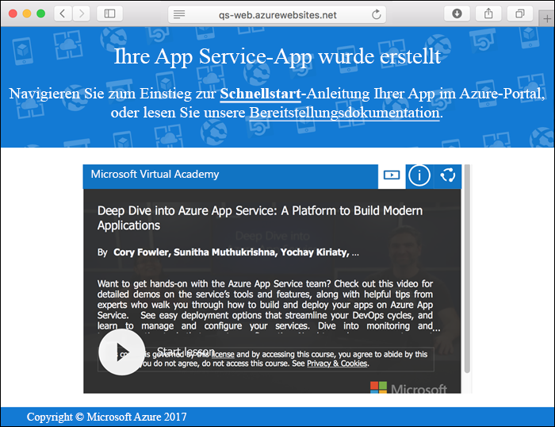
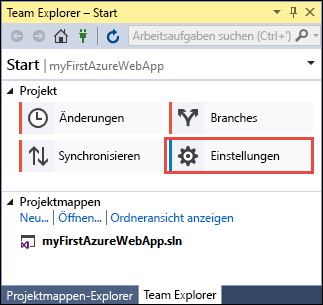
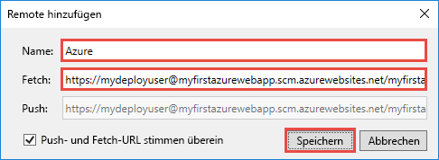

# <a name="create-an-aspnet-core-web-app-in-azure"></a>Erstellen von ASP.NET Core-Web-Apps in Azure

> [!NOTE]
> In diesem Artikel wird eine App in App Service unter Windows bereitgestellt. Informationen zur Bereitstellung in App Service unter _Linux_ finden Sie unter [Erstellen einer .NET Core-Web-App in App Service unter Linux](./containers/quickstart-dotnetcore.md).
>
> Informationen zu den Schritten für eine ASP.NET Framework-App finden Sie unter [Erstellen einer ASP.NET Framework-Web-App in Azure](app-service-web-get-started-dotnet-framework.md). 
>

[Azure-Web-Apps](app-service-web-overview.md) bietet einen hoch skalierbaren Webhostingdienst mit Self-Patching.  Diese Schnellstartanleitung veranschaulicht die Bereitstellung Ihrer ersten ASP.NET Core-Web-App in Azure-Web-Apps. Am Ende verfügen Sie über eine Ressourcengruppe, die einen App Service-Plan und eine Azure-Web-App mit einer bereitgestellten Webanwendung umfasst.

[!INCLUDE [quickstarts-free-trial-note](../../includes/quickstarts-free-trial-note.md)]

## <a name="prerequisites"></a>Voraussetzungen

Für dieses Tutorial benötigen Sie Folgendes:

* Installieren Sie <a href="https://www.visualstudio.com/downloads/" target="_blank">Visual Studio 2017</a> mit den folgenden Workloads:
    - **ASP.NET und Webentwicklung**
    - **Azure-Entwicklung**

    

## <a name="create-an-aspnet-core-web-app"></a>Erstellen einer ASP.NET Core-Web-App

Erstellen Sie in Visual Studio ein Projekt durch Auswählen von **Datei > Neu > Projekt**. 

Wählen Sie im Dialogfeld **Neues Projekt** die Optionen **Visual C# > Web > ASP.NET Core-Webanwendung** aus.

Geben Sie der Anwendung den Namen _myFirstAzureWebApp_, und wählen Sie dann **Neues Git-Repository erstellen** und **OK**.
   


Sie können jede Art von ASP.NET Core-Web-App für Azure bereitstellen. Wählen Sie in diesem Schnellstart die Vorlage **Webanwendung** aus, und vergewissern Sie sich, dass die Authentifizierung auf **Keine Authentifizierung** festgelegt ist.
      
Klicken Sie auf **OK**.


Sobald das ASP.NET Core-Projekt erstellt wurde, wird die ASP.NET Core-Startseite mit zahlreichen Links zu Ressourcen für die ersten Schritte angezeigt. 


Wählen Sie im Menü **Debuggen > Starten ohne Debugging** aus, um die Web-App lokal auszuführen.


[!INCLUDE [cloud-shell-try-it.md](../../includes/cloud-shell-try-it.md)]

[!INCLUDE [Configure deployment user](../../includes/configure-deployment-user.md)] 

[!INCLUDE [Create resource group](../../includes/app-service-web-create-resource-group.md)] 

[!INCLUDE [Create app service plan](../../includes/app-service-web-create-app-service-plan.md)] 

[!INCLUDE [Create web app](../../includes/app-service-web-create-web-app.md)] 



## <a name="push-to-azure-from-visual-studio"></a>Übertragen an Azure per Pushvorgang aus Visual Studio

Klicken Sie in Visual Studio im Menü **Ansicht** auf **Team Explorer**. Der **Team Explorer** wird angezeigt.

Klicken Sie in der Ansicht **Home** auf **Einstellungen** > **Repositoryeinstellungen**.



Wählen Sie in den **Repositoryeinstellungen** im Abschnitt **Remotes** die Option **Hinzufügen**. Das Dialogfeld **Remote hinzufügen** wird angezeigt.

Legen Sie das Feld **Name** auf _Azure_ fest, und legen Sie anschließend das Feld **Abrufen** auf die URL fest, die Sie unter [Erstellen einer Web-App](#create-a-web-app) gespeichert haben. Klicken Sie auf **Speichern**.



Diese Einstellung entspricht dem Git-Befehl `git remote add Azure <URL>`.

Klicken Sie oben auf die Schaltfläche **Home**.

Wählen Sie **Einstellungen** > **Globale Einstellungen**. Vergewissern Sie sich, dass der Name und die E-Mail-Adresse festgelegt wurden. Wählen Sie **Aktualisieren**, falls dies erforderlich ist.

Visual Studio hat bei der Erstellung des Projekts für alle Dateien bereits einen Commit in das Git-Repository durchgeführt. Sie müssen für die Dateien jetzt nur noch den Pushvorgang zu Azure durchführen.

Klicken Sie oben auf die Schaltfläche **Home**. Wählen Sie **Synchronisieren** > **Aktionen** > **Eingabeaufforderung öffnen**. 

Geben Sie im Befehlsfenster den folgenden Befehl und dann nach der Aufforderung das Bereitstellungskennwort ein:

```
git push Azure master
```

Die Ausführung dieses Befehls kann einige Minuten in Anspruch nehmen. Während der Ausführung werden Informationen angezeigt, die den Informationen im folgenden Beispiel ähneln:

```
Counting objects: 4, done.
Delta compression using up to 8 threads.
Compressing objects: 100% (4/4), done.
Writing objects: 100% (4/4), 349 bytes | 349.00 KiB/s, done.
Total 4 (delta 3), reused 0 (delta 0)
remote: Updating branch 'master'.
remote: Updating submodules.
remote: Preparing deployment for commit id '9e20345e9c'.
remote: Generating deployment script.
remote: Project file path: .\myFirstAzureWebApp\myFirstAzureWebApp.csproj
remote: Solution file path: .\myFirstAzureWebApp.sln
remote: Generated deployment script files
remote: Running deployment command...
remote: Handling ASP.NET Core Web Application deployment.
remote:   Restoring packages for D:\home\site\repository\myFirstAzureWebApp\myFirstAzureWebApp.csproj...
remote:   Restoring packages for D:\home\site\repository\myFirstAzureWebApp\myFirstAzureWebApp.csproj...
...
remote: Finished successfully.
remote: Running post deployment command(s)...
remote: Deployment successful.
To https://<app_name>.scm.azurewebsites.net/<app_name>.git
 * [new branch]      master -> master
```

## <a name="browse-to-the-app"></a>Navigieren zur App

Navigieren Sie in einem Browser zur URL der Azure-Web-App: `http://<app_name>.azurewebsites.net`.

Die Seite wird als Azure App Service-Web-App ausgeführt.


Herzlichen Glückwunsch, Ihre ASP.NET Core-Web-App wird live in Azure App Service ausgeführt.

## <a name="update-the-app-and-redeploy"></a>Aktualisieren der App und erneutes Bereitstellen

Öffnen Sie im **Projektmappen-Explorer** Folgendes: _Pages/Index.cshtml_.

Suchen Sie im oberen Bereich nach dem HTML-Tag `<div id="myCarousel" class="carousel slide" data-ride="carousel" data-interval="6000">`, und ersetzen Sie das gesamte Element durch folgenden Code:

```HTML
<div class="jumbotron">
    <h1>ASP.NET in Azure!</h1>
    <p class="lead">This is a simple app that we’ve built that demonstrates how to deploy a .NET app to Azure App Service.</p>
</div>
```

Klicken Sie im **Projektmappen-Explorer** mit der rechten Maustaste auf _Pages/Index.cshtml_ und dann auf **Commit ausführen**. Geben Sie eine Commit-Nachricht für Ihre Änderung ein, und klicken Sie auf **Alle committen**.

Führen Sie anschließend im Eingabeaufforderungsfenster für die Codeänderungen den Pushvorgang zu Azure durch.

```bash
git push Azure master
```

Navigieren Sie nach Abschluss des Bereitstellungsvorgangs wieder zu `http://<app_name>.azurewebsites.net`.


## <a name="manage-the-azure-web-app"></a>Verwalten der Azure-Web-App

Wechseln Sie zum <a href="https://portal.azure.com" target="_blank">Azure-Portal</a>, um die Web-App zu verwalten.

Wählen Sie im linken Menü **App Services** und anschließend den Namen Ihrer Azure-Web-App aus.


Die Übersichtsseite Ihrer Web-App wird angezeigt. Hier können Sie einfache Verwaltungsaufgaben wie Durchsuchen, Beenden, Neustarten und Löschen durchführen. 


Im linken Menü werden verschiedene Seiten für die Konfiguration Ihrer App angezeigt. 

[!INCLUDE [Clean-up section](../../includes/clean-up-section-portal.md)]

## <a name="next-steps"></a>Nächste Schritte

> [!div class="nextstepaction"]
> [ASP.NET Core mit SQL-Datenbank](app-service-web-tutorial-dotnetcore-sqldb.md)
