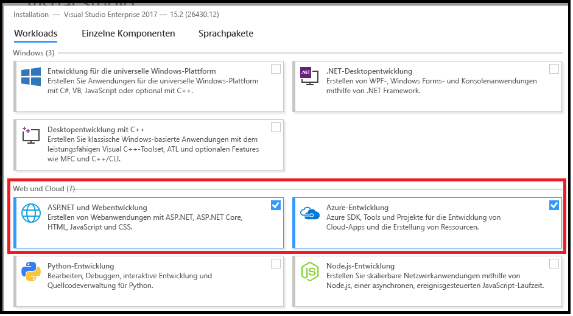
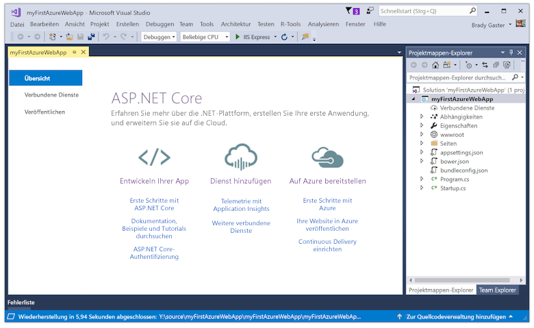
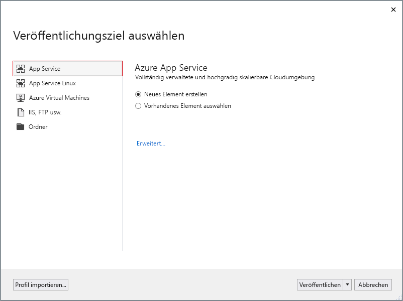
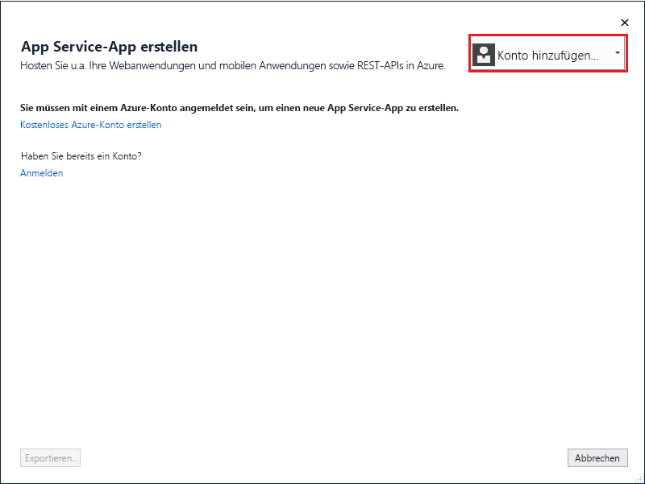
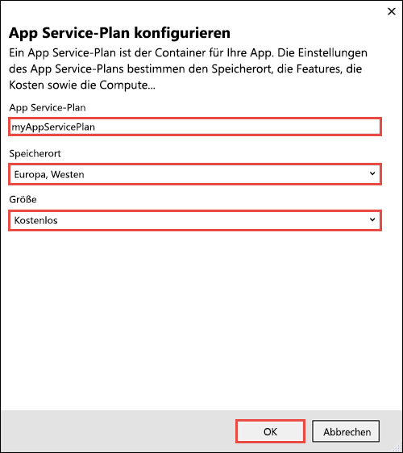
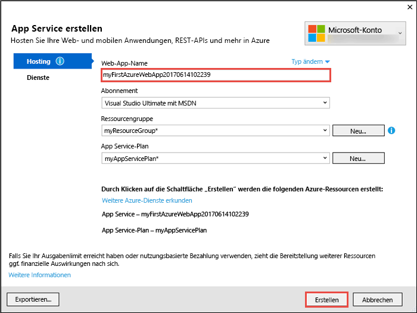
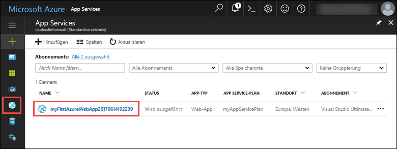
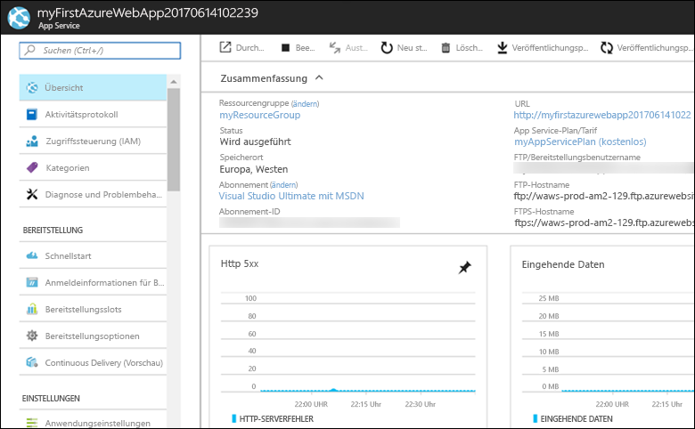

---
title: Erstellen einer ASP.NET Core-Web-App in Azure | Microsoft-Dokumentation
description: Erfahren Sie, wie Sie Web-Apps in Azure App Service ausführen, indem Sie die standardmäßige ASP.NET-Web-App bereitstellen.
services: app-service\web
documentationcenter: ''
author: cephalin
manager: cfowler
editor: ''
ms.assetid: b1e6bd58-48d1-4007-9d6c-53fd6db061e3
ms.service: app-service-web
ms.workload: web
ms.tgt_pltfrm: na
ms.devlang: na
ms.topic: quickstart
ms.date: 06/14/2017
ms.author: cephalin
ms.custom: mvc, devcenter
ms.openlocfilehash: 91f6fd077146e94833a5527f03ac710352e4fd9c
ms.sourcegitcommit: 6fcd9e220b9cd4cb2d4365de0299bf48fbb18c17
ms.translationtype: HT
ms.contentlocale: de-DE
ms.lasthandoff: 04/05/2018
ms.locfileid: "30838365"
---
# <a name="create-an-aspnet-core-web-app-in-azure"></a>Erstellen von ASP.NET Core-Web-Apps in Azure

> [!NOTE]
> In diesem Artikel wird eine App in App Service unter Windows bereitgestellt. Informationen zur Bereitstellung in App Service unter _Linux_ finden Sie unter [Erstellen einer .NET Core-Web-App in App Service unter Linux](./containers/quickstart-dotnetcore.md).
>

[Azure-Web-Apps](app-service-web-overview.md) bietet einen hoch skalierbaren Webhostingdienst mit Self-Patching.  Diese Schnellstartanleitung veranschaulicht die Bereitstellung Ihrer ersten ASP.NET Core-Web-App in Azure-Web-Apps. Am Ende verfügen Sie über eine Ressourcengruppe, die einen App Service-Plan und eine Azure-Web-App mit einer bereitgestellten Webanwendung umfasst.

> [!NOTE]
> Informationen zum Erstellen und Bereitstellen einer ASP.NET Framework-Web-App finden Sie in [diesem Artikel](app-service-web-get-started-dotnet-framework.md). 
>

[!INCLUDE [quickstarts-free-trial-note](../../includes/quickstarts-free-trial-note.md)]

## <a name="prerequisites"></a>Voraussetzungen

Für dieses Tutorial benötigen Sie Folgendes:

* Installieren Sie <a href="https://www.visualstudio.com/downloads/" target="_blank">Visual Studio 2017</a> mit den folgenden Workloads:
    - **ASP.NET und Webentwicklung**
    - **Azure-Entwicklung**

    

Falls Sie Visual Studio bereits installiert haben, können Sie die Workloads in Visual Studio hinzufügen, indem Sie auf **Extras** > **Get Tools and Features** (Tools und Features abrufen) klicken.

## <a name="create-an-aspnet-core-web-app"></a>Erstellen einer ASP.NET Core-Web-App

Erstellen Sie in Visual Studio ein Projekt durch Auswählen von **Datei > Neu > Projekt**. 

Wählen Sie im Dialogfeld **Neues Projekt** die Optionen **Visual C# > Web > ASP.NET Core-Webanwendung** aus.

Geben Sie der Anwendung den Namen _myFirstAzureWebApp_, und wählen Sie anschließend **OK** aus.
   


Sie können jede Art von ASP.NET Core-Web-App für Azure bereitstellen. Wählen Sie in diesem Schnellstart die Vorlage **Webanwendung** aus, und vergewissern Sie sich, dass die Authentifizierung auf **Keine Authentifizierung** festgelegt ist.
      
Klicken Sie auf **OK**.


Sobald das ASP.NET Core-Projekt erstellt wurde, wird die ASP.NET Core-Startseite mit zahlreichen Links zu Ressourcen für die ersten Schritte angezeigt. 



Wählen Sie im Menü **Debuggen > Starten ohne Debugging** aus, um die Web-App lokal auszuführen.


## <a name="publish-to-azure"></a>Veröffentlichen in Azure

Klicken Sie im **Projektmappen-Explorer** mit der rechten Maustaste auf das Projekt **myFirstAzureWebApp**, und wählen Sie **Veröffentlichen** aus.


Vergewissern Sie sich, dass **Microsoft Azure App Service** ausgewählt ist, und wählen Sie **Veröffentlichen** aus.



Daraufhin wird das Dialogfeld **App Service erstellen** geöffnet, in dem Sie alle Azure-Ressourcen erstellen können, die benötigt werden, um die ASP.NET Core-Web-App in Azure auszuführen.

## <a name="sign-in-to-azure"></a>Anmelden bei Azure

Wählen Sie im Dialogfeld **App Service erstellen** die Option **Konto hinzufügen**, und melden Sie sich bei Ihrem Azure-Abonnement an. Falls Sie bereits angemeldet sind, können Sie in der Dropdownliste das Konto mit dem gewünschten Abonnement auswählen.

> [!NOTE]
> Wenn Sie bereits angemeldet sind, wählen Sie noch nicht **Erstellen** aus.
>
>
   


## <a name="create-a-resource-group"></a>Erstellen einer Ressourcengruppe

[!INCLUDE [resource group intro text](../../includes/resource-group.md)]

Wählen Sie neben **Ressourcengruppe** die Option **Neu** aus.

Nennen Sie die Ressourcengruppe **myResourceGroup**, und wählen Sie **OK** aus.

## <a name="create-an-app-service-plan"></a>Wie erstelle ich einen Plan?

[!INCLUDE [app-service-plan](../../includes/app-service-plan.md)]

Wählen Sie neben **App Service-Plan** die Option **Neu** aus. 

Verwenden Sie im Dialogfeld **App Service-Plan konfigurieren** die in der Tabelle unter dem Screenshot aufgeführten Einstellungen.



| Einstellung | Empfohlener Wert | BESCHREIBUNG |
|-|-|-|
|App Service-Plan| myAppServicePlan | Name des App Service-Plans. |
| Speicherort | Europa, Westen | Das Rechenzentrum, in dem die Web-App gehostet wird. |
| Größe | Kostenlos | Der [Tarif](https://azure.microsoft.com/pricing/details/app-service/?ref=microsoft.com&utm_source=microsoft.com&utm_medium=docs&utm_campaign=visualstudio) bestimmt die Hostingfeatures. |

Klicken Sie auf **OK**.

## <a name="create-and-publish-the-web-app"></a>Erstellen und Veröffentlichen der Web-App

Geben Sie unter **Web-App-Name** einen eindeutigen App-Namen ein (gültige Zeichen sind `a-z`, `0-9` und `-`), oder akzeptieren Sie den automatisch generierten eindeutigen Namen. Die URL der Web-App lautet `http://<app_name>.azurewebsites.net`, wobei `<app_name>` der Name der Web-App ist.

Wählen Sie **Erstellen** aus, um mit der Erstellung der Azure-Ressourcen zu beginnen.



Nach Abschluss des Assistenten wird die ASP.NET Core-Web-App in Azure veröffentlicht und anschließend im Standardbrowser gestartet.


Der Web-App-Name, den Sie im [Schritt „Erstellen und Veröffentlichen“](#create-and-publish-the-web-app) angegeben haben, wird als URL-Präfix im Format `http://<app_name>.azurewebsites.net` verwendet.

Herzlichen Glückwunsch, Ihre ASP.NET Core-Web-App wird live in Azure App Service ausgeführt.

## <a name="update-the-app-and-redeploy"></a>Aktualisieren der App und erneutes Bereitstellen

Öffnen Sie im **Projektmappen-Explorer** Folgendes: _Pages/Index.cshtml_.

Suchen Sie im oberen Bereich nach dem HTML-Tag `<div id="myCarousel" class="carousel slide" data-ride="carousel" data-interval="6000">`, und ersetzen Sie das gesamte Element durch folgenden Code:

```HTML
<div class="jumbotron">
    <h1>ASP.NET in Azure!</h1>
    <p class="lead">This is a simple app that we’ve built that demonstrates how to deploy a .NET app to Azure App Service.</p>
</div>
```

Klicken Sie zur erneuten Bereitstellung in Azure im **Projektmappen-Explorer** mit der rechten Maustaste auf das Projekt **myFirstAzureWebApp**, und wählen Sie **Veröffentlichen** aus.

Wählen Sie auf der Veröffentlichungsseite die Option **Veröffentlichen** aus.

Nach Abschluss der Veröffentlichung wird in Visual Studio ein Browser mit der URL der Web-App gestartet.


## <a name="manage-the-azure-web-app"></a>Verwalten der Azure-Web-App

Wechseln Sie zum <a href="https://portal.azure.com" target="_blank">Azure-Portal</a>, um die Web-App zu verwalten.

Wählen Sie im linken Menü **App Services** und anschließend den Namen Ihrer Azure-Web-App aus.



Die Übersichtsseite Ihrer Web-App wird angezeigt. Hier können Sie einfache Verwaltungsaufgaben wie Durchsuchen, Beenden, Neustarten und Löschen durchführen. 



Im linken Menü werden verschiedene Seiten für die Konfiguration Ihrer App angezeigt. 

[!INCLUDE [Clean-up section](../../includes/clean-up-section-portal.md)]

## <a name="next-steps"></a>Nächste Schritte

> [!div class="nextstepaction"]
> [ASP.NET Core mit SQL-Datenbank](app-service-web-tutorial-dotnetcore-sqldb.md)
