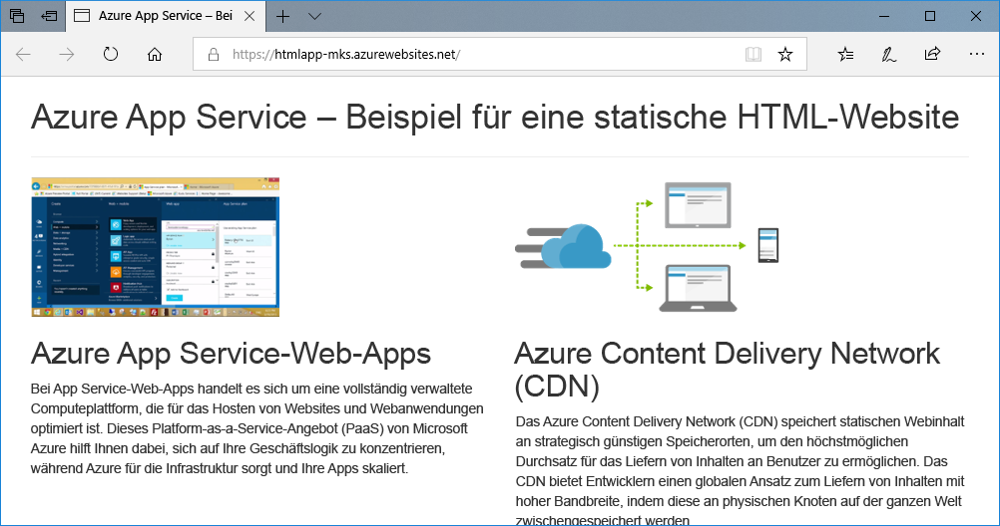
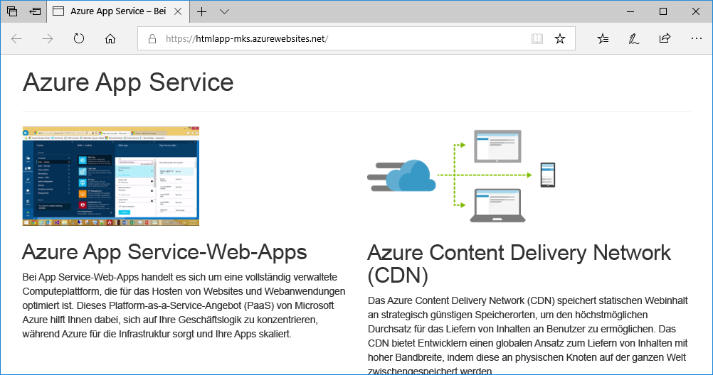
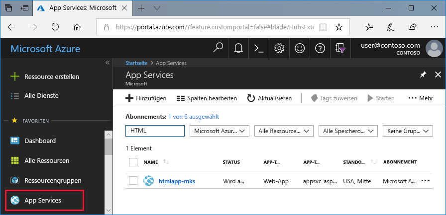
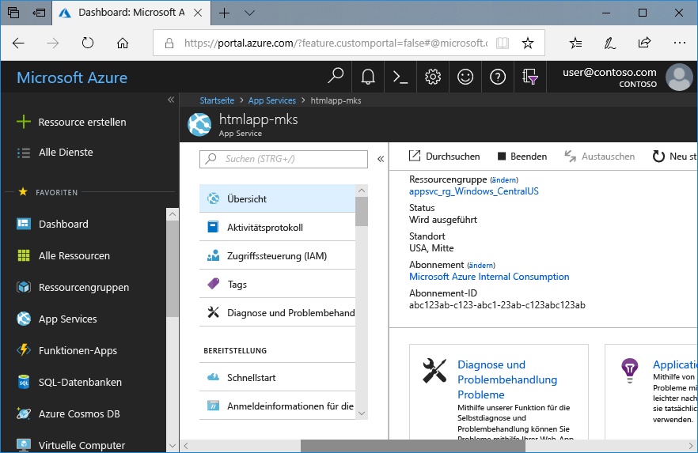

# <a name="create-a-static-html-web-app-in-azure"></a>Erstellen einer statischen HTML-Web-App in Azure

Von [Azure App Service](overview.md) wird ein hochgradig skalierbarer Webhostingdienst mit Self-Patching bereitgestellt. In dieser Schnellstartanleitung wird erläutert, wie Sie eine einfache Website mit HTML und CSS in Azure App Service bereitstellen. In dieser Schnellstartanleitung wird [Cloud Shell](https://docs.microsoft.com/azure/cloud-shell/overview) verwendet. Die Befehle können aber auch lokal über die [Azure CLI](/cli/azure/install-azure-cli) ausgeführt werden.



[!INCLUDE [quickstarts-free-trial-note](../../includes/quickstarts-free-trial-note.md)]

[!INCLUDE [cloud-shell-try-it.md](../../includes/cloud-shell-try-it.md)]

## <a name="download-the-sample"></a>Herunterladen des Beispiels

Erstellen Sie in Cloud Shell ein Schnellstartverzeichnis, und wechseln Sie dorthin.

```bash
mkdir quickstart

cd $HOME/quickstart
```

Führen Sie als Nächstes den folgenden Befehl aus, um das Beispiel-App-Repository in Ihrem Schnellstartverzeichnis zu klonen.

```bash
git clone https://github.com/Azure-Samples/html-docs-hello-world.git
```

## <a name="create-a-web-app"></a>Erstellen einer Web-App

Wechseln Sie zum Verzeichnis mit dem Beispielcode, und führen Sie den Befehl `az webapp up` aus.

Ersetzen Sie im folgenden Beispiel „<app_name>“ durch einen eindeutigen App-Namen.

```bash
cd html-docs-hello-world

az webapp up --location westeurope --name <app_name>
```

Der Befehl `az webapp up` bewirkt Folgendes:

- Erstellen einer Standardressourcengruppe

- Erstellen eines standardmäßigen App Service-Plans

- Erstellen einer App mit dem angegebenen Namen

- [Bereitstellen von ZIP-Dateien](https://docs.microsoft.com/azure/app-service/deploy-zip) aus dem aktuellen Arbeitsverzeichnis für die Web-App

Die Ausführung dieses Befehls kann einige Minuten in Anspruch nehmen. Während der Ausführung werden Informationen angezeigt, die den Informationen im folgenden Beispiel ähneln:

```json
{
  "app_url": "https://<app_name>.azurewebsites.net",
  "location": "westeurope",
  "name": "<app_name>",
  "os": "Windows",
  "resourcegroup": "appsvc_rg_Windows_westeurope",
  "serverfarm": "appsvc_asp_Windows_westeurope",
  "sku": "FREE",
  "src_path": "/home/<username>/quickstart/html-docs-hello-world ",
  < JSON data removed for brevity. >
}
```

Notieren Sie sich den Wert für `resourceGroup`. Sie benötigen ihn im Abschnitt [Bereinigen von Ressourcen](#clean-up-resources).

## <a name="browse-to-the-app"></a>Navigieren zur App

Wechseln Sie in einem Browser zur URL der App: `http://<app_name>.azurewebsites.net`.

Die Seite wird als Azure App Service-Web-App ausgeführt.


**Glückwunsch!** Sie haben Ihre erste HTML-App für App Service bereitgestellt.

## <a name="update-and-redeploy-the-app"></a>Aktualisieren und erneutes Bereitstellen der App

Geben Sie in Cloud Shell `nano index.html` ein, um den Nano-Text-Editor zu öffnen. Ändern Sie im Tag der Überschrift `<h1>` „Azure App Service – Statische HTML-Beispielsite“ in „Azure App Service“ wie nachfolgend gezeigt:


Speichern Sie Ihre Änderungen, und beenden Sie Nano. Verwenden Sie `^O` zum Speichern und `^X` zum Beenden.

Nun stellen Sie die App mit dem gleichen `az webapp up`-Befehl erneut bereit.

```bash
az webapp up --location westeurope --name <app_name>
```

Wechseln Sie nach Abschluss der Bereitstellung wieder zu dem Browserfenster, das im Schritt **Navigieren zur App** geöffnet wurde, und aktualisieren Sie die Seite.



## <a name="manage-your-new-azure-app"></a>Verwalten Ihrer neuen Azure-App

Wechseln Sie zum <a href="https://portal.azure.com" target="_blank">Azure-Portal</a>, um die erstellte Web-App zu verwalten.

Klicken Sie im linken Menü auf **App Services** und anschließend auf den Namen Ihrer Azure-App.



Die Übersichtsseite Ihrer Web-App wird angezeigt. Hier können Sie einfache Verwaltungsaufgaben wie Durchsuchen, Beenden, Neustarten und Löschen durchführen.



Im linken Menü werden verschiedene Seiten für die Konfiguration Ihrer App angezeigt.

## <a name="clean-up-resources"></a>Bereinigen von Ressourcen

In den vorherigen Schritten haben Sie Azure-Ressourcen in einer Ressourcengruppe erstellt. Wenn Sie diese Ressourcen in Zukunft nicht mehr benötigen, löschen Sie die Ressourcengruppe, indem Sie den folgenden Befehl in Cloud Shell ausführen. Denken Sie daran, dass der Name der Ressourcengruppe im Schritt [Erstellen einer Web-App](#create-a-web-app) automatisch für Sie generiert wurde.

```bash
az group delete --name appsvc_rg_Windows_westeurope
```

Die Ausführung dieses Befehls kann eine Minute in Anspruch nehmen.

## <a name="next-steps"></a>Nächste Schritte

> [!div class="nextstepaction"]
> [Zuordnen einer benutzerdefinierten Domäne](app-service-web-tutorial-custom-domain.md)
