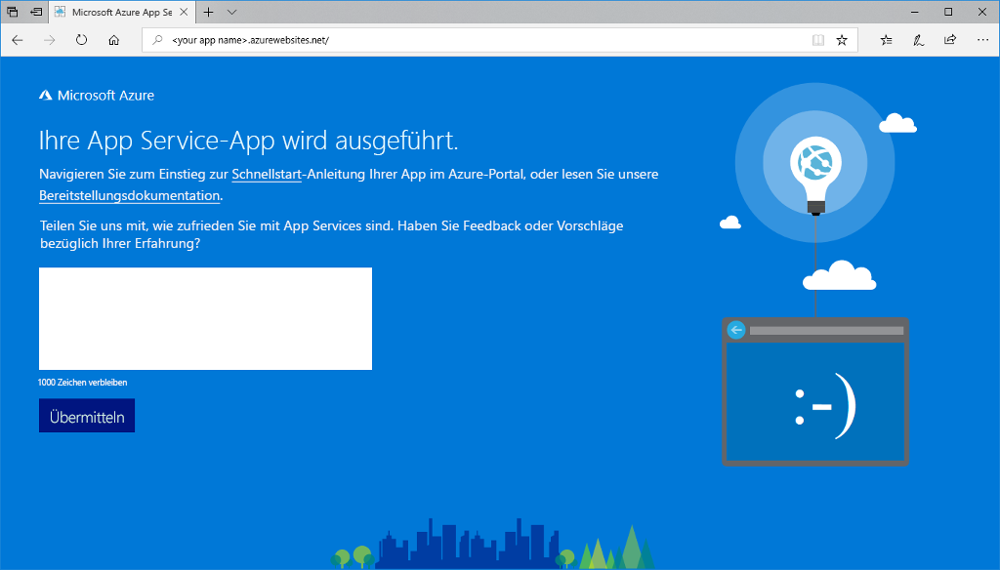

# <a name="create-a-nodejs-web-app-in-azure"></a>Erstellen einer Node.js-Web-App in Azure

> [!NOTE]
> In diesem Artikel wird eine App in App Service unter Windows bereitgestellt. Informationen zur Bereitstellung in App Service unter _Linux_ finden Sie unter [Erstellen einer Node.js-Web-App in Azure App Service unter Linux](./containers/quickstart-nodejs.md).
>

Von [Azure App Service](overview.md) wird ein hochgradig skalierbarer Webhostingdienst mit Self-Patching bereitgestellt.  In diesem Schnellstart-Artikel wird erläutert, wie Sie eine Node.js-App in Azure App Service bereitstellen. Die Web-App wird mithilfe von [Cloud Shell](https://docs.microsoft.com/azure/cloud-shell/overview) erstellt. Die Befehle können aber auch lokal über die [Azure-Befehlszeilenschnittstelle](/cli/azure/install-azure-cli) ausgeführt werden. Der Node.js-Beispielcode wird mithilfe des Befehls [az webapp deployment source config-zip](/cli/azure/webapp/deployment/source?view=azure-cli-latest#az-webapp-deployment-source-config-zip) für die Web-App bereitgestellt.  


Die folgenden Schritte können unter Mac, Windows oder Linux ausgeführt werden. Für diese Schritte werden etwa drei Minuten benötigt.

[!INCLUDE [quickstarts-free-trial-note](../../includes/quickstarts-free-trial-note.md)]

[!INCLUDE [cloud-shell-try-it.md](../../includes/cloud-shell-try-it.md)]

## <a name="download-the-sample"></a>Herunterladen des Beispiels

Erstellen Sie in Cloud Shell ein Schnellstartverzeichnis, und wechseln Sie dorthin.

```azurecli-interactive
mkdir quickstart

cd quickstart
```

Führen Sie als Nächstes den folgenden Befehl aus, um das Beispiel-App-Repository in Ihrem Schnellstartverzeichnis zu klonen.

```azurecli-interactive
git clone https://github.com/Azure-Samples/nodejs-docs-hello-world
```

Während der Ausführung werden Informationen angezeigt, die den Informationen im folgenden Beispiel ähneln:

```bash
Cloning into 'nodejs-docs-hello-world'...
remote: Counting objects: 40, done.
remote: Total 40 (delta 0), reused 0 (delta 0), pack-reused 40
Unpacking objects: 100% (40/40), done.
Checking connectivity... done.
```

> [!NOTE]
> Die Beispieldatei „index.js“ legt den Lauschport auf „process.env.PORT“ fest. Diese Umgebungsvariable wird von App Service zugewiesen.
>

[!INCLUDE [Create resource group](../../includes/app-service-web-create-resource-group-scus.md)]

[!INCLUDE [Create app service plan](../../includes/app-service-web-create-app-service-plan-scus.md)]

## <a name="create-a-web-app"></a>Erstellen einer Web-App

Erstellen Sie in Cloud Shell mit dem Befehl [`az webapp create`](/cli/azure/webapp?view=azure-cli-latest#az-webapp-create) eine Web-App im App Service-Plan `myAppServicePlan`.

Ersetzen Sie im folgenden Beispiel `<app_name>` durch einen global eindeutigen App-Namen (gültige Zeichen sind `a-z`, `0-9` und `-`).

```azurecli-interactive
# Bash and Powershell
az webapp create --resource-group myResourceGroup --plan myAppServicePlan --name <app_name>
```

Nach Erstellung der Web-App zeigt die Azure CLI eine Ausgabe wie im folgenden Beispiel an:

```json
{
  "availabilityState": "Normal",
  "clientAffinityEnabled": true,
  "clientCertEnabled": false,
  "cloningInfo": null,
  "containerSize": 0,
  "dailyMemoryTimeQuota": 0,
  "defaultHostName": "<app_name>.azurewebsites.net",
  "enabled": true,
  < JSON data removed for brevity. >
}
```

### <a name="set-nodejs-runtime"></a>Festlegen der Node.js-Runtime

Legen Sie die Node.js-Runtime auf „10.14.1“ fest. Führen Sie [`az webapp list-runtimes`](/cli/azure/webapp?view=azure-cli-latest#az-webapp-list-runtimes) aus, um alle unterstützten Laufzeiten anzuzeigen.

```azurecli-interactive
# Bash and Powershell
az webapp config appsettings set --resource-group myResourceGroup --name <app_name> --settings WEBSITE_NODE_DEFAULT_VERSION=10.14.1
```

Wechseln Sie zu Ihrer neu erstellten Web-App. Ersetzen Sie `<app_name>` durch einen eindeutigen App-Namen.

```
http://<app_name>.azurewebsites.net
```

Ihre neue Web-App sollte nun wie folgt aussehen: 

## <a name="deploy-zip-file"></a>Bereitstellen der ZIP-Datei

Navigieren Sie in Cloud Shell zum Stammverzeichnis Ihrer Anwendung, und erstellen Sie eine neue ZIP-Datei für Ihr Beispielprojekt.

```azurecli-interactive
cd nodejs-docs-hello-world  

zip -r myUpdatedAppFiles.zip *.*
```

Stellen Sie die ZIP-Datei mithilfe des Befehls [az webapp deployment source config-zip](/cli/azure/webapp/deployment/source?view=azure-cli-latest#az-webapp-deployment-source-config-zip) für Ihre Web-App bereit.  

```azurecli-interactive
az webapp deployment source config-zip --resource-group myResourceGroup --name <app_name> --src myUpdatedAppFiles.zip
```

Mit diesem Befehl werden die Dateien und Verzeichnisse aus der ZIP-Datei in Ihrem Standardordner der App Service-Anwendung (`\home\site\wwwroot`) bereitgestellt, und die App wird neu gestartet. Falls ein zusätzlicher benutzerdefinierter Buildprozess konfiguriert wurde, wird dieser ebenfalls ausgeführt. Weitere Informationen finden Sie in der [Kudu-Dokumentation](https://github.com/projectkudu/kudu/wiki/Deploying-from-a-zip-file).

## <a name="browse-to-the-app"></a>Navigieren zur App

Navigieren Sie in Ihrem Webbrowser zu der bereitgestellten Anwendung.

```
http://<app_name>.azurewebsites.net
```

Der Node.js-Beispielcode wird in einer Azure App Service-Web-App ausgeführt.


> [!NOTE]
> In Azure App Service wird die App unter Verwendung von [iisnode](https://github.com/Azure/iisnode) in IIS ausgeführt. Damit die App mit iisnode ausgeführt werden kann, enthält das Stammverzeichnis der App die Datei „web.config“. Die Datei kann von IIS gelesen werden, und die Einstellungen für iisnode sind im [GitHub-Repository zu iisnode](https://github.com/Azure/iisnode/blob/master/src/samples/configuration/web.config) dokumentiert.

**Glückwunsch!** Sie haben Ihre erste Node.js-App für App Service bereitgestellt.

## <a name="update-and-redeploy-the-code"></a>Aktualisieren und erneutes Bereitstellen des Codes

Geben Sie in Cloud Shell `code index.js` ein, um den Cloud Shell-Editor zu öffnen.


Nehmen Sie eine geringfügige Änderung am Text im Aufruf für `response.end` vor:

```javascript
response.end("Hello Azure!");
```

Speichern Sie Ihre Änderungen, und beenden Sie den Editor. Verwenden Sie `^S` zum Speichern und `^Q` zum Beenden.

Erstellen Sie eine ZIP-Datei, und stellen Sie sie mithilfe des Befehls [az webapp deployment source config-zip](/cli/azure/webapp/deployment/source?view=azure-cli-latest#az-webapp-deployment-source-config-zip) bereit.  

```azurecli-interactive
# Bash
zip -r myUpdatedAppFiles.zip *.*

az webapp deployment source config-zip --resource-group myResourceGroup --name <app_name> --src myUpdatedAppFiles.zip
```

Wechseln Sie wieder zu dem Browserfenster, das im Schritt **Navigieren zur App** geöffnet wurde, und aktualisieren Sie die Seite.


## <a name="manage-your-new-azure-app"></a>Verwalten Ihrer neuen Azure-App

Wechseln Sie zum <a href="https://portal.azure.com" target="_blank">Azure-Portal</a>, um die erstellte Web-App zu verwalten.

Klicken Sie im linken Menü auf **App Services** und anschließend auf den Namen Ihrer Azure-App.


Die Übersichtsseite Ihrer Web-App wird angezeigt. Hier können Sie einfache Verwaltungsaufgaben wie Durchsuchen, Beenden, Neustarten und Löschen durchführen.


Im linken Menü werden verschiedene Seiten für die Konfiguration Ihrer App angezeigt.

[!INCLUDE [cli-samples-clean-up](../../includes/cli-samples-clean-up.md)]

## <a name="next-steps"></a>Nächste Schritte

> [!div class="nextstepaction"]
> [Node.js mit MongoDB](app-service-web-tutorial-nodejs-mongodb-app.md)
