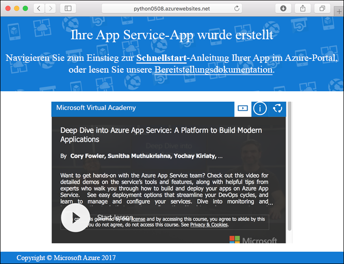
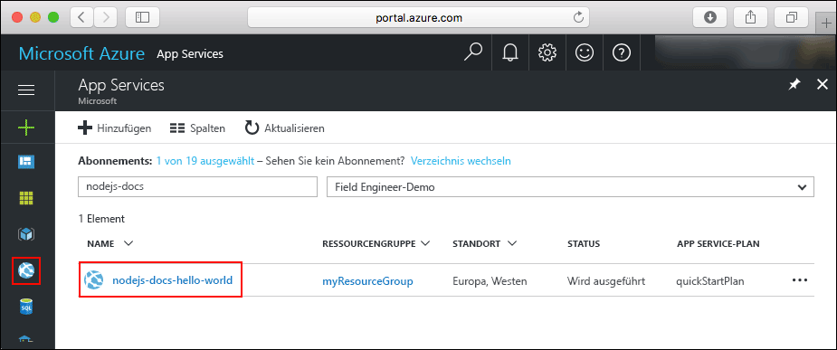
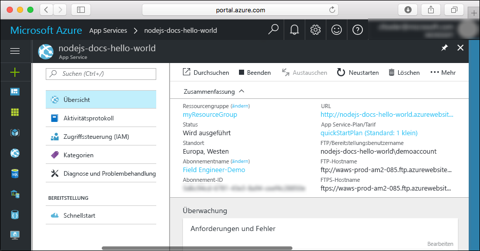

# <a name="create-a-python-web-app-in-azure"></a>Erstellen einer Python-Web-App in Azure

[Azure-Web-Apps](app-service-web-overview.md) bietet einen hochgradig skalierbaren Webhosting-Dienst mit Self-Patching.  In dieser Schnellstartanleitung erfahren Sie Schritt für Schritt, wie Sie in Azure-Web-Apps eine Python-App entwickeln und bereitstellen. Sie erstellen die Web-App mithilfe der [Azure CLI](https://docs.microsoft.com/cli/azure/get-started-with-azure-cli) und stellen mit Git Python-Beispielcode für die Web-App bereit.


Die folgenden Schritte können unter Mac, Windows oder Linux ausgeführt werden. Nachdem die erforderlichen Komponenten installiert wurden, können die Schritte in etwa fünf Minuten durchgeführt werden.

## <a name="prerequisites"></a>Voraussetzungen

Für dieses Tutorial benötigen Sie Folgendes:

1. [Installieren Sie Git.](https://git-scm.com/)
1. [Installieren Sie Python.](https://www.python.org/downloads/)

[!INCLUDE [quickstarts-free-trial-note](../../includes/quickstarts-free-trial-note.md)]

## <a name="download-the-sample"></a>Herunterladen des Beispiels

Führen Sie in einem Terminalfenster den folgenden Befehl aus, um das Beispiel-App-Repository auf Ihren lokalen Computer zu klonen.

```bash
git clone https://github.com/Azure-Samples/python-docs-hello-world
```

Navigieren Sie zum Verzeichnis mit dem Beispielcode.

```bash
cd python-docs-hello-world
```

## <a name="run-the-app-locally"></a>Lokales Ausführen der App

Installieren Sie die erforderlichen Pakete mithilfe von `pip`.

```bash
pip install -r requirements.txt
```

Öffnen Sie zum lokalen Ausführen der Anwendung ein Terminalfenster, und verwenden Sie den Befehl `Python`, um den integrierten Python-Webserver zu starten.

```bash
python main.py
```

Öffnen Sie einen Webbrowser, und navigieren Sie zu der Beispielapp auf `http://localhost:5000`.

Auf der Seite wird die Nachricht **Hello World** aus der Beispiel-App angezeigt.


Drücken Sie in Ihrem Terminalfenster **STRG+C**, um den Webserver zu beenden.

[!INCLUDE [cloud-shell-try-it.md](../../includes/cloud-shell-try-it.md)]

[!INCLUDE [Configure deployment user](../../includes/configure-deployment-user.md)]

[!INCLUDE [Create resource group](../../includes/app-service-web-create-resource-group.md)]

[!INCLUDE [Create app service plan](../../includes/app-service-web-create-app-service-plan.md)]

## <a name="create-a-web-app"></a>Erstellen einer Web-App

[!INCLUDE [Create web app](../../includes/app-service-web-create-web-app-python-no-h.md)]

Navigieren Sie zu Ihrer neu erstellten Web-App. Ersetzen Sie _&lt;App-Name>_ durch einen eindeutigen App-Namen.

```bash
http://<app name>.azurewebsites.net
```



[!INCLUDE [Push to Azure](../../includes/app-service-web-git-push-to-azure.md)]

```bash
Counting objects: 18, done.
Delta compression using up to 4 threads.
Compressing objects: 100% (16/16), done.
Writing objects: 100% (18/18), 4.31 KiB | 0 bytes/s, done.
Total 18 (delta 4), reused 0 (delta 0)
remote: Updating branch 'master'.
remote: Updating submodules.
remote: Preparing deployment for commit id '44e74fe7dd'.
remote: Generating deployment script.
remote: Generating deployment script for python Web Site
remote: Generated deployment script files
remote: Running deployment command...
remote: Handling python deployment.
remote: KuduSync.NET from: 'D:\home\site\repository' to: 'D:\home\site\wwwroot'
remote: Deleting file: 'hostingstart.html'
remote: Copying file: '.gitignore'
remote: Copying file: 'LICENSE'
remote: Copying file: 'main.py'
remote: Copying file: 'README.md'
remote: Copying file: 'requirements.txt'
remote: Copying file: 'virtualenv_proxy.py'
remote: Copying file: 'web.2.7.config'
remote: Copying file: 'web.3.4.config'
remote: Detected requirements.txt.  You can skip Python specific steps with a .skipPythonDeployment file.
remote: Detecting Python runtime from site configuration
remote: Detected python-3.4
remote: Creating python-3.4 virtual environment.
remote: .................................
remote: Pip install requirements.
remote: Successfully installed Flask click itsdangerous Jinja2 Werkzeug MarkupSafe
remote: Cleaning up...
remote: .
remote: Overwriting web.config with web.3.4.config
remote:         1 file(s) copied.
remote: Finished successfully.
remote: Running post deployment command(s)...
remote: Deployment successful.
To https://<app_name>.scm.azurewebsites.net/<app_name>.git
 * [new branch]      master -> master
```

## <a name="browse-to-the-app"></a>Navigieren zur App

Navigieren Sie in Ihrem Webbrowser zu der bereitgestellten Anwendung.

```bash
http://<app_name>.azurewebsites.net
```

Der Python-Beispielcode wird in einer Azure App Service-Web-App ausgeführt.


**Glückwunsch!** Sie haben Ihre erste Python-App für App Service bereitgestellt.

## <a name="update-and-redeploy-the-code"></a>Aktualisieren und erneutes Bereitstellen des Codes

Öffnen Sie die Datei `main.py` innerhalb der Python-App mit einem lokalen Text-Editor, und ändern Sie den Text neben der Anweisung `return` geringfügig:

```python
return 'Hello, Azure!'
```

Committen Sie Ihre Änderungen im lokalen Terminalfenster in Git, und übertragen Sie die Codeänderungen mithilfe von Push an Azure.

```bash
git commit -am "updated output"
git push azure master
```

Wechseln Sie nach Abschluss der Bereitstellung wieder zu dem Browserfenster, das im Schritt [Navigieren zur App](#browse-to-the-app) geöffnet wurde, und aktualisieren Sie die Seite.


## <a name="manage-your-new-azure-web-app"></a>Verwalten Ihrer neuen Azure-Web-App

Wechseln Sie zum <a href="https://portal.azure.com" target="_blank">Azure-Portal</a>, um die erstellte Web-App zu verwalten.

Klicken Sie im linken Menü auf **App Services** und anschließend auf den Namen Ihrer Azure-Web-App.



Die Übersichtsseite Ihrer Web-App wird angezeigt. Hier können Sie einfache Verwaltungsaufgaben wie Durchsuchen, Beenden, Neustarten und Löschen durchführen.



Im linken Menü werden verschiedene Seiten für die Konfiguration Ihrer App angezeigt.

[!INCLUDE [cli-samples-clean-up](../../includes/cli-samples-clean-up.md)]

## <a name="next-steps"></a>Nächste Schritte

> [!div class="nextstepaction"]
> [Zuordnen eines vorhandenen benutzerdefinierten DNS-Namens zu Azure-Web-Apps](app-service-web-tutorial-custom-domain.md)
