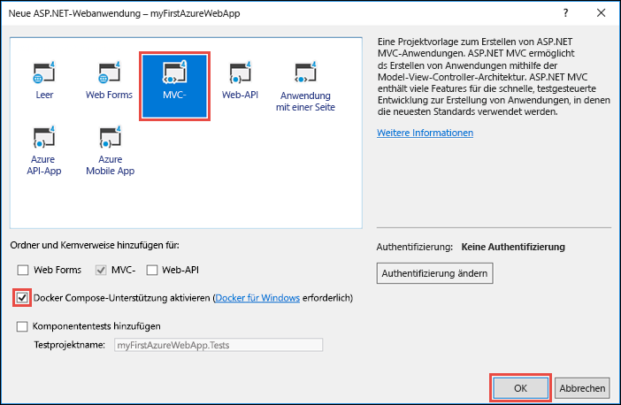
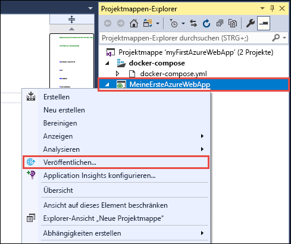
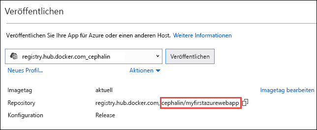
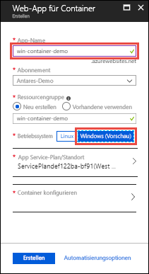
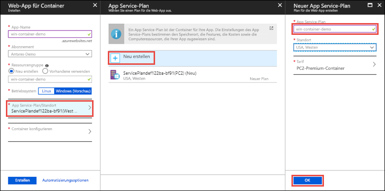
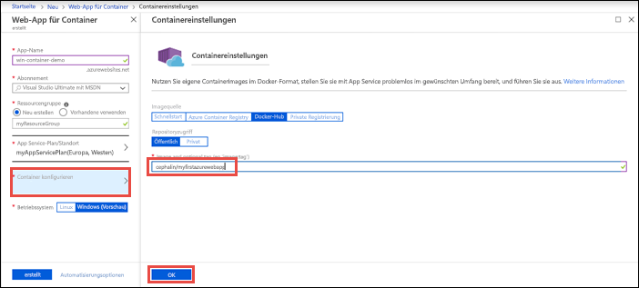
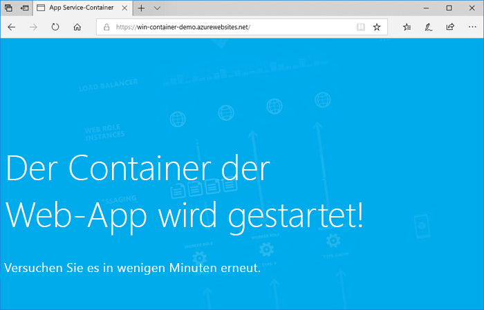
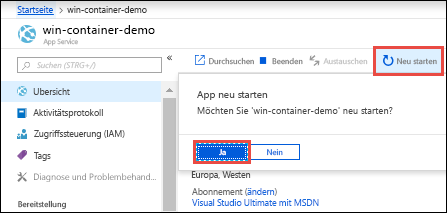

# <a name="run-a-custom-windows-container-in-azure-preview"></a>Ausführen eines benutzerdefinierten Windows-Containers in Azure (Vorschau)

[Azure App Service](overview.md) stellt vordefinierte Anwendungsstapel unter Windows wie ASP.NET oder Node.js bereit (ausgeführt unter IIS). Die vorkonfigurierte Windows-Umgebung sperrt das Betriebssystem für Administratorzugriff, Softwareinstallationen, Änderungen am globalen Assemblycache usw. (siehe [Betriebssystemfunktionen für Azure App Service](operating-system-functionality.md)). Wenn für Ihre Anwendung umfangreichere Zugriffsrechte erforderlich sind, als die vorkonfigurierte Umgebung zulässt, können Sie stattdessen einen benutzerdefinierten Windows-Container bereitstellen. In diesem Schnellstart wird gezeigt, wie Sie eine ASP.NET-App in einem Windows-Image aus Visual Studio in [Docker Hub](https://hub.docker.com/) bereitstellen und in einem benutzerdefinierten Container in Azure App Service ausführen.


## <a name="prerequisites"></a>Voraussetzungen

Für dieses Tutorial benötigen Sie Folgendes:

- <a href="https://hub.docker.com/" target="_blank">Registrierung für ein Docker-Hub-Konto</a>
- <a href="https://docs.docker.com/docker-for-windows/install/" target="_blank">Installieren Sie Docker für Windows</a>.
- <a href="https://docs.microsoft.com/virtualization/windowscontainers/quick-start/quick-start-windows-10" target="_blank">Wechseln Sie Docker, um Windows-Container auszuführen</a>.
- <a href="https://www.visualstudio.com/downloads/" target="_blank">Installieren Sie Visual Studio 2017</a> mit den Workloads **ASP.NET und Webentwicklung** und **Azure-Entwicklung**. Sie haben Visual Studio 2017 bereits installiert:
    - Installieren Sie die neuesten Updates in Visual Studio, indem Sie auf **Hilfe** > **Nach Updates suchen** klicken.
    - Fügen Sie die Workloads in Visual Studio hinzu, indem Sie auf **Tools** > **Tools und Features abrufen** klicken.

## <a name="create-an-aspnet-web-app"></a>Erstellen einer ASP.NET-Web-App

Erstellen Sie in Visual Studio ein Projekt durch Auswählen von **Datei > Neu > Projekt**. 

Wählen Sie im Dialogfeld **Neues Projekt** die Optionen **Visual C# > Web > ASP.NET-Webanwendung (.NET Framework)** aus.

Geben Sie der Anwendung den Namen _myFirstAzureWebApp_, und wählen Sie anschließend **OK** aus.
   


Sie können jede Art von ASP.NET Web-App für Azure bereitstellen. Wählen Sie in diesem Schnellstart die Vorlage **MVC** aus, und vergewissern Sie sich, dass die Authentifizierung auf **Keine Authentifizierung** festgelegt ist.

Wählen Sie **Docker Compose-Unterstützung aktivieren** aus.

Klicken Sie auf **OK**.



Wenn die _Dockerfile_-Datei nicht automatisch geöffnet wird, öffnen Sie sie im **Projektmappen-Explorer**.

Sie müssen ein [unterstütztes, übergeordnetes Image](#use-a-different-parent-image) verwenden. Ändern Sie das übergeordnete Image, indem Sie die Zeile `FROM` durch den folgenden Code ersetzen und die Datei dann speichern:

```Dockerfile
FROM mcr.microsoft.com/dotnet/framework/aspnet:4.7.2-windowsservercore-ltsc2019
```

Wählen Sie im Menü **Debuggen > Starten ohne Debugging** aus, um die Web-App lokal auszuführen.


## <a name="publish-to-docker-hub"></a>Veröffentlichen in Docker Hub

Klicken Sie im **Projektmappen-Explorer** mit der rechten Maustaste auf das Projekt **myFirstAzureWebApp**, und wählen Sie **Veröffentlichen** aus.



Der Veröffentlichungs-Assistent wird automatisch gestartet. Wählen Sie **Containerregistrierung** > **Docker Hub** > **Veröffentlichen** aus.


Geben Sie die Anmeldeinformationen für Ihr Docker Hub-Konto ein, und klicken Sie auf **Speichern**. 

Warten Sie, bis die Bereitstellung abgeschlossen ist. Auf der Seite **Veröffentlichen** wird jetzt der Name des Repositorys, das Sie später in App Service verwenden, angezeigt.



Kopieren Sie diesen Repositorynamen für die spätere Verwendung.

## <a name="sign-in-to-azure"></a>Anmelden bei Azure

Melden Sie sich unter https://portal.azure.com beim Azure-Portal an.

## <a name="create-a-windows-container-app"></a>Erstellen einer Windows-Container-App

1. Klicken Sie im Azure-Portal links oben auf **Ressource erstellen**.

2. Suchen Sie im Suchfeld oberhalb der Liste der Azure Marketplace-Ressourcen nach **Web-App für Container**, und wählen Sie diese Ressource aus.

3. Geben Sie einen App-Namen (etwa *win-container-demo*) ein, übernehmen Sie zum Erstellen einer neuen Ressourcengruppe die Standardeinstellungen, und klicken Sie unter **Betriebssystem** auf **Windows (Vorschau)**.

    

4. Erstellen Sie einen App Service-Plan. Klicken Sie dazu auf **App Service-Plan/Standort** > **Neu erstellen**. Geben Sie einen Namen für den neuen Plan ein, übernehmen Sie die Standardeinstellungen, und klicken Sie auf **OK**.

    

5. Klicken Sie auf **Container konfigurieren**. Verwenden Sie in **Image and optional tag** (Image und optionales Tag) den Namen des Repositorys, den Sie unter [Publish to Docker Hub](#publish-to-docker-hub) (In Docker Hub veröffentlichen) kopiert haben, und klicken Sie dann auf **OK**.

    

    Wenn Sie an anderer Stelle, etwa in [Azure Container Registry](/azure/container-registry/) oder einem anderen privaten Repository, ein benutzerdefiniertes Image für Ihre Webanwendung besitzen, können Sie es hier konfigurieren.

6. Klicken Sie auf **Erstellen**, und warten Sie, bis Azure die erforderlichen Ressourcen erstellt hat.

## <a name="browse-to-the-container-app"></a>Navigieren zur Container-App

Wenn der Azure-Vorgang abgeschlossen ist, wird ein Benachrichtigungsfeld angezeigt.


1. Klicken Sie auf **Zu Ressource wechseln**.

2. Klicken Sie auf der App-Seite auf den Link unter **URL**.

Die folgende neue Browserseite wird geöffnet:



Warten Sie einige Minuten, und wiederholen Sie den Vorgang, bis die ASP.NET-Standardhomepage angezeigt wird:


**Glückwunsch!** Sie führen Ihren ersten benutzerdefinierten Windows-Container in Azure App Service aus.

## <a name="see-container-start-up-logs"></a>Anzeigen der Startprotokolle des Containers

Das Laden des Windows-Containers kann eine Weile dauern. Wenn Sie den Status anzeigen möchten, navigieren Sie zur folgenden URL. Ersetzen Sie dabei *\<app_name>* durch den Namen Ihrer App.
```
https://<app_name>.scm.azurewebsites.net/api/logstream
```

Die gestreamten Protokolle sehen wie folgt aus:

```
2018-07-27T12:03:11  Welcome, you are now connected to log-streaming service.
27/07/2018 12:04:10.978 INFO - Site: win-container-demo - Start container succeeded. Container: facbf6cb214de86e58557a6d073396f640bbe2fdec88f8368695c8d1331fc94b
27/07/2018 12:04:16.767 INFO - Site: win-container-demo - Container start complete
27/07/2018 12:05:05.017 INFO - Site: win-container-demo - Container start complete
27/07/2018 12:05:05.020 INFO - Site: win-container-demo - Container started successfully
```

## <a name="update-locally-and-redeploy"></a>Lokales Aktualisieren und erneutes Bereitstellen

Öffnen Sie im **Projektmappen-Explorer** Folgendes: _Views\Home\Index.cshtml_.

Suchen Sie im oberen Bereich nach dem HTML-Tag `<div class="jumbotron">`, und ersetzen Sie das gesamte Element durch folgenden Code:

```HTML
<div class="jumbotron">
    <h1>ASP.NET in Azure!</h1>
    <p class="lead">This is a simple app that we’ve built that demonstrates how to deploy a .NET app to Azure App Service.</p>
</div>
```

Klicken Sie zur erneuten Bereitstellung in Azure im **Projektmappen-Explorer** mit der rechten Maustaste auf das Projekt **myFirstAzureWebApp**, und wählen Sie **Veröffentlichen** aus.

Wählen Sie auf der Seite „Veröffentlichen“ die Option **Veröffentlichen** aus, und warten Sie, bis die Veröffentlichung abgeschlossen ist.

Damit App Service das neue Image von Docker Hub abruft, starten Sie die App neu. Klicken Sie auf der App-Seite im Portal auf **Neu starten** > **Ja**.



[Navigieren Sie erneut zur Container-App](#browse-to-the-container-app). Wenn Sie die Webseite aktualisieren, sollte die App zunächst zurück zur Seite „Starting up“ (Starten) wechseln und dann nach einigen Minuten wieder die aktualisierte Webseite anzeigen.


## <a name="use-a-different-parent-image"></a>Verwenden eines anderen übergeordneten Images

Sie können für die Ausführung Ihrer App ein anderes benutzerdefiniertes Docker-Image verwenden. Sie müssen jedoch das richtige [übergeordnete Image](https://docs.docker.com/develop/develop-images/baseimages/) für das gewünschte Framework auswählen: 

- Verwenden Sie zum Bereitstellen von .NET Framework-Apps ein übergeordnetes Image, das auf dem [LTSC](https://docs.microsoft.com/windows-server/get-started/semi-annual-channel-overview#long-term-servicing-channel-ltsc)-Release (Long-Term Servicing Channel, langfristiger Wartungskanal) von Windows Server Core 2019 basiert. 
- Verwenden Sie zum Bereitstellen von .NET Core-Apps ein übergeordnetes Image, das auf dem [LTSC](https://docs.microsoft.com/windows-server/get-started/semi-annual-channel-overview#long-term-servicing-channel-ltsc)-Release (Long-Term Servicing Channel, langfristiger Wartungskanal) von Windows Server Nano 1809 basiert. 

Während des App-Starts dauert das Herunterladen eines übergeordneten Images eine Weile. Sie können die Startzeit jedoch reduzieren, indem Sie eins der folgenden übergeordneten Images verwenden, die bereits in Azure App Service zwischengespeichert sind:

- [mcr.microsoft.com/dotnet/framework/aspnet](https://hub.docker.com/_/microsoft-dotnet-framework-aspnet/):4.7.2-windowsservercore-ltsc2019
- [mcr.microsoft.com/windows/nanoserver](https://hub.docker.com/_/microsoft-windows-nanoserver/):1809: Dies ist der Basiscontainer, der in allen Microsoft [ASP.NET Core](https://hub.docker.com/_microsoft-dotnet-cores-aspnet)- und Microsoft Windows Nano Server-Images verwendet wird.

## <a name="next-steps"></a>Nächste Schritte

> [!div class="nextstepaction"]
> [Migrieren zum Windows-Container in Azure](app-service-web-tutorial-windows-containers-custom-fonts.md)
