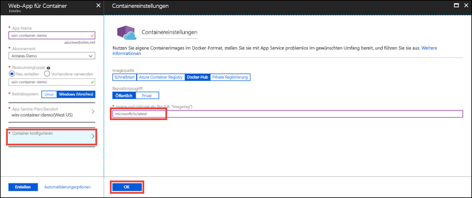

# <a name="run-a-custom-windows-container-in-azure-preview"></a>Ausführen eines benutzerdefinierten Windows-Containers in Azure (Vorschau)

[Azure App Service](app-service-web-overview.md) stellt vordefinierte Anwendungsstapel unter Windows wie ASP.NET oder Node.js bereit (ausgeführt unter IIS). Die vorkonfigurierte Windows-Umgebung sperrt das Betriebssystem für Administratorzugriff, Softwareinstallationen, Änderungen am globalen Assemblycache usw. (siehe [Betriebssystemfunktionen für Azure App Service](web-sites-available-operating-system-functionality.md)). Wenn für Ihre Anwendung umfangreichere Zugriffsrechte erforderlich sind, als die vorkonfigurierte Umgebung zulässt, können Sie stattdessen einen benutzerdefinierten Windows-Container bereitstellen. In dieser Schnellstartanleitung wird gezeigt, wie Sie über [Docker Hub](https://hub.docker.com/) ein benutzerdefiniertes IIS-Image in Azure App Service bereitstellen.


## <a name="sign-in-to-azure"></a>Anmelden bei Azure

Melden Sie sich unter https://portal.azure.com beim Azure-Portal an.

## <a name="create-a-windows-container-app"></a>Erstellen einer Windows-Container-App

1. Klicken Sie im Azure-Portal links oben auf **Ressource erstellen**.

2. Suchen Sie im Suchfeld oberhalb der Liste der Azure Marketplace-Ressourcen nach **Web-App für Container**, und wählen Sie diese Ressource aus.

3. Geben Sie einen App-Namen (etwa *mywebapp*) ein, übernehmen Sie zum Erstellen einer neuen Ressourcengruppe die Standardeinstellungen, und klicken Sie unter **Betriebssystem** auf **Windows (Vorschau)**.

    

4. Erstellen Sie einen App Service-Plan. Klicken Sie dazu auf **App Service-Plan/Standort** > **Neu erstellen**. Geben Sie einen Namen für den neuen Plan ein, übernehmen Sie die Standardeinstellungen, und klicken Sie auf **OK**.

    

5. Klicken Sie auf **Container konfigurieren**, geben Sie _microsoft/iis:latest_ in das Feld **Image und optionales Tag** ein, und klicken Sie auf **OK**.

    

    In diesem Artikel wird das öffentliche Docker Hub-Image [microsoft/iis:latest](https://hub.docker.com/r/microsoft/iis/) verwendet. Wenn Sie an anderer Stelle, etwa in [Azure Container Registry](/azure/container-registry/) oder einem anderen privaten Repository, ein benutzerdefiniertes Image für Ihre Webanwendung besitzen, können Sie es hier konfigurieren.

6. Klicken Sie auf **Erstellen**, und warten Sie, bis Azure die erforderlichen Ressourcen erstellt hat.

## <a name="browse-to-the-container-app"></a>Navigieren zur Container-App

Wenn der Azure-Vorgang abgeschlossen ist, wird ein Benachrichtigungsfeld angezeigt.


1. Klicken Sie auf **Zu Ressource wechseln**.

2. Klicken Sie auf der App-Seite auf den Link unter **URL**.

Die folgende neue Browserseite wird geöffnet:


Warten Sie einige Minuten, und wiederholen Sie den Vorgang, bis die IIS-Willkommensseite angezeigt wird:


**Glückwunsch!** Sie führen Ihren ersten benutzerdefinierten Windows-Container in Azure App Service aus.

## <a name="see-container-start-up-logs"></a>Anzeigen der Startprotokolle des Containers

Das Laden des Windows-Containers kann eine Weile dauern. Wenn Sie den Status anzeigen möchten, navigieren Sie zur folgenden URL. Ersetzen Sie dabei *\<app_name>* durch den Namen Ihrer App.
```
https://<app_name>.scm.azurewebsites.net/api/logstream
```

Die gestreamten Protokolle sehen wie folgt aus:

```
2018-07-27T12:03:11  Welcome, you are now connected to log-streaming service.
27/07/2018 12:04:10.978 INFO - Site: win-container-demo - Start container succeeded. Container: facbf6cb214de86e58557a6d073396f640bbe2fdec88f8368695c8d1331fc94b
27/07/2018 12:04:16.767 INFO - Site: win-container-demo - Container start complete
27/07/2018 12:05:05.017 INFO - Site: win-container-demo - Container start complete
27/07/2018 12:05:05.020 INFO - Site: win-container-demo - Container started successfully
```

## <a name="use-a-different-docker-image"></a>Verwenden eines anderen Docker-Images

Sie können für die Ausführung Ihrer App ein anderes benutzerdefiniertes Docker-Image verwenden. Sie müssen jedoch das richtige [übergeordnete Image](https://docs.docker.com/develop/develop-images/baseimages/) für das gewünschte Framework auswählen: 

- Verwenden Sie zum Bereitstellen von .NET Framework-Apps ein übergeordnetes Image, das auf dem [LTSC](https://docs.microsoft.com/windows-server/get-started/semi-annual-channel-overview#long-term-servicing-channel-ltsc)-Release (Long-Term Servicing Channel, langfristiger Wartungskanal) von Windows Server Core 2016 basiert. 
- Verwenden Sie zum Bereitstellen von .NET Core-Apps ein übergeordnetes Image, das auf dem [LTSC](https://docs.microsoft.com/windows-server/get-started/semi-annual-channel-overview#long-term-servicing-channel-ltsc)-Release (Long-Term Servicing Channel, langfristiger Wartungskanal) von Windows Server Nano 2016 basiert. 

Während des App-Starts dauert das Herunterladen eines übergeordneten Images eine Weile. Sie können die Startzeit jedoch reduzieren, indem Sie eins der folgenden übergeordneten Images verwenden, die bereits in Azure App Service zwischengespeichert sind:

- [microsoft/iis](https://hub.docker.com/r/microsoft/iis/):windowsservercore-ltsc2016 (neueste Version)
- [microsoft/iis](https://hub.docker.com/r/microsoft/iis/):nanoserver-sac2016
- [microsoft/aspnet](https://hub.docker.com/r/microsoft/aspnet/):4.7.2-windowsservercore-ltsc2016, 4.7.2 (neueste Version)
- [microsoft/dotnet](https://hub.docker.com/r/microsoft/dotnet/):2.1-aspnetcore-runtime
- [microsoft/dotnet](https://hub.docker.com/r/microsoft/dotnet/):2.1-sdk
