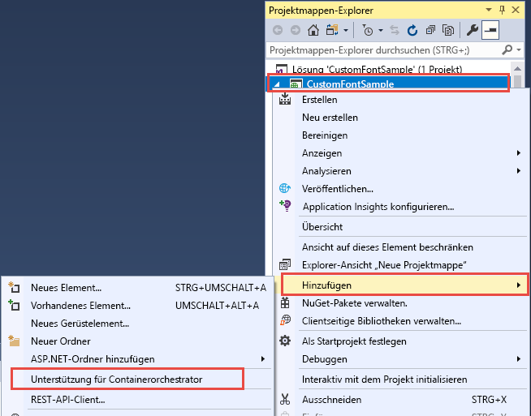
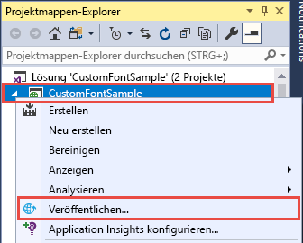
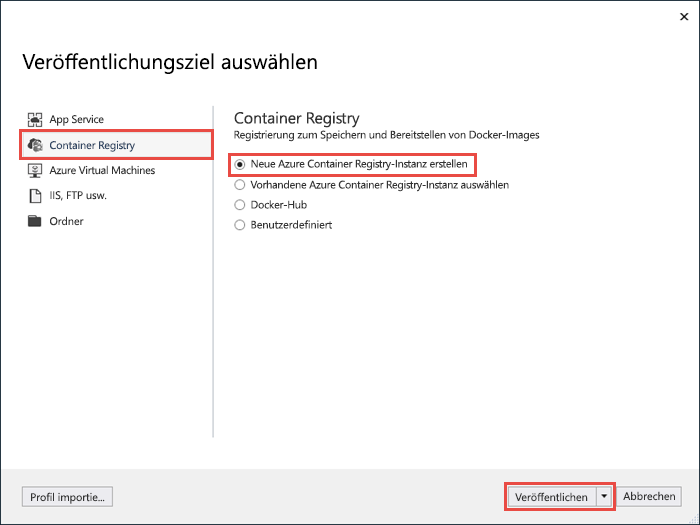
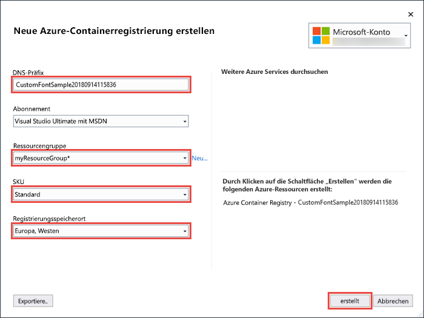
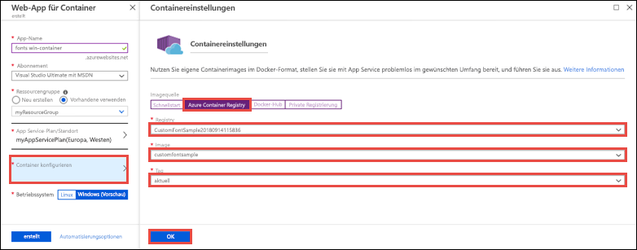
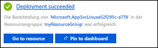

# <a name="migrate-an-aspnet-app-to-azure-app-service-using-a-windows-container-preview"></a>Migrieren einer ASP.NET-App zu Azure App Service mithilfe eines Windows-Containers (Preview)

[Azure App Service](overview.md) stellt vordefinierte Anwendungsstapel unter Windows wie ASP.NET oder Node.js bereit (ausgeführt unter IIS). Die vorkonfigurierte Windows-Umgebung sperrt das Betriebssystem für Administratorzugriff, Softwareinstallationen, Änderungen am globalen Assemblycache usw. (siehe [Betriebssystemfunktionen für Azure App Service](operating-system-functionality.md)). Jedoch ermöglicht Ihnen die Verwendung eines benutzerdefinierten Windows-Containers in App Service die Vornahme von Änderungen am Betriebssystem, die für Ihre App erforderlich sind, weshalb es einfach ist, eine lokale App zu migrieren, die eine benutzerdefinierte Betriebssystem- und Softwarekonfiguration erfordert. Dieses Tutorial veranschaulicht, wie Sie eine ASP.NET-App zu App Service migrieren, die benutzerdefinierte Schriftarten verwendet, die in der Schriftartenbibliothek von Windows installiert sind. Sie stellen ein benutzerdefiniert konfiguriertes Windows-Image aus Visual Studio in der [Azure Container Registry](https://docs.microsoft.com/azure/container-registry/) bereit und führen es dann in App Service aus.


## <a name="prerequisites"></a>Voraussetzungen

Für dieses Tutorial benötigen Sie Folgendes:

- <a href="https://hub.docker.com/" target="_blank">Registrierung für ein Docker-Hub-Konto</a>
- <a href="https://docs.docker.com/docker-for-windows/install/" target="_blank">Installieren Sie Docker für Windows</a>.
- <a href="https://docs.microsoft.com/virtualization/windowscontainers/quick-start/quick-start-windows-10#2-switch-to-windows-containers" target="_blank">Wechseln Sie Docker, um Windows-Container auszuführen</a>.
- <a href="https://www.visualstudio.com/downloads/" target="_blank">Installieren Sie Visual Studio 2017</a> mit den Workloads **ASP.NET und Webentwicklung** und **Azure-Entwicklung**. Sie haben Visual Studio 2017 bereits installiert:
    - Installieren Sie die neuesten Updates in Visual Studio, indem Sie auf **Hilfe** > **Nach Updates suchen** klicken.
    - Fügen Sie die Workloads in Visual Studio hinzu, indem Sie auf **Tools** > **Tools und Features abrufen** klicken.

## <a name="set-up-the-app-locally"></a>Lokales Einrichten der App

### <a name="download-the-sample"></a>Herunterladen des Beispiels

In diesem Schritt richten Sie das lokale .NET-Projekt ein.

- [Laden Sie das Beispielprojekt](https://github.com/Azure-Samples/custom-font-win-container/archive/master.zip) herunter.
- Extrahieren (Entzippen) Sie die Datei *custom-font-win-container.zip*.

Das Beispielprojekt enthält eine einfache ASP.NET-Anwendung, die eine benutzerdefinierte Schriftart verwendet, die in der Schriftartenbibliothek von Windows installiert ist. Es ist nicht erforderlich, Schriftarten zu installieren, aber es ist ein Beispiel für eine App, die in das zugrunde liegende Betriebssystem integriert ist. Um eine solche App zu App Service zu migrieren, strukturieren Sie entweder Ihren Code neu, um die Integration zu entfernen, oder Sie migrieren sie unverändert zu einem benutzerdefinierten Windows-Container.

### <a name="install-the-font"></a>Installieren der Schriftart

Navigieren Sie in Windows-Explorer zu _custom-font-win-container-master/CustomFontSample_, klicken Sie mit der rechten Maustaste auf _FrederickatheGreat-Regular.ttf_, und wählen Sie **installieren** aus.

Diese Schriftart ist öffentlich bei [Google Fonts](https://fonts.google.com/specimen/Fredericka+the+Great) erhältlich.

### <a name="run-the-app"></a>Ausführen der App

Öffnen Sie die Datei *custom-font-win-container/CustomFontSample.sln* in Visual Studio. 

Geben Sie `Ctrl+F5` ein, um die App ohne Debuggen auszuführen. Die App wird im Standardbrowser angezeigt. 


Da sie eine installierte Schriftart verwendet, kann die App nicht in der App Service-Sandbox ausgeführt werden. Allerdings können Sie sie stattdessen mithilfe eines Windows-Containers bereitstellen, da Sie die Schriftart in dem Windows-Container installieren können.

### <a name="configure-windows-container"></a>Konfigurieren des Windows-Containers

Klicken Sie im Projektmappen-Explorer mit der rechten Maustaste auf das Projekt **CustomFontSample**, und wählen Sie **Hinzufügen** > **Unterstützung für Containerorchestrierung** aus.



Wählen Sie **Docker Compose** > **OK** aus.

Ihr Projekt ist jetzt für die Ausführung in einem Windows-Container eingerichtet. Eine _Dockerfile_ wird dem Projekt **CustomFontSample** hinzugefügt, und ein Projekt **docker-compose** wird der Projektmappe hinzugefügt. 

Öffnen Sie im Projektmappen-Explorer **Dockerfile**.

Sie müssen ein [unterstütztes, übergeordnetes Image](app-service-web-get-started-windows-container.md#use-a-different-parent-image) verwenden. Ändern Sie das übergeordnete Image, indem Sie die `FROM`-Zeile durch den folgenden Code ersetzen:

```Dockerfile
FROM microsoft/aspnet:4.7.1
```

Fügen Sie am Ende der Datei die folgende Zeile hinzu, und speichern Sie die Datei:

```Dockerfile
RUN ${source:-obj/Docker/publish/InstallFont.ps1}
```

Sie finden das Skript _InstallFont.ps1_ im Projekt **CustomFontSample**. Es ist ein einfaches Skript, das die Schriftart installiert. Eine komplexere Version des Skripts finden Sie im [Script Center](https://gallery.technet.microsoft.com/scriptcenter/fb742f92-e594-4d0c-8b79-27564c575133).

## <a name="publish-to-azure-container-registry"></a>Veröffentlichen in der Azure Container Registry

[Azure Container Registry](https://docs.microsoft.com/azure/container-registry/) kann Ihre Images für Containerbereitstellungen speichern. Sie können App Service so konfigurieren, dass er Images verwendet, die in Azure Container Registry gehostet werden.

### <a name="open-publish-wizard"></a>Öffnen des Veröffentlichungs-Assistenten

Klicken Sie im Projektmappen-Explorer mit der rechten Maustaste auf das Projekt **CustomFontSample**, und wählen Sie **Veröffentlichen** aus.



### <a name="create-registry-and-publish"></a>Erstellen der Registrierung und Veröffentlichen

Wählen Sie im Veröffentlichungs-Assistenten **Container Registry** > **Neue Azure Container Registry-Instanz erstellen** > **Veröffentlichen** aus.



### <a name="sign-in-with-azure-account"></a>Anmelden mit Azure-Konto

Wählen Sie im Dialogfeld **Neue Azure Container Registry-Instanz erstellen** die Option **Konto hinzufügen** aus, und melden Sie sich bei Ihrem Azure-Abonnement an. Falls Sie bereits angemeldet sind, können Sie in der Dropdownliste das Konto mit dem gewünschten Abonnement auswählen.


### <a name="configure-the-registry"></a>Konfigurieren der Registrierung

Konfigurieren Sie die neue Containerregistrierung, basierend auf den in der folgenden Tabelle vorgeschlagenen Werten. Klicken Sie auf **Erstellen**, wenn Sie fertig sind.

| Einstellung  | Empfohlener Wert | Weitere Informationen |
| ----------------- | ------------ | ----|
|**DNS-Präfix**| Behalten Sie den generierten Registrierungsnamen bei, oder ändern Sie ihn in einen anderen eindeutigen Namen. |  |
|**Ressourcengruppe**| Klicken Sie auf **Neu**, geben Sie **myResourceGroup** ein, und klicken Sie auf **OK**. |  |
|**SKU**| Basic | [Tarife](https://azure.microsoft.com/pricing/details/container-registry/)|
|**Registrierungsstandort**| Europa, Westen | |



Ein Terminalfenster wird geöffnet, worin der Status der Imagebereitstellung angezeigt wird. Warten Sie, bis die Bereitstellung abgeschlossen ist.

## <a name="sign-in-to-azure"></a>Anmelden bei Azure

Melden Sie sich unter https://portal.azure.com beim Azure-Portal an.

## <a name="create-a-web-app"></a>Erstellen einer Web-App

Wählen Sie im linken Menü **Ressource erstellen** > **Web** > **Web-App für Container** aus.

### <a name="configure-the-new-web-app"></a>Konfigurieren der neuen Web-App

Konfigurieren Sie in „Schnittstelle erstellen“ die Einstellungen entsprechend der folgenden Tabelle:

| Einstellung  | Empfohlener Wert | Weitere Informationen |
| ----------------- | ------------ | ----|
|**App-Name**| Geben Sie einen eindeutigen Namen ein. | Die URL der Web-App lautet `http://<app_name>.azurewebsites.net`, wobei `<app_name>` der Name Ihrer App ist. |
|**Ressourcengruppe**| Wählen Sie **Vorhandene verwenden** aus, und geben Sie **myResourceGroup** ein. |  |
|**Betriebssystem**| Windows (Preview) | |

### <a name="configure-app-service-plan"></a>App Service-Plan konfigurieren

Klicken Sie auf **App Service-Plan/Standort** > **Neu erstellen**. Geben Sie dem neuen Plan einen Namen, wählen Sie **Europa, Westen** als Ort aus, und klicken Sie auf **OK**.


### <a name="configure-container"></a>Container konfigurieren

Klicken Sie auf **Container konfigurieren** > **Azure Container Registry**. Wählen Sie die Registrierung, das Images und das Tag aus, die Sie zuvor in [Veröffentlichen in der Azure Container Registry](#publish-to-azure-container-registry) erstellt haben, und klicken Sie auf **OK**.



### <a name="complete-app-creation"></a>Abschließen der App-Erstellung

Klicken Sie auf **Erstellen**, und warten Sie, bis Azure die erforderlichen Ressourcen erstellt hat.

## <a name="browse-to-the-web-app"></a>Navigieren zur Web-App

Wenn der Azure-Vorgang abgeschlossen ist, wird ein Benachrichtigungsfeld angezeigt.



1. Klicken Sie auf **Zu Ressource wechseln**.

2. Klicken Sie auf der App-Seite auf den Link unter **URL**.

Die folgende neue Browserseite wird geöffnet:


Warten Sie einige Minuten, und wiederholen Sie den Vorgang, bis die Startseite mit der von Ihnen erwarteten, ausdrucksstarken Schriftart angezeigt wird:


**Glückwunsch!** Sie haben eine ASP.NET-Anwendung zu Azure App Service in einen Windows-Container migriert.

## <a name="see-container-start-up-logs"></a>Anzeigen der Startprotokolle des Containers

Das Laden des Windows-Containers kann eine Weile dauern. Wenn Sie den Status anzeigen möchten, navigieren Sie zur folgenden URL. Ersetzen Sie dabei *\<app_name>* durch den Namen Ihrer App.
```
https://<app_name>.scm.azurewebsites.net/api/logstream
```

Die gestreamten Protokolle sehen wie folgt aus:

```
14/09/2018 23:16:19.889 INFO - Site: fonts-win-container - Creating container for image: customfontsample20180914115836.azurecr.io/customfontsample:latest.
14/09/2018 23:16:19.928 INFO - Site: fonts-win-container - Create container for image: customfontsample20180914115836.azurecr.io/customfontsample:latest succeeded. Container Id 329ecfedbe370f1d99857da7352a7633366b878607994ff1334461e44e6f5418
14/09/2018 23:17:23.405 INFO - Site: fonts-win-container - Start container succeeded. Container: 329ecfedbe370f1d99857da7352a7633366b878607994ff1334461e44e6f5418
14/09/2018 23:17:28.637 INFO - Site: fonts-win-container - Container ready
14/09/2018 23:17:28.637 INFO - Site: fonts-win-container - Configuring container
14/09/2018 23:18:03.823 INFO - Site: fonts-win-container - Container ready
14/09/2018 23:18:03.823 INFO - Site: fonts-win-container - Container start-up and configuration completed successfully
```

