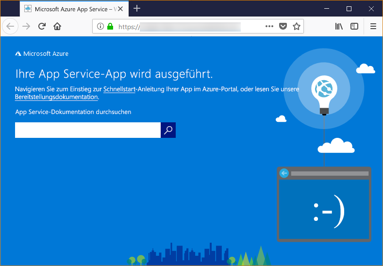

# <a name="configure-a-linux-python-app-for-azure-app-service"></a>Konfigurieren einer Linux-Python-App für Azure App Service

In diesem Artikel erfahren Sie, wie Python-Apps mit [Azure App Service](app-service-linux-intro.md) ausgeführt werden und wie Sie das Verhalten von App Service bei Bedarf anpassen können. Python-Apps müssen mit allen erforderlichen [pip](https://pypi.org/project/pip/)-Modulen bereitgestellt werden.

Die App Service-Bereitstellungs-Engine aktiviert automatisch eine virtuelle Umgebung und führt `pip install -r requirements.txt` für Sie aus, wenn Sie ein [Git-Repository](../deploy-local-git.md?toc=%2fazure%2fapp-service%2fcontainers%2ftoc.json) oder ein [ZIP-Paket](../deploy-zip.md?toc=%2fazure%2fapp-service%2fcontainers%2ftoc.json) mit aktivierten Buildprozessen bereitstellen.

Dieser Leitfaden enthält wichtige Konzepte und Anleitungen für Python-Entwickler, die in App Service einen integrierten Linux-Container verwenden. Falls Sie Azure App Service noch nicht verwendet haben, sollten Sie zunächst die [Python-Schnellstartanleitung](quickstart-python.md) und das [Tutorial „Python mit PostgreSQL“](tutorial-python-postgresql-app.md) durcharbeiten.

> [!NOTE]
> Linux ist derzeit die empfohlene Option zum Ausführen von Python-Apps in App Service. Weitere Informationen zur Windows-Option finden Sie unter [Einrichten einer Python-Umgebung in Azure App Service (Windows)](https://docs.microsoft.com/visualstudio/python/managing-python-on-azure-app-service).
>

## <a name="show-python-version"></a>Anzeigen der Python-Version

Führen Sie in [Cloud Shell](https://shell.azure.com) den folgenden Befehl aus, um die aktuelle Python-Version anzuzeigen:

```azurecli-interactive
az webapp config show --resource-group <resource-group-name> --name <app-name> --query linuxFxVersion
```

Führen Sie in [Cloud Shell](https://shell.azure.com) den folgenden Befehl aus, um alle unterstützten Python-Versionen anzuzeigen:

```azurecli-interactive
az webapp list-runtimes --linux | grep PYTHON
```

Sie können auch eine nicht unterstützte Version von Python ausführen, indem Sie stattdessen Ihr eigenes Containerimage erstellen. Weitere Informationen finden Sie unter [Verwenden eines benutzerdefinierten Docker-Images für Web-App für Container](tutorial-custom-docker-image.md).

## <a name="set-python-version"></a>Festlegen der Python-Version

Führen Sie in [Cloud Shell](https://shell.azure.com) den folgenden Befehl aus, um die Python-Version auf „3.7“ festzulegen:

```azurecli-interactive
az webapp config set --resource-group <resource-group-name> --name <app-name> --linux-fx-version "PYTHON|3.7"
```

## <a name="container-characteristics"></a>Eigenschaften von Containern

Python-Apps, die für App Service unter Linux bereitgestellt werden, werden in einem Docker-Container ausgeführt, der im GitHub-Repository [Python 3.6](https://github.com/Azure-App-Service/python/tree/master/3.6.6) oder [Python 3.7](https://github.com/Azure-App-Service/python/tree/master/3.7.0) definiert ist.

Dieser Container verfügt über die folgenden Eigenschaften:

- Apps werden per [Gunicorn WSGI HTTP Server](https://gunicorn.org/) mit den zusätzlichen Argumenten `--bind=0.0.0.0 --timeout 600` ausgeführt.

- Standardmäßig enthält das Basisimage das Flask-Webframework, aber der Container unterstützt auch andere Frameworks, die WSGI-konform und mit Python 3.7 kompatibel sind, z.B. Django.

- Erstellen Sie zum Installieren von zusätzlichen Paketen, z.B. Django, die Datei [*requirements.txt*](https://pip.pypa.io/en/stable/user_guide/#requirements-files) im Stamm Ihres Projekts, indem Sie `pip freeze > requirements.txt` verwenden. Veröffentlichen Sie Ihr Projekt anschließend per Git-Bereitstellung in App Service. Hierbei wird automatisch `pip install -r requirements.txt` im Container ausgeführt, um die Abhängigkeiten Ihrer App zu installieren.

## <a name="container-startup-process"></a>Startprozess des Containers

Beim Starten führt der Container vom Typ „App Service unter Linux“ die folgenden Schritte aus:

1. Verwenden eines [benutzerdefinierten Startbefehls](#customize-startup-command) (sofern vorhanden)
2. Überprüfen, ob eine [Django-App](#django-app) vorhanden ist, und Starten von Gunicorn für die ggf. erkannte App
3. Überprüfen, ob eine [Flask-App](#flask-app) vorhanden ist, und Starten von Gunicorn für die ggf. erkannte App
4. Wenn keine andere App gefunden wird, können Sie eine Standard-App starten, die im Container integriert ist.

Die folgenden Abschnitte enthalten weitere Details zu den einzelnen Optionen.

### <a name="django-app"></a>Django-App

Für Django-Apps sucht App Service in Ihrem App-Code nach der Datei `wsgi.py` und führt dann mit dem folgenden Befehl Gunicorn aus:

```bash
# <module> is the path to the folder that contains wsgi.py
gunicorn --bind=0.0.0.0 --timeout 600 <module>.wsgi
```

Wenn Sie eine genauere Kontrolle über den Startbefehl wünschen, können Sie einen [benutzerdefinierten Startbefehl](#customize-startup-command) verwenden und `<module>` durch den Namen des Moduls ersetzen, das *wsgi.py* enthält.

### <a name="flask-app"></a>Flask-App

Für Flask sucht App Service nach der Datei *application.py* oder *app.py* und startet Gunicorn:

```bash
# If application.py
gunicorn --bind=0.0.0.0 --timeout 600 application:app
# If app.py
gunicorn --bind=0.0.0.0 --timeout 600 app:app
```

Falls Ihr App-Hauptmodul in einer anderen Datei enthalten ist, sollten Sie einen anderen Namen für das App-Objekt verwenden. Wenn Sie zusätzliche Argumente für Gunicorn angeben möchten, können Sie einen [benutzerdefinierten Startbefehl](#customize-startup-command) nutzen.

### <a name="default-behavior"></a>Standardverhalten

Wenn App Service keinen benutzerdefinierten Befehl und keine Django-App oder Flask-App findet, wird eine schreibgeschützte Standard-App ausgeführt, die sich im Ordner _opt/defaultsite_ befindet. Die Standard-App wird wie folgt angezeigt:



## <a name="customize-startup-command"></a>Anpassen des Startbefehls

Sie können das Startverhalten des Containers steuern, indem Sie einen benutzerdefinierten Gunicorn-Startbefehl angeben. Führen Sie hierzu den folgenden Befehl in [Cloud Shell](https://shell.azure.com) aus:

```azurecli-interactive
az webapp config set --resource-group <resource-group-name> --name <app-name> --startup-file "<custom-command>"
```

Wenn Sie beispielsweise über eine Flask-App verfügen, deren Hauptmodul *hello.py* lautet, und das Flask-App-Objekt in dieser Datei den Namen `myapp` hat, lautet *\<custom-command>* wie folgt:

```bash
gunicorn --bind=0.0.0.0 --timeout 600 hello:myapp
```

Wenn Ihr Hauptmodul in einem Unterordner, z.B. `website` enthalten ist, können Sie diesen Ordner mit dem Argument `--chdir` angeben:

```bash
gunicorn --bind=0.0.0.0 --timeout 600 --chdir website hello:myapp
```

Sie können *\<custom-command>* auch zusätzliche Argumente für Gunicorn hinzufügen, z. B. `--workers=4`. Weitere Informationen finden Sie unter [Running Gunicorn](https://docs.gunicorn.org/en/stable/run.html) (Ausführen von Gunicorn) (docs.gunicorn.org).

Zum Verwenden eines anderen Servers als von Gunicorn, z. B. [aiohttp](https://aiohttp.readthedocs.io/en/stable/web_quickstart.html), können Sie *\<custom-command>* wie folgt ersetzen:

```bash
python3.7 -m aiohttp.web -H localhost -P 8080 package.module:init_func
```

> [!Note]
> App Service ignoriert alle Fehler, die beim Verarbeiten einer benutzerdefinierten Befehlsdatei auftreten, und setzt den Startprozess dann fort, indem nach Django- und Flask-Apps gesucht wird. Wenn das erwartete Verhalten nicht zu beobachten ist, sollten Sie überprüfen, ob Ihre Startdatei für App Service bereitgestellt wird und keine Fehler enthält.

## <a name="access-environment-variables"></a>Zugreifen auf Umgebungsvariablen

In App Service können Sie [App-Einstellungen außerhalb Ihres App-Codes festlegen](../configure-common.md?toc=%2fazure%2fapp-service%2fcontainers%2ftoc.json#configure-app-settings). Anschließend können Sie darauf unter Verwendung des Standardmusters [os.environ](https://docs.python.org/3/library/os.html#os.environ) zugreifen. Verwenden Sie beispielsweise den folgenden Code, um auf eine App-Einstellung namens `WEBSITE_SITE_NAME` zuzugreifen:

```python
os.environ['WEBSITE_SITE_NAME']
```

## <a name="detect-https-session"></a>Erkennen einer HTTPS-Sitzung

In App Service erfolgt die [SSL-Beendigung](https://wikipedia.org/wiki/TLS_termination_proxy) in den Modulen für den Netzwerklastenausgleich, sodass alle HTTPS-Anforderungen Ihre App als unverschlüsselte HTTP-Anforderungen erreichen. Wenn Ihre App-Logik überprüfen muss, ob Benutzeranforderungen verschlüsselt sind, können Sie dazu den Header `X-Forwarded-Proto` untersuchen.

```python
if 'X-Forwarded-Proto' in request.headers and request.headers['X-Forwarded-Proto'] == 'https':
# Do something when HTTPS is used
```

Gängige Webframeworks ermöglichen den Zugriff auf die Information `X-Forwarded-*` in Ihrem App-Standardmuster. In [CodeIgniter](https://codeigniter.com/) überprüft [is_https()](https://github.com/bcit-ci/CodeIgniter/blob/master/system/core/Common.php#L338-L365) standardmäßig den Wert von `X_FORWARDED_PROTO`.

## <a name="access-diagnostic-logs"></a>Zugreifen auf Diagnoseprotokolle

[!INCLUDE [Access diagnostic logs](../../../includes/app-service-web-logs-access-no-h.md)]

## <a name="open-ssh-session-in-browser"></a>Öffnen einer SSH-Sitzung im Browser

[!INCLUDE [Open SSH session in browser](../../../includes/app-service-web-ssh-connect-builtin-no-h.md)]

## <a name="troubleshooting"></a>Problembehandlung

- **Die Standard-App wird angezeigt, nachdem Sie Ihren eigenen App-Code bereitgestellt haben.** Die Standard-App wird angezeigt, da Sie entweder Ihren App-Code nicht in App Service bereitgestellt haben oder App Service Ihren App-Code nicht finden konnte und stattdessen die Standard-App ausgeführt hat.
- Starten Sie App Service neu, warten Sie 15 bis 20 Sekunden, und prüfen Sie die App dann erneut.
- Stellen Sie sicher, dass Sie App Service für Linux verwenden (keine Windows-basierte Instanz). Führen Sie über die Azure CLI den Befehl `az webapp show --resource-group <resource_group_name> --name <app_service_name> --query kind` aus, und ersetzen Sie jeweils `<resource_group_name>` und `<app_service_name>`. `app,linux` sollte als Ausgabe angezeigt werden. Erstellen Sie andernfalls die App Service-Instanz neu, und wählen Sie Linux.
- Verwenden Sie SSH oder die Kudu-Konsole, um eine direkte Verbindung mit App Service herzustellen, und stellen Sie sicher, dass Ihre Dateien unter *site/wwwroot* vorhanden sind. Falls Ihre Dateien nicht vorhanden sind, sollten Sie Ihren Bereitstellungsprozess überprüfen und die App erneut bereitstellen.
- Wenn Ihre Dateien vorhanden sind, konnte App Service Ihre spezifische Startdatei nicht identifizieren. Überprüfen Sie, ob Ihre App so strukturiert ist, wie App Service dies für [Django](#django-app) oder [Flask](#flask-app) erwartet, oder verwenden Sie einen [benutzerdefinierten Startbefehl](#customize-startup-command).
- **Im Browser wird die Meldung „Dienst nicht verfügbar“ angezeigt.** Für den Browser ist ein Timeout aufgetreten, während auf eine Antwort von App Service gewartet wurde. Dies weist darauf hin, dass App Service den Gunicorn-Server gestartet hat, aber die Argumente, mit denen der App-Code angegeben wird, fehlerhaft sind.
- Aktualisieren Sie den Browser. Dies gilt besonders, wenn Sie in Ihrem App Service-Plan die niedrigsten Tarife nutzen. Bei Verwendung von Free-Tarifen kann das Starten der App beispielsweise länger dauern. Sie reagiert dann wieder, nachdem Sie den Browser aktualisiert haben.
- Überprüfen Sie, ob Ihre App so strukturiert ist, wie App Service dies für [Django](#django-app) oder [Flask](#flask-app) erwartet, oder verwenden Sie einen [benutzerdefinierten Startbefehl](#customize-startup-command).
- [Greifen Sie auf den Protokolldatenstrom zu](#access-diagnostic-logs).

## <a name="next-steps"></a>Nächste Schritte

> [!div class="nextstepaction"]
> [Tutorial: Python-App mit PostgreSQL](tutorial-python-postgresql-app.md)

> [!div class="nextstepaction"]
> [Tutorial: Bereitstellen über privates Containerrepository](tutorial-custom-docker-image.md)

> [!div class="nextstepaction"]
> [App Service unter Linux – Häufig gestellte Fragen](app-service-linux-faq.md)