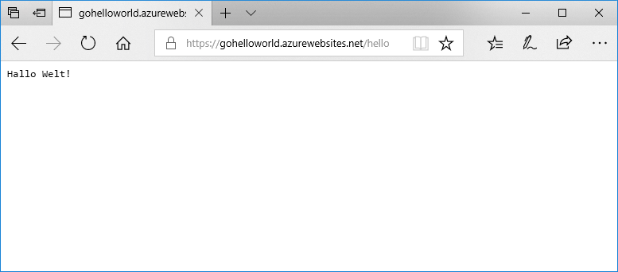

# <a name="deploy-a-dockergo-web-app-in-web-app-for-containers"></a>Bereitstellen einer Docker/Go-Web-App über die Web-App für Container

Bei [App Service Linux](app-service-linux-intro.md) werden vordefinierte Anwendungsstapel unter Linux mit Unterstützung für verschiedene Sprachen bereitgestellt, z.B. .NET, PHP, Node.js und andere. Sie können auch ein benutzerdefiniertes Docker-Image verwenden, um Ihre Web-App in einem Anwendungsstapel auszuführen, der nicht bereits in Azure definiert ist. In diesem Schnellstart wird erläutert, wie Sie eine Web-App erstellen und ein Go-Image per Docker Hub bereitstellen. Sie erstellen die Web-App mithilfe der [Azure CLI](https://docs.microsoft.com/cli/azure/get-started-with-azure-cli).



[!INCLUDE [quickstarts-free-trial-note](../../../includes/quickstarts-free-trial-note.md)]

[!INCLUDE [cloud-shell-try-it.md](../../../includes/cloud-shell-try-it.md)]

[!INCLUDE [Configure deployment user](../../../includes/configure-deployment-user.md)]

[!INCLUDE [Create resource group](../../../includes/app-service-web-create-resource-group-linux.md)]

[!INCLUDE [Create app service plan](../../../includes/app-service-web-create-app-service-plan-linux.md)]

## <a name="create-a-web-app"></a>Erstellen einer Web-App

Erstellen Sie eine [Web-App](../app-service-web-overview.md) im App Service-Plan `myAppServicePlan` mit dem Befehl [az webapp create](/cli/azure/webapp?view=azure-cli-latest#az_webapp_create). Vergessen Sie nicht, `<app name>` durch einen global eindeutigen App-Namen zu ersetzen.

```azurecli-interactive
az webapp create --resource-group myResourceGroup --plan myAppServicePlan --name <app name> --deployment-container-image-name microsoft/azure-appservices-go-quickstart
```

Im obigen Befehl zeigt `--deployment-container-image-name` auf das öffentliche Docker Hub-Image [microsoft/azure-appservices-go-quickstart](https://hub.docker.com/r/microsoft/azure-appservices-go-quickstart/).

Nach Erstellung der Web-App zeigt die Azure CLI eine Ausgabe wie im folgenden Beispiel an:

```json
{
  "availabilityState": "Normal",
  "clientAffinityEnabled": true,
  "clientCertEnabled": false,
  "cloningInfo": null,
  "containerSize": 0,
  "dailyMemoryTimeQuota": 0,
  "defaultHostName": "<app name>.azurewebsites.net",
  "deploymentLocalGitUrl": "https://<username>@<app name>.scm.azurewebsites.net/<app name>.git",
  "enabled": true,
  < JSON data removed for brevity. >
}
```

## <a name="browse-to-the-app"></a>Navigieren zur App

```bash
http://<app_name>.azurewebsites.net/hello
```


**Glückwunsch!** Sie haben ein benutzerdefiniertes Docker-Image zur Ausführung einer Go-Anwendung für Web-App für Container bereitgestellt.

[!INCLUDE [Clean-up section](../../../includes/cli-script-clean-up.md)]

## <a name="next-steps"></a>Nächste Schritte

> [!div class="nextstepaction"]
> [Verwenden eines benutzerdefinierten Docker-Images](tutorial-custom-docker-image.md)
