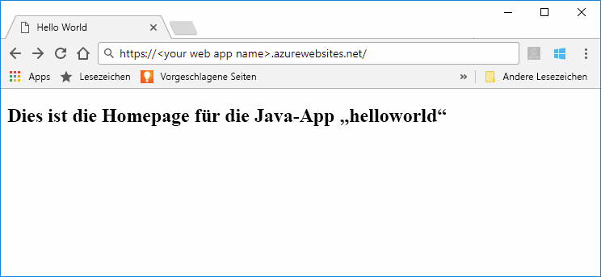
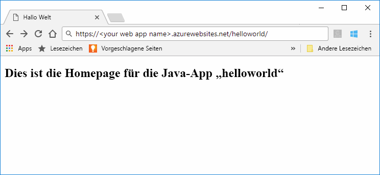

# <a name="quickstart-create-a-java-app-in-app-service-on-linux"></a>Schnellstart: Erstellen einer Java-App in App Service unter Linux

[App Service unter Linux](app-service-linux-intro.md) bietet einen hochgradig skalierbaren Webhostingdienst mit Self-Patching unter dem Linux-Betriebssystem. In dieser Schnellstartanleitung wird gezeigt, wie Sie mit der [Azure CLI](https://docs.microsoft.com/cli/azure/get-started-with-azure-cli) und dem [Maven-Plug-In für Azure-Web-Apps (Vorschauversion)](https://github.com/Microsoft/azure-maven-plugins/tree/develop/azure-webapp-maven-plugin) eine Java-Webarchivdatei (WAR) bereitstellen.



[!INCLUDE [quickstarts-free-trial-note](../../../includes/quickstarts-free-trial-note.md)]

[!INCLUDE [cloud-shell-try-it.md](../../../includes/cloud-shell-try-it.md)]

## <a name="create-a-java-app"></a>Erstellen einer Java-App

Führen Sie den folgenden Maven-Befehl über die Eingabeaufforderung der Cloud Shell aus, um eine neue App mit dem Namen `helloworld` zu erstellen:

```bash
mvn archetype:generate -DgroupId=example.demo -DartifactId=helloworld -DarchetypeArtifactId=maven-archetype-webapp
```

## <a name="configure-the-maven-plugin"></a>Konfigurieren des Maven-Plug-Ins

Verwenden Sie zum Bereitstellen über Maven den Code-Editor in der Cloud Shell, um die Projektdatei `pom.xml` im Verzeichnis `helloworld` zu öffnen. 

```bash
code pom.xml
```

Fügen Sie dann die folgende Plug-In-Definition im `<build>`-Element der Datei `pom.xml` hinzu.

```xml
<plugins>
    <!--*************************************************-->
    <!-- Deploy to Tomcat in App Service Linux           -->
    <!--*************************************************-->
      
    <plugin>
        <groupId>com.microsoft.azure</groupId>
        <artifactId>azure-webapp-maven-plugin</artifactId>
        <version>1.4.0</version>
        <configuration>
   
            <!-- App information -->
            <resourceGroup>${RESOURCEGROUP_NAME}</resourceGroup>
            <appName>${WEBAPP_NAME}</appName>
            <region>${REGION}</region>
   
            <!-- Java Runtime Stack for App on Linux-->
            <linuxRuntime>tomcat 8.5-jre8</linuxRuntime>
   
        </configuration>
    </plugin>
</plugins>
```    


> [!NOTE] 
> In diesem Artikel arbeiten wir nur mit Java-Apps, die in WAR-Dateien enthalten sind. Das Plug-In unterstützt auch JAR-Webanwendungen. Dies können Sie unter [Bereitstellen einer Spring Boot-App mit JAR-Datei in Azure App Service unter Linux](https://docs.microsoft.com/java/azure/spring-framework/deploy-spring-boot-java-app-with-maven-plugin?toc=%2fazure%2fapp-service%2fcontainers%2ftoc.json) ausprobieren.


Aktualisieren Sie die folgenden Platzhalter in der Plug-In-Konfiguration:

| Platzhalter | BESCHREIBUNG |
| ----------- | ----------- |
| `RESOURCEGROUP_NAME` | Der Name der neuen Ressourcengruppe, in der Ihre App erstellt wird. Indem Sie alle Ressourcen für eine App in einer Gruppe zusammenfassen, können Sie sie zusammen verwalten. Wenn Sie beispielsweise die Ressourcengruppe löschen, werden alle Ressourcen gelöscht, die der App zugeordnet sind. Aktualisieren Sie diesen Wert mit einem neuen eindeutigen Ressourcengruppennamen, z.B. *TestResources*. In einem Abschnitt weiter unten verwenden Sie diesen Ressourcengruppennamen zum Bereinigen aller Azure-Ressourcen. |
| `WEBAPP_NAME` | Der App-Name wird bei der Bereitstellung in Azure als Teil des Hostnamens für die App (WEBAPP_NAME.azurewebsites.net) verwendet. Aktualisieren Sie diesen Wert mit einem eindeutigen Namen für die neue App Service-App, die Ihre Java-App hostet, z.B. *contoso*. |
| `REGION` | Eine Azure-Region, in der die App gehostet wird, z.B. `westus2`. Sie können eine Liste von Regionen über die Cloud Shell oder CLI mit dem Befehl `az account list-locations` abrufen. |

## <a name="deploy-the-app"></a>Bereitstellen der App

Stellen Sie Ihre Java-App mit dem folgenden Befehl in Azure bereit:

```bash
mvn package azure-webapp:deploy
```

Navigieren Sie nach Abschluss der Bereitstellung zur bereitgestellten Anwendung, indem Sie in Ihrem Webbrowser die folgende URL verwenden, z. B. `http://<webapp>.azurewebsites.net/helloworld`. 



**Glückwunsch!** Sie haben Ihre erste Java-App für App Service unter Linux bereitgestellt.


[!INCLUDE [cli-samples-clean-up](../../../includes/cli-samples-clean-up.md)]


## <a name="next-steps"></a>Nächste Schritte

In dieser Schnellstartanleitung haben Sie mit Maven eine Java-App erstellt, das [Maven-Plug-In für Azure-Web-Apps](https://github.com/Microsoft/azure-maven-plugins/tree/develop/azure-webapp-maven-plugin) konfiguriert und anschließend eine in einem Webarchiv verpackte Java-App in App Service unter Linux bereitgestellt. In den folgenden Tutorials und Anleitungen finden Sie weitere Informationen zum Hosten von Java-Anwendungen in App Serivce unter Linux.

- [Tutorial: Bereitstellen einer Java-Unternehmens-App mit PostgreSQL](tutorial-java-enterprise-postgresql-app.md)
- [Konfigurieren einer Tomcat-Datenquelle](app-service-linux-java.md#connecting-to-data-sources)
- [CI/CD mit Jenkins](/azure/jenkins/deploy-jenkins-app-service-plugin)
- [Einrichten der Tools zur Überwachung der Anwendungsleistung](how-to-java-apm-monitoring.md)

