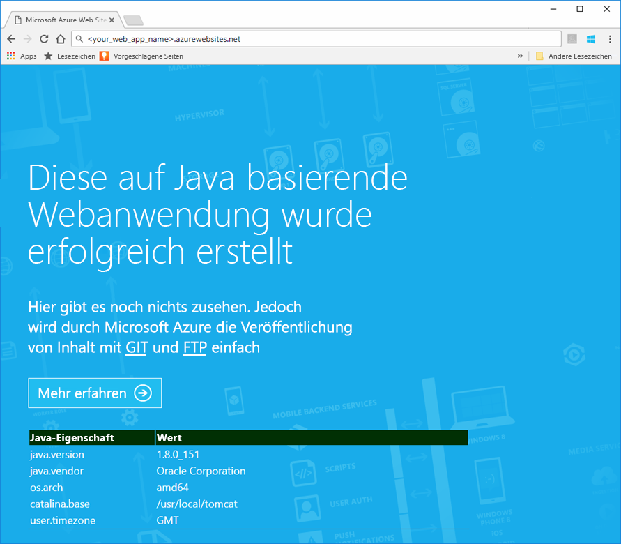
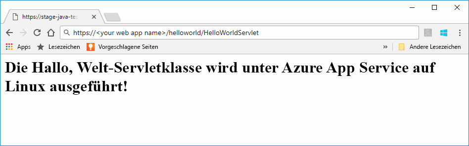

# <a name="preview-create-a-java-web-app-in-app-service-on-linux"></a>Vorschauversion: Erstellen einer Java-Web-App in App Service unter Linux

In App Service unter Linux wird derzeit eine Vorschaufunktion für die Unterstützung von Java-Web-Apps bereitgestellt. Weitere Informationen zu Vorschauversionen finden Sie unter [Zusätzliche Nutzungsbestimmungen für Microsoft Azure-Vorschauen](https://azure.microsoft.com/support/legal/preview-supplemental-terms/). Unter [Bereitstellen einer Web-App vom Typ „Hallo Welt“ in einem Linux-Container in der Cloud mit dem Azure-Toolkit für IntelliJ](https://docs.microsoft.com/java/azure/intellij/azure-toolkit-for-intellij-hello-world-web-app-linux) ist ein alternativer Ansatz für die Bereitstellung der Java-App in Ihrem eigenen Container dargestellt.

> [!NOTE]
> In diesem Artikel wird eine Java-Web-App in App Service unter Linux bereitgestellt.
>

[App Service unter Linux](app-service-linux-intro.md) bietet einen hochgradig skalierbaren Webhostingdienst mit Self-Patching unter Linux-Betriebssystemen. Dieser Schnellstart veranschaulicht das Bereitstellen einer Java-App in App Service unter Linux mit einem integrierten Image. Sie erstellen die Web-App mit integriertem Image mithilfe der [Azure-Befehlszeilenschnittstelle](https://docs.microsoft.com/cli/azure/get-started-with-azure-cli) und stellen die Java-App für die Web-App bereit.


[!INCLUDE [quickstarts-free-trial-note](../../../includes/quickstarts-free-trial-note.md)]


## <a name="prerequisites"></a>Voraussetzungen

So führen Sie diesen Schnellstart durch: 

* Sie benötigen ein Azure-Abonnement. Wenn Sie kein Azure-Abonnement besitzen, können Sie ein [kostenloses Konto](https://azure.microsoft.com/free/?ref=microsoft.com&utm_source=microsoft.com&utm_medium=docs&utm_campaign=visualstudio) erstellen, bevor Sie beginnen.
* [Git installieren](https://git-scm.com/).
* Installieren Sie [Eclipse](https://www.eclipse.org/downloads/).


[!INCLUDE [cloud-shell-try-it.md](../../../includes/cloud-shell-try-it.md)]

[!INCLUDE [Configure deployment user](../../../includes/configure-deployment-user.md)]


## <a name="create-a-resource-group"></a>Erstellen einer Ressourcengruppe

Erstellen Sie in Cloud Shell mit dem Befehl [`az group create`](/cli/azure/group?view=azure-cli-latest#az_group_create) eine Ressourcengruppe. Das folgende Beispiel erstellt eine Ressourcengruppe mit dem Namen *myResourceGroup* am Standort *Europa, Westen*. Wenn Sie alle unterstützten Standorte für App Service anzeigen möchten, führen Sie den Befehl [`az appservice list-locations`](/cli/azure/appservice?view=azure-cli-latest#az_appservice_list_locations) aus.

```azurecli-interactive
az group create --name myResourceGroup --location "West US"
```

Im Allgemeinen erstellen Sie Ressourcengruppen und Ressourcen in einer Region in Ihrer Nähe. 

Nach Ausführung dieses Befehls werden die Ressourcengruppeneigenschaften in einer JSON-Ausgabe angezeigt.


[!INCLUDE [Create app service plan](../../../includes/app-service-web-create-app-service-plan-linux.md)]


## <a name="create-a-web-app"></a>Erstellen einer Web-App

Erstellen Sie in der Cloud Shell im App Service-Plan `myAppServicePlan` eine [Web-App](../app-service-web-overview.md). Verwenden Sie hierfür den Befehl [`az webapp create`](/cli/azure/webapp?view=azure-cli-latest#az_webapp_create). Ersetzen Sie im folgenden Beispiel *\<App_Name>* durch einen global eindeutigen App-Namen (gültige Zeichen sind `a-z`, `0-9` und `-`). 

```azurecli-interactive
az webapp create --name <app_name> --resource-group myResourceGroup --plan myAppServicePlan --runtime "TOMCAT|8.5-jre8"
```

Verwenden Sie für den Parameter **runtime** eine der folgenden Runtimes:
 * TOMCAT|8.5-jre8
 * TOMCAT|9.0-jre8


Nach dem Erstellen der Web-App zeigt die Azure-Befehlszeilenschnittstelle Informationen wie im folgenden Beispiel an:

```json
{
  "additionalProperties": {},
  "availabilityState": "Normal",
  "clientAffinityEnabled": true,
  "clientCertEnabled": false,
  "cloningInfo": null,
  "containerSize": 0,
  "dailyMemoryTimeQuota": 0,
  "defaultHostName": "<your web app name>.azurewebsites.net",
  "enabled": true,
  "enabledHostNames": [
    "<your web app name>.azurewebsites.net",
    "<your web app name>.scm.azurewebsites.net"
  ],
  "ftpPublishingUrl": "ftp://<your ftp URL>",  
  < JSON data removed for brevity. >
}
```

Kopieren Sie den Wert für **ftpPublishingUrl**. Sie benötigen ihn später, falls Sie die FTP-Bereitstellung wählen.

Wechseln Sie zu Ihrer neu erstellten Web-App.

```
http://<app_name>.azurewebsites.net
```

Wenn die Web-App ausgeführt wird und aktiv ist, sieht die Standardanzeige etwa wie folgt aus:




## <a name="download-the-sample-java-app"></a>Herunterladen der Java-Beispiel-App

Führen Sie in einem Terminalfenster auf Ihrem Computer den folgenden Befehl aus, um das Beispiel-App-Repository auf Ihren lokalen Computer zu klonen: Sie stellen diese Beispiel-App in einem späteren Schritt bereit.

```bash
git clone https://github.com/Azure-Samples/java-docs-hello-world
```


## <a name="deploying-the-java-app-to-app-service-on-linux"></a>Bereitstellen der Java-App für App Service unter Linux

Öffnen Sie das Beispielprojekt in [Eclipse](https://www.eclipse.org/downloads/), und [exportieren Sie die Java-App in eine Webarchivdatei (WAR)](http://help.eclipse.org/kepler/index.jsp?topic=%2Forg.eclipse.wst.webtools.doc.user%2Ftopics%2Ftwcrewar.html) mit dem Namen `helloworld.war`.

Zum Bereitstellen Ihrer WAR-Datei für die Java-App können Sie WarDeploy (derzeit als [Vorschauversion](https://azure.microsoft.com/support/legal/preview-supplemental-terms/)) oder FTP verwenden.

Je nach verwendeter Bereitstellungsmethode kann der relative Pfad zu Ihrer Java-Web-App leicht variieren.

### <a name="deploy-with-wardeploy"></a>Bereitstellen mit WarDeploy 

Verwenden Sie zum Bereitstellen Ihrer WAR-Datei mit WarDeploy die folgende cURL-Beispielbefehlszeile, um eine POST-Anforderung an *https://<your app name>.scm.azurewebsites.net/api/wardeploy* zu senden. Die POST-Anforderung muss die WAR-Datei im Nachrichtentext enthalten. Die Anmeldeinformationen für die Bereitstellung für Ihre App werden in der Anforderung mithilfe von HTTP-Standardauthentifizierung bereitgestellt. Weitere Informationen zu WarDeploy finden Sie unter [Bereitstellen der App in Azure App Service mit einer ZIP-Datei](../app-service-deploy-zip.md).

```bash
curl -X POST -u <username> --data-binary @"<war_file_path>" https://<app_name>.scm.azurewebsites.net/api/wardeploy
```

Aktualisieren Sie Folgendes:

* `username`: Verwenden Sie den zuvor erstellten Benutzernamen der Anmeldeinformationen für die Bereitstellung.
* `war_file_path`: Verwenden Sie den lokalen WAR-Dateipfad.
* `app_name`: Verwenden Sie den zuvor erstellten App-Namen.

Führen Sie den Befehl aus. Geben Sie nach der Aufforderung durch cURL das Kennwort für Ihre Anmeldeinformationen für die Bereitstellung ein.

Navigieren Sie zur bereitgestellten Anwendung, indem Sie in Ihrem Webbrowser die folgende URL verwenden.

```bash
http://<app_name>.azurewebsites.net
```

Der Java-Beispielcode wird in einer Web-App mit integriertem Image ausgeführt.


Navigieren Sie im Webbrowser zum Servlet.

```bash
http://<app_name>.azurewebsites.net/HelloWorldServlet
```

Das Servlet wird in einer Web-App mit integriertem Image ausgeführt.


**Glückwunsch!** Sie haben Ihre erste Java-App für App Service unter Linux bereitgestellt.


### <a name="ftp-deployment"></a>FTP-Bereitstellung

Alternativ hierzu können Sie zum Bereitstellen der WAR-Datei auch FTP verwenden. 

Übertragen Sie die Datei per FTP in das Verzeichnis */home/site/wwwroot/webapps* Ihrer Web-App. In der folgenden Beispielbefehlszeile wird cURL verwendet:

```bash
curl -T war_file_path -u "app_name\username" ftp://webappFTPURL/site/wwwroot/webapps/
```

Aktualisieren Sie Folgendes:

* `war_file_path`: Verwenden Sie den lokalen WAR-Dateipfad.
* `app_name`: Verwenden Sie den zuvor erstellten App-Namen.
* `username`: Verwenden Sie den zuvor erstellten Benutzernamen der Anmeldeinformationen für die Bereitstellung.
* `webappFTPURL`: Verwenden Sie den Wert unter **FTP-Hostname** für Ihre Web-App, den Sie zuvor kopiert haben. Der FTP-Hostname ist auch im [Azure-Portal](https://portal.azure.com/) auf dem Blatt **Übersicht** für Ihre Web-App angegeben.

Führen Sie den Befehl aus. Geben Sie nach der Aufforderung durch cURL das Kennwort für Ihre Anmeldeinformationen für die Bereitstellung ein.


Navigieren Sie zur bereitgestellten Anwendung, indem Sie in Ihrem Webbrowser die folgende URL verwenden.

```bash
http://<app_name>.azurewebsites.net/helloworld
```

Der Java-Beispielcode wird in einer Web-App mit integriertem Image ausgeführt.


Navigieren Sie im Webbrowser zum Servlet.

```bash
http://<app_name>.azurewebsites.net/helloworld/HelloWorldServlet
```

Der Java-Beispielcode wird in einer Web-App mit integriertem Image ausgeführt.




**Glückwunsch!** Sie haben Ihre erste Java-App für App Service unter Linux bereitgestellt.


[!INCLUDE [cli-samples-clean-up](../../../includes/cli-samples-clean-up.md)]


## <a name="next-steps"></a>Nächste Schritte

Weitere Informationen zur Verwendung von Java mit Azure finden Sie unter den folgenden Links:

* [Azure für Java-Entwickler](https://docs.microsoft.com/java/azure/)
* [Bereitstellen einer Web-App vom Typ „Hallo Welt“ in einem Linux-Container in der Cloud mit dem Azure-Toolkit für IntelliJ](https://docs.microsoft.com/java/azure/intellij/azure-toolkit-for-intellij-hello-world-web-app-linux)
* [Java-Tools für Visual Studio Team Services](https://java.visualstudio.com/)
