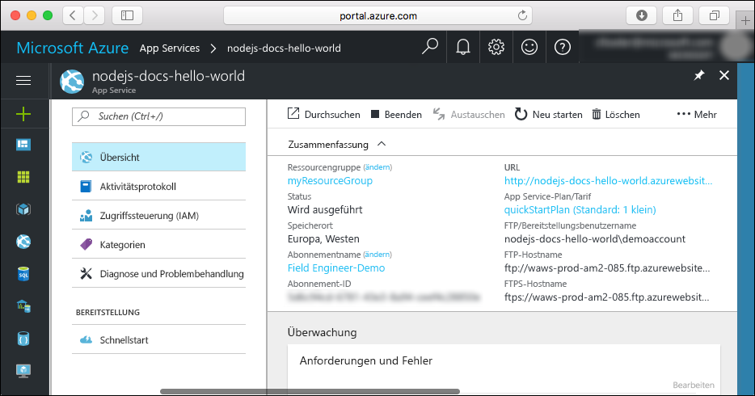

# <a name="create-a-nodejs-web-app-in-azure-app-service-on-linux"></a>Erstellen einer Node.js-Web-App in Azure App Service unter Linux

> [!NOTE]
> In diesem Artikel wird eine App in App Service unter Linux bereitgestellt. Informationen zur Bereitstellung in App Service unter _Windows_ finden Sie unter [Erstellen einer Node.js-Web-App in Azure](../app-service-web-get-started-nodejs.md).
>

[App Service unter Linux](app-service-linux-intro.md) bietet einen hochgradig skalierbaren Webhostingdienst mit Self-Patching unter Linux-Betriebssystemen. Diese Schnellstartanleitung veranschaulicht, wie Sie unter Linux mithilfe von [Cloud Shell](https://docs.microsoft.com/azure/cloud-shell/overview) eine Node.js-App in App Service bereitstellen.

In dieser Schnellstartanleitung wird Cloud Shell verwendet. Die Befehle können aber auch lokal über die [Azure CLI](/cli/azure/install-azure-cli) ausgeführt werden.


[!INCLUDE [quickstarts-free-trial-note](../../../includes/quickstarts-free-trial-note.md)]

[!INCLUDE [cloud-shell-try-it.md](../../../includes/cloud-shell-try-it.md)]

## <a name="install-web-app-extension-for-cloud-shell"></a>Installieren der Web-App-Erweiterung für Cloud Shell

Für diese Schnellstartanleitung müssen Sie die [az-Web-App-Erweiterung](https://docs.microsoft.com/cli/azure/extension?view=azure-cli-latest#az-extension-add) hinzufügen. Falls die Erweiterung bereits installiert ist, sollten Sie sie auf die neueste Version aktualisieren. Geben Sie zum Aktualisieren der Web-App-Erweiterung Folgendes ein: `az extension update -n webapp`.

Führen Sie zum Installieren der Web-App-Erweiterung den folgenden Befehl aus:

```bash
az extension add -n webapp
```

Wenn die Erweiterung installiert wurde, zeigt Cloud Shell Informationen wie im folgenden Beispiel an:

```bash
The installed extension 'webapp' is in preview.
```

## <a name="download-the-sample"></a>Herunterladen des Beispiels

Erstellen Sie in Cloud Shell ein Schnellstartverzeichnis, und wechseln Sie dorthin.

```bash
mkdir quickstart

cd quickstart
```

Führen Sie als Nächstes den folgenden Befehl aus, um das Beispiel-App-Repository in Ihrem Schnellstartverzeichnis zu klonen.

```bash
git clone https://github.com/Azure-Samples/nodejs-docs-hello-world
```

Während der Ausführung werden Informationen angezeigt, die den Informationen im folgenden Beispiel ähneln:

```bash
Cloning into 'nodejs-docs-hello-world'...
remote: Counting objects: 40, done.
remote: Total 40 (delta 0), reused 0 (delta 0), pack-reused 40
Unpacking objects: 100% (40/40), done.
Checking connectivity... done.
````

## <a name="create-a-web-app"></a>Erstellen einer Web-App

Wechseln Sie zum Verzeichnis mit dem Beispielcode, und führen Sie den Befehl `az webapp up` aus.

Ersetzen Sie im folgenden Beispiel „<app_name>“ durch einen eindeutigen App-Namen.

```bash
cd nodejs-docs-hello-world

az webapp up -n <app_name>
```

Die Ausführung dieses Befehls kann einige Minuten in Anspruch nehmen. Während der Ausführung werden Informationen angezeigt, die den Informationen im folgenden Beispiel ähneln:

```json
Creating Resource group 'appsvc_rg_Linux_CentralUS' ...
Resource group creation complete
Creating App service plan 'appsvc_asp_Linux_CentralUS' ...
App service plan creation complete
Creating app '<app_name>' ....
Webapp creation complete
Updating app settings to enable build after deployment
Creating zip with contents of dir /home/username/quickstart/nodejs-docs-hello-world ...
Preparing to deploy and build contents to app.
Fetching changes.

Generating deployment script.
Generating deployment script.
Generating deployment script.
Running deployment command...
Running deployment command...
Running deployment command...
Deployment successful.
All done.
{
  "app_url": "https://<app_name>.azurewebsites.net",
  "location": "Central US",
  "name": "<app_name>",
  "os": "Linux",
  "resourcegroup": "appsvc_rg_Linux_CentralUS ",
  "serverfarm": "appsvc_asp_Linux_CentralUS",
  "sku": "STANDARD",
  "src_path": "/home/username/quickstart/nodejs-docs-hello-world ",
  "version_detected": "6.9",
  "version_to_create": "node|6.9"
}
```

Der Befehl `az webapp up` bewirkt Folgendes:

- Erstellen einer Standardressourcengruppe

- Erstellen eines standardmäßigen App Service-Plans

- Erstellen einer App mit dem angegebenen Namen

- [Bereitstellen von ZIP-Dateien](https://docs.microsoft.com/azure/app-service/app-service-deploy-zip) aus dem aktuellen Arbeitsverzeichnis für die Web-App

## <a name="browse-to-the-app"></a>Navigieren zur App

Navigieren Sie in Ihrem Webbrowser zu der bereitgestellten Anwendung. Ersetzen Sie „<app_name>“ durch Ihren Web-App-Namen.

```bash
http://<app_name>.azurewebsites.net
```

Der Node.js-Beispielcode wird in einer Web-App mit integriertem Image ausgeführt.


**Glückwunsch!** Sie haben Ihre erste Node.js-App für App Service unter Linux bereitgestellt.

## <a name="update-and-redeploy-the-code"></a>Aktualisieren und erneutes Bereitstellen des Codes

Geben Sie in Cloud Shell `nano index.js` ein, um den Nano-Text-Editor zu öffnen.


 Nehmen Sie eine geringfügige Änderung am Text im Aufruf für `response.end` vor:

```nodejs
response.end("Hello Azure!");
```

Speichern Sie Ihre Änderungen, und beenden Sie Nano. Verwenden Sie `^O` zum Speichern und `^X` zum Beenden.

Nun stellen Sie die App erneut bereit. Ersetzen Sie `<app_name>` durch Ihre Web-App.

```bash
az webapp up -n <app_name>
```

Wechseln Sie nach Abschluss der Bereitstellung wieder zu dem Browserfenster, das im Schritt **Navigieren zur App** geöffnet wurde, und aktualisieren Sie die Seite.


## <a name="manage-your-new-azure-web-app"></a>Verwalten Ihrer neuen Azure-Web-App

Wechseln Sie zum <a href="https://portal.azure.com" target="_blank">Azure-Portal</a>, um die erstellte Web-App zu verwalten.

Klicken Sie im linken Menü auf **App Services** und anschließend auf den Namen Ihrer Azure-Web-App.


Die Übersichtsseite Ihrer Web-App wird angezeigt. Hier können Sie einfache Verwaltungsaufgaben wie Durchsuchen, Beenden, Starten, Neustarten und Löschen durchführen.



Im linken Menü werden verschiedene Seiten für die Konfiguration Ihrer App angezeigt.

## <a name="clean-up-resources"></a>Bereinigen von Ressourcen

In den vorherigen Schritten haben Sie Azure-Ressourcen in einer Ressourcengruppe erstellt. Wenn Sie diese Ressourcen nicht mehr benötigen, löschen Sie die Ressourcengruppe aus Cloud Shell. Wenn Sie die Region geändert haben, aktualisieren Sie den Ressourcengruppennamen `appsvc_rg_Linux_CentralUS` auf die spezifische Ressourcengruppe für Ihre App.

```azurecli-interactive
az group delete --name appsvc_rg_Linux_CentralUS
```

Die Ausführung dieses Befehls kann eine Minute in Anspruch nehmen.

## <a name="next-steps"></a>Nächste Schritte

> [!div class="nextstepaction"]
> [Node.js mit MongoDB](tutorial-nodejs-mongodb-app.md)
