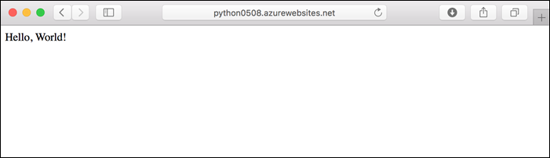
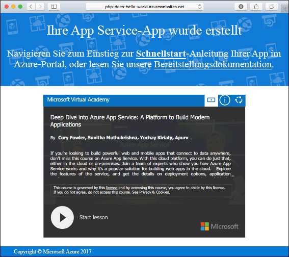
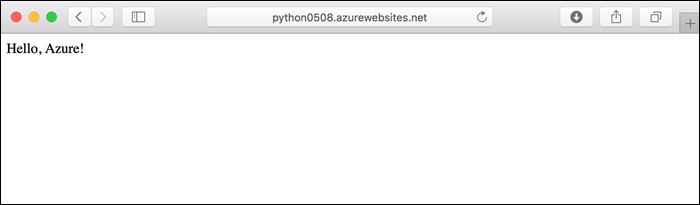
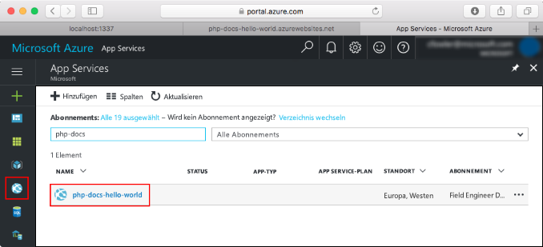
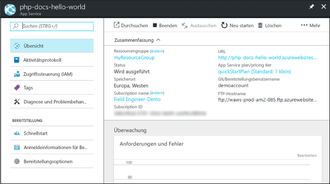

# <a name="create-a-python-app-in-azure-app-service-on-linux-preview"></a>Erstellen einer Python-App in Azure App Service für Linux (Vorschau)

[App Service unter Linux](app-service-linux-intro.md) bietet einen hochgradig skalierbaren Webhostingdienst mit Self-Patching unter Linux-Betriebssystemen. Dieser Schnellstart zeigt, wie Sie eine Python-App über dem integrierten Python-Image (Vorschau) im App Service unter Linux mithilfe der [Azure CLI](/cli/azure/install-azure-cli) bereitstellen.

Die Schritte in diesem Artikel können unter Mac, Windows oder Linux ausgeführt werden.



[!INCLUDE [quickstarts-free-trial-note](../../../includes/quickstarts-free-trial-note.md)]

## <a name="prerequisites"></a>Voraussetzungen

So führen Sie diesen Schnellstart durch:

* <a href="https://www.python.org/downloads/" target="_blank">Installation von Python 3.7</a>
* <a href="https://git-scm.com/" target="_blank">Installation von Git</a>

## <a name="download-the-sample"></a>Herunterladen des Beispiels

Führen Sie in einem Terminalfenster die folgenden Befehle aus, um die Beispielanwendung auf Ihren lokalen Computer zu klonen, und navigieren Sie zum Verzeichnis mit dem Beispielcode.

```bash
git clone https://github.com/Azure-Samples/python-docs-hello-world
cd python-docs-hello-world
```

## <a name="run-the-app-locally"></a>Lokales Ausführen der App

Führen Sie die Anwendung lokal aus, damit Sie sehen, wie sie beim Bereitstellen in Azure aussehen sollte. Öffnen Sie ein Terminalfenster, und verwenden Sie die folgenden Befehle, um die erforderlichen Abhängigkeiten zu installieren und den integrierten Entwicklungsserver zu starten. 

```bash
# In Bash
python3 -m venv venv
source venv/bin/activate
pip install -r requirements.txt
FLASK_APP=application.py flask run

# In PowerShell
py -3 -m venv env
env\scripts\activate
pip install -r requirements.txt
Set-Item Env:FLASK_APP ".\application.py"
flask run
```

Öffnen Sie einen Webbrowser, und navigieren Sie zu der Beispielapp auf `http://localhost:5000/`.

Die Nachricht **Hello World!** aus der Beispiel-App wird auf der Seite angezeigt.


Drücken Sie in Ihrem Terminalfenster **STRG+C**, um den Webserver zu beenden.

[!INCLUDE [cloud-shell-try-it.md](../../../includes/cloud-shell-try-it.md)]

[!INCLUDE [Configure deployment user](../../../includes/configure-deployment-user.md)]

[!INCLUDE [Create resource group](../../../includes/app-service-web-create-resource-group-linux.md)]

[!INCLUDE [Create app service plan](../../../includes/app-service-web-create-app-service-plan-linux.md)]

## <a name="create-a-web-app"></a>Erstellen einer Web-App

[!INCLUDE [Create web app](../../../includes/app-service-web-create-web-app-python-linux-no-h.md)]

Rufen Sie die Website auf, um Ihre neu erstellte App mit integriertem Image anzuzeigen. Ersetzen Sie _&lt;app name>_ durch Ihren App-Namen.

```bash
http://<app_name>.azurewebsites.net
```

Ihre neue App sollte nun wie folgt aussehen:



[!INCLUDE [Push to Azure](../../../includes/app-service-web-git-push-to-azure.md)] 

```bash
Counting objects: 42, done.
Delta compression using up to 8 threads.
Compressing objects: 100% (39/39), done.
Writing objects: 100% (42/42), 9.43 KiB | 0 bytes/s, done.
Total 42 (delta 15), reused 0 (delta 0)
remote: Updating branch 'master'.
remote: Updating submodules.
remote: Preparing deployment for commit id 'c40efbb40e'.
remote: Generating deployment script.
remote: Generating deployment script for python Web Site
.
.
.
remote: Finished successfully.
remote: Running post deployment command(s)...
remote: Deployment successful.
remote: App container will begin restart within 10 seconds.
To https://user2234@cephalin-python.scm.azurewebsites.net/cephalin-python.git
 * [new branch]      master -> master
 ```

## <a name="browse-to-the-app"></a>Navigieren zur App

Navigieren Sie in Ihrem Webbrowser zu der bereitgestellten Anwendung.

```bash
http://<app_name>.azurewebsites.net
```

Der Python-Beispielcode wird in App Service unter Linux mit einem integrierten Image ausgeführt.


**Glückwunsch!** Sie haben Ihre erste Python-App für App Service unter Linux bereitgestellt.

## <a name="update-locally-and-redeploy-the-code"></a>Lokales Aktualisieren und erneutes Bereitstellen des Codes

Öffnen Sie im lokalen Repository die Datei `application.py`, und ändern Sie den Text in der letzten Zeile geringfügig:

```python
return "Hello Azure!"
```

Führen Sie für Ihre Änderungen in Git einen Commit aus, und übertragen Sie dann die Codeänderungen mithilfe von Push an Azure.

```bash
git commit -am "updated output"
git push azure master
```

Wechseln Sie nach Abschluss der Bereitstellung wieder zu dem Browserfenster, das im Schritt **Navigieren zur App** geöffnet wurde, und aktualisieren Sie die Seite.



## <a name="manage-your-new-azure-app"></a>Verwalten Ihrer neuen Azure-App

Wechseln Sie zum <a href="https://portal.azure.com" target="_blank">Azure-Portal</a>, um die erstellte App zu verwalten.

Klicken Sie im linken Menü auf **App Services** und anschließend auf den Namen Ihrer Azure-App.



Die Übersichtsseite Ihrer App wird angezeigt. Hier können Sie einfache Verwaltungsaufgaben wie Durchsuchen, Beenden, Neustarten und Löschen durchführen.



Im linken Menü werden verschiedene Seiten für die Konfiguration Ihrer App angezeigt. 

[!INCLUDE [cli-samples-clean-up](../../../includes/cli-samples-clean-up.md)]

## <a name="next-steps"></a>Nächste Schritte

Das integrierte Python-Image in App Service unter Linux ist zurzeit als Vorschauversion verfügbar, und Sie können den zum Starten Ihrer App verwendeten Befehl anpassen. Sie können Python-Apps für die Produktionsumgebung stattdessen auch mit einem benutzerdefinierten Container erstellen.

> [!div class="nextstepaction"]
> [Python mit PostgreSQL](tutorial-python-postgresql-app.md)

> [!div class="nextstepaction"]
> [Konfigurieren eines benutzerdefinierten Startbefehls](how-to-configure-python.md#custom-startup-command)

> [!div class="nextstepaction"]
> [Problembehandlung](how-to-configure-python.md#troubleshooting)

> [!div class="nextstepaction"]
> [Verwenden von benutzerdefinierten Images](tutorial-custom-docker-image.md)
