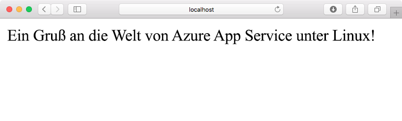
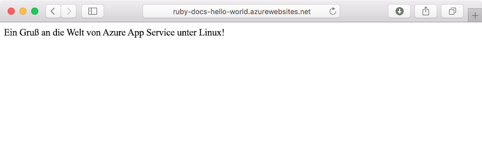

# <a name="create-a-ruby-app-in-app-service-on-linux"></a>Erstellen einer Ruby-App in App Service unter Linux

[Azure App Service unter Linux](app-service-linux-intro.md) bietet einen hochgradig skalierbaren Webhostingdienst mit Self-Patching. In dieser Schnellstartanleitung erfahren Sie, wie Sie eine grundlegende [Ruby on Rails](https://rubyonrails.org/)-Anwendung erstellen, die dann in Azure als Web-App unter Linux bereitgestellt werden kann.



[!INCLUDE [quickstarts-free-trial-note](../../../includes/quickstarts-free-trial-note.md)]

## <a name="prerequisites"></a>Voraussetzungen

* <a href="https://www.ruby-lang.org/en/documentation/installation/#rubyinstaller" target="_blank">Installieren von Ruby 2.3 oder höher</a>
* <a href="https://git-scm.com/" target="_blank">Installation von Git</a>

## <a name="download-the-sample"></a>Herunterladen des Beispiels

Führen Sie in einem Terminalfenster den folgenden Befehl aus, um das Beispiel-App-Repository auf Ihren lokalen Computer zu klonen:

```bash
git clone https://github.com/Azure-Samples/ruby-docs-hello-world
```

## <a name="run-the-application-locally"></a>Lokales Ausführen der Anwendung

Der Rails-Server muss ausgeführt werden, damit die Anwendung funktioniert. Ändern Sie diese auf das Verzeichnis `hello-world`, und verwenden Sie den Befehl `rails server`, um den Server zu starten.

```bash
cd hello-world\bin
rails server
```

Navigieren Sie in Ihrem Webbrowser zu `http://localhost:3000`, um die App lokal zu testen.



[!INCLUDE [Try Cloud Shell](../../../includes/cloud-shell-try-it.md)]

[!INCLUDE [Configure deployment user](../../../includes/configure-deployment-user.md)]

[!INCLUDE [Create resource group](../../../includes/app-service-web-create-resource-group-linux.md)]

[!INCLUDE [Create app service plan](../../../includes/app-service-web-create-app-service-plan-linux.md)]

## <a name="create-a-web-app"></a>Erstellen einer Web-App

[!INCLUDE [Create web app](../../../includes/app-service-web-create-web-app-ruby-linux-no-h.md)] 

Browsen Sie zu der Website, um Ihre neu erstellte Web-App mit integriertem Image anzuzeigen. Ersetzen Sie _&lt;App-Name>_ durch Ihren Web-App-Namen.

```bash
http://<app_name>.azurewebsites.net
```

Ihre neue Web-App sollte nun wie folgt aussehen:


## <a name="deploy-your-application"></a>Bereitstellen der Anwendung

Führen Sie die folgenden Befehle aus, um die lokale Anwendung auf Ihrer Azure-Website bereitzustellen:

```bash
git remote add azure <Git deployment URL from above>
git add -A
git commit -m "Initial deployment commit"
git push azure master
```

Vergewissern Sie sich, dass die Remotebereitstellungsvorgänge erfolgreich waren. Der Befehl erzeugt eine Ausgabe ähnlich dem folgenden Text:

```bash
remote: Using sass-rails 5.0.6
remote: Updating files in vendor/cache
remote: Bundle gems are installed into ./vendor/bundle
remote: Updating files in vendor/cache
remote: ~site/repository
remote: Finished successfully.
remote: Running post deployment command(s)...
remote: Deployment successful.
To https://<your web app name>.scm.azurewebsites.net/<your web app name>.git
  579ccb....2ca5f31  master -> master
myuser@ubuntu1234:~workspace/<app name>$
```

Starten Sie Ihre Web-App nach Abschluss der Bereitstellung neu, damit die Bereitstellung wirksam wird. Verwenden Sie dazu den Befehl [`az webapp restart`](/cli/azure/webapp?view=azure-cli-latest#az_webapp_restart), wie hier gezeigt:

```azurecli-interactive
az webapp restart --name <app name> --resource-group myResourceGroup
```

Navigieren Sie zu Ihrer Website, und überprüfen Sie die Ergebnisse.

```bash
http://<app name>.azurewebsites.net
```


> [!NOTE]
> Wenn Sie während des Neustarts der App versuchen, zur Website zu browsen, wird der HTTP-Statuscode `Error 503 Server unavailable` ausgegeben. Der vollständige Neustart kann einige Minuten in Anspruch nehmen.
>

[!INCLUDE [Clean-up section](../../../includes/cli-script-clean-up.md)]

## <a name="next-steps"></a>Nächste Schritte

> [!div class="nextstepaction"]
> [Ruby on Rails mit MySQL](tutorial-ruby-mysql-app.md)
