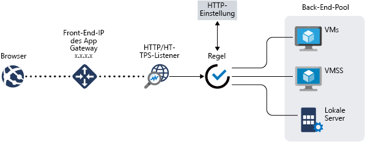

# Was ist Azure Application Gateway?

Azure Application Gateway ist ein Lastenausgleich für Webdatenverkehr, mit dem Sie eingehenden Datenverkehr für Ihre Webanwendungen verwalten können. Herkömmliche Lastenausgleichsmodule sind auf der Transportschicht (OSI-Schicht 4 – TCP und UDP) aktiv und leiten Datenverkehr basierend auf der IP-Quelladresse und dem dazugehörigen Port an eine IP-Zieladresse und an den entsprechenden Port weiter.

Mit Application Gateway können Sie Routingentscheidungen treffen, basierend auf zusätzlichen Attributen einer HTTP-Anforderung, z. B. URI-Pfad oder Hostkopfzeilen. So können Sie beispielsweise Datenverkehr basierend auf der eingehenden URL weiterleiten. Falls die eingehende URL also `/images` enthält, können Sie Datenverkehr an eine bestimmte Gruppe von Servern (einen so genannten Pool) weiterleiten, die für Bilder konfiguriert sind. Falls die URL `/video` enthält, wird dieser Datenverkehr an einen anderen Pool weitergeleitet, der für Videos optimiert ist.

Diese Art des Routings wird als Lastenausgleich auf Anwendungsebene (OSI-Schicht 7) bezeichnet. Per Azure Application Gateway kann das URL-basierte Routing und noch mehr durchgeführt werden.

Im Anschluss sind die verfügbaren Features von Azure Application Gateway aufgeführt:

## SSL-Beendigung (Secure Sockets Layer)

Application Gateway unterstützt die SSL-Beendigung am Gateway, wonach der Datenverkehr in der Regel unverschlüsselt zu den Back-End-Servern gelangt. Mit diesem Feature können Webserver vom kostspieligen Verschlüsselungs- und Entschlüsselungsaufwand befreit werden. Manchmal ist die unverschlüsselte Kommunikation mit den Servern allerdings keine akzeptable Option. Der Grund hierfür können Sicherheits- oder Complianceanforderungen sein, oder dass die Anwendung nur eine sichere Verbindung akzeptiert. Für Anwendungen dieser Art unterstützt Application Gateway die End-to-End-SSL-Verschlüsselung.

## Automatische Skalierung

Application Gateway- oder WAF-Bereitstellungen unter der Standard_v2- oder WAF_v2-SKU unterstützen automatische Skalierung und können zentral hoch- und herunterskalieren, je nach Veränderung der Datenverkehr-Auslastungsmuster. Durch die automatische Skalierung entfällt auch die Notwendigkeit, während des Bereitstellens eine Bereitstellungsgröße oder eine Anzahl von Instanzen auszuwählen. Weitere Informationen zu den standard_v2- und WAF_v2-Features von Application Gateway finden Sie unter [Automatische Skalierung der v2-SKU](application-gateway-autoscaling-zone-redundant.md).

## Zonenredundanz

Eine Application Gateway- oder WAF-Bereitstellung unter Standard_v2- oder WAF_v2-SKU kann sich über mehrere Verfügbarkeitszonen erstrecken und so höhere Fehlerresilienz bieten sowie die Notwendigkeit beseitigen, in jeder Zone separate Application Gateways bereitstellen zu müssen.

## Statische VIP

Die Application Gateway-VIP in Standard_v2- oder WAF_v2-SKU unterstützt nun exklusiv den statischen VIP-Typ. Dadurch wird sichergestellt, dass die dem Application Gateway zugeordnete VIP auch über die gesamte Lebensdauer des Application Gateways unverändert bleibt.

## Web Application Firewall

Web Application Firewall (WAF) ist ein Feature von Application Gateway, das zentralisierten Schutz Ihrer Webanwendungen vor allgemeinen Exploits und Sicherheitsrisiken bietet. Die WAF basiert auf den Regeln der [OWASP-Kernregelsätze (Open Web Application Security Project)](https://www.owasp.org/index.php/Category:OWASP_ModSecurity_Core_Rule_Set_Project) der Version 3.0 oder 2.2.9. 

Webanwendungen sind zunehmend Ziele böswilliger Angriffe, die allgemein bekannte Sicherheitslücken ausnutzen. Zu diesen Sicherheitslücken (Exploits) gehören üblicherweise Angriffe durch Einschleusung von SQL-Befehlen oder Angriffe durch websiteübergreifende Skripts, um nur einige zu nennen. Die Verhinderung solcher Angriffe im Anwendungscode ist oft schwierig und erfordert strenge Wartung, Patching und Überwachung auf vielen Ebenen der Anwendungstopologie. Eine zentrale Web Application Firewall vereinfacht die Sicherheitsverwaltung erheblich und bietet Anwendungsadministratoren einen besseren Schutz vor Bedrohungen und Angriffen. Mit einer WAF-Lösung können Sie ebenfalls schneller auf ein Sicherheitsrisiko reagieren, da eine bekannte Schwachstelle an einem zentralen Ort gepatcht wird, statt jede einzelne Webanwendung separat zu sichern. Vorhandene Anwendungsgateways lassen sich problemlos in ein Anwendungsgateway mit Web Application Firewall konvertieren.

Weitere Informationen finden Sie unter [Web Application-Firewall (WAF) in Application Gateway](https://docs.microsoft.com/azure/application-gateway/waf-overview).

## URL-basiertes Routing

Mit dem Routing auf URL-Pfadbasis kann Datenverkehr basierend auf URL-Pfaden von Anforderungen an Back-End-Serverpools weitergeleitet werden. Ein mögliches Szenario ist die Weiterleitung von Anforderungen für unterschiedliche Inhaltstypen an verschiedene Pools.

Beispielsweise werden Anforderungen von `http://contoso.com/video/*` an VideoServerPool und `http://contoso.com/images/*` an ImageServerPool weitergeleitet. DefaultServerPool wird ausgewählt, wenn keines der Pfadmuster zutrifft.

Weitere Informationen finden Sie unter [URL-basiertes Routing mit Application Gateway](https://docs.microsoft.com/azure/application-gateway/url-route-overview).

## Hosten mehrerer Websites

Das Hosten mehrerer Websites ermöglicht es Ihnen, mehr als eine Website auf derselben Anwendungsgatewayinstanz zu konfigurieren. Mit diesem Feature können Sie eine effizientere Topologie für Ihre Bereitstellungen konfigurieren, indem Sie einem Anwendungsgateway bis zu 100 Websites hinzufügen. Jede Website kann zu einem eigenen Pool umgeleitet werden. Das Anwendungsgateway kann Datenverkehr beispielsweise für `contoso.com` und `fabrikam.com` über die beiden Serverpools „ContosoServerPool“ und „FabrikamServerPool“ bereitstellen.

Anforderungen für `http://contoso.com` werden an „ContosoServerPool“ und Anforderungen für `http://fabrikam.com` an „FabrikamServerPool“ weitergeleitet.

Analog dazu können zwei Unterdomänen der gleichen übergeordneten Domäne in der gleichen Anwendungsgatewaybereitstellung gehostet werden. Beispiele für die Verwendung von untergeordneten Domänen sind `http://blog.contoso.com` und `http://app.contoso.com`, die unter nur einer Anwendungsgatewaybereitstellung gehostet werden.

Weitere Informationen finden Sie unter [Hosten von mehreren Websites mit Application Gateway](https://docs.microsoft.com/azure/application-gateway/multiple-site-overview).

## Umleitung

Ein typisches Szenario vieler Webanwendungen ist die Unterstützung der automatischen Umleitung von HTTP zu HTTPS, um sicherzustellen, dass die gesamte Kommunikation zwischen einer Anwendung und ihren Benutzern über einen verschlüsselten Pfad stattfindet.

In der Vergangenheit haben Sie unter Umständen auch Verfahren wie die Erstellung eines dedizierten Pools verwendet, der den alleinigen Zweck hatte, eingehende HTTP-Anforderungen zu HTTPS umzuleiten. Application Gateway unterstützt die Umleitung von Application Gateway-Datenverkehr. Dies vereinfacht die Anwendungskonfiguration, optimiert die Ressourcennutzung und ermöglicht neue Umleitungsszenarien wie etwa die globale und pfadbasierte Umleitung. Die Application Gateway-Umleitung ist nicht auf HTTP zu HTTPS beschränkt. Vielmehr handelt es sich um einen generischen Umleitungsmechanismus, sodass Sie Umleitungen für jeden Port durchführen können, den Sie mithilfe von Regeln definieren. Auch die Umleitung an eine externe Website wird unterstützt.

Die Application Gateway-Umleitung bietet Folgendes:

- Globale Umleitung von einem Port zu einem anderen Port über das Gateway. Dies ermöglicht HTTP-zu-HTTPS-Umleitungen auf einer Website.
- Pfadbasierte Umleitung. Bei dieser Art von Umleitung kann HTTP nur in einem bestimmten Websitebereich zu HTTPS umgeleitet werden – etwa in einem durch `/cart/*` gekennzeichneten Einkaufswagenbereich.
- Umleitung an eine externe Website.

Weitere Informationen finden Sie unter [Umleiten von Datenverkehr](https://docs.microsoft.com/azure/application-gateway/redirect-overview) mit Application Gateway.

## Sitzungsaffinität

Das Feature „Cookiebasierte Sitzungsaffinität“ ist hilfreich, wenn eine Benutzersitzung auf dem gleichen Server bleiben soll. Mithilfe von durch das Gateway verwalteten Cookies kann Application Gateway weiteren Datenverkehr einer Benutzersitzung zur Verarbeitung an den gleichen Server weiterleiten. Dies ist hilfreich, wenn der Sitzungsstatus für eine Benutzersitzung lokal auf dem Server gespeichert wird.

## WebSocket- und HTTP/2-Datenverkehr

Application Gateway verfügt über native Unterstützung für das WebSocket- und das HTTP/2-Protokoll. Die WebSocket-Unterstützung kann von Benutzern nicht selektiv aktiviert oder deaktiviert werden.

Das WebSocket- und das HTTP/2-Protokoll ermöglichen die Vollduplexkommunikation zwischen einem Server und einem Client über eine TCP-Verbindung mit langer Laufzeit. Dies ermöglicht wiederum mehr Interaktivität bei der Kommunikation zwischen dem Webserver und dem Client, da die Kommunikation auch ohne die bei HTTP-basierten Implementierungen erforderlichen Abfragen bidirektional sein kann. Diese Protokolle zeichnen sich im Vergleich zu HTTP durch einen geringen Mehraufwand aus. Außerdem können sie die gleiche TCP-Verbindung für mehrere Anforderungen/Antworten verwenden, was eine effizientere Ressourcennutzung zur Folge hat. Diese Protokolle sind für die Nutzung der üblichen HTTP-Ports 80 und 443 konzipiert.

Weitere Informationen finden Sie unter [WebSocket-Unterstützung](https://docs.microsoft.com/azure/application-gateway/application-gateway-websocket) und [HTTP/2-Unterstützung](https://docs.microsoft.com/azure/application-gateway/configuration-overview#http2-support).

## AKS-Eingangscontroller (Azure Kubernetes Service) – Vorschauversion 

Der Application Gateway-Eingangscontroller wird als Pod im AKS-Cluster ausgeführt und ermöglicht es dem Application Gateway, als Eingang zu einem AKS-Cluster zu fungieren. Dies wird nur mit v2 Application Gateway unterstützt.

Weitere Informationen finden Sie unter [Azure Application Gateway Ingress Controller](https://azure.github.io/application-gateway-kubernetes-ingress/) (Azure Application Gateway-Eingangscontroller).

## Verbindungsausgleich

Mit dem Verbindungsausgleich können Sie eine korrekte Entfernung von Mitgliedern des Back-End-Pools bei geplanten Dienstupdates erzielen. Diese Einstellung wird über die HTTP-Einstellung des Back-Ends aktiviert und kann bei der Erstellung einer Regel auf alle Mitglieder eines Back-End-Pools angewendet werden. Nach der Aktivierung stellt Application Gateway sicher, dass alle Instanzen eines Back-End-Pools, deren Registrierung aufgehoben wird, keine neuen Anforderungen mehr erhalten, während vorhandene Anforderungen innerhalb eines konfigurierten Zeitlimits abgeschlossen werden können. Dies gilt sowohl für Back-End-Instanzen, die per API-Aufruf explizit aus dem Back-End-Pool entfernt werden, als auch für Back-End-Instanzen, die von den Integritätstests als fehlerhaft gemeldet werden.

## Benutzerdefinierte Fehlerseiten

Mit Application Gateway können Sie benutzerdefinierte Fehlerseiten erstellen, anstatt Standardfehlerseiten anzuzeigen. Sie können für eine benutzerdefinierte Fehlerseite Ihr eigenes Branding und Layout verwenden.

Weitere Informationen finden Sie unter [Erneutes Generieren von HTTP-Headern](rewrite-http-headers.md).

## Erneutes Generieren von HTTP-Headern

HTTP-Header ermöglichen Client und Server das Übergeben von zusätzlichen Informationen mit der Anforderung oder der Antwort. Das Umschreiben dieser HTTP-Header hilft Ihnen, mehrere wichtige Szenarien zu meistern, wie z.B.:

- Hinzufügen von sicherheitsbezogenen Headerfeldern wie HSTS/X-XSS-Protection.
- Entfernen von Headerfeldern aus Antworten, die vertrauliche Informationen preisgeben können.
- Entfernen von Portinformationen aus X-Forwarded-For-Headern.

Application Gateway unterstützt das Hinzufügen, Entfernen oder Aktualisieren von HTTP-Anforderungs- und -Antwortheadern, während die Anforderungs- und Antwortpakete zwischen dem Client und den Back-End-Pools übertragen werden. Es bietet Ihnen auch die Möglichkeit, Bedingungen hinzuzufügen, um sicherzustellen, dass die angegebenen Header nur dann neu geschrieben werden, wenn bestimmte Bedingungen erfüllt sind.

Weitere Informationen finden Sie unter [Erneutes Generieren von HTTP-Headern](rewrite-http-headers.md).

## Festlegen der Größe

Die Standard_v2- und WAF_v2-SKU von Application Gateway kann für die automatische Skalierung oder für Bereitstellungen fester Größe konfiguriert werden. Diese SKUs bieten keine verschiedenen Instanzgrößen.

Die Standard- und WAF-SKU von Application Gateway werden zurzeit in drei Größen angeboten: **klein**, **mittel** und **groß**. Kleine Instanzen sind für Entwicklungs- und Testszenarien vorgesehen.

Eine vollständige Liste mit den Einschränkungen von Anwendungsgateways finden Sie unter [Application Gateway service limits (Einschränkungen von Application Gateway)](../azure-subscription-service-limits.md?toc=%2fazure%2fapplication-gateway%2ftoc.json#application-gateway-limits).

Die folgende Tabelle zeigt einen durchschnittlichen Leistungsdurchsatz für jede Anwendungsgatewayinstanz mit aktivierter SSL-Auslagerung:

| Durchschnittliche Größe der Back-End-Seitenantwort | Klein | Mittel | Groß |
| --- | --- | --- | --- |
| 6 KB |7,5 MBit/s |13 MBit/s |50 MBit/s |
| 100 KB |35 MBit/s |100 MBit/s |200 MBit/s |

> [!NOTE]
> Hierbei handelt es sich um ungefähre Werte für den Durchsatz des Anwendungsgateways. Der tatsächliche Durchsatz ist abhängig von verschiedenen Umgebungsdetails wie etwa durchschnittliche Seitengröße, Speicherort der Back-End-Instanzen und Verarbeitungszeit für die Seitenbereitstellung. Für genaue Leistungsangaben sollten Sie Ihre eigenen Tests ausführen. Diese Werte dienen nur als Leitfaden für die Kapazitätsplanung.

## Nächste Schritte

Je nach Ihren Anforderungen und der vorhandenen Umgebung können Sie eine Application Gateway-Testinstanz über das Azure-Portal, mithilfe von Azure PowerShell oder unter Verwendung der Azure CLI erstellen:

- [Schnellstart: Weiterleiten von Webdatenverkehr per Azure Application Gateway – Azure-Portal](quick-create-portal.md)
- [Schnellstart: Weiterleiten von Webdatenverkehr per Azure Application Gateway – Azure PowerShell](quick-create-powershell.md)
- [Schnellstart: Weiterleiten von Webdatenverkehr per Azure Application Gateway – Azure CLI](quick-create-cli.md)