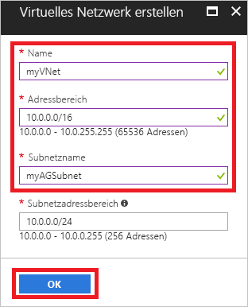
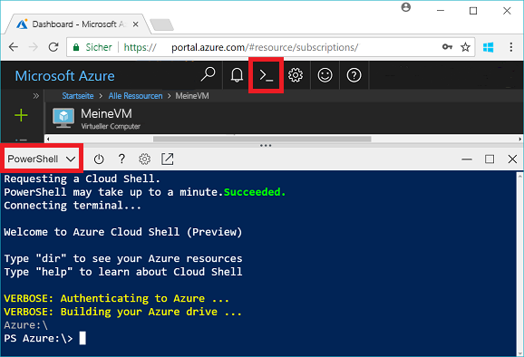
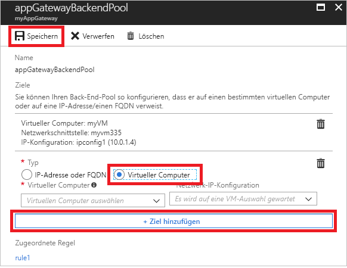
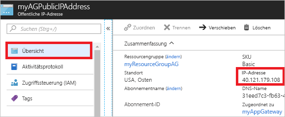

# <a name="quickstart-direct-web-traffic-with-azure-application-gateway---azure-portal"></a>Schnellstart: Weiterleiten von Webdatenverkehr per Azure Application Gateway – Azure-Portal

Per Azure Application Gateway können Sie Ihren Webdatenverkehr für Anwendungen an bestimmte Ressourcen leiten, indem Sie Ports Listener zuweisen, Regeln erstellen und Ressourcen einem Back-End-Pool hinzufügen.

In dieser Schnellstartanleitung wird gezeigt, wie Sie das Azure-Portal zur schnellen Erstellung des Anwendungsgateways mit zwei virtuellen Computern im Back-End-Pool erstellen. Anschließend führen Sie einen Test durch, um sicherzustellen, dass alles richtig funktioniert.

Wenn Sie kein Azure-Abonnement besitzen, können Sie ein [kostenloses Konto](https://azure.microsoft.com/free/?WT.mc_id=A261C142F) erstellen, bevor Sie beginnen.

## <a name="log-in-to-azure"></a>Anmelden an Azure

Melden Sie sich unter [http://portal.azure.com](http://portal.azure.com) beim Azure-Portal an.

## <a name="create-an-application-gateway"></a>Erstellen eines Anwendungsgateways

Sie müssen ein virtuelles Netzwerk für das Anwendungsgateway erstellen, um mit anderen Ressourcen kommunizieren zu können. Sie können ein virtuelles Netzwerk zum gleichen Zeitpunkt erstellen wie das Anwendungsgateway. In diesem Beispiel werden zwei Subnetze erstellt: eins für das Anwendungsgateway und das andere für die virtuellen Computer. 

1. Klicken Sie in der linken oberen Ecke des Azure-Portals auf **Ressource erstellen**.
2. Klicken Sie auf **Netzwerk** und dann in der Liste der ausgewählten Elemente auf **Application Gateway**.
3. Geben Sie die folgenden Werte für das Anwendungsgateway ein:

    - *myAppGateway*: Name des Anwendungsgateways
    - *myResourceGroupAG*: neue Ressourcengruppe

    

4. Übernehmen Sie die Standardwerte für die anderen Einstellungen, und klicken Sie auf **OK**.
5. Klicken Sie auf **Virtuelles Netzwerk auswählen** > **Neu erstellen**, und geben Sie dann die folgenden Werte für das virtuelle Netzwerk ein:

    - *myVNet*: Name des virtuellen Netzwerks
    - *10.0.0.0/16*: Adressraum des virtuellen Netzwerks
    - *myAGSubnet*: Subnetzname
    - *10.0.0.0/24*: Adressraum des Subnetzes

    

6. Klicken Sie auf **OK**, um das virtuelle Netzwerk und das Subnetz zu erstellen.
6. Klicken Sie auf **Öffentliche IP-Adresse auswählen** > **Neu erstellen**, und geben Sie den Namen der öffentlichen IP-Adresse ein. In diesem Beispiel heißt die öffentliche IP-Adresse *myAGPublicIPAddress*. Übernehmen Sie die Standardwerte für die anderen Einstellungen, und klicken Sie auf **OK**.
8. Übernehmen Sie die Standardwerte für die Listenerkonfiguration, lassen Sie die Web Application Firewall deaktiviert, und klicken Sie dann auf **OK**.
9. Überprüfen Sie die Einstellungen auf der Zusammenfassungsseite, und klicken Sie dann auf **OK**, um das virtuelle Netzwerk, die öffentliche IP-Adresse und das Anwendungsgateway zu erstellen. Die Erstellung des Anwendungsgateways kann bis zu 30 Minuten dauern. Warten Sie, bis die Bereitstellung abgeschlossen ist, bevor Sie mit dem nächsten Abschnitt fortfahren.

### <a name="add-a-subnet"></a>Hinzufügen eines Subnetzes

1. Klicken Sie im linken Menü auf **Alle Ressourcen** und dann in der Ressourcenliste auf **myVNet**.
2. Klicken Sie auf **Subnetze** > **Subnetz**.

    

3. Geben Sie als Name des Subnetzes *myBackendSubnet* ein, und klicken Sie auf **OK**.

## <a name="create-backend-servers"></a>Erstellen von Back-End-Servern

In diesem Beispiel erstellen Sie zwei virtuelle Computer, die als Back-End-Server für das Anwendungsgateway verwendet werden. 

### <a name="create-a-virtual-machine"></a>Erstellen eines virtuellen Computers

1. Klicken Sie auf **New**.
2. Wählen Sie **Compute**, und wählen Sie dann in der Liste der ausgewählten Elemente die Option **Windows Server 2016 Datacenter**.
3. Geben Sie die folgenden Werte für den virtuellen Computer ein:

    - *myVM*: Name des virtuellen Computers
    - *azureuser*: Name des Administratorbenutzers
    - *Azure123456!* als Kennwort
    - Wählen Sie **Vorhandene verwenden** und dann *myResourceGroupAG* aus.

4. Klicken Sie auf **OK**.
5. Wählen Sie als Größe des virtuellen Computers **DS1_V2** aus, und klicken Sie dann auf **Auswählen**.
6. Stellen Sie sicher, dass als virtuelles Netzwerk **myVNet** und als Subnetz **myBackendSubnet** ausgewählt ist. 
7. Klicken Sie auf **Deaktiviert**, um die Startdiagnose zu deaktivieren.
8. Klicken Sie auf **OK**, überprüfen Sie die Einstellungen auf der Seite „Zusammenfassung“, und klicken Sie dann auf **Erstellen**.

### <a name="install-iis"></a>Installieren von IIS

Sie installieren IIS auf den virtuellen Computern, um zu überprüfen, ob das Anwendungsgateway erfolgreich erstellt wurde.

1. Öffnen Sie die interaktive Shell, und vergewissern Sie sich, dass **PowerShell** festgelegt ist.

    

2. Führen Sie den folgenden Befehl aus, um IIS auf dem virtuellen Computer zu installieren: 

    ```azurepowershell-interactive
    Set-AzureRmVMExtension `
      -ResourceGroupName myResourceGroupAG `
      -ExtensionName IIS `
      -VMName myVM `
      -Publisher Microsoft.Compute `
      -ExtensionType CustomScriptExtension `
      -TypeHandlerVersion 1.4 `
      -SettingString '{"commandToExecute":"powershell Add-WindowsFeature Web-Server; powershell Add-Content -Path \"C:\\inetpub\\wwwroot\\Default.htm\" -Value $($env:computername)"}' `
      -Location EastUS
    ```

3. Erstellen Sie einen zweiten virtuellen Computer, und installieren Sie IIS mithilfe der soeben ausgeführten Schritte. Geben Sie *myVM2* als Name und für „VMName“ in „Set-AzureRmVMExtension“ ein.

### <a name="add-backend-servers"></a>Hinzufügen von Back-End-Servern

Nachdem Sie die virtuellen Computer erstellt haben, müssen Sie sie zum Back-End-Pool im Anwendungsgateway hinzufügen.

1. Klicken Sie auf **Alle Ressourcen** > **myAppGateway**.
2. Klicken Sie auf **Back-End-Pools**. Ein Standardpool mit dem Anwendungsgateway wurde automatisch erstellt. Klicken Sie auf **appGatewayBackendPool**.
3. Klicken Sie auf **Ziel hinzufügen** > **Virtueller Computer**, und wählen Sie dann *myVM*. Wählen Sie **Ziel hinzufügen** > **Virtueller Computer**, und wählen Sie dann *myVM2*.

    

4. Klicken Sie auf **Speichern**.

## <a name="test-the-application-gateway"></a>Testen des Anwendungsgateways

Die Installation von IIS ist für die Erstellung des Anwendungsgateways nicht erforderlich. Sie haben die Installation in dieser Schnellstartanleitung aber ausgeführt, um zu überprüfen, ob das Anwendungsgateway erfolgreich erstellt wurde.

1. Suchen Sie auf dem Übersichtsbildschirm die öffentliche IP-Adresse für das Anwendungsgateway. Klicken Sie auf **Alle Ressourcen** > **myAGPublicIPAddress**.

    

2. Kopieren Sie die öffentliche IP-Adresse, und fügen Sie sie in die Adressleiste des Browsers ein.

    

Wenn Sie den Browser aktualisieren, sollte der Name des anderen virtuellen Computers angezeigt werden.

## <a name="clean-up-resources"></a>Bereinigen von Ressourcen

Untersuchen Sie zuerst die Ressourcen, die mit dem Anwendungsgateway erstellt wurden. Sie können dann die Ressourcengruppe, das Anwendungsgateway und alle dazugehörigen Ressourcen löschen, wenn diese nicht mehr benötigt werden. Wählen Sie hierzu die Ressourcengruppe aus, die das Anwendungsgateway enthält, und klicken Sie auf **Löschen**.

## <a name="next-steps"></a>Nächste Schritte

> [!div class="nextstepaction"]
> [Verwalten von Webdatenverkehr mit einem Anwendungsgateway per Azure CLI](./tutorial-manage-web-traffic-cli.md)
