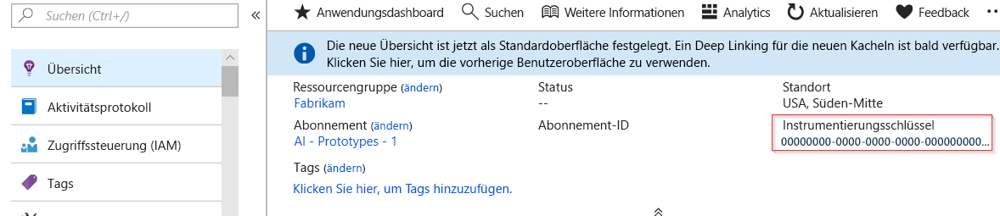
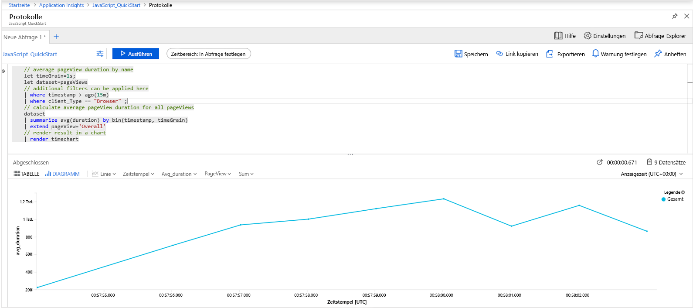
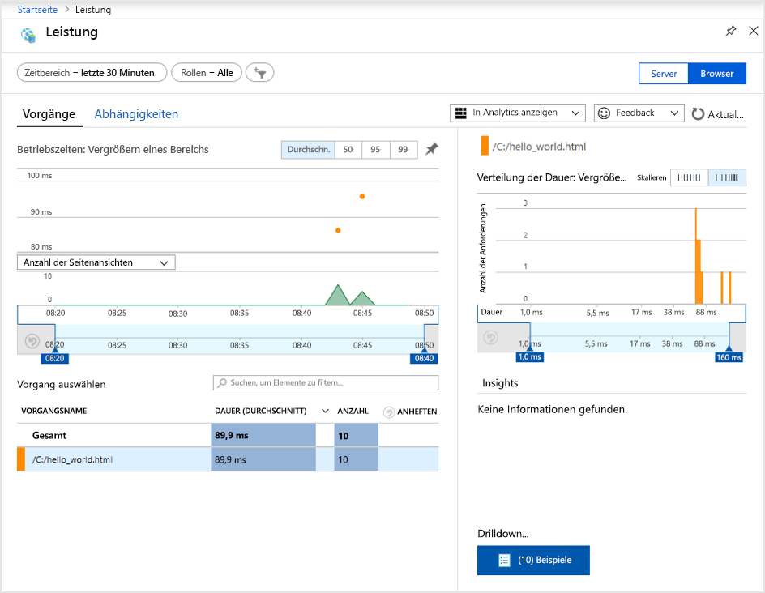
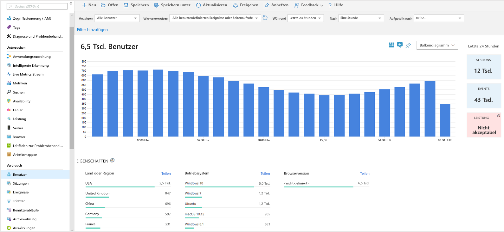
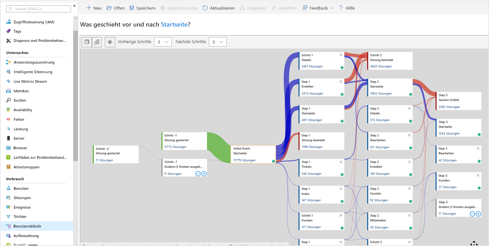

# <a name="start-monitoring-your-website"></a>Starten der Überwachung Ihrer Website

Mit Azure Monitor Application Insights können Sie ganz einfach die Verfügbarkeit, Leistung und Nutzung Ihrer Website überwachen. Sie können auch Fehler in Ihrer Anwendung schnell erkennen und diagnostizieren, ohne darauf warten zu müssen, dass diese Fehler von Benutzern gemeldet werden. Application Insights bietet sowohl Funktionen für die serverseitige Überwachung als auch Funktionen für die client-/browserseitige Überwachung.

Diese Schnellstartanleitung zeigt Schritt für Schritt, wie Sie das [Open Source-basierte JavaScript SDK für Application Insights](https://github.com/Microsoft/ApplicationInsights-JS) hinzufügen, um sich mit der client-/browserseitigen Erfahrung der Besucher Ihrer Website vertraut zu machen.

## <a name="prerequisites"></a>Voraussetzungen

So führen Sie diesen Schnellstart durch:

- Sie benötigen ein Azure-Abonnement.

Wenn Sie kein Azure-Abonnement besitzen, können Sie ein [kostenloses Konto](https://azure.microsoft.com/free/) erstellen, bevor Sie beginnen.

## <a name="sign-in-to-the-azure-portal"></a>Melden Sie sich auf dem Azure-Portal an.

Melden Sie sich beim [Azure-Portal](https://portal.azure.com/) an.

## <a name="enable-application-insights"></a>Aktivieren von Application Insights

Application Insights kann Telemetriedaten aus jeder mit dem Internet verbundenen Anwendung erfassen – ob lokal ausgeführt oder in der Cloud. Geben Sie folgendermaßen vor, um diese Daten anzuzeigen.

1. Klicken Sie auf **Ressource erstellen** > **Verwaltungstools** > **Application Insights**.

   Ein Dialogfeld für die Konfiguration wird geöffnet. Füllen Sie die Eingabefelder anhand der Informationen in der folgenden Tabelle aus:

    | Einstellungen        | Wert           | BESCHREIBUNG  |
   | ------------- |:-------------|:-----|
   | **Name**      | Global eindeutiger Wert | Der Name, der die zu überwachende App identifiziert. |
   | **Anwendungstyp** | Allgemeine Anwendung | Der Typ der zu überwachenden App. |
   | **Ressourcengruppe**     | myResourceGroup      | Der Name der neuen Ressourcengruppe, die Application Insights-Daten hosten soll. |
   | **Location** | USA (Ost) | Wählen Sie einen Standort in Ihrer Nähe oder in der Nähe des Standorts, in dem Ihre App gehostet wird. |

2. Klicken Sie auf **Create**.

## <a name="create-an-html-file"></a>Erstellen einer HTML-Datei

1. Erstellen Sie auf Ihrem lokalen Computer eine Datei namens ``hello_world.html``. In diesem Beispiel wird die Datei im Stammverzeichnis von Laufwerk C: unter ``C:\hello_world.html`` abgelegt.
2. Kopieren Sie das folgende Skript in ``hello_world.html``:

    ```html
    <!DOCTYPE html>
    <html>
    <head>
    <title>Azure Monitor Application Insights</title>
    </head>
    <body>
    <h1>Azure Monitor Application Insights Hello World!</h1>
    <p>You can use the Application Insights JavaScript SDK to perform client/browser-side monitoring of your website. To learn about more advanced JavaScript SDK configurations visit the <a href="https://github.com/Microsoft/ApplicationInsights-JS/blob/master/API-reference.md" title="API Reference">API reference</a>.</p>
    </body>
    </html>
    ```

## <a name="configure-app-insights-sdk"></a>Konfigurieren des Application Insights SDK

1. Wählen Sie **Übersicht** > **Grundlagen** aus, und kopieren Sie den**Instrumentierungsschlüssel** Ihrer Anwendung.

   

2. Fügen Sie der Datei ``hello_world.html`` das folgende Skript vor dem schließenden Tag ``</head>`` hinzu:

   ```javascript
      <script type="text/javascript">
        var appInsights=window.appInsights||function(a){
            function b(a){c[a]=function(){var b=arguments;c.queue.push(function(){c[a].apply(c,b)})}}var c={config:a},d=document,e=window;setTimeout(function(){var b=d.createElement("script");b.src=a.url||"https://az416426.vo.msecnd.net/scripts/a/ai.0.js",d.getElementsByTagName("script")[0].parentNode.appendChild(b)});try{c.cookie=d.cookie}catch(a){}c.queue=[];for(var f=["Event","Exception","Metric","PageView","Trace","Dependency"];f.length;)b("track"+f.pop());if(b("setAuthenticatedUserContext"),b("clearAuthenticatedUserContext"),b("startTrackEvent"),b("stopTrackEvent"),b("startTrackPage"),b("stopTrackPage"),b("flush"),!a.disableExceptionTracking){f="onerror",b("_"+f);var g=e[f];e[f]=function(a,b,d,e,h){var i=g&&g(a,b,d,e,h);return!0!==i&&c["_"+f](a,b,d,e,h),i}}return c
        }({
            instrumentationKey: "xxxxxxxx-xxxx-xxxx-xxxx-xxxxxxxx"
        });
        
        window.appInsights=appInsights,appInsights.queue&&0===appInsights.queue.length&&appInsights.trackPageView();
</script>
   ```

3. Bearbeiten Sie ``hello_world.html``, und fügen Sie Ihren Instrumentierungsschlüssel hinzu.

4. Öffnen Sie ``hello_world.html`` in einer lokalen Browsersitzung. Dadurch wird ein einzelner Seitenaufruf generiert. Sie können Ihren Browser aktualisieren, um mehrere Testseitenaufrufe zu generieren.

## <a name="start-monitoring-in-the-azure-portal"></a>Starten der Überwachung im Azure-Portal

1. Sie können jetzt im Azure-Portal erneut die Seite **Übersicht** für Application Insights öffnen, von der Sie den Instrumentierungsschlüssel abgerufen haben, um Details zu Ihrer aktuell ausgeführten Anwendung anzuzeigen. Die vier Standarddiagramme auf der Übersichtsseite sind auf serverseitige Anwendungsdaten ausgelegt. Da wir die client-/browserseitigen Interaktionen mit dem JavaScript SDK instrumentieren, ist diese spezielle Ansicht nicht relevant (es sei denn, es ist auch ein serverseitiges SDK installiert).

2. Klicken Sie auf  **Analytics**.  Dadurch wird **Analytics** geöffnet. Hier steht eine erweiterte Abfragesprache zum Analysieren aller Daten zur Verfügung, die von Application Insights gesammelt werden. Führen Sie die folgende Abfrage aus, um Daten im Zusammenhang mit den clientseitigen Browseranforderungen anzuzeigen:

    ```kusto
    // average pageView duration by name
    let timeGrain=1s;
    let dataset=pageViews
    // additional filters can be applied here
    | where timestamp > ago(15m)
    | where client_Type == "Browser" ;
    // calculate average pageView duration for all pageViews
    dataset
    | summarize avg(duration) by bin(timestamp, timeGrain)
    | extend pageView='Overall'
    // render result in a chart
    | render timechart
    ```

   

3. Kehren Sie zur Seite **Übersicht** zurück. Klicken Sie unter der Überschrift **Untersuchen** auf **Browser**, und wählen Sie anschließend **Leistung** aus. Hier finden Sie Metriken im Zusammenhang mit der Leistung Ihrer Website. Es gibt auch eine Ansicht zum Analysieren von Fehlern und Ausnahmen für Ihre Website. Durch Klicken auf **Beispiele** gelangen Sie zu den Details einzelner Transaktionen. Von dort aus können Sie auf die [End-to-End-Transaktionsdetails](app-insights-transaction-diagnostics.md) zugreifen.

   

4. Klicken Sie im Hauptmenü von Application Insights unter der Überschrift **Nutzung** auf [**Benutzer**](app-insights-usage-segmentation.md), um die [Analysetools für Benutzerverhalten](app-insights-usage-overview.md) zu erkunden. Da wir zum Testen einen einzelnen Computer verwenden, werden nur Daten für einen einzelnen Benutzer angezeigt. Bei einer Livewebsite kann die Benutzerverteilung beispielsweise wie folgt aussehen:

     

5. Ein anderes praktisches Tool für die Instrumentierung komplexerer Websites mit mehreren Seiten ist [**Benutzerabläufe**](app-insights-usage-flows.md). Mit **Benutzerabläufe** können Sie den Pfad nachverfolgen, den Besucher in verschiedenen Bereichen Ihrer Website durchlaufen.

  

Informationen zu komplexeren Konfigurationen für die Websiteüberwachung finden Sie in der [API-Referenz für das JavaScript SDK](https://github.com/Microsoft/ApplicationInsights-JS/blob/master/API-reference.md).

## <a name="clean-up-resources"></a>Bereinigen von Ressourcen

Wenn Sie planen, mit den nachfolgenden Schnellstarts oder Tutorials fortzufahren, sollten Sie die in diesem Schnellstart erstellten Ressourcen nicht bereinigen. Falls Sie nicht fortfahren möchten, können Sie die folgenden Schritte ausführen, um alle erstellten Ressourcen dieser Schnellstartanleitung im Azure-Portal zu löschen.

1. Klicken Sie im Azure-Portal im Menü auf der linken Seite auf **Ressourcengruppen** und dann auf **myResourceGroup**.
2. Klicken Sie auf der Seite mit Ihrer Ressourcengruppe auf **Löschen**, geben Sie im Textfeld **myResourceGroup** ein, und klicken Sie dann auf **Löschen**.

## <a name="next-steps"></a>Nächste Schritte

> [!div class="nextstepaction"]
> [Suchen nach und Diagnostizieren von Leistungsproblemen](https://docs.microsoft.com/azure/application-insights/app-insights-analytics)
