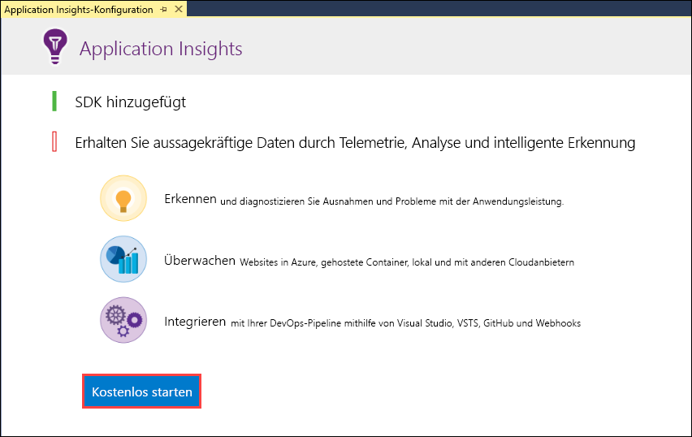
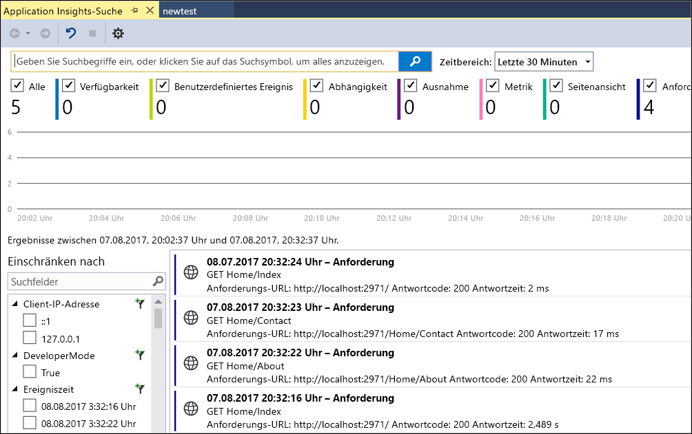
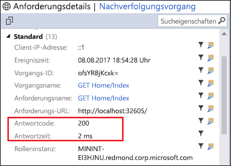
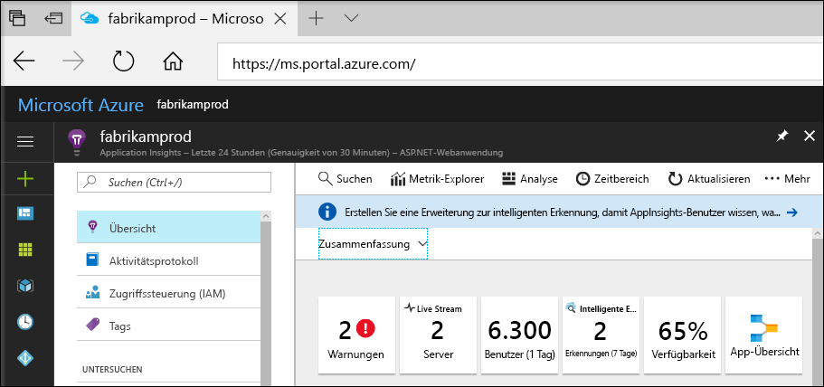
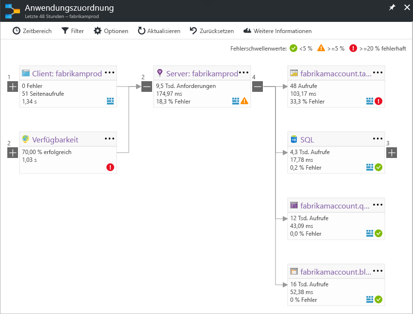
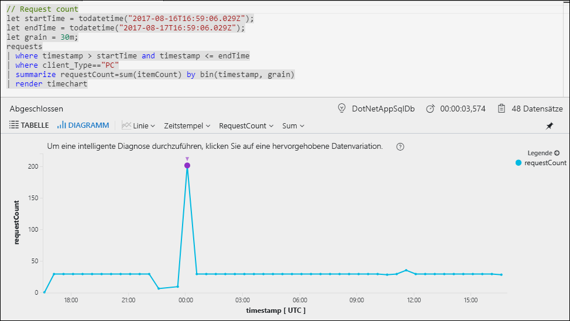
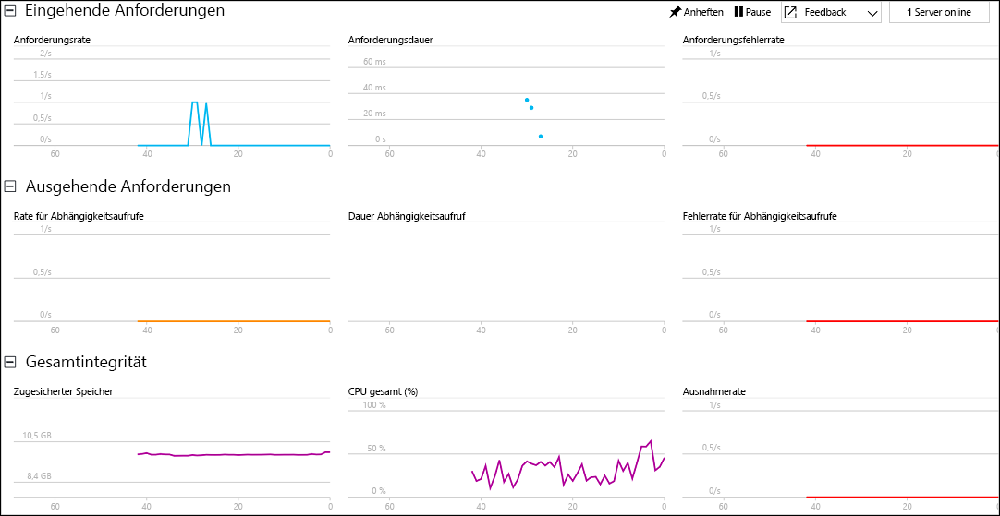

# Starten der Überwachung Ihrer ASP.NET-Webanwendung

Mit Azure Application Insights können Sie die Verfügbarkeit, Leistung und Nutzung Ihrer Webanwendung ganz einfach überwachen.  Sie können auch Fehler in Ihrer Anwendung schnell erkennen und diagnostizieren, ohne darauf warten zu müssen, dass diese Fehler von Benutzern gemeldet werden.  Mit den Informationen, die Sie in Application Insights über die Leistung und Effizienz Ihrer App sammeln, können Sie fundierte Entscheidungen zur Wartung und Verbesserung der Anwendung treffen.

Diese Schnellstartanleitung zeigt, wie Sie Application Insights zu einer vorhandenen ASP.NET-Webanwendung hinzufügen und mit der Analyse von Livestatistiken beginnen, einer der vielen Methoden, mit denen Sie Ihre Anwendung analysieren können. Wenn Sie noch nicht über eine ASP.NET-Webanwendung verfügen, können Sie mithilfe der Schnellstartanleitung unter [Erstellen einer ASP.NET-Web-App](../app-service/app-service-web-get-started-dotnet.md) eine erstellen.

## Voraussetzungen
So führen Sie diesen Schnellstart durch:

- Installieren Sie [Visual Studio 2017](https://www.visualstudio.com/downloads/) mit den folgenden Workloads:
    - ASP.NET und Webentwicklung
    - Azure-Entwicklung

Wenn Sie kein Azure-Abonnement besitzen, können Sie ein [kostenloses Konto](https://azure.microsoft.com/free/) erstellen, bevor Sie beginnen.

## Aktivieren von Application Insights

1. Öffnen Sie Ihr Projekt in Visual Studio 2017.
2. Wählen Sie aus dem Menü „Projekt“ die Option **Application Insights konfigurieren**. Visual Studio fügt Ihrer Anwendung das Application Insights SDK hinzu.
3. Klicken Sie auf **Kostenlos starten**, wählen Sie Ihren bevorzugten Abrechnungsplan, und klicken Sie auf **Registrieren**.

    

4. Führen Sie Ihre Anwendung aus, indem Sie entweder aus dem Menü **Debuggen** die Option **Debuggen starten** auswählen oder die Taste F5 drücken.

## Bestätigen der App-Konfiguration

Application Insights sammelt Telemetriedaten für Anwendung, unabhängig davon, ob sie ausgeführt wird oder nicht. Geben Sie folgendermaßen vor, um diese Daten anzuzeigen.

1. Öffnen Sie Application Insights, indem Sie auf **Projekt** -> **Application Insights** -> **Nach Telemetriedaten der Debugsitzung suchen** klicken.  Sie sehen die Telemetriedaten Ihrer aktuellen Sitzung.  

2. Klicken Sie auf die erste Anforderung in der List (in diesem Beispiel „GET Home/Index“), um die Anforderungsdetails anzuzeigen. Beachten Sie, dass sowohl Statuscode als auch Antwortzeit sowie weitere wertvolle Informationen zur Anforderung angezeigt werden.  

## Starten der Überwachung im Azure-Portal

Sie können jetzt Application Insights im Azure-Portal öffnen, um verschiedene Details zu Ihrer ausgeführten Anwendung anzuzeigen.

1. Klicken Sie mit der rechten Maustaste auf den Ordner **Verbundene Dienste – Application Insights** im Projektmappen-Explorer, und klicken Sie auf **Application Insights-Portal öffnen**.  Sie sehen einige Informationen zu Ihrer Anwendung sowie verschiedene Optionen.

    

2. Klicken Sie auf **App-Zuordnung**, um ein visuelles Layout der Abhängigkeitsbeziehungen zwischen den Komponenten Ihrer Anwendung zu erhalten.  Jede Komponente zeigt KPIs wie z.B. Last, Leistung, Fehler und Warnungen an.

    

3. Klicken Sie auf das **App-Analyse**-Symbol  bei einer der Anwendungskomponenten.  Dadurch wird die **Application Insights-Analyse** geöffnet, die eine erweiterte Abfragesprache zum Analysieren aller Daten bereitstellt, die von Application Insights gesammelt werden.  In diesem Fall wird eine Abfrage für Sie generiert, die die Anzahl von Anforderungen als Diagramm darstellt.  Sie können selbst Abfragen zum Analysieren anderer Daten schreiben.

    

4. Kehren Sie zur Seite **Übersicht** zurück, und klicken Sie auf **Live Stream**.  Damit werden Livestatistiken über Ihre Anwendung während der Ausführung angezeigt.  Hierzu gehören Informationen wie die Anzahl von eingehenden Anforderungen, die Dauer dieser Anforderungen sowie jegliche auftretenden Fehler.  Sie können auch kritische Leistungsmetriken wie Prozessor und Arbeitsspeicher untersuchen.

    

Wenn Sie bereit sind, Ihre Anwendung in Azure zu hosten, können Sie sie jetzt veröffentlichen. Führen Sie die in der Schnellstartanleitung [Erstellen einer ASP.NET-Web-App](../app-service/app-service-web-get-started-dotnet.md#update-the-app-and-redeploy) beschriebenen Schritte aus.

## Nächste Schritte
In dieser Schnellstartanleitung haben Sie Ihre Anwendung für die Überwachung durch Azure Application Insights aktiviert.  Fahren Sie mit den Tutorials fort, um zu lernen, wie Sie Statistiken überwachen und Fehler in Ihrer Anwendung erkennen.

> [!div class="nextstepaction"]
> [Azure Application Insights-Tutorials](app-insights-tutorial-runtime-exceptions.md)