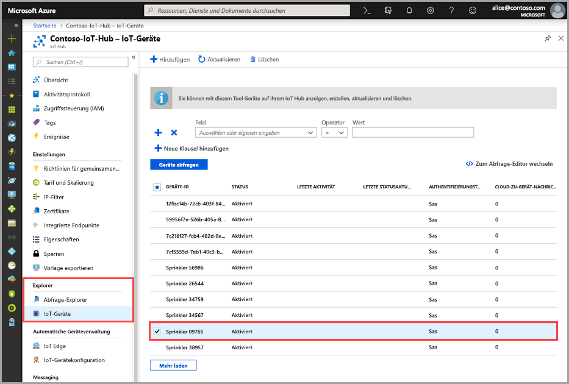
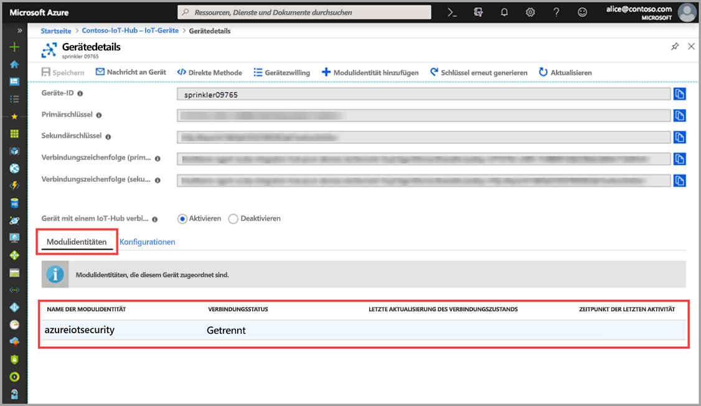

# Schnellstart: Erstellen eines Azure IoT-Sicherheitsmodulzwillings

> [!IMPORTANT]
> Azure Security Center für IoT befindet sich derzeit in der öffentlichen Vorschauphase. Diese Vorschauversion wird ohne Vereinbarung zum Servicelevel bereitgestellt und ist nicht für Produktionsworkloads vorgesehen. Manche Features werden möglicherweise nicht unterstützt oder sind nur eingeschränkt verwendbar. Weitere Informationen finden Sie unter [Zusätzliche Nutzungsbestimmungen für Microsoft Azure-Vorschauen](https://azure.microsoft.com/support/legal/preview-supplemental-terms/).

In dieser Schnellstartanleitung wird beschrieben, wie Sie individuelle _azureiotsecurity_-Modulzwillinge für neue Geräte oder im Batchmodus Modulzwillinge für alle Geräte eines IoT-Hubs erstellen.  

## Grundlegendes zu azureiotsecurity-Modulzwillingen 

Für in Azure erstellte IoT-Lösungen spielen Gerätezwillinge eine wichtige Rolle – sowohl bei der Geräteverwaltung als auch bei der Prozessautomatisierung. 

Azure Security Center (ASC) für IoT ermöglicht die vollständige Integration in Ihre vorhandene Plattform für die IoT-Geräteverwaltung. Auf diese Weise können Sie Ihren Gerätesicherheitsstatus verwalten und die vorhandenen Funktionen für die Gerätesteuerung nutzen.
Die ASC für IoT-Integration wird erreicht, indem der Mechanismus für IoT Hub-Zwillinge verwendet wird.  

Weitere Informationen zum allgemeinen Konzept in Bezug auf Modulzwillinge in Azure IoT Hub finden Sie unter [Verstehen und Verwenden von Modulzwillingen in IoT Hub](https://docs.microsoft.com/azure/iot-hub/iot-hub-devguide-module-twins). 
 
Unter ASC für IoT wird der Mechanismus für Modulzwillinge genutzt und für jedes Gerät ein Sicherheitsmodulzwilling mit dem Namen _azureiotsecurity_ eingesetzt.
Der Sicherheitsmodulzwilling enthält alle Informationen, die für die Gerätesicherheit Ihrer einzelnen Geräte jeweils relevant sind. 
 
Zur vollständigen Nutzung von ASC für IoT-Features müssen Sie diese Sicherheitsmodulzwillinge für jedes Gerät des Diensts erstellen, konfigurieren und verwenden.  

## Erstellen eines azureiotsecurity-Modulzwillings 

_azureiotsecurity_-Modulzwillinge können auf zwei Arten erstellt werden:
1. [Modulbatchskript](https://aka.ms/iot-security-github-create-module): Erstellt automatisch einen Modulzwilling für neue Geräte bzw. Geräte ohne Modulzwilling, indem die Standardkonfiguration verwendet wird.
2. Jeder Modulzwilling wird manuell individuell bearbeitet, und auf jedes Gerät werden spezifische Konfigurationen angewendet.

>[!NOTE] 
> Beim Verwenden der Batchmethode werden vorhandene azureiotsecurity-Modulzwillinge nicht überschrieben. Wenn NUR die Batchmethode verwendet wird, werden neue Modulzwillinge für Geräte erstellt, die nicht bereits über einen Sicherheitsmodulzwilling verfügen. 

Informationen zum Modifizieren oder Ändern der Konfiguration eines vorhandenen Modulzwillings finden Sie unter [Agent-Konfiguration](how-to-agent-configuration.md). 

Verwenden Sie die folgende Anleitung, um für ein Gerät manuell einen neuen _azureiotsecurity_-Modulzwilling zu erstellen: 

1. Suchen Sie auf Ihrem IoT-Hub nach dem Gerät, für das Sie einen Sicherheitsmodulzwilling erstellen möchten, und wählen Sie es aus.
1. Klicken Sie auf Ihr Gerät und dann auf **Modulidentität hinzufügen**.
1. Geben Sie im Feld **Name der Modulidentität** den Namen **azureiotsecurity** ein.

1. Klicken Sie auf **Speichern**. 

## Überprüfen der Erstellung eines Modulzwillings

Überprüfen Sie wie folgt, ob für ein bestimmtes Gerät ein Sicherheitsmodulzwilling vorhanden ist:

1. Wählen Sie auf Ihrer Azure IoT Hub-Instanz im Menü **Explorer** die Option **IoT-Geräte**.    
1. Geben Sie die Geräte-ID ein, oder wählen Sie im Feld **Gerät abfragen** eine Option aus, und klicken Sie auf **Geräte abfragen**. 
    
1. Wählen Sie das Gerät aus, oder doppelklicken Sie darauf, um die Seite „Gerätedetails“ zu öffnen. 
1. Wählen Sie das Menü **Modulidentitäten** aus, und bestätigen Sie das Vorhandensein des Moduls **azureiotsecurity** in der Liste mit den Modulidentitäten, die dem Gerät zugeordnet sind. 
    

Weitere Informationen zum Anpassen der Eigenschaften von ASC für IoT-Modulzwillingen finden Sie unter [Agent-Konfiguration](how-to-agent-configuration.md).

## Nächste Schritte

Fahren Sie mit dem nächsten Artikel fort, um sich über das Konfigurieren von benutzerdefinierten Warnungen zu informieren.

> [!div class="nextstepaction"]
> [Konfigurieren von benutzerdefinierten Warnungen](quickstart-create-custom-alerts.md)
