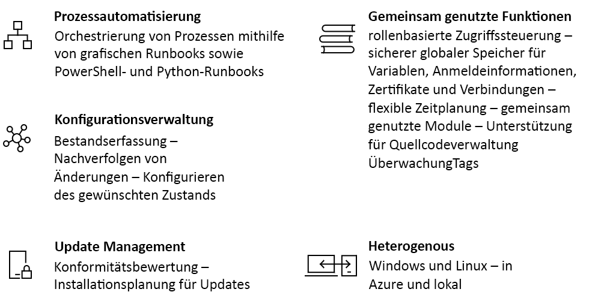

# Einführung in Azure Automation

Mit Azure Automation wird ein cloudbasierter Automatisierungs- und Konfigurationsdienst bereitgestellt, der eine einheitliche Verwaltung für Ihre Azure-Umgebungen und anderen Umgebungen ermöglicht. Er umfasst Features für die Prozessautomatisierung, Updateverwaltung und Konfiguration. Mit Azure Automation haben Sie in Bezug auf die Bereitstellung, Abläufe und Außerbetriebnahme von Workloads und Ressourcen die volle Kontrolle.
Dieser Artikel enthält eine kurze Übersicht über Azure Automation und Antworten auf einige häufig gestellte Fragen. Weitere Informationen zu den verschiedenen Funktionen finden Sie unter den Links, die in dieser Übersicht angegeben sind.

## Azure Automation-Funktionen

### Prozessautomatisierung

Mit Azure Automation können Sie häufig anfallende, zeitaufwändige und fehleranfällige Cloudverwaltungsaufgaben automatisieren. Dank dieser Automatisierung können Sie Ihre Zeit direkt in Arbeit investieren, die den Geschäftswert erhöht. Aufgrund der geringeren Fehlerquote und höheren Effizienz können Betriebskosten gesenkt werden. Sie können Azure-Dienste und andere öffentliche Systeme integrieren, die für die Bereitstellung, Konfiguration und Verwaltung Ihrer End-to-End-Prozesse erforderlich sind. Der Dienst ermöglicht das grafische [Erstellen von Runbooks](automation-runbook-types.md) per PowerShell oder Python. Mit einem Hybrid Runbook Worker können Sie die Verwaltung vereinheitlichen, indem Sie eine übergreifende Orchestrierung für die lokalen Umgebungen durchführen. [Webhooks](automation-webhooks.md) stellen eine Möglichkeit dar, um Anforderungen zu erfüllen und den kontinuierlichen Ablauf von Bereitstellungen und Vorgängen sicherzustellen, indem die Automatisierung über ITSM, DevOps und Überwachungssysteme ausgelöst wird.

### Konfigurationsverwaltung

Azure Automation [Desired State Configuration](automation-dsc-overview.md) ist eine cloudbasierte PowerShell DSC-Lösung, mit der für Unternehmensumgebungen erforderliche Dienste bereitgestellt werden. Verwalten Sie Ihre DSC-Ressourcen in Azure Automation, und wenden Sie Konfigurationen auf virtuelle oder physische Computer über einen DSC-Pullserver in der Azure-Cloud an. Es werden umfassende Berichte bereitgestellt, mit denen Sie über wichtige Ereignisse informiert werden, z.B. wenn Knoten von ihrer zugewiesenen Konfiguration abweichen. Sie können die Computerkonfiguration überwachen und automatisch aktualisieren. Dies gilt sowohl für physische als auch für virtuelle Computer unter Windows oder Linux, die sich in der Cloud oder in lokalen Rechenzentren befinden können.

Es ist auch möglich, den Bestand von Ressourcen auf Gastsystemen abzurufen, um sich über die installierten Anwendungen und andere Konfigurationselemente zu informieren. Sie können die umfassenden Berichterstellungs- und Suchfunktionen nutzen, um schnell ausführliche Informationen dazu zu ermitteln, welche Konfiguration für das Betriebssystem vorliegt. Sie können Änderungen für Dienste, Daemons, Software, die Registrierung und Dateien nachverfolgen, um schnell zu identifizieren, welche Vorgänge ggf. zu Problemen führen. Außerdem können Sie mit DSC Diagnosen erstellen und Warnungen erhalten, wenn es in Ihrer Umgebung zu unerwünschten Änderungen kommt.

### Updateverwaltung

Aktualisieren Sie Windows- und Linux-Systeme mit Azure Automation übergreifend für Hybridumgebungen. So erhalten Sie einen Einblick in die Konformität von Updates für Azure, die lokale Umgebung und andere Clouds. Sie können Zeitplanbereitstellungen erstellen, um die Installation von Updates in einem definierten Wartungsfenster zu orchestrieren. Falls ein Update auf einem Computer nicht installiert werden soll, können Sie es aus der Bereitstellung ausschließen.

### Gemeinsam genutzte Funktionen

Azure Automation besteht aus einem Satz von gemeinsam genutzten Ressourcen, die Ihnen das bedarfsabhängige Automatisieren und Konfigurieren Ihrer Umgebungen erleichtern.

* **[Rollenbasierte Zugriffssteuerung](automation-role-based-access-control.md)**: Der Zugriff auf das Konto wird mit der Rolle „Operator für Automation“ gesteuert. Mit dieser Rolle können Aufgaben durchgeführt werden, ohne dass Berechtigungen für Erstellungsfunktionen gewährt werden müssen.
* **[Variablen](automation-variables.md)**: Variablen können Inhalt enthalten, der dann für alle Runbooks und Konfigurationen verwendet werden kann. Sie können Werte ändern, ohne dass Sie die Runbooks oder Konfigurationen modifizieren müssen, die darauf verweisen.
* **[Anmeldeinformationen](automation-credentials.md)**: Ermöglichen das sichere Speichern von vertraulichen Informationen, die zur Laufzeit von Runbooks und Konfigurationen verwendet werden können.
* **[Zertifikate](automation-certificates.md)**: Sie können Zertifikate zur Laufzeit speichern und verfügbar machen, damit sie für die Authentifizierung und zum Schützen von bereitgestellten Ressourcen verwendet werden können.
* **[Verbindungen](automation-connections.md)**: Dienen zum Speichern eines Name-Wert-Paars mit allgemeinen Informationen für die Verbindungsherstellung mit Systemen in Verbindungsressourcen. Verbindungen werden vom Autor eines Moduls für die Nutzung in Runbooks und Konfigurationen zur Laufzeit definiert.
* **[Zeitpläne](automation-schedules.md)**: Werden im Dienst verwendet, um die Automatisierung zu vordefinierten Zeiten auszulösen.
* **[Integration in Quellcodeverwaltung](automation-source-control-integration.md)**: Ermöglicht die Konfiguration in Form von Code, sodass Runbooks oder Konfigurationen in ein Quellcodeverwaltungssystem eingecheckt werden können.
* **[PowerShell-Module](automation-integration-modules.md)**: Module werden zum Verwalten von Azure und anderen Systemen verwendet. Importieren Sie sie in das Automation-Konto für Microsoft, Drittanbieter-, Community- oder benutzerdefinierte Cmdlets und DSC-Ressourcen.

### Windows und Linux

Azure Automation ist für die Nutzung in Ihrer gesamten Hybridcloudumgebung und unter Windows und Linux ausgelegt. Sie können bereitgestellte Workloads und das Betriebssystem, auf dem diese ausgeführt werden, auf einheitliche Weise automatisieren und konfigurieren.

### Communitykatalog

Suchen Sie im [Automation-Katalog](automation-runbook-gallery.md) nach Runbooks und Modulen, um schnell mit dem Integrieren und Erstellen Ihrer Prozesse aus dem PowerShell-Katalog und Microsoft Script Center beginnen zu können.

## Häufige Automation-Szenarien

Mit Azure Automation wird der Lebenszyklus Ihrer Infrastruktur und Anwendungen verwaltet. Übertragen Sie das Wissen, wie die Organisation Workloads bereitstellt und wartet, in das System. Führen Sie die Erstellung in gängigen Sprachen durch, z.B. mithilfe von PowerShell, Desired State Configuration, Python und grafischen Runbooks. Verschaffen Sie sich einen Überblick über den gesamten Bestand an bereitgestellten Ressourcen für die Bereiche Zielgruppenadressierung, Berichterstellung und Konformität. Identifizieren Sie Änderungen, die zu Fehlkonfigurationen führen können, und verbessern Sie die betriebsbezogene Konformität.

* **Ressourcen erstellen/bereitstellen**: Stellen Sie VMs in einer Hybridumgebung bereit, indem Sie Runbooks und Azure Resource Manager-Vorlagen verwenden. Führen Sie die Integration in Entwicklungstools wie Jenkins und Visual Studio Team Services durch.
* **VMs konfigurieren**: Bewerten und konfigurieren Sie Windows- und Linux-Computer mit der gewünschten Konfiguration für die Infrastruktur und Anwendung.
* **Überwachen**: Identifizieren Sie Änderungen auf Computern, die Probleme verursachen, und beheben Sie diese, oder nutzen Sie die Eskalation an Verwaltungssysteme.
* **Schützen**: Aktivieren Sie für eine VM den Quarantänezustand, wenn eine Sicherheitswarnung ausgelöst wird. Legen Sie Anforderungen auf Gastsystemen fest.
* **Steuern**: Richten Sie die rollenbasierte Zugriffssteuerung für Teams ein. Stellen Sie ungenutzte Ressourcen wieder her.

## Preise für Automation

Sie können sich über die Preise für Azure Automation auf der entsprechenden Seite mit den [Preisen](https://azure.microsoft.com/pricing/details/automation/) informieren.

## Nächste Schritte

> [!div class="nextstepaction"]
> [Erstellen eines Automation-Kontos](automation-quickstart-create-account.md)
