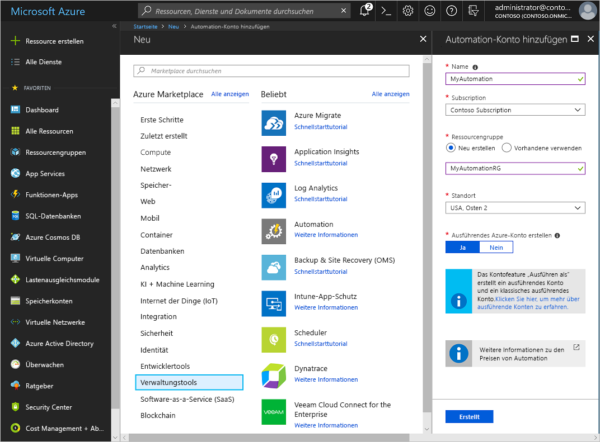
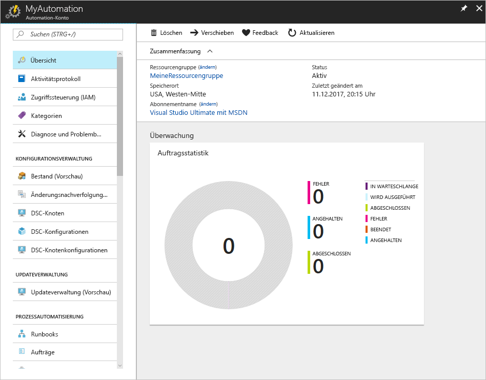
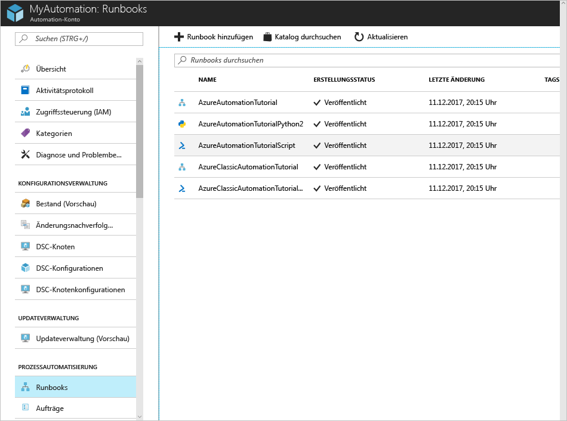
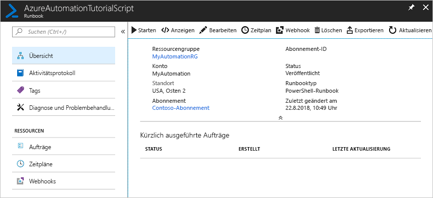

# Erstellen eines Azure Automation-Kontos

Azure Automation-Konten können über Azure erstellt werden. Diese Methode bietet eine browserbasierte Benutzeroberfläche zum Erstellen und Konfigurieren von Automation-Konten und den dazugehörigen Ressourcen. In dieser Schnellstartanleitung werden die Erstellung eines Automation-Kontos und die Ausführung eines Runbooks im Konto Schritt für Schritt beschrieben.

Wenn Sie über kein Azure-Abonnement verfügen, können Sie ein [kostenloses Azure-Konto](https://azure.microsoft.com/free/?WT.mc_id=A261C142F) erstellen, bevor Sie beginnen.

## Anmelden bei Azure

Melden Sie sich unter https://portal.azure.com bei Azure an.

## Erstellen eines Automation-Kontos

1. Klicken Sie in der linken oberen Ecke von Azure auf die Schaltfläche **Ressource erstellen**.

1. Wählen Sie **Verwaltungsprogramme** und dann **Automation**.

1. Geben Sie die Kontoinformationen ein. Wählen Sie für **Ausführendes Azure-Konto erstellen** die Option **Ja**, damit die Artefakte zum Vereinfachen der Authentifizierung für Azure automatisch aktiviert werden. Beachten Sie beim Erstellen eines Automation-Kontos unbedingt, dass der Name nach dem Auswählen nicht geändert werden kann. *Automation-Kontonamen sind für jede Region und Ressourcengruppe eindeutig. Namen für Automation-Konten, die gelöscht wurden, sind möglicherweise nicht sofort verfügbar.* Ein Automation-Konto kann Ressourcen in allen Regionen und Abonnements für einen bestimmten Mandanten verwalten. Klicken Sie nach Abschluss des Vorgangs auf **Erstellen**, um die Bereitstellung des Automation-Kontos zu starten.

      

    > [!NOTE]
    > Eine aktualisierte Liste mit Standorten, an denen Sie ein Automation-Konto bereitstellen können, finden Sie unter [Verfügbare Produkte nach Region](https://azure.microsoft.com/en-us/global-infrastructure/services/?products=automation&regions=all).

1. Klicken Sie nach Abschluss der Bereitstellung auf ** **Alle Dienste**, und wählen Sie **Automation-Konten** und anschließend das von Ihnen erstellte Automation-Konto.

    

## Ausführen eines Runbooks

Führen Sie ein Runbook des Tutorials aus.

1. Klicken Sie unter **PROZESSAUTOMATISIERUNG** auf **Runbooks**. Die Liste mit den Runbooks wird angezeigt. Standardmäßig sind mehrere Tutorial-Runbooks im Konto aktiviert.

    

1. Wählen Sie das Runbook **AzureAutomationTutorialScript** aus. Die Seite mit der Runbookübersicht wird geöffnet.

    

1. Klicken Sie auf **Starten** und auf der Seite **Runbook starten** dann auf **OK**, um das Runbook zu starten.

    

1. Nachdem sich der **Auftragsstatus** in **Wird ausgeführt** geändert hat, können Sie auf **Ausgabe** oder **Alle Protokolle** klicken, um die Ausgabe des Runbookauftrags anzuzeigen. Für dieses Tutorial-Runbook ist die Ausgabe eine Liste mit Ihren Azure-Ressourcen.

## Bereinigen von Ressourcen

Löschen Sie die Ressourcengruppe, das Automation-Konto und alle dazugehörigen Ressourcen, wenn Sie sie nicht mehr benötigen. Wählen Sie hierzu die Ressourcengruppe für das Automation-Konto aus, und klicken Sie auf **Löschen**.

## Nächste Schritte

In dieser Schnellstartanleitung haben Sie ein Automation-Konto bereitgestellt, einen Runbookauftrag gestartet und die Auftragsergebnisse angezeigt. Weitere Informationen zu Azure Automation finden Sie in der Schnellstartanleitung zum Erstellen Ihres ersten Runbooks.

> [!div class="nextstepaction"]
> [Automation-Schnellstart – Erstellen eines Runbooks](./automation-quickstart-create-runbook.md)
