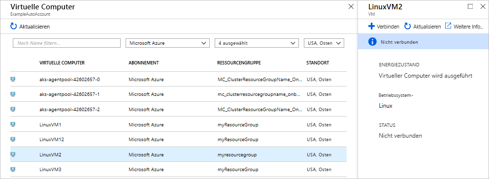
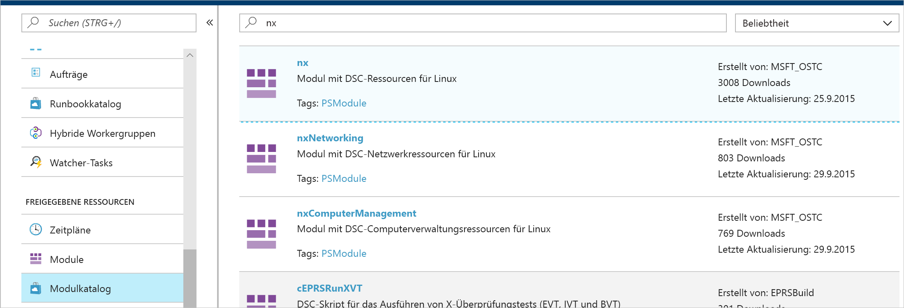
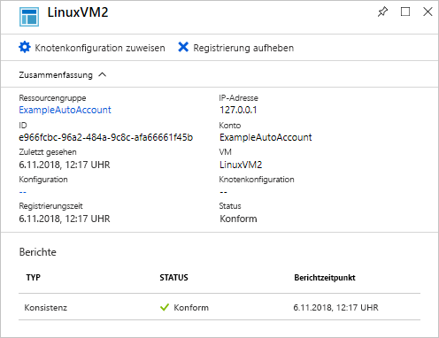
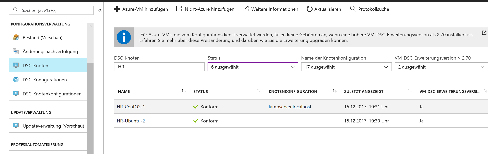

# <a name="configure-a-linux-virtual-machine-with-desired-state-configuration"></a>Konfigurieren eines virtuellen Linux-Computers per Desired State Configuration

Indem Sie die Desired State Configuration (DSC) aktivieren, können Sie die Konfigurationen Ihrer Windows- und Linux-Server verwalten und überwachen. Konfigurationen, die von der gewünschten Konfiguration abweichen, können identifiziert oder automatisch korrigiert werden. In dieser Schnellstartanleitung werden das Integrieren einer Linux-VM und das Bereitstellen eines LAMP-Stapels per DSC Schritt für Schritt beschrieben.

## <a name="prerequisites"></a>Voraussetzungen

Für die Durchführung dieses Schnellstarts benötigen Sie Folgendes:

* Ein Azure-Abonnement. Wenn Sie kein Azure-Abonnement besitzen, können Sie ein [kostenloses Konto erstellen](https://azure.microsoft.com/free/).
* Ein Azure Automation-Konto. Informationen zum Erstellen eines ausführenden Azure Automation-Kontos finden Sie unter [Azure Run As Account](automation-sec-configure-azure-runas-account.md)(Ausführendes Azure-Konto).
* Eine Azure Resource Manager-VM (nicht klassisch) mit Red Hat Enterprise Linux, CentOS oder Oracle Linux. Eine Anleitung zum Erstellen einer VM finden Sie unter [Erstellen Ihres ersten virtuellen Linux-Computers im Azure-Portal](../virtual-machines/linux/quick-create-portal.md).

## <a name="sign-in-to-azure"></a>Anmelden bei Azure
Melden Sie sich unter https://portal.azure.com bei Azure an.

## <a name="onboard-a-virtual-machine"></a>Integrieren eines virtuellen Computers
Es gibt viele verschiedene Methoden zum Integrieren eines Computers und Aktivieren der Desired State Configuration. In dieser Schnellstartanleitung wird die Integration über ein Automation-Konto behandelt. Weitere Informationen zu den unterschiedlichen Methoden zum Integrieren Ihrer Computer in die Desired State Configuration finden Sie im Artikel zur [Integration](https://docs.microsoft.com/azure/automation/automation-dsc-onboarding).

1. Wählen Sie links im Azure-Portal die Option **Automation-Konten**. Falls die Option im linken Bereich nicht sichtbar ist, können Sie auf **Alle Dienste** klicken und in den angezeigten Ergebnissen danach suchen.
1. Wählen Sie in der Liste ein Automation-Konto aus.
1. Wählen Sie im linken Bereich des Automation-Kontos die Option **Zustandskonfiguration (DSC)** aus.
2. Klicken Sie auf **Hinzufügen**, um die Seite zum Auswählen des virtuellen Computers zu öffnen.
3. Suchen Sie nach dem virtuellen Computer, für den Sie DSC aktivieren möchten. Sie können das Suchfeld verwenden und die Optionen filtern, um einen bestimmten virtuellen Computer zu ermitteln.
4. Klicken Sie auf den virtuellen Computer, und wählen Sie dann die Option **Verbinden**.
5. Wählen Sie die gewünschten DSC-Einstellungen für den virtuellen Computer aus. Wenn Sie bereits eine Konfiguration vorbereitet haben, können Sie sie unter *Name der Knotenkonfiguration* angeben. Sie können den [Konfigurationsmodus](https://docs.microsoft.com/powershell/dsc/metaconfig) festlegen, um das Konfigurationsverhalten für den Computer zu steuern.
6. Klicken Sie auf **OK**



Während die Desired State Configuration-Erweiterung für den virtuellen Computer bereitgestellt wird, wird *Connecting* (Verbindung wird hergestellt) angezeigt.

## <a name="import-modules"></a>Importieren von Modulen

Module enthalten DSC-Ressourcen. Sie finden viele Beispiele hierzu im [PowerShell-Katalog](https://www.powershellgallery.com). Alle Ressourcen, die in Ihren Konfigurationen verwendet werden, müssen vor dem Kompilieren in das Automation-Konto importiert werden. Für dieses Tutorial ist das Modul mit dem Namen **nx** erforderlich.

1. Wählen Sie im linken Bereich des Automation-Kontos die Option **Modulkatalog** (unter „Freigegebene Ressourcen“).
1. Suchen Sie nach dem Modul, das Sie importieren möchten, indem Sie einen Teil des Namens eingeben: *nx*.
1. Klicken Sie auf das Modul, das Sie importieren möchten.
1. Klicken Sie auf **Importieren**.



## <a name="import-the-configuration"></a>Importieren der Konfiguration

In dieser Schnellstartanleitung wird eine DSC-Konfiguration verwendet, mit der Apache HTTP Server, MySQL und PHP auf dem Computer konfiguriert werden.

Weitere Informationen zu DSC-Konfigurationen finden Sie unter [DSC-Konfigurationen](https://docs.microsoft.com/powershell/dsc/configurations).

Geben Sie in einem Texteditor Folgendes ein, und speichern Sie die Datei lokal als `LAMPServer.ps1`.

```powershell-interactive
configuration LAMPServer {
   Import-DSCResource -module "nx"

   Node localhost {

        $requiredPackages = @("httpd","mod_ssl","php","php-mysql","mariadb","mariadb-server")
        $enabledServices = @("httpd","mariadb")

        #Ensure packages are installed
        ForEach ($package in $requiredPackages){
            nxPackage $Package{
                Ensure = "Present"
                Name = $Package
                PackageManager = "yum"
            }
        }

        #Ensure daemons are enabled
        ForEach ($service in $enabledServices){
            nxService $service{
                Enabled = $true
                Name = $service
                Controller = "SystemD"
                State = "running"
            }
        }
   }
}
```

Gehen Sie wie folgt vor, um die Konfiguration zu importieren:

1. Wählen Sie im linken Bereich des Automation-Kontos die Option **Zustandskonfiguration (DSC)** aus, und klicken Sie anschließend auf die Registerkarte **Konfigurationen**.
2. Klicken Sie auf **+ Hinzufügen**.
3. Wählen Sie die *Konfigurationsdatei* aus, die Sie im vorherigen Schritt gespeichert haben.
4. Klicken Sie auf **OK**

## <a name="compile-a-configuration"></a>Kompilieren einer Konfiguration

DSC-Konfigurationen müssen in eine Kontenkonfiguration (MOF-Dokument) kompiliert werden, bevor sie einem Knoten zugewiesen werden. Bei der Kompilierung wird die Konfiguration überprüft, und es können Parameterwerte eingegeben werden. Weitere Informationen zum Kompilieren einer Konfiguration finden Sie im folgenden Artikel: [Kompilieren von Konfigurationen in Azure Automation DSC](https://docs.microsoft.com/azure/automation/automation-dsc-compile).

Gehen Sie wie folgt vor, um die Konfiguration zu kompilieren:

1. Wählen Sie im linken Bereich des Automation-Kontos die Option **Zustandskonfiguration (DSC)** aus, und klicken Sie anschließend auf die Registerkarte **Konfigurationen**.
1. Wählen Sie die Konfiguration aus, die Sie in einem vorherigen Schritt importiert haben („LAMPServer“).
1. Klicken Sie in den Menüoptionen auf **Kompilieren** und dann auf **Ja**.
1. In der Ansicht „Konfiguration“ wird ein neuer *Kompilierungsauftrag* in die Warteschlange eingereiht. Nachdem der Auftrag erfolgreich abgeschlossen wurde, können Sie mit dem nächsten Schritt fortfahren. Falls Fehler vorhanden sind, können Sie auf den Kompilierungsauftrag klicken, um die Details anzuzeigen.

## <a name="assign-a-node-configuration"></a>Zuweisen einer Knotenkonfiguration

Eine kompilierte *Knotenkonfiguration* kann DSC-Knoten zugewiesen werden. Bei der Zuweisung wird die Konfiguration dem Computer zugewiesen und eine Überwachung (bzw. automatische Korrektur) durchgeführt, um zu ermitteln, ob sich Abweichungen von dieser Konfiguration ergeben.

1. Wählen Sie im linken Bereich des Automation-Kontos die Option „Zustandskonfiguration (DSC)“ aus, und klicken Sie anschließend auf die Registerkarte **Knoten**.
1. Wählen Sie den Knoten aus, dem Sie eine Konfiguration zuweisen möchten.
1. Klicken Sie auf **Knotenkonfiguration zuweisen**.
1. Wählen Sie die *Knotenkonfiguration* - **LAMPServer.localhost** für die Zuweisung aus, und klicken Sie auf **OK**.
1. Die kompilierte Konfiguration wird dem Knoten zugewiesen, und der Knotenstatus ändert sich in *Ausstehend*. Bei der nächsten planmäßigen Überprüfung ruft der Knoten die Konfiguration ab, wendet sie an und meldet ihren Status. Es kann bis zu 30 Minuten dauern, bis der Knoten die Konfiguration abgerufen hat. Dies richtet sich nach den Einstellungen des Knotens. Um eine sofortige Überprüfung zu erzwingen, können Sie den folgenden Befehl lokal auf dem virtuellen Linux-Computer ausführen: `sudo /opt/microsoft/dsc/Scripts/PerformRequiredConfigurationChecks.py`.



## <a name="viewing-node-status"></a>Anzeigen des Knotenstatus

Der Status aller verwalteten Knoten wird unter **Zustandskonfiguration (DSC)** sowie auf der Registerkarte **Knoten** im Automation-Konto angezeigt. Sie können die Anzeige nach Status, Knotenkonfiguration oder Name filtern.



## <a name="next-steps"></a>Nächste Schritte

In dieser Schnellstartanleitung haben Sie eine Linux-VM in DSC integriert, eine Konfiguration für einen LAMP-Stapel erstellt und diese auf der VM bereitgestellt. Fahren Sie mit dem folgenden Artikel fort, um zu erfahren, wie Sie Automation DSC für die Continuous Deployment-Aktivierung verwenden können:

> [!div class="nextstepaction"]
> [Fortlaufende Bereitstellung auf virtuellen Computern mit Automation DSC und Chocolatey](./automation-dsc-cd-chocolatey.md)

* Weitere Informationen zu PowerShell Desired State Configuration finden Sie unter [Windows PowerShell DSC – Übersicht](https://docs.microsoft.com/powershell/dsc/overview).
* Weitere Informationen zur Verwaltung von Automation DSC mit PowerShell finden Sie unter [Azure PowerShell](https://docs.microsoft.com/powershell/module/azurerm.automation/?view=azurermps-5.0.0).
* Informationen zum Weiterleiten von DSC-Berichten an Azure Monitor-Protokolle für Berichterstellungs- und Warnzwecke finden Sie unter [Weiterleiten von Azure Automation DSC-Berichtsdaten an Azure Monitor-Protokolle](https://docs.microsoft.com/azure/automation/automation-dsc-diagnostics). 

