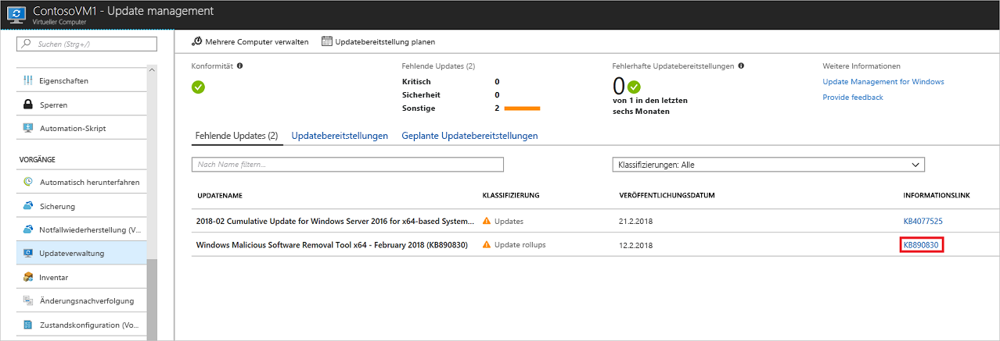
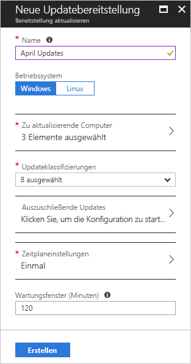

# Verwalten von Windows-Updates mithilfe von Azure Automation

Sie können die Updateverwaltungslösung verwenden, um Updates und Patches für Ihre virtuellen Computer zu verwalten. In diesem Tutorial wird beschrieben, wie Sie den Status der verfügbaren Updates schnell bewerten, die Installation der erforderlichen Updates planen, die Bereitstellungsergebnisse prüfen und eine Warnung erstellen, um sich zu vergewissern, dass die Updates erfolgreich angewendet werden.

Informationen zu den Preisen finden Sie unter [Automation – Preise](https://azure.microsoft.com/pricing/details/automation/) unter „Updateverwaltung“.

In diesem Tutorial lernen Sie Folgendes:

> [!div class="checklist"]
> * Integrieren eines virtuellen Computers für die Updateverwaltung
> * Anzeigen einer Updatebewertung
> * Konfigurieren von Warnungen
> * Planen einer Updatebereitstellung
> * Anzeigen der Ergebnisse einer Bereitstellung

## Voraussetzungen

Für dieses Tutorial benötigen Sie Folgendes:

* Ein Azure-Abonnement. Falls Sie noch kein Abonnement besitzen, können Sie [Ihre monatliche Azure-Gutschrift für Visual Studio-Abonnenten aktivieren](https://azure.microsoft.com/pricing/member-offers/msdn-benefits-details/) oder sich für ein [kostenloses Konto](https://azure.microsoft.com/free/?WT.mc_id=A261C142F) registrieren.
* Ein [Azure Automation-Konto](automation-offering-get-started.md) für die Watcher- und Aktionsrunbooks und den Watchertask
* Einen [virtuellen Computer](../virtual-machines/windows/quick-create-portal.md), der integriert werden soll.

## Anmelden bei Azure

Melden Sie sich unter https://portal.azure.com beim Azure-Portal an.

## Aktivieren der Updateverwaltung

Aktivieren Sie für dieses Tutorial zuerst die Updateverwaltung auf Ihrem virtuellen Computer:

1. Wählen Sie im Azure-Portal im Menü Bereich die Option **Virtuelle Computer**. Wählen Sie einen virtuellen Computer aus der Liste aus.
2. Wählen Sie auf der Seite der virtuellen Computer unter **VORGÄNGE** die Option **Updateverwaltung**. Der Bereich **Updateverwaltung aktivieren** wird geöffnet.

Eine Überprüfung wird ausgeführt, um festzustellen, ob die Updateverwaltung für diesen virtuellen Computer aktiviert ist. Dabei wird auf einen Azure Log Analytics-Arbeitsbereich und ein verknüpftes Automation-Konto geprüft und überprüft, ob die Lösung für die Updateverwaltung im Arbeitsbereich vorhanden ist.

Mit einem [Log Analytics](../log-analytics/log-analytics-overview.md?toc=%2fazure%2fautomation%2ftoc.json)-Arbeitsbereich werden Daten gesammelt, die von Features und Diensten wie der Updateverwaltung generiert werden. Der Arbeitsbereich ist ein zentraler Ort zum Überprüfen und Analysieren von Daten aus mehreren Quellen.

Bei der Überprüfung wird auch geprüft, ob der virtuelle Computer mit Microsoft Monitoring Agent (MMA) und Automation Hybrid Runbook Worker bereitgestellt wird. Dieser Agent wird verwendet, um mit Azure Automation zu kommunizieren und Informationen zum Updatestatus abzurufen. Für den Agent muss Port 443 geöffnet sein, um mit dem Azure Automation-Dienst zu kommunizieren und Updates herunterzuladen.

Wenn beim Onboarding festgestellt wird, dass eine der folgenden Voraussetzungen fehlt, wird sie automatisch hinzugefügt:

* [Log Analytics](../log-analytics/log-analytics-overview.md?toc=%2fazure%2fautomation%2ftoc.json)-Arbeitsbereich
* [Automation-Konto](./automation-offering-get-started.md)
* [Hybrid Runbook Worker](./automation-hybrid-runbook-worker.md) (auf dem virtuellen Computer aktiviert)

Legen Sie unter **Updateverwaltung** den Standort, den Log Analytics-Arbeitsbereich und das Automation-Konto fest, die verwendet werden sollen. Wählen Sie anschließend **Aktivieren** aus. Sind diese Optionen nicht verfügbar, bedeutet das, dass eine andere Automatisierungslösung für den virtuellen Computer aktiviert ist. In diesem Fall müssen der gleiche Arbeitsbereich und das gleiche Automation-Konto verwendet werden.

Das Aktivieren der Lösung kann einige Minuten dauern. Schließen Sie das Browserfenster während dieses Zeitraums nicht. Nachdem die Lösung aktiviert wurde, werden Informationen zu fehlenden Updates auf dem virtuellen Computer an Azure Monitor-Protokolle übermittelt. Es kann zwischen 30 Minuten und 6 Stunden dauern, bis die Daten für die Analyse verfügbar sind.

## Anzeigen der Updatebewertung

Sobald die Updateverwaltung aktiviert ist, wird der Bereich **Updateverwaltung** angezeigt. Falls Updates fehlen, wird auf der Registerkarte **Fehlende Updates** eine Liste mit den entsprechenden Updates angezeigt.

Klicken Sie unter **INFORMATIONSLINK** auf den Updatelink, um den Supportartikel für das Update in einem neuen Fenster zu öffnen. Dieses Fenster enthält wichtige Informationen zum Update.

Klicken Sie im Update auf eine andere Stelle, um den Bereich **Protokollsuche** für das ausgewählte Update zu öffnen. Die Abfrage für die Protokollsuche ist für das jeweilige Update vordefiniert. Sie können diese Abfrage ändern oder Ihre eigene Abfrage erstellen, um ausführliche Informationen zu den Updates anzuzeigen, die in Ihrer Umgebung bereitgestellt wurden bzw. fehlen.

## Konfigurieren von Warnungen

In diesem Schritt erfahren Sie, wie Sie eine Warnung einrichten, um über den Status einer Updatebereitstellung informiert zu werden.

### Warnungsbedingungen

Navigieren Sie in Ihrem Automation-Konto unter **Überwachung** zu **Warnungen**, und klicken Sie dann auf **+ Neue Warnungsregel**.

Ihr Automation-Konto ist bereits als Ressource ausgewählt. Falls Sie die Ressource ändern möchten, klicken Sie auf **Auswählen**, und wählen Sie dann auf der Seite **Ressource auswählen** in der Dropdownliste **Nach Ressourcentyp filtern** die Option **Automation-Konten** aus. Wählen Sie Ihr Automation-Konto aus, und klicken Sie auf **Fertig**.

Klicken Sie auf **Bedingung hinzufügen**, um das geeignete Signal für Ihre Updatebereitstellung auszuwählen. In der folgenden Tabelle sind die Details der zwei verfügbaren Signale für Updatebereitstellungen aufgeführt:

|Signalname|Dimensionen|BESCHREIBUNG|
|---|---|---|
|**Total Update Deployment Runs** (Updatebereitstellungsausführungen gesamt)|- Name der Updatebereitstellung - Status|Dieses Signal wird für Warnungen zum allgemeinen Status einer Updatebereitstellung verwendet.|
|**Total Update Deployment Machine Runs** (Updatebereitstellungsausführungen auf dem Computer gesamt)|- Name der Updatebereitstellung - Status - Zielcomputer - ID der Updatebereitstellungsausführung|Dieses Signal wird für Warnungen zum Status einer Updatebereitstellung auf bestimmten Computern verwendet.|

Wählen Sie einen gültigen Wert für die Dimensionswerte in der Liste aus. Wenn der gesuchte Wert nicht in der Liste enthalten ist, klicken Sie auf das Plussymbol (**\+**) neben der Dimension, und geben Sie den benutzerdefinierten Namen ein. Anschließend können Sie den Wert auswählen, nach dem Sie suchen möchten. Wenn Sie alle Werte einer Dimension auswählen möchten, klicken Sie auf die Schaltfläche **Auswählen\***. Wenn Sie keinen Wert für eine Dimension auswählen, wird diese Dimension während der Auswertung ignoriert.

Geben Sie unter **Warnungslogik** für **Schwellenwert** den Wert **1** ein. Klicken Sie auf **Fertig**, wenn Sie fertig sind.

### Warnungsdetails

Wählen Sie unter **2. Warnungsdetails definieren** einen Namen und eine Beschreibung für die Warnung ein. Legen Sie **Schweregrad** für eine erfolgreiche Ausführung auf **Information (Schweregrad 2)** bzw. für eine Ausführung mit Fehler auf **Information (Schweregrad 1)** fest.

Wählen Sie unter **Aktionsgruppen** die Option **Neu erstellen** aus. Eine Aktionsgruppe ist eine Gruppe mit Aktionen, die Sie übergreifend für mehrere Warnungen verwenden können. Dies können beispielsweise E-Mail-Benachrichtigungen, Runbooks, Webhooks und vieles mehr sein. Weitere Informationen zu Aktionsgruppen finden Sie unter [Erstellen und Verwalten von Aktionsgruppen im Azure-Portal](../azure-monitor/platform/action-groups.md).

Geben Sie im Feld **Name der Aktionsgruppe** einen Namen für die Warnung und darunter einen Kurznamen ein. Der Kurzname wird anstelle eines vollständigen Aktionsgruppennamens verwendet, wenn Benachrichtigungen mithilfe dieser Gruppe gesendet werden.

Geben Sie unter **Aktionen** einen Namen für die Aktion ein, beispielsweise **E-Mail-Benachrichtigungen**. Wählen Sie unter **AKTIONSTYP** die Option **E-Mail/SMS/Push/Sprachanruf** aus. Wählen Sie unter **DETAILS** die Option **Details bearbeiten**.

Geben Sie auf der Seite **E-Mail/SMS/Push/Sprachanruf** einen Namen ein. Aktivieren Sie das Kontrollkästchen **E-Mail**, und geben Sie eine gültige E-Mail-Adresse ein.

Klicken Sie im Bereich **E-Mail/SMS/Push/Sprachanruf** auf **OK**. Klicken Sie im Bereich **Aktionsgruppe hinzufügen** auf **OK**.

Wenn Sie den Betreff der Warnungs-E-Mail anpassen möchten, klicken Sie unter **Regel erstellen** und **Aktionen anpassen** auf **E-Mail-Betreff**. Klicken Sie abschließend auf **Warnungsregel erstellen**. Die Warnung informiert Sie, wenn die Bereitstellung eines Updates erfolgreich war. Außerdem wird angegeben, welche Computer Teil der durchgeführten Updatebereitstellung waren.

## Planen einer Updatebereitstellung

Planen Sie als Nächstes eine Bereitstellung, die Ihrem Releasezeitplan und Wartungsfenster entspricht, um Updates zu installieren. Sie können auswählen, welche Updatetypen in die Bereitstellung eingeschlossen werden sollen. Beispielsweise können Sie kritische oder Sicherheitsupdates einschließen und Updaterollups ausschließen.

Um eine neue Updatebereitstellung für den virtuellen Computer zu planen, klicken Sie auf **Updateverwaltung** und dann auf **Updatebereitstellung planen**.

Geben Sie unter **Neue Updatebereitstellung** die folgenden Informationen ein:

* **Name**: Geben Sie einen eindeutigen Namen für die Updatebereitstellung ein.

* **Betriebssystem**: Wählen Sie das Betriebssystem aus, für das die Updatebereitstellung ausgeführt werden soll.

* **Zu aktualisierende Gruppen (Vorschau)**: Definieren Sie eine Abfrage basierend auf einer Kombination aus Abonnement, Ressourcengruppen, Standorten und Tags, um eine dynamische Gruppe von Azure-VMs zu erstellen, die in Ihre Bereitstellung eingeschlossen werden sollen. Weitere Informationen finden Sie unter [Dynamische Gruppen](automation-update-management.md#using-dynamic-groups).

* **Zu aktualisierende Computer**: Wählen Sie eine gespeicherte Suche oder eine importierte Gruppe aus, oder wählen Sie im Dropdownmenü „Computer“ und dann einzelne Computer aus. Bei Auswahl von **Computer** wird die Bereitschaft des Computers in der Spalte **BEREITSCHAFT DES UPDATE-AGENTS** angezeigt. Weitere Informationen zu den verschiedenen Methoden zum Erstellen von Computergruppen in Azure Monitor-Protokollen finden Sie unter [Computergruppen in Azure Monitor-Protokollen](../azure-monitor/platform/computer-groups.md).

* **Updateklassifizierung**: Wählen Sie die Softwaretypen aus, die in die Updatebereitstellung eingeschlossen werden sollen. Lassen Sie für dieses Tutorial alle Typen ausgewählt.

  Es gibt die folgenden Klassifizierungstypen:

   |Betriebssystem  |Type  |
   |---------|---------|
   |Windows     | Kritische Updates Sicherheitsupdates Updaterollups Feature Packs Service Packs Definitionsupdates Tools Aktualisierungen        |
   |Linux     | Kritische Updates und Sicherheitsupdates Andere Updates       |

   Eine Beschreibung der Klassifizierungstypen finden Sie unter [Updateklassifizierungen](automation-update-management.md#update-classifications).

* **Einzuschließende/auszuschließende Updates**: Öffnet die Seite **Einschließen/ausschließen**. Updates, die eingeschlossen oder ausgeschlossen werden sollen, befinden sich auf verschiedenen Registerkarten. Weitere Informationen zur Vorgehensweise beim Einschließen finden Sie unter [Verhalten beim Einschließen](automation-update-management.md#inclusion-behavior).

* **Zeitplaneinstellungen**: Der Bereich **Zeitplaneinstellungen** wird geöffnet. Der Standard-Startzeitpunkt liegt 30 Minuten nach der aktuellen Uhrzeit. Als Startzeit können Sie einen beliebigen Wert festlegen, er muss jedoch mindestens 10 Minuten in der Zukunft liegen.

   Sie können auch angeben, ob die Bereitstellung einmalig erfolgt, oder einen sich wiederholenden Zeitplan einrichten. Wählen Sie unter **Wiederholung** die Option **Einmal**. Übernehmen Sie den Standardwert „1 Tag“, und wählen Sie **OK**. Ein Zeitplan für Wiederholung wird eingerichtet.

* **Vor und nach dem Vorgang auszuführende Skripts**: Wählen Sie die Skripts aus, die vor und nach Ihrer Bereitstellung ausgeführt werden sollen. Weitere Informationen finden Sie unter [Verwalten von Pre- und Post-Skripts](pre-post-scripts.md).
* **Wartungsfenster (Minuten)**: Behalten Sie den Standardwert bei. Sie können das Zeitfenster angeben, in dem die Updatebereitstellung stattfinden soll. Mit dieser Einstellung können Sie sicherstellen, dass Änderungen in den von Ihnen festgelegten Wartungsfenstern ausgeführt werden.

* **Neustartoptionen**: Mit dieser Einstellung wird festgelegt, wie Neustarts behandelt werden sollen. Die verfügbaren Optionen lauten wie folgt:
  * Neu starten bei Bedarf (Standard)
  * Immer neu starten
  * Nie neu starten
  * Nur neu starten – Updates werden nicht installiert

Klicken Sie auf **Erstellen**, wenn die Konfiguration des Zeitplans abgeschlossen ist.

Das Statusdashboard wird wieder angezeigt. Wählen Sie **Geplante Updatebereitstellungen**, um den Bereitstellungszeitplan anzuzeigen.

> [!NOTE]
> Die Updateverwaltung unterstützt die Bereitstellung von Erstanbieterupdates sowie Vorabdownloads von Patches. Hierzu sind Änderungen an den Systemen erforderlich, die gepatcht werden. Informationen zum Konfigurieren der entsprechenden Einstellungen für Ihre Systeme finden Sie im [Abschnitt zu Erstanbieterpatches und Vorabdownloads](automation-update-management.md#firstparty-predownload).

## Anzeigen der Ergebnisse einer Updatebereitstellung

Nach dem Start der geplanten Bereitstellung sehen Sie den Status der Bereitstellung auf der Registerkarte **Updatebereitstellungen** unter **Updateverwaltung**. Der Status lautet **In Bearbeitung**, wenn die Bereitstellung derzeit ausgeführt wird. Wenn die Bereitstellung erfolgreich abgeschlossen wird, ändert sich der Status in **Erfolgreich**. Wenn bei einem oder mehreren Updates in der Bereitstellung Fehler auftreten, wird der Status **Der Vorgang ist teilweise fehlgeschlagen** angezeigt.

Klicken Sie auf die abgeschlossene Updatebereitstellung, um das Dashboard für diese Updatebereitstellung anzuzeigen.

Unter **Updateergebnisse** werden eine Zusammenfassung der Gesamtzahl von Updates und der Ergebnisse der Bereitstellung auf dem virtuellen Computer angegeben. Die Tabelle rechts enthält eine detaillierte Aufschlüsselung der einzelnen Updates und die Installationsergebnisse.

In der folgenden Liste sind die verfügbaren Werte aufgeführt:

* **Kein Versuch erfolgt**: Das Update wurde nicht installiert, da aufgrund des definierten Wartungsfensters nicht genügend Zeit zur Verfügung stand.
* **Erfolgreich**: Das Update war erfolgreich.
* **Fehler**: Beim Update ist ein Fehler aufgetreten.

Klicken Sie auf **Alle Protokolle**, um alle von der Bereitstellung erstellten Protokolleinträge anzuzeigen.

Klicken Sie auf **Ausgabe**, um den Auftragsdatenstrom des Runbooks anzuzeigen, das für die Verwaltung der Updatebereitstellung auf dem virtuellen Zielcomputer verantwortlich ist.

Klicken Sie auf **Fehler**, um ausführliche Informationen zu Fehlern bei der Bereitstellung anzuzeigen.

Nachdem die Updatebereitstellung erfolgreich abgeschlossen wurde, wird eine E-Mail (in etwa wie im folgenden Beispiel) gesendet, um den Erfolg der Bereitstellung anzugeben:

## Nächste Schritte

In diesem Tutorial haben Sie Folgendes gelernt:

> [!div class="checklist"]
> * Integrieren eines virtuellen Computers für die Updateverwaltung
> * Anzeigen einer Updatebewertung
> * Konfigurieren von Warnungen
> * Planen einer Updatebereitstellung
> * Anzeigen der Ergebnisse einer Bereitstellung

Fahren Sie mit der Übersicht über die Lösung für die Updateverwaltung fort.

> [!div class="nextstepaction"]
> [Lösung für die Updateverwaltung](../operations-management-suite/oms-solution-update-management.md?toc=%2fazure%2fautomation%2ftoc.json)

