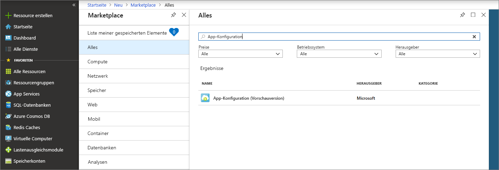
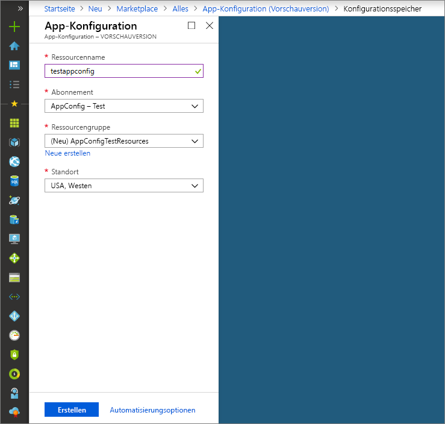

# <a name="quickstart-create-a-java-spring-app-with-app-configuration"></a>Schnellstart: Erstellen einer Java Spring-App mit App Configuration

Azure App Configuration ist ein verwalteter Konfigurationsdienst in Azure. Mit diesem Dienst können Sie Ihre gesamten Anwendungseinstellungen komfortabel an einem zentralen Ort speichern und verwalten, der von Ihrem Code getrennt ist. In dieser Schnellstartanleitung wird veranschaulicht, wie Sie den Dienst in eine Java Spring-App einbinden.

Für die Ausführung der Schritte in diesem Schnellstart können Sie einen beliebigen Code-Editor verwenden. [Visual Studio Code](https://code.visualstudio.com/) ist eine hervorragende Option, die auf Windows-, macOS- und Linux-Plattformen verfügbar ist.

## <a name="prerequisites"></a>Voraussetzungen

Installieren Sie für diesen Schnellstart ein unterstütztes [Java Development Kit (JDK)](https://aka.ms/azure-jdks) (Version 8) und [Apache Maven](https://maven.apache.org/) (Version 3.0 oder höher).

[!INCLUDE [quickstarts-free-trial-note](../../includes/quickstarts-free-trial-note.md)]

## <a name="create-an-app-configuration-store"></a>Erstellen eines App-Konfigurationsspeichers

1. Melden Sie sich beim [Azure-Portal](https://aka.ms/azconfig/portal) an, um einen neuen App-Konfigurationsspeicher zu erstellen. Wählen Sie links oben auf der Seite die Option **+ Ressource erstellen** aus. Geben Sie im Feld **Marketplace durchsuchen** den Suchbegriff **App Configuration** ein, und drücken Sie die EINGABETASTE.

    

2. Wählen Sie **App Configuration** in den Suchergebnissen und dann **Erstellen** aus.

3. Geben Sie auf der Seite **App Configuration** > **Erstellen** die folgenden Einstellungen ein.

    | Einstellung | Empfohlener Wert | BESCHREIBUNG |
    |---|---|---|
    | **Ressourcenname** | Global eindeutiger Name | Geben Sie einen eindeutigen Ressourcennamen ein, der für die Ressource des App-Konfigurationsspeichers verwendet werden soll. Der Name muss zwischen 1 und 63 Zeichen lang sein und darf nur Zahlen, Buchstaben und das Zeichen `-` enthalten. Der Name darf weder mit dem Zeichen `-` beginnen oder enden noch mehrere aufeinanderfolgende Zeichen vom Typ `-` enthalten.  |
    | **Abonnement** | Ihr Abonnement | Wählen Sie das Azure-Abonnement aus, das Sie zum Testen von App Configuration verwenden möchten. Wenn das Konto nur über ein einzelnes Abonnement verfügt, wird automatisch dieses Abonnement ausgewählt, und die Dropdownliste **Abonnement** wird nicht angezeigt. |
    | **Ressourcengruppe** | *AppConfigTestResources* | Wählen oder erstellen Sie eine Ressourcengruppe für Ihre App-Konfigurationsspeicher-Ressource. Diese Gruppe ist beim Organisieren mehrerer Ressourcen hilfreich, die Sie möglicherweise zur gleichen Zeit löschen möchten, indem Sie die Ressourcengruppe löschen. Weitere Informationen finden Sie unter [Verwenden von Ressourcengruppen zum Verwalten von Azure-Ressourcen](https://docs.microsoft.com/azure/azure-resource-manager/resource-group-overview). |
    | **Location** | *USA (Mitte)* | Verwenden Sie **Standort**, um den geografischen Standort anzugeben, an dem Ihre SignalR-Ressource gehostet wird. Erstellen Sie die Ressource in derselben Region wie andere Komponenten Ihrer Anwendung, um eine optimale Leistung zu erzielen. |

    

4. Klicken Sie auf **Erstellen**. Die Bereitstellung kann einige Minuten dauern.

5. Wählen Sie nach Abschluss der Bereitstellung die Optionen **Einstellungen** > **Zugriffsschlüssel** aus. Notieren Sie sich entweder die Primärschlüssel-Verbindungszeichenfolge vom Typ „Schreibgeschützt“ oder „Lesen/Schreiben“. Diese Verbindungszeichenfolge verwenden Sie später zum Konfigurieren Ihrer Anwendung für die Kommunikation mit dem erstellten App-Konfigurationsspeicher. Die Verbindungszeichenfolge hat die folgende Form:

        Endpoint=<your_endpoint>;Id=<your_id>;Secret=<your_secret>

    Verwenden Sie in Ihrer Anwendung die gesamte Zeichenfolge.

6. Wählen Sie **Schlüssel/Wert-Explorer** > **+ Erstellen** aus, um die folgenden Schlüssel-Wert-Paare hinzuzufügen:

    | Schlüssel | Wert |
    |---|---|
    | /application/config.message | Hallo |

    Lassen Sie **Bezeichnung** und **Inhaltstyp** vorerst leer.

## <a name="create-a-spring-boot-app"></a>Erstellen einer Spring Boot-App

Sie verwenden [Spring Initializr](https://start.spring.io/), um ein neues Spring Boot-Projekt zu erstellen.

1. Navigieren Sie zu <https://start.spring.io/>.

2. Verwenden Sie die folgenden Optionen:

   * Generieren Sie ein **Maven**-Projekt mit **Java**.
   * Geben Sie eine **Spring Boot**-Version ab 2.0 an.
   * Geben Sie Namen für die **Gruppe** und das **Artefakt** für Ihre Anwendung an.
   * Fügen Sie die **Web**-Abhängigkeit hinzu.

3. Wählen Sie nach Angabe der vorherigen Optionen die Option **Projekt generieren** aus. Laden Sie das Projekt nach entsprechender Aufforderung unter einem Pfad auf dem lokalen Computer herunter.

## <a name="connect-to-an-app-configuration-store"></a>Herstellen einer Verbindung mit einem App-Konfigurationsspeicher

1. Nachdem Sie die Dateien auf Ihrem lokalen System extrahiert haben, kann Ihre einfache Spring Boot-Anwendung bearbeitet werden. Suchen Sie im Stammverzeichnis Ihrer App nach der Datei *pom.xml*.

2. Öffnen Sie die Datei *pom.xml* in einem Text-Editor, und fügen Sie Spring Cloud Azure Config Starter der Liste mit den Abhängigkeiten (`<dependencies>`) hinzu:

    ```xml
    <dependency>
        <groupId>com.microsoft.azure</groupId>
        <artifactId>spring-cloud-starter-azure-appconfiguration-config</artifactId>
        <version>1.1.0.M1</version>
    </dependency>
    ```

3. Erstellen Sie eine neue Java-Datei mit dem Namen *MessageProperties.java* im Paketverzeichnis Ihrer App. Fügen Sie die folgenden Zeilen hinzu:

    ```java
    @ConfigurationProperties(prefix = "config")
    public class MessageProperties {
        private String message;

        public String getMessage() {
            return message;
        }

        public void setMessage(String message) {
            this.message = message;
        }
    }
    ```

4. Erstellen Sie im Paketverzeichnis Ihrer App eine neue Java-Datei mit dem Namen *HelloController.java*. Fügen Sie die folgenden Zeilen hinzu:

    ```java
    @RestController
    public class HelloController {
        private final MessageProperties properties;

        public HelloController(MessageProperties properties) {
            this.properties = properties;
        }

        @GetMapping
        public String getMessage() {
            return "Message: " + properties.getMessage();
        }
    }
    ```

5. Öffnen Sie die Java-Hauptanwendungsdatei, und fügen Sie `@EnableConfigurationProperties` hinzu, um diese Funktion zu aktivieren.

    ```java
    @SpringBootApplication
    @EnableConfigurationProperties(MessageProperties.class)
    public class AzureConfigApplication {
        public static void main(String[] args) {
            SpringApplication.run(AzureConfigApplication.class, args);
        }
    }
    ```

6. Erstellen Sie eine neue Datei mit der Bezeichnung `bootstrap.properties` unter dem Verzeichnis „resources“ der App, und fügen Sie die folgenden Zeilen in der Datei ein. Ersetzen Sie die Beispielwerte durch die entsprechenden Eigenschaften für Ihren App-Konfigurationsspeicher.

    ```properties
    spring.cloud.azure.appconfiguration.stores[0].connection-string=[your-connection-string]
    ```

## <a name="build-and-run-the-app-locally"></a>Lokales Erstellen und Ausführen der App

1. Erstellen Sie Ihre Spring Boot-Anwendung mit Maven, und führen Sie sie aus. Beispiel:

    ```shell
    mvn clean package
    mvn spring-boot:run
    ```
2. Nachdem Ihre Anwendung ausgeführt wird, testen Sie sie mit *cURL*. Beispiel:

      ```shell
      curl -X GET http://localhost:8080/
      ```
    Es wird die Nachricht angezeigt, die Sie im App-Konfigurationsspeicher eingegeben haben.

## <a name="clean-up-resources"></a>Bereinigen von Ressourcen

[!INCLUDE [azure-app-configuration-cleanup](../../includes/azure-app-configuration-cleanup.md)]

## <a name="next-steps"></a>Nächste Schritte

In diesem Schnellstart haben Sie einen neuen App-Konfigurationsspeicher erstellt und mit einer Java Spring-App verwendet. Weitere Informationen finden Sie unter [Spring in Azure](https://docs.microsoft.com/java/azure/spring-framework/).

Weitere Informationen zur Verwendung von App Configuration finden Sie im nächsten Tutorial, in dem es um die Authentifizierung geht.

> [!div class="nextstepaction"]
> [Verwaltete Identitäten für Azure-Ressourcenintegration](./integrate-azure-managed-service-identity.md)