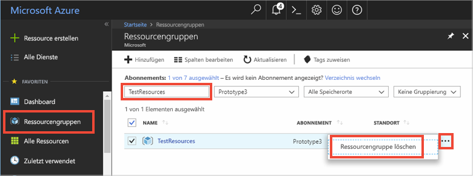

# <a name="quickstart-use-azure-cache-for-redis-with-a-net-core-app"></a>Schnellstart: Verwenden von Azure Cache for Redis mit einer .NET Core-App


In dieser Schnellstartanleitung wird beschrieben, wie Sie in die Nutzung von Microsoft Azure Cache for Redis mit .NET Core einsteigen. Microsoft Azure Cache for Redis basiert auf dem beliebten Open-Source-Speicherdienst Azure Cache for Redis. Mit diesem Dienst erhalten Sie Zugriff auf eine sichere, dedizierte Azure Cache for Redis-Instanz, die von Microsoft verwaltet wird. Ein mit Azure Cache for Redis erstellter Cache ist für beliebige Anwendungen in Microsoft Azure erreichbar.

In dieser Schnellstartanleitung verwenden Sie den [StackExchange.Redis](https://github.com/StackExchange/StackExchange.Redis)-Client mit C\#-Code in einer .NET Core-Konsolen-App. Sie erstellen einen Cache und konfigurieren die .NET Core-Client-App. Anschließend fügen Sie dem Cache Objekte hinzu und führen eine Aktualisierung durch. 

Sie können einen beliebigen Code-Editor nutzen, um die Schritte dieser Schnellstartanleitung auszuführen. [Visual Studio Code](https://code.visualstudio.com/) ist aber eine hervorragende Option, die auf Windows-, macOS- und Linux-Plattformen verfügbar ist.


[!INCLUDE [quickstarts-free-trial-note](../../includes/quickstarts-free-trial-note.md)]

## <a name="prerequisites"></a>Voraussetzungen

* [.NET SDK 2.0](https://www.microsoft.com/net/learn/get-started/windows) oder höher
* Für den StackExchange.Redis-Client ist [.NET Framework 4 oder höher](https://www.microsoft.com/net/download/dotnet-framework-runtime) erforderlich

## <a name="create-a-cache"></a>Erstellen eines Caches
[!INCLUDE [redis-cache-create](../../includes/redis-cache-create.md)]

[!INCLUDE [redis-cache-access-keys](../../includes/redis-cache-access-keys.md)]

Notieren Sie sich den **HOSTNAMEN** und den **primären** Zugriffsschlüssel. Sie verwenden diese Werte später, um das *CacheConnection*-Geheimnis zu erstellen.


## <a name="create-a-console-app"></a>Erstellen einer Konsolen-App

Öffnen Sie ein neues Befehlsfenster, und führen Sie den folgenden Befehl aus, um die .NET Core-Konsolen-App zu erstellen:

```
dotnet new console -o Redistest
```

Wechseln Sie im Befehlsfenster zum neuen Projektverzeichnis *Redistest*.


## <a name="add-secret-manager-to-the-project"></a>Hinzufügen des Geheimnis-Managers

In diesem Abschnitt fügen Sie Ihrem Projekt das [Geheimnis-Manager-Tool](https://docs.microsoft.com/aspnet/core/security/app-secrets) hinzu. Im Geheimnis-Manager-Tool werden sensible Daten für die Entwicklungsarbeit außerhalb Ihrer Projektstruktur gespeichert. Mit diesem Ansatz können Sie verhindern, dass App-Geheimnisse versehentlich im Quellcode angegeben werden.

Öffnen Sie die Datei *Redistest.csproj*. Fügen Sie das `DotNetCliToolReference`-Element hinzu, um *Microsoft.Extensions.SecretManager.Tools* einzubinden. Fügen Sie außerdem wie unten gezeigt das `UserSecretsId`-Element hinzu, und speichern Sie die Datei.

```xml
<Project Sdk="Microsoft.NET.Sdk">

  <PropertyGroup>
    <OutputType>Exe</OutputType>
    <TargetFramework>netcoreapp2.0</TargetFramework>
    <UserSecretsId>Redistest</UserSecretsId>
  </PropertyGroup>
  <ItemGroup>
    <DotNetCliToolReference Include="Microsoft.Extensions.SecretManager.Tools" Version="2.0.0" />
  </ItemGroup>
</Project>
```

Führen Sie den folgenden Befehl aus, um dem Projekt das Paket *Microsoft.Extensions.Configuration.UserSecrets* hinzuzufügen:

```
dotnet add package Microsoft.Extensions.Configuration.UserSecrets
```

Führen Sie den folgenden Befehl aus, um Ihre Pakete wiederherzustellen:

```
dotnet restore
```

Führen Sie im Befehlsfenster den folgenden Befehl aus, um ein neues Geheimnis mit dem Namen *CacheConnection* zu speichern, nachdem Sie die Platzhalter (einschließlich der Winkelklammern) durch Ihren Cachenamen und den Primärschlüssel ersetzt haben:

```
dotnet user-secrets set CacheConnection "<cache name>.redis.cache.windows.net,abortConnect=false,ssl=true,password=<primary-access-key>"
```

Fügen Sie *Program.cs* die folgende `using`-Anweisung hinzu:

```csharp
using Microsoft.Extensions.Configuration;
```

Fügen Sie der `Program`-Klasse in *Program.cs* die folgenden Member hinzu. Mit diesem Code wird eine Konfiguration für den Zugriff auf das Benutzergeheimnis für die Azure Cache for Redis-Verbindungszeichenfolge initialisiert.

```csharp
        private static IConfigurationRoot Configuration { get; set; }
        const string SecretName = "CacheConnection";

        private static void InitializeConfiguration()
        {
            var builder = new ConfigurationBuilder()
                .AddUserSecrets<Program>();

            Configuration = builder.Build();
        }
```

## <a name="configure-the-cache-client"></a>Konfigurieren des Cacheclients

In diesem Abschnitt konfigurieren Sie die Konsolenanwendung zur Verwendung des [StackExchange.Redis](https://github.com/StackExchange/StackExchange.Redis)-Clients für .NET.

Führen Sie im Befehlsfenster im Projektverzeichnis *Redistest* den folgenden Befehl aus:

```
dotnet add package StackExchange.Redis
```

Nach Abschluss der Installation kann der *StackExchange.Redis*-Cacheclient für Ihr Projekt verwendet werden.


## <a name="connect-to-the-cache"></a>Herstellen einer Verbindung mit dem Cache

Fügen Sie *Program.cs* die folgende `using`-Anweisung hinzu:

```csharp
using StackExchange.Redis;
```

Die Verbindung mit Azure Cache for Redis wird von der `ConnectionMultiplexer`-Klasse verwaltet. Diese Klasse sollte für Ihre gesamte Clientanwendung genutzt und wiederverwendet werden. Erstellen Sie nicht für jeden Vorgang eine neue Verbindung. 

Fügen Sie in der Datei *Program.cs* der `Program`-Klasse Ihrer Konsolenanwendung die folgenden Member hinzu:

```csharp
        private static Lazy<ConnectionMultiplexer> lazyConnection = new Lazy<ConnectionMultiplexer>(() =>
        {
            string cacheConnection = Configuration[SecretName];
            return ConnectionMultiplexer.Connect(cacheConnection);
        });

        public static ConnectionMultiplexer Connection
        {
            get
            {
                return lazyConnection.Value;
            }
        }
```

Bei diesem Ansatz zum Freigeben einer `ConnectionMultiplexer`-Instanz in Ihrer Anwendung wird eine statische Eigenschaft verwendet, die eine verbundene Instanz zurückgibt. Dieser Code ist eine threadsichere Möglichkeit, um nur eine einzelne verbundene `ConnectionMultiplexer`-Instanz zu initialisieren. `abortConnect` ist auf „false“ festgelegt. Dies bedeutet, dass der Aufruf erfolgreich ist, auch wenn keine Verbindung mit Azure Cache for Redis hergestellt wird. Eine wichtige Funktion von `ConnectionMultiplexer` ist, dass die Verbindung mit dem Cache automatisch wiederhergestellt wird, sobald das Netzwerkproblem oder andere Ursachen beseitigt wurden.

Auf den Wert des Geheimnisses *CacheConnection* wird über den Geheimnis-Manager-Konfigurationsanbieter zugegriffen, und der Wert wird dann als Kennwortparameter verwendet.

## <a name="executing-cache-commands"></a>Ausführen von Cachebefehlen

Fügen Sie in der Datei *Program.cs* den folgenden Code für das Verfahren `Main` der `Program`-Klasse Ihrer Konsolenanwendung hinzu:

```csharp
        static void Main(string[] args)
        {
            InitializeConfiguration();

            // Connection refers to a property that returns a ConnectionMultiplexer
            // as shown in the previous example.
            IDatabase cache = lazyConnection.Value.GetDatabase();

            // Perform cache operations using the cache object...

            // Simple PING command
            string cacheCommand = "PING";
            Console.WriteLine("\nCache command  : " + cacheCommand);
            Console.WriteLine("Cache response : " + cache.Execute(cacheCommand).ToString());

            // Simple get and put of integral data types into the cache
            cacheCommand = "GET Message";
            Console.WriteLine("\nCache command  : " + cacheCommand + " or StringGet()");
            Console.WriteLine("Cache response : " + cache.StringGet("Message").ToString());

            cacheCommand = "SET Message \"Hello! The cache is working from a .NET Core console app!\"";
            Console.WriteLine("\nCache command  : " + cacheCommand + " or StringSet()");
            Console.WriteLine("Cache response : " + cache.StringSet("Message", "Hello! The cache is working from a .NET Core console app!").ToString());

            // Demostrate "SET Message" executed as expected...
            cacheCommand = "GET Message";
            Console.WriteLine("\nCache command  : " + cacheCommand + " or StringGet()");
            Console.WriteLine("Cache response : " + cache.StringGet("Message").ToString());

            // Get the client list, useful to see if connection list is growing...
            cacheCommand = "CLIENT LIST";
            Console.WriteLine("\nCache command  : " + cacheCommand);
            Console.WriteLine("Cache response : \n" + cache.Execute("CLIENT", "LIST").ToString().Replace("id=", "id="));

            lazyConnection.Value.Dispose();
        }
```

Speichern Sie *Program.cs*.

Für Azure Cache for Redis kann eine konfigurierbare Anzahl von Datenbanken (standardmäßig 16) konfiguriert werden, mit denen die Daten innerhalb einer Azure Cache for Redis-Instanz logisch getrennt werden können. Der Code stellt eine Verbindung mit der Standarddatenbank (DB 0) her. Weitere Informationen finden Sie unter [Was sind Redis-Datenbanken?](cache-faq.md#what-are-redis-databases) und [Standardmäßige Redis-Serverkonfiguration](cache-configure.md#default-redis-server-configuration).

Cacheelemente können mit den Methoden `StringSet` und `StringGet` gespeichert und abgerufen werden.

Redis speichert die meisten Daten als Redis-Zeichenfolgen. Diese können jedoch unterschiedliche Datentypen enthalten, inklusive serialisierter Binärdaten, die zum Speichern von .NET-Objekten im Cache verwendet werden können.

Führen Sie in Ihrem Befehlsfenster den folgenden Befehl aus, um die App zu erstellen:

```
dotnet build
```

Führen Sie die App anschließend mit dem folgenden Befehl aus:

```
dotnet run
```

Im folgenden Beispiel können Sie sehen, dass der `Message`-Schlüssel zuvor einen zwischengespeicherten Wert aufgewiesen hat, der im Azure-Portal über die Redis-Konsole festgelegt wurde. Die App hat diesen zwischengespeicherten Wert aktualisiert. Außerdem hat die App die Befehle `PING` und `CLIENT LIST` ausgeführt.


## <a name="work-with-net-objects-in-the-cache"></a>Arbeiten mit .NET-Objekten im Cache

Azure Cache for Redis kann sowohl .NET-Objekte als auch primitive Datentypen zwischenspeichern, aber .NET-Objekte müssen zunächst serialisiert werden. Die Serialisierung des .NET-Objekts ist Aufgabe des Anwendungsentwicklers und überlässt dem Entwickler die Freiheit bei der Wahl des Serialisierers.

Eine einfache Möglichkeit zum Serialisieren von Objekten stellt die Verwendung der `JsonConvert`-Serialisierungsmethoden in [Newtonsoft.Json](https://www.nuget.org/packages/Newtonsoft.Json/) und die Serialisierung in und aus JSON dar. In diesem Abschnitt fügen Sie dem Cache ein .NET-Objekt hinzu.

Führen Sie den folgenden Befehl aus, um der App das Paket *Newtonsoft.json* hinzuzufügen:

```
dotnet add package Newtonsoft.json
```

Fügen Sie am Anfang der Datei *Program.cs* die folgende `using`-Anweisung hinzu:

```charp
using Newtonsoft.Json;
```

Fügen Sie der Datei *Program.cs* die folgende `Employee`-Klassendefinition hinzu:

```csharp
        class Employee
        {
            public string Id { get; set; }
            public string Name { get; set; }
            public int Age { get; set; }

            public Employee(string EmployeeId, string Name, int Age)
            {
                this.Id = EmployeeId;
                this.Name = Name;
                this.Age = Age;
            }
        }
```

Fügen Sie in *Program.cs* am unteren Ende der Prozedur `Main()` und vor dem Aufruf von `Dispose()` die folgenden Codezeilen hinzu, um ein serialisiertes .NET-Objekt zwischenzuspeichern und abzurufen:

```csharp
            // Store .NET object to cache
            Employee e007 = new Employee("007", "Davide Columbo", 100);
            Console.WriteLine("Cache response from storing Employee .NET object : " + 
                cache.StringSet("e007", JsonConvert.SerializeObject(e007)));

            // Retrieve .NET object from cache
            Employee e007FromCache = JsonConvert.DeserializeObject<Employee>(cache.StringGet("e007"));
            Console.WriteLine("Deserialized Employee .NET object :\n");
            Console.WriteLine("\tEmployee.Name : " + e007FromCache.Name);
            Console.WriteLine("\tEmployee.Id   : " + e007FromCache.Id);
            Console.WriteLine("\tEmployee.Age  : " + e007FromCache.Age + "\n");
```

Speichern Sie *Program.cs*, und erstellen Sie die App mit dem folgenden Befehl neu:

```
dotnet build
```

Führen Sie die App mit dem folgenden Befehl aus, um die Serialisierung von .NET-Objekten zu testen:

```
dotnet run
```


## <a name="clean-up-resources"></a>Bereinigen von Ressourcen

Falls Sie mit dem nächsten Tutorial fortfahren möchten, können Sie die in dieser Schnellstartanleitung erstellten Ressourcen beibehalten und wiederverwenden.

Wenn Sie die Schnellstart-Beispielanwendung nicht mehr benötigen, können Sie die in dieser Schnellstartanleitung erstellten Azure-Ressourcen löschen, um das Anfallen von Kosten zu vermeiden. 

> [!IMPORTANT]
> Das Löschen einer Ressourcengruppe kann nicht rückgängig gemacht werden. Die Ressourcengruppe und alle darin enthaltenen Ressourcen werden also dauerhaft gelöscht. Achten Sie daher darauf, dass Sie nicht versehentlich die falsche Ressourcengruppe oder die falschen Ressourcen löschen. Falls Sie die Ressourcen zum Hosten dieses Beispiels in einer vorhandenen Ressourcengruppe erstellt haben, die beizubehaltende Ressourcen enthält, können Sie die Ressourcen einzeln über das jeweilige Blatt löschen, statt die Ressourcengruppe zu löschen.
>

Melden Sie sich beim [Azure-Portal](https://portal.azure.com) an, und klicken Sie auf **Ressourcengruppen**.

Geben Sie im Textfeld **Nach Name filtern...** den Namen Ihrer Ressourcengruppe ein. In diesem Artikel wurde eine Ressourcengruppe mit dem Namen *TestResources* verwendet. Klicken Sie in Ihrer Ressourcengruppe in der Ergebnisliste auf **...** und dann auf **Ressourcengruppe löschen**.



Sie werden aufgefordert, das Löschen der Ressourcengruppe zu bestätigen. Geben Sie den Namen der entsprechenden Ressourcengruppe ein, und klicken Sie auf **Löschen**.

Daraufhin werden die Ressourcengruppe und alle darin enthaltenen Ressourcen gelöscht.


<a name="next-steps"></a>

## <a name="next-steps"></a>Nächste Schritte

In dieser Schnellstartanleitung wurde beschrieben, wie Sie Azure Cache for Redis über eine .NET Core-Anwendung verwenden. In der nächsten Schnellstartanleitung erfahren Sie, wie Sie Azure Cache for Redis mit einer ASP.NET-Web-App verwenden.

> [!div class="nextstepaction"]
> [Quickstart: Create an ASP.NET web app](./cache-web-app-howto.md) (Schnellstart: Erstellen einer ASP.NET-Web-App)


