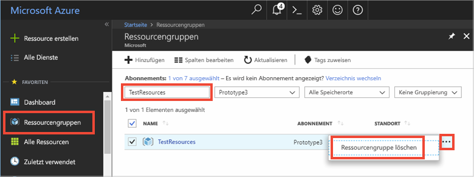

# <a name="quickstart-use-azure-cache-for-redis-with-a-net-application"></a>Schnellstart: Verwenden von Azure Cache for Redis mit einer .NET-Anwendung


In dieser Schnellstartanleitung werden die ersten Schritte mit Microsoft Azure Cache for Redis und .NET beschrieben. Microsoft Azure Cache for Redis basiert auf dem beliebten Open-Source-Speicherdienst Azure Cache for Redis. Mit diesem Dienst erhalten Sie Zugriff auf eine sichere, dedizierte Azure Cache for Redis-Instanz, die von Microsoft verwaltet wird. Ein mit Azure Cache for Redis erstellter Cache kann von jeder Anwendung in Microsoft Azure genutzt werden.

In dieser Schnellstartanleitung verwenden Sie den [StackExchange.Redis](https://github.com/StackExchange/StackExchange.Redis)-Client mit C\#-Code in einer Konsolen-App. Sie erstellen einen Cache und konfigurieren die .NET-Client-App. Anschließend fügen Sie dem Cache Objekte hinzu und führen eine Aktualisierung durch. 


[!INCLUDE [quickstarts-free-trial-note](../../includes/quickstarts-free-trial-note.md)]

## <a name="prerequisites"></a>Voraussetzungen

* [Visual Studio](https://www.visualstudio.com/downloads/)
* Für den StackExchange.Redis-Client ist [.NET Framework 4 oder höher](https://www.microsoft.com/net/download/dotnet-framework-runtime) erforderlich

## <a name="create-a-cache"></a>Erstellen eines Caches
[!INCLUDE [redis-cache-create](../../includes/redis-cache-create.md)]

[!INCLUDE [redis-cache-access-keys](../../includes/redis-cache-access-keys.md)]

Erstellen Sie auf Ihrem Computer eine Datei namens *CacheSecrets.config*, und platzieren Sie die Datei an einem Speicherort, an dem sie nicht mit dem Quellcode Ihrer Beispielanwendung eingecheckt wird. In diesem Schnellstart befindet sich die Datei *CacheSecrets.config* im Verzeichnis *C:\AppSecrets\CacheSecrets.config*.

Bearbeiten Sie die Datei *CacheSecrets.config*, und fügen Sie ihr folgende Inhalte hinzu:

```xml
<appSettings>
    <add key="CacheConnection" value="<cache-name>.redis.cache.windows.net,abortConnect=false,ssl=true,password=<access-key>"/>
</appSettings>
```

Ersetzen Sie `<cache-name>` durch den Cachehostnamen.

Ersetzen Sie `<access-key>` durch den Primärschlüssel für Ihren Cache.


## <a name="create-a-console-app"></a>Erstellen einer Konsolen-App

Klicken Sie in Visual Studio auf **Datei** > **Neu** > **Projekt**.

Klicken Sie unter **Visual C#** auf den **klassischen Windows-Desktop** und dann auf **Konsolen-App** und **OK**, um eine neue Konsolenanwendung zu erstellen.


<a name="configure-the-cache-clients"></a>

## <a name="configure-the-cache-client"></a>Konfigurieren des Cacheclients

In diesem Abschnitt konfigurieren Sie die Konsolenanwendung zur Verwendung des [StackExchange.Redis](https://github.com/StackExchange/StackExchange.Redis)-Clients für .NET.

Klicken Sie in Visual Studio auf **Tools** > **NuGet-Paket-Manager** > **Paket-Manager-Konsole**, und führen Sie im Fenster der Paket-Manager-Konsole den folgenden Befehl aus.

```powershell
Install-Package StackExchange.Redis
```

Nach Abschluss der Installation kann der *StackExchange.Redis*-Cacheclient für Ihr Projekt verwendet werden.


## <a name="connect-to-the-cache"></a>Herstellen einer Verbindung mit dem Cache

Öffnen Sie in Visual Studio die Datei *App.config*, und aktualisieren Sie sie, damit sie ein `appSettings`-`file`-Attribut enthält, das auf die Datei *CacheSecrets.config* verweist.

```xml
<?xml version="1.0" encoding="utf-8" ?>
<configuration>
    <startup> 
        <supportedRuntime version="v4.0" sku=".NETFramework,Version=v4.7.1" />
    </startup>

    <appSettings file="C:\AppSecrets\CacheSecrets.config"></appSettings>  

</configuration>
```

Klicken Sie im Projektmappen-Explorer mit der rechten Maustaste auf **Verweise**, und klicken Sie anschließend auf **Verweis hinzufügen**. Fügen Sie einen Verweis auf die Assembly **System.Configuration** hinzu.

Fügen Sie der Datei *Program.cs* die folgenden `using`-Anweisungen hinzu:

```csharp
using StackExchange.Redis;
using System.Configuration;
```

Die Verbindung mit Azure Cache for Redis wird durch die Klasse `ConnectionMultiplexer` verwaltet. Diese Klasse sollte für Ihre gesamte Clientanwendung genutzt und wiederverwendet werden. Erstellen Sie nicht für jeden Vorgang eine neue Verbindung. 

Speichern Sie niemals Anmeldeinformationen im Quellcode. Hier wird nur eine externe Konfigurationsdatei für Geheimnisse verwendet, um dieses Beispiel einfach zu halten. Ein besserer Ansatz wäre die Nutzung von [Azure Key Vault mit Zertifikaten](https://docs.microsoft.com/rest/api/keyvault/certificate-scenarios).

Fügen Sie in der Datei *Program.cs* der `Program`-Klasse Ihrer Konsolenanwendung die folgenden Member hinzu:

```csharp
        private static Lazy<ConnectionMultiplexer> lazyConnection = new Lazy<ConnectionMultiplexer>(() =>
        {
            string cacheConnection = ConfigurationManager.AppSettings["CacheConnection"].ToString();
            return ConnectionMultiplexer.Connect(cacheConnection);
        });

        public static ConnectionMultiplexer Connection
        {
            get
            {
                return lazyConnection.Value;
            }
        }
```


Bei diesem Ansatz zum Freigeben einer `ConnectionMultiplexer`-Instanz in Ihrer Anwendung wird eine statische Eigenschaft verwendet, die eine verbundene Instanz zurückgibt. Dieser Code ist eine threadsichere Möglichkeit, um nur eine einzelne verbundene `ConnectionMultiplexer`-Instanz zu initialisieren. `abortConnect` ist auf „false“ festgelegt. Das bedeutet, dass der Aufruf erfolgreich ist, auch wenn keine Verbindung mit Azure Cache for Redis hergestellt wird. Eine wichtige Funktion von `ConnectionMultiplexer` ist, dass die Verbindung mit dem Cache automatisch wiederhergestellt wird, sobald das Netzwerkproblem oder andere Ursachen beseitigt wurden.

Der Wert der appSetting-Einstellung *CacheConnection* wird verwendet, um über das Azure-Portal auf die Cacheverbindungszeichenfolge als Kennwortparameter zu verweisen.

## <a name="executing-cache-commands"></a>Ausführen von Cachebefehlen

Fügen Sie den folgenden Code für die Prozedur `Main` der `Program`-Klasse Ihrer Konsolenanwendung hinzu:

```csharp
        static void Main(string[] args)
        {
            // Connection refers to a property that returns a ConnectionMultiplexer
            // as shown in the previous example.
            IDatabase cache = lazyConnection.Value.GetDatabase();

            // Perform cache operations using the cache object...

            // Simple PING command
            string cacheCommand = "PING";
            Console.WriteLine("\nCache command  : " + cacheCommand);
            Console.WriteLine("Cache response : " + cache.Execute(cacheCommand).ToString());

            // Simple get and put of integral data types into the cache
            cacheCommand = "GET Message";
            Console.WriteLine("\nCache command  : " + cacheCommand + " or StringGet()");
            Console.WriteLine("Cache response : " + cache.StringGet("Message").ToString());

            cacheCommand = "SET Message \"Hello! The cache is working from a .NET console app!\"";
            Console.WriteLine("\nCache command  : " + cacheCommand + " or StringSet()");
            Console.WriteLine("Cache response : " + cache.StringSet("Message", "Hello! The cache is working from a .NET console app!").ToString());

            // Demostrate "SET Message" executed as expected...
            cacheCommand = "GET Message";
            Console.WriteLine("\nCache command  : " + cacheCommand + " or StringGet()");
            Console.WriteLine("Cache response : " + cache.StringGet("Message").ToString());

            // Get the client list, useful to see if connection list is growing...
            cacheCommand = "CLIENT LIST";
            Console.WriteLine("\nCache command  : " + cacheCommand);
            Console.WriteLine("Cache response : \n" + cache.Execute("CLIENT", "LIST").ToString().Replace("id=", "id="));

            lazyConnection.Value.Dispose();
        }
```

Für Azure Cache for Redis kann eine konfigurierbare Anzahl von Datenbanken (standardmäßig 16) konfiguriert werden, mit denen die Daten innerhalb einer Azure Cache for Redis-Instanz logisch getrennt werden können. Der Code stellt eine Verbindung mit der Standarddatenbank (DB 0) her. Weitere Informationen finden Sie unter [Was sind Redis-Datenbanken?](cache-faq.md#what-are-redis-databases) und [Standardmäßige Redis-Serverkonfiguration](cache-configure.md#default-redis-server-configuration).

Cacheelemente können mit den Methoden `StringSet` und `StringGet` gespeichert und abgerufen werden.

Redis speichert die meisten Daten als Redis-Zeichenfolgen. Diese können jedoch unterschiedliche Datentypen enthalten, inklusive serialisierter Binärdaten, die zum Speichern von .NET-Objekten im Cache verwendet werden können.

Drücken Sie **STRG+F5**, um die Konsolen-App zu erstellen und auszuführen.

Im folgenden Beispiel können Sie sehen, dass der `Message`-Schlüssel zuvor einen zwischengespeicherten Wert aufgewiesen hat, der im Azure-Portal über die Redis-Konsole festgelegt wurde. Die App hat diesen zwischengespeicherten Wert aktualisiert. Außerdem hat die App die Befehle `PING` und `CLIENT LIST` ausgeführt.


## <a name="work-with-net-objects-in-the-cache"></a>Arbeiten mit .NET-Objekten im Cache

Azure Cache for Redis kann sowohl .NET-Objekte als auch primitive Datentypen zwischenspeichern. .NET-Objekte müssen allerdings zunächst serialisiert werden. Die Serialisierung des .NET-Objekts ist Aufgabe des Anwendungsentwicklers und überlässt dem Entwickler die Freiheit bei der Wahl des Serialisierers.

Eine einfache Möglichkeit zum Serialisieren von Objekten stellt die Verwendung der `JsonConvert`-Serialisierungsmethoden in [Newtonsoft.Json](https://www.nuget.org/packages/Newtonsoft.Json/) und die Serialisierung in und aus JSON dar. In diesem Abschnitt fügen Sie dem Cache ein .NET-Objekt hinzu.

Klicken Sie in Visual Studio auf **Tools** > **NuGet-Paket-Manager** > **Paket-Manager-Konsole**, und führen Sie im Fenster der Paket-Manager-Konsole den folgenden Befehl aus.

```powershell
Install-Package Newtonsoft.Json
```

Fügen Sie am Anfang der Datei *Program.cs* die folgende `using`-Anweisung hinzu:

```charp
using Newtonsoft.Json;
```

Fügen Sie der Datei *Program.cs* die folgende `Employee`-Klassendefinition hinzu:

```csharp
        class Employee
        {
            public string Id { get; set; }
            public string Name { get; set; }
            public int Age { get; set; }

            public Employee(string EmployeeId, string Name, int Age)
            {
                this.Id = EmployeeId;
                this.Name = Name;
                this.Age = Age;
            }
        }
```

Fügen Sie in *Program.cs* am unteren Ende der Prozedur `Main()` und vor dem Aufruf von `Dispose()` die folgenden Codezeilen hinzu, um ein serialisiertes .NET-Objekt zwischenzuspeichern und abzurufen:

```csharp
            // Store .NET object to cache
            Employee e007 = new Employee("007", "Davide Columbo", 100);
            Console.WriteLine("Cache response from storing Employee .NET object : " + 
                cache.StringSet("e007", JsonConvert.SerializeObject(e007)));

            // Retrieve .NET object from cache
            Employee e007FromCache = JsonConvert.DeserializeObject<Employee>(cache.StringGet("e007"));
            Console.WriteLine("Deserialized Employee .NET object :\n");
            Console.WriteLine("\tEmployee.Name : " + e007FromCache.Name);
            Console.WriteLine("\tEmployee.Id   : " + e007FromCache.Id);
            Console.WriteLine("\tEmployee.Age  : " + e007FromCache.Age + "\n");
```

Drücken Sie **STRG+F5**, um die Konsolen-App zum Testen der Serialisierung von .NET-Objekten zu erstellen und auszuführen. 


## <a name="clean-up-resources"></a>Bereinigen von Ressourcen

Falls Sie mit dem nächsten Tutorial fortfahren möchten, können Sie die in dieser Schnellstartanleitung erstellten Ressourcen beibehalten und wiederverwenden.

Wenn Sie die Schnellstart-Beispielanwendung nicht mehr benötigen, können Sie die in dieser Schnellstartanleitung erstellten Azure-Ressourcen löschen, um das Anfallen von Kosten zu vermeiden. 

> [!IMPORTANT]
> Das Löschen einer Ressourcengruppe kann nicht rückgängig gemacht werden. Die Ressourcengruppe und alle darin enthaltenen Ressourcen werden also dauerhaft gelöscht. Achten Sie daher darauf, dass Sie nicht versehentlich die falsche Ressourcengruppe oder die falschen Ressourcen löschen. Falls Sie die Ressourcen zum Hosten dieses Beispiels in einer vorhandenen Ressourcengruppe erstellt haben, die beizubehaltende Ressourcen enthält, können Sie die Ressourcen einzeln über das jeweilige Blatt löschen, statt die Ressourcengruppe zu löschen.
>

Melden Sie sich beim [Azure-Portal](https://portal.azure.com) an, und klicken Sie auf **Ressourcengruppen**.

Geben Sie im Textfeld **Nach Name filtern...** den Namen Ihrer Ressourcengruppe ein. In diesem Artikel wurde eine Ressourcengruppe mit dem Namen *TestResources* verwendet. Klicken Sie in Ihrer Ressourcengruppe in der Ergebnisliste auf **...** und dann auf **Ressourcengruppe löschen**.



Sie werden aufgefordert, das Löschen der Ressourcengruppe zu bestätigen. Geben Sie den Namen der entsprechenden Ressourcengruppe ein, und klicken Sie auf **Löschen**.

Daraufhin werden die Ressourcengruppe und alle darin enthaltenen Ressourcen gelöscht.


<a name="next-steps"></a>

## <a name="next-steps"></a>Nächste Schritte

In dieser Schnellstartanleitung wurde beschrieben, wie Sie Azure Cache for Redis über eine .NET-Anwendung verwenden. In der nächsten Schnellstartanleitung erfahren Sie, wie Sie Azure Cache for Redis mit einer ASP.NET-Web-App verwenden.

> [!div class="nextstepaction"]
> [Schnellstart: Erstellen einer ASP.NET-Web-App](./cache-web-app-howto.md)


