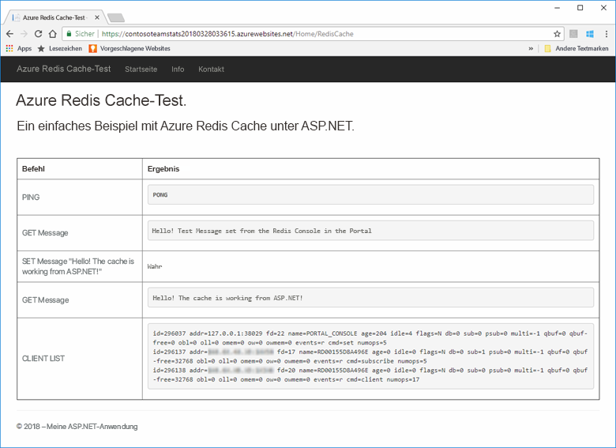
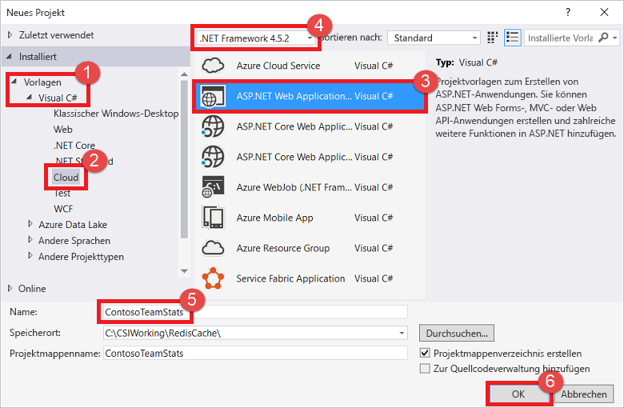
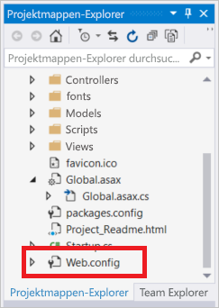
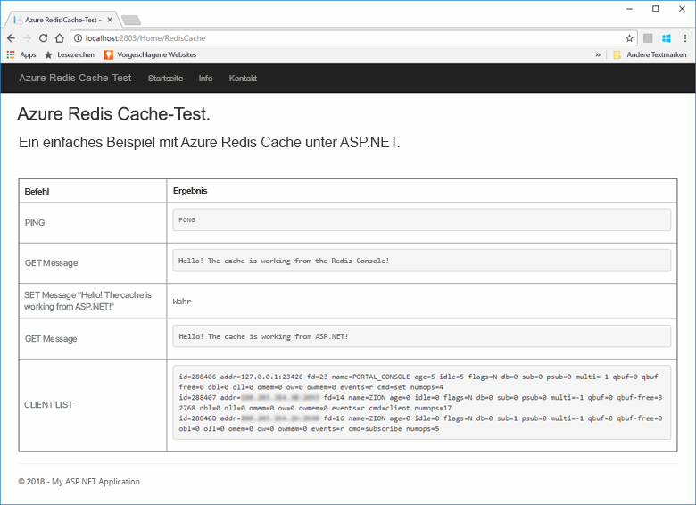
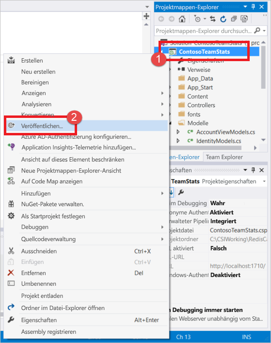
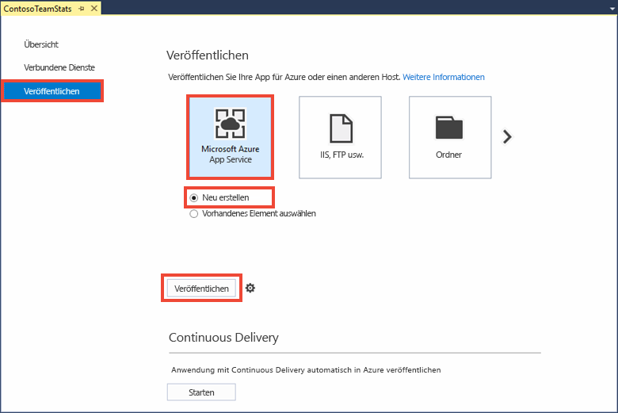
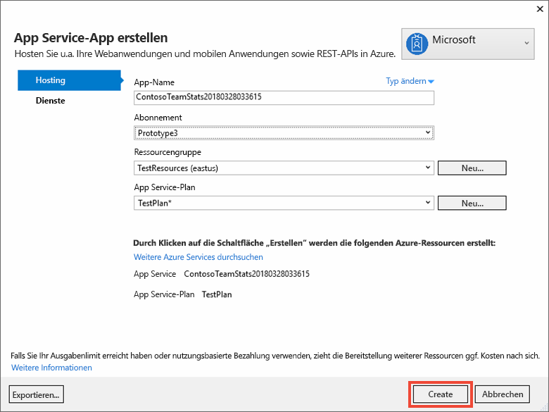
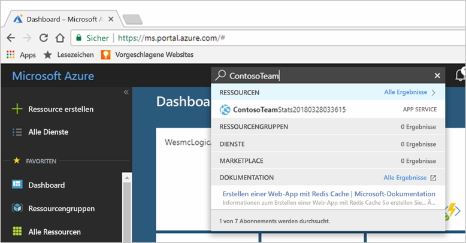
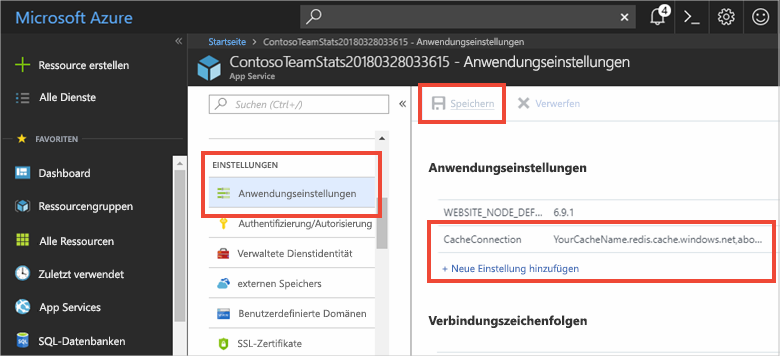

# <a name="quickstart-create-an-aspnet-web-app"></a>Schnellstart: Erstellen einer ASP.NET-Web-App 

## <a name="introduction"></a>Einführung

In dieser Schnellstartanleitung wird erörtert, wie Sie mit Visual Studio 2019 eine ASP.NET-Webanwendung erstellen und für Azure App Service bereitstellen. Die Beispielanwendung stellt eine Verbindung mit Azure Cache for Redis her, um Daten aus dem Cache abzurufen und zu speichern. Nach der Ausführung der in dieser Schnellstartanleitung beschriebenen Schritte verfügen Sie über eine funktionsfähige, in Azure gehostete Web-App, die Lese- und Schreibvorgänge in Azure Cache for Redis ausführt.



[!INCLUDE [quickstarts-free-trial-note](../../includes/quickstarts-free-trial-note.md)]

## <a name="prerequisites"></a>Voraussetzungen

Installieren Sie [Visual Studio 2019](https://www.visualstudio.com/downloads/) mit den folgenden Umgebungen, um diesen Schnellstart durchzuführen:
* ASP.NET und Webentwicklung
* Azure-Entwicklung

## <a name="create-the-visual-studio-project"></a>Erstellen des Visual Studio-Projekts

1. Öffnen Sie Visual Studio, und wählen Sie anschließend **Datei** >**Neu** > **Projekt** aus.

2. Führen Sie im Dialogfeld **Neues Projekt** die folgenden Schritte aus:

    

    a. Erweitern Sie in der Liste **Vorlagen** den Knoten **Visual C#** .

    b. Wählen Sie **Cloud** aus.

    c. Wählen Sie **ASP.NET-Webanwendung**aus.

    d. Stellen Sie sicher, dass **.NET Framework 4.5.2** oder höher ausgewählt ist.

    e. Geben Sie im Feld **Name** einen Namen für das Projekt ein. In diesem Beispiel haben wir **ContosoTeamStats** verwendet.

    f. Klicken Sie auf **OK**.
   
3. Wählen Sie als Projekttyp die Option **MVC** aus.

4. Stellen Sie sicher, dass für die Einstellungen unter **Authentifizierung** die Option **Keine Authentifizierung** angegeben ist. Je nach Ihrer Version von Visual Studio kann die Standardeinstellung für **Authentifizierung** auch anders lauten. Um die Einstellung zu ändern, wählen Sie zunächst **Authentifizierung ändern** und anschließend **Keine Authentifizierung** aus.

5. Wählen Sie **OK** aus, um das Projekt zu erstellen.

## <a name="create-a-cache"></a>Erstellen eines Caches

Als Nächstes erstellen Sie den Cache für die App.

[!INCLUDE [redis-cache-create](../../includes/redis-cache-create.md)]

[!INCLUDE [redis-cache-access-keys](../../includes/redis-cache-access-keys.md)]

#### <a name="to-edit-the-cachesecretsconfig-file"></a>So bearbeiten Sie die Datei *CacheSecrets.config*

1. Erstellen Sie auf Ihrem Computer eine Datei mit dem Namen *CacheSecrets.config*. Speichern Sie sie an einem Ort, an dem sie nicht mit dem Quellcode Ihrer Beispielanwendung eingecheckt wird. In diesem Schnellstart befindet sich die Datei *CacheSecrets.config* im Verzeichnis *C:\AppSecrets\CacheSecrets.config*.

1. Bearbeiten Sie die Datei *CacheSecrets.config*. Fügen Sie anschließend folgenden Inhalt hinzu:

    ```xml
    <appSettings>
        <add key="CacheConnection" value="<cache-name>.redis.cache.windows.net,abortConnect=false,ssl=true,password=<access-key>"/>
    </appSettings>
    ```

1. Ersetzen Sie `<cache-name>` durch den Cachehostnamen.

1. Ersetzen Sie `<access-key>` durch den Primärschlüssel für Ihren Cache.

    > [!TIP]
    > Sie können den sekundären Zugriffsschlüssel bei der Schlüsselrotation als alternativen Schlüssel verwenden, während Sie den primären Zugriffsschlüssel neu generieren.
   >
1. Speichern Sie die Datei .

## <a name="update-the-mvc-application"></a>Aktualisieren der MVC-Anwendung

In diesem Abschnitt aktualisieren Sie die Anwendung, um eine neue Ansicht zu unterstützen, in der ein einfacher Test für Azure Cache for Redis angezeigt wird.

* [Aktualisieren der Datei „Web.config“ mit einer App-Einstellung für den Cache](#update-the-webconfig-file-with-an-app-setting-for-the-cache)
* Konfigurieren der Anwendung für die Verwendung des Clients „StackExchange.Redis“
* Aktualisieren von HomeController und Layout
* Hinzufügen einer neuen RedisCache-Ansicht

### <a name="update-the-webconfig-file-with-an-app-setting-for-the-cache"></a>Aktualisieren der Datei „Web.config“ mit einer App-Einstellung für den Cache

Wenn Sie die Anwendung lokal ausführen, werden die Informationen in der Datei *CacheSecrets.config* verwendet, um eine Verbindung mit Ihrer Azure Cache for Redis-Instanz herzustellen. Später stellen Sie diese Anwendung für Azure bereit. Zu diesem Zeitpunkt konfigurieren Sie eine App-Einstellung in Azure, die von der Anwendung verwendet wird, um die Cacheverbindungsinformationen anstelle dieser Datei abzurufen. 

Weil die Datei *CacheSecrets.config* nicht mit Ihrer Anwendung in Azure bereitgestellt wird, verwenden Sie die Datei nur, wenn Sie die Anwendung lokal testen. Speichern Sie diese Informationen so sicher wie möglich, um missbräuchlichen Zugriff auf Ihre Cachedaten zu verhindern.

#### <a name="to-update-the-webconfig-file"></a>So aktualisieren Sie die Datei *web.config*
1. Doppelklicken Sie im **Projektmappen-Explorer** auf die Datei *Web.config*, um sie zu öffnen.

    

2. Suchen Sie in der Datei *web.config* nach dem Element `<appSetting>`. Fügen Sie anschließend das folgende `file`-Attribut hinzu. Falls Sie einen anderen Dateinamen oder -speicherort verwendet haben, müssen die Werte aus dem Beispiel durch diese Werte ersetzt werden.

* Vorher: `<appSettings>`
* Nachher: `<appSettings file="C:\AppSecrets\CacheSecrets.config">`

Die ASP.NET-Laufzeit führt die Inhalte der externen Datei mit dem Markup im `<appSettings>`-Element zusammen. Falls die angegebene Datei nicht gefunden wird, wird das Dateiattribut ignoriert. Ihre vertraulichen Daten (die Verbindungszeichenfolge für Ihren Cache) sind nicht Bestandteil des Quellcodes für die Anwendung. Die Datei *CacheSecrets.config* wird bei der Bereitstellung der Web-App in Azure nicht bereitgestellt.

### <a name="to-configure-the-application-to-use-stackexchangeredis"></a>So konfigurieren Sie die Anwendung für die Verwendung von „StackExchange.Redis“

1. Um die App für die Verwendung des [StackExchange.Redis](https://github.com/StackExchange/StackExchange.Redis)-NuGet-Pakets für Visual Studio zu konfigurieren, wählen Sie **Extras > NuGet-Paket-Manager > Paket-Manager-Konsole** aus.

2. Führen Sie im Fenster `Package Manager Console` den folgenden Befehl aus:

    ```powershell
    Install-Package StackExchange.Redis
    ```

3. Das NuGet-Paket wird heruntergeladen und fügt die benötigten Assemblyverweise zu Ihrer Clientanwendung hinzu, um mithilfe des StackExchange.Azure Cache for Redis-Clients auf Azure Cache for Redis zuzugreifen. Installieren Sie das Paket `StackExchange.Redis.StrongName`, wenn Sie es vorziehen, eine Version der `StackExchange.Redis`-Clientbibliothek mit sicheren Namen zu verwenden.

### <a name="to-update-the-homecontroller-and-layout"></a>So aktualisieren Sie HomeController und Layout

1. Erweitern Sie im **Projektmappen-Explorer** den Ordner **Controller**, und öffnen Sie anschließend die Datei *HomeController.cs*.

2. Fügen Sie am Anfang der Datei die folgenden zwei `using`-Anweisungen hinzu, um die Cacheclient- und App-Einstellungen zu unterstützen.

    ```csharp
    using System.Configuration;
    using StackExchange.Redis;
    ```

3. Fügen Sie der `HomeController`-Klasse die folgende Methode hinzu, um eine neue `RedisCache`-Aktion zu unterstützen, die einige Befehle für den neuen Cache ausführt.

    ```csharp
        public ActionResult RedisCache()
        {
            ViewBag.Message = "A simple example with Azure Cache for Redis on ASP.NET.";

            var lazyConnection = new Lazy<ConnectionMultiplexer>(() =>
            {
                string cacheConnection = ConfigurationManager.AppSettings["CacheConnection"].ToString();
                return ConnectionMultiplexer.Connect(cacheConnection);
            });

            // Connection refers to a property that returns a ConnectionMultiplexer
            // as shown in the previous example.
            IDatabase cache = lazyConnection.Value.GetDatabase();

            // Perform cache operations using the cache object...

            // Simple PING command
            ViewBag.command1 = "PING";
            ViewBag.command1Result = cache.Execute(ViewBag.command1).ToString();

            // Simple get and put of integral data types into the cache
            ViewBag.command2 = "GET Message";
            ViewBag.command2Result = cache.StringGet("Message").ToString();

            ViewBag.command3 = "SET Message \"Hello! The cache is working from ASP.NET!\"";
            ViewBag.command3Result = cache.StringSet("Message", "Hello! The cache is working from ASP.NET!").ToString();

            // Demonstrate "SET Message" executed as expected...
            ViewBag.command4 = "GET Message";
            ViewBag.command4Result = cache.StringGet("Message").ToString();

            // Get the client list, useful to see if connection list is growing...
            ViewBag.command5 = "CLIENT LIST";
            ViewBag.command5Result = cache.Execute("CLIENT", "LIST").ToString().Replace(" id=", "\rid=");

            lazyConnection.Value.Dispose();

            return View();
        }
    ```

4. Erweitern Sie im **Projektmappen-Explorer** den Ordner **Ansichten** > **Freigegeben**. Öffnen Sie anschließend die Datei *_Layout.cshtml*.

    Ersetzen Sie:
    
    ```csharp
    @Html.ActionLink("Application name", "Index", "Home", new { area = "" }, new { @class = "navbar-brand" })
    ```

    durch:

    ```csharp
    @Html.ActionLink("Azure Cache for Redis Test", "RedisCache", "Home", new { area = "" }, new { @class = "navbar-brand" })
    ```

### <a name="to-add-a-new-rediscache-view"></a>So fügen Sie eine neue RedisCache-Ansicht hinzu

1. Erweitern Sie im **Projektmappen-Explorer** den Ordner **Ansichten**, und klicken Sie dann mit der rechten Maustaste auf den Ordner **Home**. Wählen Sie **Hinzufügen** > **Ansicht...** aus.

2. Geben Sie im Dialogfeld **Ansicht hinzufügen** den Ansichtsnamen **RedisCache** ein. Wählen Sie anschließend **Hinzufügen**.

3. Ersetzen Sie den Code in der Datei *RedisCache.cshtml* durch den folgenden Code:

    ```csharp
    @{
        ViewBag.Title = "Azure Cache for Redis Test";
    }

    <h2>@ViewBag.Title.</h2>
    <h3>@ViewBag.Message</h3>
    <br /><br />
    <table border="1" cellpadding="10">
        <tr>
            <th>Command</th>
            <th>Result</th>
        </tr>
        <tr>
            <td>@ViewBag.command1</td>
            <td><pre>@ViewBag.command1Result</pre></td>
        </tr>
        <tr>
            <td>@ViewBag.command2</td>
            <td><pre>@ViewBag.command2Result</pre></td>
        </tr>
        <tr>
            <td>@ViewBag.command3</td>
            <td><pre>@ViewBag.command3Result</pre></td>
        </tr>
        <tr>
            <td>@ViewBag.command4</td>
            <td><pre>@ViewBag.command4Result</pre></td>
        </tr>
        <tr>
            <td>@ViewBag.command5</td>
            <td><pre>@ViewBag.command5Result</pre></td>
        </tr>
    </table>
    ```

## <a name="run-the-app-locally"></a>Lokales Ausführen der App

Standardmäßig ist das Projekt für das lokale Hosten der App in [IIS Express](https://docs.microsoft.com/iis/extensions/introduction-to-iis-express/iis-express-overview) zum Testen und Debuggen konfiguriert.

### <a name="to-run-the-app-locally"></a>So führen Sie die App lokal aus
1. Wählen Sie in Visual Studio **Debuggen** > **Debugging starten** aus, um die App zum Testen und Debuggen lokal zu erstellen und zu starten.

2. Wählen Sie im Browser auf der Navigationsleiste **Azure Cache for Redis Test** (Azure Cache for Redis-Test) aus.

3. Im folgenden Beispiel hat der `Message`-Schlüssel zuvor einen zwischengespeicherten Wert aufgewiesen, der im Portal über die Azure Cache for Redis-Konsole festgelegt wurde. Die App hat diesen zwischengespeicherten Wert aktualisiert. Außerdem hat die App die Befehle `PING` und `CLIENT LIST` ausgeführt.

    

## <a name="publish-and-run-in-azure"></a>Veröffentlichen und Ausführen in Azure

Nachdem Sie die App erfolgreich lokal getestet haben, stellen Sie die App für Azure bereit und führen sie in der Cloud aus.

### <a name="to-publish-the-app-to-azure"></a>So veröffentlichen Sie die App in Azure

1. Klicken Sie in Visual Studio im Projektmappen-Explorer mit der rechten Maustaste auf den Projektknoten. Wählen Sie anschließend **Veröffentlichen** aus.

    

2. Wählen Sie **Microsoft Azure App Service**, **Neu erstellen** und anschließend **Veröffentlichen** aus.

    

3. Nehmen Sie im Dialogfeld **App Service erstellen** folgende Änderungen vor:

    | Einstellung | Empfohlener Wert | BESCHREIBUNG |
    | ------- | :---------------: | ----------- |
    | **App-Name** | Verwenden Sie den Standardwert. | Bei der Bereitstellung der App für Azure wird der App-Name als Hostname für die App verwendet. Dem Namen kann bei Bedarf ein Zeitstempelsuffix hinzugefügt werden, um ihn eindeutig zu machen. |
    | **Abonnement** | Wählen Sie Ihr Azure-Abonnement aus. | Für dieses Abonnement werden alle damit verbundenen Hostingkosten berechnet. Wenn Sie über mehrere Azure-Abonnements verfügen, stellen Sie sicher, dass das gewünschte Abonnement ausgewählt ist.|
    | **Ressourcengruppe** | Verwenden Sie die Ressourcengruppe, in der Sie den Cache erstellt haben (z.B. *TestResourceGroup*). | Die Ressourcengruppe hilft Ihnen, alle Ressourcen als Gruppe zu verwalten. Wenn Sie die App später löschen möchten, können Sie die Gruppe einfach löschen. |
    | **App Service-Plan** | Wählen Sie **Neu** aus, und erstellen Sie anschließend einen neuen App Service-Plan mit dem Namen *TestingPlan*. <br />Verwenden Sie den gleichen **Speicherort**, den Sie beim Erstellen Ihres Caches verwendet haben. <br />Wählen Sie **Free** für die Größe aus. | Mit einem App Service-Plan wird ein Satz von Computeressourcen für die Ausführung einer Web-App definiert. |

    

4. Nachdem Sie die App Service-Hostingeinstellungen konfiguriert haben, wählen Sie **Erstellen** aus.

5. Überwachen Sie in Visual Studio das Fenster **Ausgabe**, um den Veröffentlichungsstatus anzuzeigen. Nach der Veröffentlichung der App wird die URL für die App protokolliert:

    

### <a name="add-the-app-setting-for-the-cache"></a>Hinzufügen der App-Einstellung für den Cache

Fügen Sie nach dem Veröffentlichen der neuen App eine neue App-Einstellung hinzu. Diese Einstellung wird zum Speichern der Cacheverbindungsinformationen verwendet. 

#### <a name="to-add-the-app-setting"></a>So fügen Sie die App-Einstellung hinzu 

1. Geben Sie oben im Azure-Portal in der Suchleiste den App-Namen ein, um nach der neuen App zu suchen, die Sie erstellt haben.

    

2. Fügen Sie eine neue App-Einstellung mit dem Namen **CacheConnection** hinzu, die von der App zum Herstellen einer Verbindung mit dem Cache verwendet wird. Verwenden Sie den gleichen Wert, den Sie für `CacheConnection` in der Datei *CacheSecrets.config* konfiguriert haben. Der Wert enthält den Cachehostnamen und den Zugriffsschlüssel.

    

### <a name="run-the-app-in-azure"></a>Ausführen der App in Azure

Navigieren Sie in Ihrem Browser zur URL für die App. Die URL wird in Visual Studio im Fenster „Ausgabe“ in den Ergebnissen des Veröffentlichungsvorgangs angezeigt. Sie wird auch im Azure-Portal auf der Seite „Übersicht“ der von Ihnen erstellten App angegeben.

Wählen Sie auf der Navigationsleiste **Azure Cache for Redis Test** (Azure Cache for Redis-Test) aus, um den Cachezugriff zu testen.


## <a name="clean-up-resources"></a>Bereinigen von Ressourcen

Falls Sie mit dem nächsten Tutorial fortfahren möchten, können Sie die in dieser Schnellstartanleitung erstellten Ressourcen beibehalten und wiederverwenden.

Wenn Sie die Schnellstart-Beispielanwendung nicht mehr benötigen, können Sie die in dieser Schnellstartanleitung erstellten Azure-Ressourcen löschen, um das Anfallen von Kosten zu vermeiden. 

> [!IMPORTANT]
> Das Löschen einer Ressourcengruppe kann nicht rückgängig gemacht werden. Beim Löschen einer Ressourcengruppe werden alle darin enthaltenen Ressourcen unwiderruflich gelöscht. Achten Sie daher darauf, dass Sie nicht versehentlich die falsche Ressourcengruppe oder die falschen Ressourcen löschen. Falls Sie die Ressourcen zum Hosten dieses Beispiels in einer vorhandenen Ressourcengruppe erstellt haben, die beizubehaltende Ressourcen enthält, können Sie die Ressourcen einzeln über das jeweilige Blatt löschen, statt die Ressourcengruppe zu löschen.

### <a name="to-delete-a-resource-group"></a>So löschen Sie eine Ressourcengruppe

1. Melden Sie sich beim [Azure-Portal](https://portal.azure.com) an, und wählen Sie anschließend **Ressourcengruppen** aus.

2. Geben Sie im Feld **Nach Name filtern...** den Namen Ihrer Ressourcengruppe ein. In diesem Artikel wurde eine Ressourcengruppe mit dem Namen *TestResources* verwendet. Wählen Sie in Ihrer Ressourcengruppe in der Ergebnisliste **...** und anschließend **Ressourcengruppe löschen** aus.

    

Sie werden aufgefordert, das Löschen der Ressourcengruppe zu bestätigen. Geben Sie den Namen Ihrer Ressourcengruppe ein, und wählen Sie **Löschen** aus.

Daraufhin werden die Ressourcengruppe und alle darin enthaltenen Ressourcen gelöscht.

## <a name="next-steps"></a>Nächste Schritte

Im nächsten Tutorial verwenden Sie Azure Cache for Redis in einem realitätsnäheren Szenario zur Verbesserung der Leistung einer App. Sie werden diese Anwendung zum Zwischenspeichern von Leaderboard-Ergebnissen anhand des cachefremden Musters mit ASP.NET und einer Datenbank aktualisieren.

> [!div class="nextstepaction"]
> [Erstellen eines cachefremden Leaderboards in ASP.NET](cache-web-app-cache-aside-leaderboard.md)
