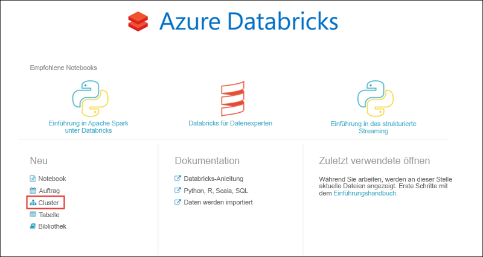
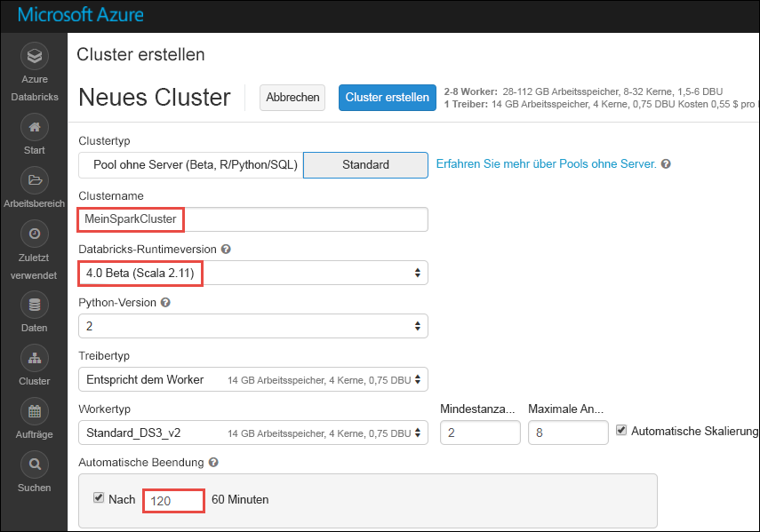

# <a name="tutorial-sentiment-analysis-on-streaming-data-using-azure-databricks"></a>Tutorial: Standpunktanalyse für Streamingdaten mit Azure Databricks

In diesem Tutorial erfahren Sie, wie Sie mit Azure Databricks nahezu in Echtzeit eine Standpunktanalyse für Streamingdaten durchführen. Sie richten ein Datenerfassungssystem mit Azure Event Hubs ein. Sie nutzen die Nachrichten von Event Hubs in Azure Databricks, indem Sie den Spark-Event Hubs-Connector verwenden. Abschließend verwenden Sie Microsoft Cognitive Services-APIs zum Durchführen der Standpunktanalyse für die gestreamten Daten.

Am Ende dieses Tutorials verfügen Sie über gestreamte Tweets von Twitter, die den Begriff „Azure“ enthalten und für die die Standpunktanalyse durchgeführt wird.

In der folgenden Abbildung ist der Anwendungsfluss dargestellt:


Dieses Tutorial enthält die folgenden Aufgaben:

> [!div class="checklist"]
> * Erstellen eines Azure Databricks-Arbeitsbereichs
> * Erstellen eines Spark-Clusters in Azure Databricks
> * Erstellen einer Twitter-App für den Zugriff auf Streamingdaten
> * Erstellen von Notebooks in Azure Databricks
> * Anfügen von Bibliotheken für Event Hubs und die Twitter-API
> * Erstellen eines Microsoft Cognitive Services-Kontos und Abrufen des Zugriffsschlüssels
> * Senden von Tweets an Event Hubs
> * Lesen von Tweets von Event Hubs
> * Durchführen der Standpunktanalyse für Tweets

Wenn Sie kein Azure-Abonnement besitzen, können Sie ein [kostenloses Konto](https://azure.microsoft.com/free/) erstellen, bevor Sie beginnen.

> [!Note]
> Dieses Tutorial kann nicht mit dem **kostenlosen Azure-Testabonnement** absolviert werden.
> Navigieren Sie vor dem Erstellen des Clusters zu Ihrem Profil, und legen Sie für Ihr Abonnement die **nutzungsbasierte Bezahlung** fest, um für die Erstellung des Azure Databricks-Clusters ein kostenloses Konto zu verwenden. Weitere Informationen finden Sie unter [Kostenloses Azure-Konto](https://azure.microsoft.com/free/).

## <a name="prerequisites"></a>Voraussetzungen

Vergewissern Sie sich zunächst, dass die folgenden Anforderungen erfüllt sind bzw. dass Folgendes vorhanden ist:
- Ein Azure Event Hubs-Namespace
- Ein Event Hub innerhalb des Namespace.
- Die Verbindungszeichenfolge für den Zugriff auf den Event Hubs-Namespace. Die Verbindungszeichenfolge sollte in etwa das folgende Format haben: `Endpoint=sb://<namespace>.servicebus.windows.net/;SharedAccessKeyName=<key name>;SharedAccessKey=<key value>`.
- Der Name der SAS-Richtlinie und der Richtlinienschlüssel für Event Hubs.

Sie können diese Anforderungen erfüllen, indem Sie die Schritte im Artikel [Erstellen eines Event Hubs-Namespace und eines Event Hubs mithilfe des Azure-Portals](../event-hubs/event-hubs-create.md) ausführen.

## <a name="sign-in-to-the-azure-portal"></a>Melden Sie sich auf dem Azure-Portal an.

Melden Sie sich beim [Azure-Portal](https://portal.azure.com/) an.

## <a name="create-an-azure-databricks-workspace"></a>Erstellen eines Azure Databricks-Arbeitsbereichs

In diesem Abschnitt erstellen Sie einen Azure Databricks-Arbeitsbereich über das Azure-Portal.

1. Klicken Sie im Azure-Portal auf **Ressource erstellen** > **Daten + Analysen** > **Azure Databricks**.

    

3. Geben Sie unter **Azure Databricks-Dienst** die Werte für die Erstellung eines Databricks-Arbeitsbereichs an.

    

    Geben Sie außerdem die folgenden Werte an:

    |Eigenschaft  |BESCHREIBUNG  |
    |---------|---------|
    |**Arbeitsbereichsname**     | Geben Sie einen Namen für Ihren Databricks-Arbeitsbereich an.        |
    |**Abonnement**     | Wählen Sie in der Dropdownliste Ihr Azure-Abonnement aus.        |
    |**Ressourcengruppe**     | Geben Sie an, ob Sie eine neue Ressourcengruppe erstellen oder eine vorhandene Ressourcengruppe verwenden möchten. Eine Ressourcengruppe ist ein Container, der verwandte Ressourcen für eine Azure-Lösung enthält. Weitere Informationen finden Sie in der [Übersicht über den Azure Resource Manager](../azure-resource-manager/resource-group-overview.md). |
    |**Location**     | Wählen Sie **USA, Osten 2** aus. Informationen zu weiteren verfügbaren Regionen finden Sie unter [Verfügbare Produkte nach Region](https://azure.microsoft.com/regions/services/).        |
    |**Tarif**     |  Wählen Sie zwischen **Standard** und **Premium**. Weitere Informationen zu diesen Tarifen, finden Sie unter [Azure Databricks – Preise](https://azure.microsoft.com/pricing/details/databricks/).       |

    Aktivieren Sie das Kontrollkästchen **An Dashboard anheften**, und klicken Sie anschließend auf **Erstellen**.

4. Die Kontoerstellung dauert einige Minuten. Während der Erstellung des Kontos wird im Portal auf der rechten Seite die Kachel **Submitting deployment for Azure Databricks** (Bereitstellung für Azure Databricks wird übermittelt) angezeigt. Möglicherweise müssen Sie im Dashboard nach rechts scrollen, um die Kachel zu sehen. Am oberen Bildschirmrand wird auch eine Statusanzeige angezeigt. Sie können den Status beider Bereiche beobachten.

    

## <a name="create-a-spark-cluster-in-databricks"></a>Erstellen eines Spark-Clusters in Databricks

1. Navigieren Sie im Azure-Portal zum erstellten Databricks-Arbeitsbereich, und klicken Sie auf **Launch Workspace** (Arbeitsbereich starten).

2. Sie werden zum Azure Databricks-Portal weitergeleitet. Klicken Sie im Portal auf **Cluster**.

    

3. Geben Sie auf der Seite **Neuer Cluster** die erforderlichen Werte an, um einen Cluster zu erstellen.

    

    Übernehmen Sie alle anderen Standardwerte bis auf Folgendes:

   * Geben Sie einen Namen für den Cluster ein.
   * Erstellen Sie für diesen Artikel einen Cluster mit der Laufzeit **4.0 (Beta)** .
   * Aktivieren Sie das Kontrollkästchen **Terminate after \_\_ minutes of inactivity** (Nach \_\_ Minuten Inaktivität beenden). Geben Sie an, nach wie vielen Minuten der Cluster beendet werden soll, wenn er nicht verwendet wird.

     Klicken Sie auf **Cluster erstellen**. Sobald der Cluster ausgeführt wird, können Sie Notizbücher an den Cluster anfügen und Spark-Aufträge ausführen.

## <a name="create-a-twitter-application"></a>Erstellen einer Twitter-Anwendung

Für den Empfang eines Datenstroms mit Tweets müssen Sie eine Anwendung in Twitter erstellen. Führen Sie die Schritte aus, um eine Twitter-Anwendung zu erstellen, und notieren Sie sich die Werte, die Sie zum Durcharbeiten dieses Tutorials benötigen.

1. Navigieren Sie im Webbrowser zur Anwendungsverwaltung von Twitter ([Twitter Application Management](https://apps.twitter.com/)), und wählen Sie **Create New App** (Neue App erstellen).

    

2. Geben Sie auf der Seite **Create an application** (Anwendung erstellen) die Details für die neue App an, und klicken Sie anschließend auf **Create your Twitter application** (Twitter-Anwendung erstellen).

    

3. Klicken Sie auf der Anwendungsseite auf die Registerkarte **Keys and Access Tokens** (Schlüssel und Zugriffstoken), und kopieren Sie die Werte für **Consumer Key** (Consumerschlüssel) und **Consumer Secret** (Consumergeheimnis). Klicken Sie außerdem auf **Create my access token** (Mein Zugriffstoken erstellen), um die Zugriffstoken zu generieren. Kopieren Sie die Werte für **Access Token** (Zugriffstoken) und **Access Token Secret** (Zugriffstokengeheimnis).

    

Speichern Sie die Werte, die Sie für die Twitter-Anwendung abgerufen haben. Diese werden im weiteren Verlauf des Tutorials benötigt.

## <a name="attach-libraries-to-spark-cluster"></a>Anfügen von Bibliotheken an einen Spark-Cluster

In diesem Tutorial verwenden Sie die Twitter-APIs, um Tweets an Event Hubs zu senden. Außerdem verwenden Sie den [Apache Spark-Event Hubs-Connector](https://github.com/Azure/azure-event-hubs-spark), um Daten in Azure Event Hubs zu lesen und zu schreiben. Fügen Sie diese APIs als Bibliotheken in Azure Databricks hinzu, und ordnen Sie sie dann Ihrem Spark-Cluster zu, um sie als Teil Ihres Clusters zu nutzen. In der folgenden Anleitung wird veranschaulicht, wie Sie die Bibliothek in Ihrem Arbeitsbereich dem Ordner **Freigegeben** hinzufügen.

1. Klicken Sie im Azure Databricks-Arbeitsbereich auf **Arbeitsbereich** und anschließend mit der rechten Maustaste auf **Freigegeben**. Klicken Sie im Kontextmenü auf **Erstellen** > **Bibliothek**.

   

2. Wählen Sie auf der Seite „Neue Bibliothek“ unter **Quelle** die Option **Maven Coordinate** (Maven-Koordinate) aus. Geben Sie unter **Koordinate** die Koordinate für das Paket ein, das Sie hinzufügen möchten. Im Anschluss finden Sie die Maven-Koordinaten für die Bibliotheken, die in diesem Tutorial verwendet werden:

   * Spark-Event Hubs-Connector: `com.microsoft.azure:azure-eventhubs-spark_2.11:2.3.5`
   * Twitter-API: `org.twitter4j:twitter4j-core:4.0.6`

     

3. Klicken Sie auf **Bibliothek erstellen**.

4. Wählen Sie den Ordner aus, dem Sie die Bibliothek hinzugefügt haben, und wählen Sie anschließend den Namen der Bibliothek aus.

    

5. Wählen Sie auf der Seite für die Bibliothek den Cluster aus, in dem Sie die Bibliothek verwenden möchten. Nachdem die Bibliothek dem Cluster zugeordnet wurde, ändert sich der Status sofort in **Angefügt**.

    

6. Wiederholen Sie diese Schritte für das Twitter-Paket `twitter4j-core:4.0.6`.

## <a name="get-a-cognitive-services-access-key"></a>Abrufen eines Cognitive Services-Zugriffsschlüssels

In diesem Tutorial verwenden Sie die [Azure Cognitive Services-Textanalyse-APIs](../cognitive-services/text-analytics/overview.md), um nahezu in Echtzeit eine Standpunktanalyse für einen Datenstrom mit Tweets durchzuführen. Vor der Verwendung der APIs müssen Sie in Azure ein Azure Cognitive Services-Konto erstellen und einen Zugriffsschlüssel für die Nutzung der Textanalyse-APIs abrufen.

1. Melden Sie sich beim [Azure-Portal](https://portal.azure.com/) an.

2. Wählen Sie **+ Ressource erstellen**.

3. Wählen Sie unter „Azure Marketplace“ die Option **KI + Cognitive Services** > **Textanalyse-API**.

    

4. Geben Sie im Dialogfeld **Erstellen** die folgenden Werte an:

    

   - Geben Sie einen Namen für das Cognitive Services-Konto ein.
   - Wählen Sie das Azure-Abonnement aus, unter dem das Konto erstellt wird.
   - Wählen Sie einen Azure-Standort aus.
   - Wählen Sie einen Tarif für den Dienst aus. Weitere Informationen zu den Preisen von Cognitive Services finden Sie unter [Cognitive Services-Preise](https://azure.microsoft.com/pricing/details/cognitive-services/).
   - Geben Sie an, ob Sie eine neue Ressourcengruppe erstellen oder eine vorhandene auswählen möchten.

     Klicken Sie auf **Erstellen**.

5. Wählen Sie nach der Erstellung des Kontos auf der Registerkarte **Übersicht** die Option **Zugriffsschlüssel anzeigen** aus.

    

    Kopieren Sie außerdem einen Teil der Endpunkt-URL, wie im Screenshot dargestellt. Sie benötigen diese URL im Tutorial.

6. Wählen Sie unter **Schlüssel verwalten** das Kopiersymbol für den gewünschten Schlüssel aus.

    

7. Speichern Sie die Werte für die Endpunkt-URL und den Zugriffsschlüssel, die Sie in diesem Schritt abgerufen haben. Sie benötigen sie später in diesem Tutorial.

## <a name="create-notebooks-in-databricks"></a>Erstellen von Notebooks in Databricks

In diesem Abschnitt erstellen Sie zwei Notebooks mit den folgenden Namen im Databricks-Arbeitsbereich.

- **SendTweetsToEventHub**: Ein Producer-Notebook zum Abrufen von Tweets von Twitter und Streamen an Event Hubs.
- **AnalyzeTweetsFromEventHub**: Ein Consumer-Notebook zum Lesen der Tweets von Event Hubs und Durchführen der Standpunktanalyse.

1. Wählen Sie im linken Bereich die Option **Arbeitsbereich**. Wählen Sie in der Dropdownliste **Arbeitsbereich** die Option **Erstellen** und dann **Notebook**.

    

2. Geben Sie im Dialogfeld **Notizbuch erstellen** den Namen **SendTweetsToEventHub** ein, wählen Sie **Scala** als Sprache aus, und wählen Sie den zuvor erstellten Spark-Cluster aus.

    

    Klicken Sie auf **Erstellen**.

3. Wiederholen Sie die Schritte zum Erstellen des Notebooks **AnalyzeTweetsFromEventHub**.

## <a name="send-tweets-to-event-hubs"></a>Senden von Tweets an Event Hubs

Fügen Sie im Notebook **SendTweetsToEventHub** den folgenden Code ein, und ersetzen Sie den Platzhalter durch Werte für Ihren Event Hubs-Namespace und die zuvor erstellte Twitter-Anwendung. Mit diesem Notebook werden Tweets mit dem Schlüsselwort „Azure“ in Echtzeit an Event Hubs gestreamt.

```scala
import java.util._
import scala.collection.JavaConverters._
import com.microsoft.azure.eventhubs._
import java.util.concurrent._

val namespaceName = "<EVENT HUBS NAMESPACE>"
val eventHubName = "<EVENT HUB NAME>"
val sasKeyName = "<POLICY NAME>"
val sasKey = "<POLICY KEY>"
val connStr = new ConnectionStringBuilder()
            .setNamespaceName(namespaceName)
            .setEventHubName(eventHubName)
            .setSasKeyName(sasKeyName)
            .setSasKey(sasKey)

val pool = Executors.newScheduledThreadPool(1)
val eventHubClient = EventHubClient.create(connStr.toString(), pool)

def sendEvent(message: String) = {
  val messageData = EventData.create(message.getBytes("UTF-8"))
  eventHubClient.get().send(messageData)
  System.out.println("Sent event: " + message + "\n")
}

import twitter4j._
import twitter4j.TwitterFactory
import twitter4j.Twitter
import twitter4j.conf.ConfigurationBuilder

// Twitter configuration!
// Replace values below with yours

val twitterConsumerKey = "<CONSUMER KEY>"
val twitterConsumerSecret = "<CONSUMER SECRET>"
val twitterOauthAccessToken = "<ACCESS TOKEN>"
val twitterOauthTokenSecret = "<TOKEN SECRET>"

val cb = new ConfigurationBuilder()
  cb.setDebugEnabled(true)
  .setOAuthConsumerKey(twitterConsumerKey)
  .setOAuthConsumerSecret(twitterConsumerSecret)
  .setOAuthAccessToken(twitterOauthAccessToken)
  .setOAuthAccessTokenSecret(twitterOauthTokenSecret)

val twitterFactory = new TwitterFactory(cb.build())
val twitter = twitterFactory.getInstance()

// Getting tweets with keyword "Azure" and sending them to the Event Hub in realtime!

val query = new Query(" #Azure ")
query.setCount(100)
query.lang("en")
var finished = false
while (!finished) {
  val result = twitter.search(query)
  val statuses = result.getTweets()
  var lowestStatusId = Long.MaxValue
  for (status <- statuses.asScala) {
    if(!status.isRetweet()){
      sendEvent(status.getText())
    }
    lowestStatusId = Math.min(status.getId(), lowestStatusId)
    Thread.sleep(2000)
  }
  query.setMaxId(lowestStatusId - 1)
}

// Closing connection to the Event Hub
 eventHubClient.get().close()
```

Drücken Sie zum Ausführen des Notebooks **UMSCHALT+EINGABE**. Die Ausgabe sieht wie im folgenden Codeausschnitt aus. Jedes Ereignis der Ausgabe ist ein Tweet, der in Event Hubs erfasst wird.

    Sent event: @Microsoft and @Esri launch Geospatial AI on Azure https://t.co/VmLUCiPm6q via @geoworldmedia #geoai #azure #gis #ArtificialIntelligence

    Sent event: Public preview of Java on App Service, built-in support for Tomcat and OpenJDK
    https://t.co/7vs7cKtvah
    #cloudcomputing #Azure

    Sent event: 4 Killer #Azure Features for #Data #Performance https://t.co/kpIb7hFO2j by @RedPixie

    Sent event: Migrate your databases to a fully managed service with Azure SQL Database Managed Instance | #Azure | #Cloud https://t.co/sJHXN4trDk

    Sent event: Top 10 Tricks to #Save Money with #Azure Virtual Machines https://t.co/F2wshBXdoz #Cloud

    ...
    ...

## <a name="read-tweets-from-event-hubs"></a>Lesen von Tweets aus Event Hubs

Fügen Sie im Notebook **AnalyzeTweetsFromEventHub** den folgenden Code ein, und ersetzen Sie den Platzhalter durch Werte für Ihre zuvor erstellten Azure Event Hubs. Mit diesem Notebook werden die Tweets gelesen, die Sie weiter oben mit dem Notebook **SendTweetsToEventHub** in Event Hubs gestreamt haben.

```scala
import org.apache.spark.eventhubs._

// Build connection string with the above information
val namespaceName = "<EVENT HUBS NAMESPACE>"
val eventHubName = "<EVENT HUB NAME>"
val sasKeyName = "<POLICY NAME>"
val sasKey = "<POLICY KEY>"
val connectionString = ConnectionStringBuilder()
            .setNamespaceName(namespaceName)
            .setEventHubName(eventHubName)
            .setSasKeyName(sasKeyName)
            .setSasKey(sasKey)

val customEventhubParameters =
  EventHubsConf(connectionString.toString())
  .setMaxEventsPerTrigger(5)

val incomingStream = spark.readStream.format("eventhubs").options(customEventhubParameters.toMap).load()

incomingStream.printSchema

// Sending the incoming stream into the console.
// Data comes in batches!
incomingStream.writeStream.outputMode("append").format("console").option("truncate", false).start().awaitTermination()
```

Sie erhalten die folgende Ausgabe:

    root
     |-- body: binary (nullable = true)
     |-- offset: long (nullable = true)
     |-- seqNumber: long (nullable = true)
     |-- enqueuedTime: long (nullable = true)
     |-- publisher: string (nullable = true)
     |-- partitionKey: string (nullable = true)

    -------------------------------------------
    Batch: 0
    -------------------------------------------
    +------+------+--------------+---------------+---------+------------+
    |body  |offset|sequenceNumber|enqueuedTime   |publisher|partitionKey|
    +------+------+--------------+---------------+---------+------------+
    |[50 75 62 6C 69 63 20 70 72 65 76 69 65 77 20 6F 66 20 4A 61 76 61 20 6F 6E 20 41 70 70 20 53 65 72 76 69 63 65 2C 20 62 75 69 6C 74 2D 69 6E 20 73 75 70 70 6F 72 74 20 66 6F 72 20 54 6F 6D 63 61 74 20 61 6E 64 20 4F 70 65 6E 4A 44 4B 0A 68 74 74 70 73 3A 2F 2F 74 2E 63 6F 2F 37 76 73 37 63 4B 74 76 61 68 20 0A 23 63 6C 6F 75 64 63 6F 6D 70 75 74 69 6E 67 20 23 41 7A 75 72 65]                              |0     |0             |2018-03-09 05:49:08.86 |null     |null        |
    |[4D 69 67 72 61 74 65 20 79 6F 75 72 20 64 61 74 61 62 61 73 65 73 20 74 6F 20 61 20 66 75 6C 6C 79 20 6D 61 6E 61 67 65 64 20 73 65 72 76 69 63 65 20 77 69 74 68 20 41 7A 75 72 65 20 53 51 4C 20 44 61 74 61 62 61 73 65 20 4D 61 6E 61 67 65 64 20 49 6E 73 74 61 6E 63 65 20 7C 20 23 41 7A 75 72 65 20 7C 20 23 43 6C 6F 75 64 20 68 74 74 70 73 3A 2F 2F 74 2E 63 6F 2F 73 4A 48 58 4E 34 74 72 44 6B]            |168   |1             |2018-03-09 05:49:24.752|null     |null        |
    +------+------+--------------+---------------+---------+------------+

    -------------------------------------------
    Batch: 1
    -------------------------------------------
    ...
    ...

Da die Ausgabe in einem Binärmodus vorliegt, verwenden Sie den folgenden Codeausschnitt, um sie in eine Zeichenfolge zu konvertieren.

```scala
import org.apache.spark.sql.types._
import org.apache.spark.sql.functions._

// Event Hub message format is JSON and contains "body" field
// Body is binary, so we cast it to string to see the actual content of the message
val messages =
  incomingStream
  .withColumn("Offset", $"offset".cast(LongType))
  .withColumn("Time (readable)", $"enqueuedTime".cast(TimestampType))
  .withColumn("Timestamp", $"enqueuedTime".cast(LongType))
  .withColumn("Body", $"body".cast(StringType))
  .select("Offset", "Time (readable)", "Timestamp", "Body")

messages.printSchema

messages.writeStream.outputMode("append").format("console").option("truncate", false).start().awaitTermination()
```

Die Ausgabe sieht nun in etwa wie im folgenden Codeausschnitt aus:

    root
     |-- Offset: long (nullable = true)
     |-- Time (readable): timestamp (nullable = true)
     |-- Timestamp: long (nullable = true)
     |-- Body: string (nullable = true)

    -------------------------------------------
    Batch: 0
    -------------------------------------------
    +------+-----------------+----------+-------+
    |Offset|Time (readable)  |Timestamp |Body
    +------+-----------------+----------+-------+
    |0     |2018-03-09 05:49:08.86 |1520574548|Public preview of Java on App Service, built-in support for Tomcat and OpenJDK
    https://t.co/7vs7cKtvah
    #cloudcomputing #Azure          |
    |168   |2018-03-09 05:49:24.752|1520574564|Migrate your databases to a fully managed service with Azure SQL Database Managed Instance | #Azure | #Cloud https://t.co/sJHXN4trDk    |
    |0     |2018-03-09 05:49:02.936|1520574542|@Microsoft and @Esri launch Geospatial AI on Azure https://t.co/VmLUCiPm6q via @geoworldmedia #geoai #azure #gis #ArtificialIntelligence|
    |176   |2018-03-09 05:49:20.801|1520574560|4 Killer #Azure Features for #Data #Performance https://t.co/kpIb7hFO2j by @RedPixie                                                    |
    +------+-----------------+----------+-------+
    -------------------------------------------
    Batch: 1
    -------------------------------------------
    ...
    ...

Sie haben nun mithilfe des Event Hubs-Connectors für Apache Spark Daten aus Azure Event Hubs nahezu in Echtzeit in Azure Databricks gestreamt. Weitere Informationen zur Verwendung des Event Hubs-Connectors für Spark finden Sie in der [Connector-Dokumentation](https://github.com/Azure/azure-event-hubs-spark/tree/master/docs).

## <a name="run-sentiment-analysis-on-tweets"></a>Durchführen der Standpunktanalyse für Tweets

In diesem Abschnitt führen Sie eine Standpunktanalyse für Tweets durch, indem Sie die Twitter-API verwenden. Für diesen Abschnitt fügen Sie die Codeausschnitte wieder dem Notebook **AnalyzeTweetsFromEventHub** hinzu.

Fügen Sie im Notebook zunächst einen neue Codezelle hinzu, und fügen Sie den unten angegebenen Codeausschnitt ein. Mit diesem Codeausschnitt werden die Datentypen für die API für Sprache und Standpunkt definiert.

```scala
import java.io._
import java.net._
import java.util._

case class Language(documents: Array[LanguageDocuments], errors: Array[Any]) extends Serializable
case class LanguageDocuments(id: String, detectedLanguages: Array[DetectedLanguages]) extends Serializable
case class DetectedLanguages(name: String, iso6391Name: String, score: Double) extends Serializable

case class Sentiment(documents: Array[SentimentDocuments], errors: Array[Any]) extends Serializable
case class SentimentDocuments(id: String, score: Double) extends Serializable

case class RequestToTextApi(documents: Array[RequestToTextApiDocument]) extends Serializable
case class RequestToTextApiDocument(id: String, text: String, var language: String = "") extends Serializable
```

Fügen Sie eine neue Codezelle hinzu, und fügen Sie den unten angegebenen Codeausschnitt ein. Mit diesem Codeausschnitt wird ein Objekt definiert, das Funktionen zum Aufrufen der Textanalyse-API für die Durchführung der Spracherkennung und Standpunktanalyse enthält. Stellen Sie sicher, dass Sie die Platzhalter `<PROVIDE ACCESS KEY HERE>` und `<PROVIDE REGION HERE>` durch die Werte ersetzen, die Sie für Ihr Cognitive Services-Konto abgerufen haben.

```scala
import javax.net.ssl.HttpsURLConnection
import com.google.gson.Gson
import com.google.gson.GsonBuilder
import com.google.gson.JsonObject
import com.google.gson.JsonParser
import scala.util.parsing.json._

object SentimentDetector extends Serializable {

    // Cognitive Services API connection settings
    val accessKey = "<PROVIDE ACCESS KEY HERE>"
    val host = "https://<PROVIDE REGION HERE>.api.cognitive.microsoft.com"
    val languagesPath = "/text/analytics/v2.0/languages"
    val sentimentPath = "/text/analytics/v2.0/sentiment"
    val languagesUrl = new URL(host+languagesPath)
    val sentimenUrl = new URL(host+sentimentPath)
    val g = new Gson

    def getConnection(path: URL): HttpsURLConnection = {
        val connection = path.openConnection().asInstanceOf[HttpsURLConnection]
        connection.setRequestMethod("POST")
        connection.setRequestProperty("Content-Type", "text/json")
        connection.setRequestProperty("Ocp-Apim-Subscription-Key", accessKey)
        connection.setDoOutput(true)
        return connection
    }

    def prettify (json_text: String): String = {
        val parser = new JsonParser()
        val json = parser.parse(json_text).getAsJsonObject()
        val gson = new GsonBuilder().setPrettyPrinting().create()
        return gson.toJson(json)
    }

    // Handles the call to Cognitive Services API.
    def processUsingApi(request: RequestToTextApi, path: URL): String = {
        val requestToJson = g.toJson(request)
        val encoded_text = requestToJson.getBytes("UTF-8")
        val connection = getConnection(path)
        val wr = new DataOutputStream(connection.getOutputStream())
        wr.write(encoded_text, 0, encoded_text.length)
        wr.flush()
        wr.close()

        val response = new StringBuilder()
        val in = new BufferedReader(new InputStreamReader(connection.getInputStream()))
        var line = in.readLine()
        while (line != null) {
            response.append(line)
            line = in.readLine()
        }
        in.close()
        return response.toString()
    }

    // Calls the language API for specified documents.
    def getLanguage (inputDocs: RequestToTextApi): Option[Language] = {
        try {
            val response = processUsingApi(inputDocs, languagesUrl)
            // In case we need to log the json response somewhere
            val niceResponse = prettify(response)
            // Deserializing the JSON response from the API into Scala types
            val language = g.fromJson(niceResponse, classOf[Language])
            if (language.documents(0).detectedLanguages(0).iso6391Name == "(Unknown)")
                return None
            return Some(language)
        } catch {
            case e: Exception => return None
        }
    }

    // Calls the sentiment API for specified documents. Needs a language field to be set for each of them.
    def getSentiment (inputDocs: RequestToTextApi): Option[Sentiment] = {
        try {
            val response = processUsingApi(inputDocs, sentimenUrl)
            val niceResponse = prettify(response)
            // Deserializing the JSON response from the API into Scala types
            val sentiment = g.fromJson(niceResponse, classOf[Sentiment])
            return Some(sentiment)
        } catch {
            case e: Exception => return None
        }
    }
}
```

Fügen Sie eine weitere Zelle hinzu, um eine benutzerdefinierte Spark-Funktion (User Defined Function, UDF) zu definieren, die die Stimmung bestimmt.

```scala
// User Defined Function for processing content of messages to return their sentiment.
val toSentiment =
    udf((textContent: String) =>
        {
            val inputObject = new RequestToTextApi(Array(new RequestToTextApiDocument(textContent, textContent)))
            val detectedLanguage = SentimentDetector.getLanguage(inputObject)
            detectedLanguage match {
                case Some(language) =>
                    if(language.documents.size > 0) {
                        inputObject.documents(0).language = language.documents(0).detectedLanguages(0).iso6391Name
                        val sentimentDetected = SentimentDetector.getSentiment(inputObject)
                        sentimentDetected match {
                            case Some(sentiment) => {
                                if(sentiment.documents.size > 0) {
                                    sentiment.documents(0).score.toString()
                                }
                                else {
                                    "Error happened when getting sentiment: " + sentiment.errors(0).toString
                                }
                            }
                            case None => "Couldn't detect sentiment"
                        }
                    }
                    else {
                        "Error happened when getting language" + language.errors(0).toString
                    }
                case None => "Couldn't detect language"
            }
        }
    )
```

Fügen Sie eine letzte Codezelle hinzu, um einen Datenrahmen mit dem Inhalt des Tweets und des Standpunkts vorzubereiten, der dem Tweet zugeordnet ist.

```scala
// Prepare a dataframe with Content and Sentiment columns
val streamingDataFrame = incomingStream.selectExpr("cast (body as string) AS Content").withColumn("Sentiment", toSentiment($"Content"))

// Display the streaming data with the sentiment
streamingDataFrame.writeStream.outputMode("append").format("console").option("truncate", false).start().awaitTermination()
```

Die Ausgabe sollte in etwa wie im folgenden Codeausschnitt aussehen:

    -------------------------------------------
    Batch: 0
    -------------------------------------------
    +--------------------------------+------------------+
    |Content                         |Sentiment         |
    +--------------------------------+------------------+
    |Public preview of Java on App Service, built-in support for Tomcat and OpenJDK
    https://t.co/7vs7cKtvah   #cloudcomputing #Azure          |0.7761918306350708|
    |Migrate your databases to a fully managed service with Azure SQL Database Managed Instance | #Azure | #Cloud https://t.co/sJHXN4trDk    |0.8558163642883301|
    |@Microsoft and @Esri launch Geospatial AI on Azure https://t.co/VmLUCiPm6q via @geoworldmedia #geoai #azure #gis #ArtificialIntelligence|0.5               |
    |4 Killer #Azure Features for #Data #Performance https://t.co/kpIb7hFO2j by @RedPixie                                                    |0.5               |
    +--------------------------------+------------------+

Je näher der Wert in der Spalte **Sentiment** (Standpunkt) an **1** liegt, desto besser ist die Erfahrung mit Azure. Wenn der Wert eher in Richtung **0** geht, weist dies darauf hin, dass es für Benutzer bei der Verwendung von Microsoft Azure zu Problemen gekommen ist.

Das ist alles! Mit Azure Databricks haben Sie Daten erfolgreich in Azure Event Hubs gestreamt, die Daten des Datenstroms mit dem Event Hubs-Connector genutzt und dann nahezu in Echtzeit eine Standpunktanalyse für die Streamingdaten durchgeführt.

## <a name="clean-up-resources"></a>Bereinigen von Ressourcen

Nach Abschluss des Tutorials können Sie den Cluster beenden. Klicken Sie hierzu im linken Bereich des Azure Databricks-Arbeitsbereichs auf **Cluster**. Bewegen Sie den Cursor zum Beenden des Clusters auf die Auslassungspunkte in der Spalte **Aktionen**, und klicken Sie auf das Symbol **Beenden**.


Wenn Sie den Cluster nicht manuell beenden, wird er automatisch beendet, sofern Sie bei der Erstellung des Clusters das Kontrollkästchen **Terminate after \_\_ minutes of inactivity** (Nach \_\_ Minuten Inaktivität beenden) aktiviert haben. Der Cluster wird dann automatisch beendet, wenn er für den angegebenen Zeitraum inaktiv war.

## <a name="next-steps"></a>Nächste Schritte
In diesem Tutorial wurde beschrieben, wie Sie Azure Databricks zum Streamen von Daten in Azure Event Hubs verwenden und die Streamingdaten dann in Echtzeit von Event Hubs lesen. Es wurde Folgendes vermittelt:
> [!div class="checklist"]
> * Erstellen eines Azure Databricks-Arbeitsbereichs
> * Erstellen eines Spark-Clusters in Azure Databricks
> * Erstellen einer Twitter-App für den Zugriff auf Streamingdaten
> * Erstellen von Notebooks in Azure Databricks
> * Hinzufügen und Anfügen von Bibliotheken für Event Hubs und die Twitter-API
> * Erstellen eines Microsoft Cognitive Services-Kontos und Abrufen des Zugriffsschlüssels
> * Senden von Tweets an Event Hubs
> * Lesen von Tweets von Event Hubs
> * Durchführen der Standpunktanalyse für Tweets

Fahren Sie mit dem nächsten Tutorial fort, um sich über die Durchführung von Machine Learning-Aufgaben mit Azure Databricks zu informieren.

> [!div class="nextstepaction"]
>[Machine Learning mit Azure Databricks](https://docs.azuredatabricks.net/spark/latest/mllib/decision-trees.html)
