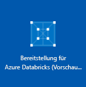
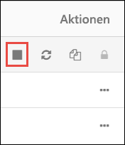

# Tutorial: Streamen von Daten an Azure Databricks unter Verwendung von Event Hubs

In diesem Tutorial verbinden Sie ein Datenerfassungssystem mit Azure Databricks, um Echtzeitdaten in einen Apache Spark-Cluster zu streamen. Sie richten ein Echtzeit-Datenerfassungssystem mit Azure Event Hubs ein und verbinden es zur Verarbeitung der eingehenden Nachrichten mit Azure Databricks. Für den Zugriff auf in Echtzeit gestreamte Daten verwenden Sie Twitter-APIs, um Tweets in Event Hubs zu erfassen. Sobald sich die Daten in Azure Databricks befinden, können Sie Analyseaufträge ausführen, um die Daten näher zu analysieren. In diesem Tutorial extrahieren Sie Tweets, die den Begriff „Azure“ enthalten.

Der folgende Screenshot zeigt den Anwendungsfluss:

 

Dieses Tutorial enthält die folgenden Aufgaben: 

> [!div class="checklist"]
> * Erstellen eines Azure Databricks-Arbeitsbereichs
> * Erstellen eines Spark-Clusters in Azure Databricks
> * Erstellen einer Twitter-App für den Zugriff auf Echtzeitdaten
> * Erstellen von Notebooks in Azure Databricks
> * Anfügen von Bibliotheken für Event Hubs und die Twitter-API
> * Senden von Tweets an Event Hubs
> * Lesen von Tweets aus Event Hubs

Wenn Sie kein Azure-Abonnement besitzen, können Sie ein [kostenloses Konto](https://azure.microsoft.com/free/) erstellen, bevor Sie beginnen.

## Voraussetzungen

Vergewissern Sie sich zunächst, dass die folgenden Anforderungen erfüllt sind bzw. dass Folgendes vorhanden ist:
- Ein Azure Event Hubs-Namespace.
- Ein Event Hub innerhalb des Namespace.
- Die Verbindungszeichenfolge für den Zugriff auf den Event Hubs-Namespace. Die Verbindungszeichenfolge sollte in etwa das folgende Format haben: `Endpoint=sb://<namespace>.servicebus.windows.net/;SharedAccessKeyName=<key name>;SharedAccessKey=<key value>”`.
- Der Name der SAS-Richtlinie und der Richtlinienschlüssel für Event Hubs.

Sie können diese Anforderungen erfüllen, indem Sie die Schritte im Artikel [Erstellen eines Event Hubs-Namespace und eines Event Hubs mithilfe des Azure-Portals](../event-hubs/event-hubs-create.md) ausführen.

## Anmelden beim Azure-Portal

Melden Sie sich beim [Azure-Portal](https://portal.azure.com/)an.

## Erstellen eines Azure Databricks-Arbeitsbereichs

In diesem Abschnitt erstellen Sie einen Azure Databricks-Arbeitsbereich über das Azure-Portal. 

1. Klicken Sie im Azure-Portal auf **Ressource erstellen** > **Daten + Analysen** > **Azure Databricks (Vorschauversion)**. 

    

2. Klicken Sie unter **Azure Databricks (Vorschauversion)** auf **Erstellen**.

3. Geben Sie unter **Azure Databricks-Dienst** die Werte für die Erstellung eines Databricks-Arbeitsbereichs an.

    

    Geben Sie außerdem die folgenden Werte an: 
     
    |Eigenschaft  |Beschreibung  |
    |---------|---------|
    |**Arbeitsbereichname**     | Geben Sie einen Namen für Ihren Databricks-Arbeitsbereich an.        |
    |**Abonnement**     | Wählen Sie in der Dropdownliste Ihr Azure-Abonnement aus.        |
    |**Ressourcengruppe**     | Geben Sie an, ob Sie eine neue Ressourcengruppe erstellen oder eine vorhandene Ressourcengruppe verwenden möchten. Eine Ressourcengruppe ist ein Container, der verwandte Ressourcen für eine Azure-Lösung enthält. Weitere Informationen finden Sie in der [Übersicht über den Azure Resource Manager](../azure-resource-manager/resource-group-overview.md). |
    |**Location**     | Wählen Sie **USA, Osten 2** aus. Informationen zu weiteren verfügbaren Regionen finden Sie unter [Verfügbare Produkte nach Region](https://azure.microsoft.com/regions/services/).        |
    |**Tarif**     |  Wählen Sie zwischen **Standard** und **Premium**. Weitere Informationen zu diesen Tarifen, finden Sie unter [Azure Databricks – Preise](https://azure.microsoft.com/pricing/details/databricks/).       |

    Aktivieren Sie das Kontrollkästchen **An Dashboard anheften**, und klicken Sie anschließend auf **Erstellen**.

4. Die Kontoerstellung dauert einige Minuten. Während der Erstellung des Kontos wird im Portal auf der rechten Seite die Kachel **Submitting deployment for Azure Databricks** (Bereitstellung für Azure Databricks wird übermittelt) angezeigt. Möglicherweise müssen Sie im Dashboard nach rechts scrollen, um die Kachel zu sehen. Am oberen Bildschirmrand wird auch eine Statusanzeige angezeigt. Sie können den Status beider Bereiche beobachten.

    

## Erstellen eines Spark-Clusters in Databricks

1. Navigieren Sie im Azure-Portal zum erstellten Databricks-Arbeitsbereich, und klicken Sie auf **Launch Workspace** (Arbeitsbereich starten).

2. Sie werden zum Azure Databricks-Portal weitergeleitet. Klicken Sie im Portal auf **Cluster**.

    

3. Geben Sie auf der Seite **Neuer Cluster** die erforderlichen Werte an, um einen Cluster zu erstellen.

    

    Übernehmen Sie alle anderen Standardwerte bis auf Folgendes:

    * Geben Sie einen Namen für den Cluster ein.
    * Erstellen Sie im Rahmen dieses Artikels einen Cluster mit der Runtime **4.0**. 
    * Aktivieren Sie das Kontrollkästchen **Terminate after ____ minutes of inactivity** (Nach ___ Minuten Inaktivität beenden). Geben Sie an, nach wie vielen Minuten der Cluster beendet werden soll, wenn er nicht verwendet wird.
    
    Klicken Sie auf **Cluster erstellen**. Sobald der Cluster ausgeführt wird, können Sie Notizbücher an den Cluster anfügen und Spark-Aufträge ausführen.

## Erstellen einer Twitter-Anwendung

Für den Empfang eines Echtzeit-Datenstroms mit Tweets erstellen Sie eine Anwendung in Twitter. Gehen Sie gemäß der Anleitung vor, um eine Twitter-Anwendung zu erstellen, und erfassen Sie die Werte, die Sie für dieses Tutorial benötigen.

1. Navigieren Sie in einem Webbrowser zur Anwendungsverwaltung von Twitter ([Twitter Application Management](http://twitter.com/app)), und klicken Sie auf **Create New App** (Neue App erstellen).

    

2. Geben Sie auf der Seite **Create an application** (Anwendung erstellen) die Details für die neue App an, und klicken Sie anschließend auf **Create your Twitter application** (Twitter-Anwendung erstellen).

    

3. Klicken Sie auf der Anwendungsseite auf die Registerkarte **Keys and Access Tokens** (Schlüssel und Zugriffstoken), und kopieren Sie die Werte für **Consumer Key** (Consumerschlüssel) und **Consumer Secret** (Consumergeheimnis). Klicken Sie außerdem auf **Create my access token** (Mein Zugriffstoken erstellen), um die Zugriffstoken zu generieren. Kopieren Sie die Werte für **Access Token** (Zugriffstoken) und **Access Token Secret** (Zugriffstokengeheimnis).

    

Speichern Sie die Werte, die Sie für die Twitter-Anwendung abgerufen haben. Diese werden im weiteren Verlauf des Tutorials benötigt.

## Anfügen von Bibliotheken an einen Spark-Cluster

In diesem Tutorial verwenden Sie die Twitter-APIs, um Tweets an Event Hubs zu senden. Außerdem verwenden Sie den [Apache Spark-Event Hubs-Connector](https://github.com/Azure/azure-event-hubs-spark), um Daten in Azure Event Hubs zu lesen und zu schreiben. Fügen Sie diese APIs als Bibliotheken in Azure Databricks hinzu, und ordnen Sie sie dann Ihrem Spark-Cluster zu, um sie als Teil Ihres Clusters zu nutzen. In der folgenden Anleitung wird veranschaulicht, wie Sie die Bibliothek in Ihrem Arbeitsbereich dem Ordner **Freigegeben** hinzufügen.

1.  Klicken Sie im Azure Databricks-Arbeitsbereich auf **Arbeitsbereich** und anschließend mit der rechten Maustaste auf **Freigegeben**. Klicken Sie im Kontextmenü auf **Erstellen** > **Bibliothek**.

    

2. Wählen Sie auf der Seite „Neue Bibliothek“ unter **Quelle** die Option **Maven Coordinate** (Maven-Koordinate) aus. Geben Sie unter **Koordinate** die Koordinate für das Paket ein, das Sie hinzufügen möchten. Im Anschluss finden Sie die Maven-Koordinaten für die Bibliotheken, die in diesem Tutorial verwendet werden:

    * Spark-Event Hubs-Connector: `com.microsoft.azure:azure-eventhubs-spark_2.11:2.3.0`
    * Twitter-API: `org.twitter4j:twitter4j-core:4.0.6`

    

3. Klicken Sie auf **Bibliothek erstellen**.

4. Wählen Sie den Ordner aus, dem Sie die Bibliothek hinzugefügt haben, und wählen Sie anschließend den Namen der Bibliothek aus.

    

5. Wählen Sie auf der Seite für die Bibliothek den Cluster aus, in dem Sie die Bibliothek verwenden möchten. Nachdem die Bibliothek dem Cluster zugeordnet wurde, ändert sich der Status sofort in **Angefügt**.

    

6. Wiederholen Sie diese Schritte für das Twitter-Paket `twitter4j-core:4.0.6`.

## Erstellen von Notebooks in Databricks

In diesem Abschnitt erstellen Sie im Databricks-Arbeitsbereich zwei Notebooks mit folgenden Namen:

- **SendTweetsToEventHub**: Ein Producer-Notebook, um Tweets von Twitter abzurufen und an Event Hubs zu streamen.
- **ReadTweetsFromEventHub**: Ein Consumer-Notebook zum Lesen der Tweets aus Event Hubs.

1. Klicken Sie im linken Bereich auf **Arbeitsbereich**. Wählen Sie in der Dropdownliste **Arbeitsbereich** die Option **Erstellen** > **Notebook** aus.

    

2. Geben Sie im Dialogfeld **Notizbuch erstellen** den Namen **SendTweetsToEventHub** ein, wählen Sie **Scala** als Sprache aus, und wählen Sie den zuvor erstellten Spark-Cluster aus.

    

    Klicken Sie auf **Erstellen**.

3. Wiederholen Sie die Schritte, um das Notebook **ReadTweetsFromEventHub** zu erstellen.

## Senden von Tweets an Event Hubs

Fügen Sie im Notebook **SendTweetsToEventHub** den folgenden Code ein, und ersetzen Sie die Platzhalter durch Werte für Ihren Event Hubs-Namespace und die zuvor erstellte Twitter-Anwendung. Mit diesem Notebook werden Tweets mit dem Schlüsselwort „Azure“ in Echtzeit an Event Hubs gestreamt.

    import java.util._
    import scala.collection.JavaConverters._
    import com.microsoft.azure.eventhubs._
    import java.util.concurrent._
    
    val namespaceName = "<EVENT HUBS NAMESPACE>"
    val eventHubName = "<EVENT HUB NAME>"
    val sasKeyName = "<POLICY NAME>"
    val sasKey = "<POLICY KEY>"
    val connStr = new ConnectionStringBuilder()
                .setNamespaceName(namespaceName)
                .setEventHubName(eventHubName)
                .setSasKeyName(sasKeyName)
                .setSasKey(sasKey)
    
    val pool = Executors.newFixedThreadPool(1)
    val eventHubClient = EventHubClient.create(connStr.toString(), pool)
    
    def sendEvent(message: String) = {
      val messageData = EventData.create(message.getBytes("UTF-8"))
      eventHubClient.get().send(messageData) 
      System.out.println("Sent event: " + message + "\n")
    }
    
    import twitter4j._
    import twitter4j.TwitterFactory
    import twitter4j.Twitter
    import twitter4j.conf.ConfigurationBuilder
    
    // Twitter configuration!
    // Replace values below with yours
    
    val twitterConsumerKey = "<CONSUMER KEY>"
    val twitterConsumerSecret = "<CONSUMER SECRET>"
    val twitterOauthAccessToken = "<ACCESS TOKEN>"
    val twitterOauthTokenSecret = "<TOKEN SECRET>"
    
    val cb = new ConfigurationBuilder()
      cb.setDebugEnabled(true)
      .setOAuthConsumerKey(twitterConsumerKey)
      .setOAuthConsumerSecret(twitterConsumerSecret)
      .setOAuthAccessToken(twitterOauthAccessToken)
      .setOAuthAccessTokenSecret(twitterOauthTokenSecret)
    
    val twitterFactory = new TwitterFactory(cb.build())
    val twitter = twitterFactory.getInstance()
    
    // Getting tweets with keyword "Azure" and sending them to the Event Hub in realtime!
    
    val query = new Query(" #Azure ")
    query.setCount(100)
    query.lang("en")
    var finished = false
    while (!finished) {
      val result = twitter.search(query) 
      val statuses = result.getTweets()
      var lowestStatusId = Long.MaxValue
      for (status <- statuses.asScala) {
        if(!status.isRetweet()){ 
          sendEvent(status.getText())
        }
        lowestStatusId = Math.min(status.getId(), lowestStatusId)
        Thread.sleep(2000)
      }
      query.setMaxId(lowestStatusId - 1)
    }
    
    // Closing connection to the Event Hub
    eventHubClient.get().close()

Drücken Sie**UMSCHALT+EINGABE**, um das Notebook auszuführen. Die Ausgabe sieht in etwa wie im folgenden Codeausschnitt aus. Jedes Ereignis der Ausgabe ist ein Echtzeit-Tweet, der in Event Hubs erfasst wird und den Begriff „Azure“ enthält. 

    Sent event: @Microsoft and @Esri launch Geospatial AI on Azure https://t.co/VmLUCiPm6q via @geoworldmedia #geoai #azure #gis #ArtificialIntelligence

    Sent event: Public preview of Java on App Service, built-in support for Tomcat and OpenJDK
    https://t.co/7vs7cKtvah 
    #cloudcomputing #Azure
    
    Sent event: 4 Killer #Azure Features for #Data #Performance https://t.co/kpIb7hFO2j by @RedPixie
    
    Sent event: Migrate your databases to a fully managed service with Azure SQL Database Managed Instance | #Azure | #Cloud https://t.co/sJHXN4trDk
    
    Sent event: Top 10 Tricks to #Save Money with #Azure Virtual Machines https://t.co/F2wshBXdoz #Cloud
    
    ...
    ...

## Lesen von Tweets aus Event Hubs

Fügen Sie im Notebook **ReadTweetsFromEventHub** den folgenden Code ein, und ersetzen Sie den Platzhalter durch Werte für Ihre zuvor erstellten Azure Event Hubs. Mit diesem Notebook werden die Tweets gelesen, die Sie weiter oben mit dem Notebook **SendTweetsToEventHub** an Event Hubs gestreamt haben.

    import org.apache.spark.eventhubs._

    // Build connection string with the above information 
    val connectionString = ConnectionStringBuilder("<EVENT HUBS CONNECTION STRING>")
      .setEventHubName("<EVENT HUB NAME>")
      .build
    
    val customEventhubParameters = 
      EventHubsConf(connectionString)
      .setMaxEventsPerTrigger(5)
    
    val incomingStream = spark.readStream.format("eventhubs").options(customEventhubParameters.toMap).load()
    
    incomingStream.printSchema
    
    // Sending the incoming stream into the console.
    // Data comes in batches!
    incomingStream.writeStream.outputMode("append").format("console").option("truncate", false).start().awaitTermination()

Sie erhalten die folgende Ausgabe:

  
    root
     |-- body: binary (nullable = true)
     |-- offset: long (nullable = true)
     |-- seqNumber: long (nullable = true)
     |-- enqueuedTime: long (nullable = true)
     |-- publisher: string (nullable = true)
     |-- partitionKey: string (nullable = true)
   
    -------------------------------------------
    Batch: 0
    -------------------------------------------
    +------+------+--------------+---------------+---------+------------+
    |body  |offset|sequenceNumber|enqueuedTime   |publisher|partitionKey|
    +------+------+--------------+---------------+---------+------------+
    |[50 75 62 6C 69 63 20 70 72 65 76 69 65 77 20 6F 66 20 4A 61 76 61 20 6F 6E 20 41 70 70 20 53 65 72 76 69 63 65 2C 20 62 75 69 6C 74 2D 69 6E 20 73 75 70 70 6F 72 74 20 66 6F 72 20 54 6F 6D 63 61 74 20 61 6E 64 20 4F 70 65 6E 4A 44 4B 0A 68 74 74 70 73 3A 2F 2F 74 2E 63 6F 2F 37 76 73 37 63 4B 74 76 61 68 20 0A 23 63 6C 6F 75 64 63 6F 6D 70 75 74 69 6E 67 20 23 41 7A 75 72 65]                              |0     |0             |2018-03-09 05:49:08.86 |null     |null        |
    |[4D 69 67 72 61 74 65 20 79 6F 75 72 20 64 61 74 61 62 61 73 65 73 20 74 6F 20 61 20 66 75 6C 6C 79 20 6D 61 6E 61 67 65 64 20 73 65 72 76 69 63 65 20 77 69 74 68 20 41 7A 75 72 65 20 53 51 4C 20 44 61 74 61 62 61 73 65 20 4D 61 6E 61 67 65 64 20 49 6E 73 74 61 6E 63 65 20 7C 20 23 41 7A 75 72 65 20 7C 20 23 43 6C 6F 75 64 20 68 74 74 70 73 3A 2F 2F 74 2E 63 6F 2F 73 4A 48 58 4E 34 74 72 44 6B]            |168   |1             |2018-03-09 05:49:24.752|null     |null        | 
    +------+------+--------------+---------------+---------+------------+
    
    -------------------------------------------
    Batch: 1
    -------------------------------------------
    ...
    ...

Da die Ausgabe in einem Binärmodus vorliegt, verwenden Sie den folgenden Codeausschnitt, um sie in eine Zeichenfolge zu konvertieren.

    import org.apache.spark.sql.types._
    import org.apache.spark.sql.functions._
    
    // Event Hub message format is JSON and contains "body" field
    // Body is binary, so we cast it to string to see the actual content of the message
    val messages = 
      incomingStream
      .withColumn("Offset", $"offset".cast(LongType))
      .withColumn("Time (readable)", $"enqueuedTime".cast(TimestampType))
      .withColumn("Timestamp", $"enqueuedTime".cast(LongType))
      .withColumn("Body", $"body".cast(StringType))
      .select("Offset", "Time (readable)", "Timestamp", "Body")
    
    messages.printSchema
    
    messages.writeStream.outputMode("append").format("console").option("truncate", false).start().awaitTermination()

Die Ausgabe sieht nun in etwa wie im folgenden Codeausschnitt aus:

    root
     |-- Offset: long (nullable = true)
     |-- Time (readable): timestamp (nullable = true)
     |-- Timestamp: long (nullable = true)
     |-- Body: string (nullable = true)
    
    -------------------------------------------
    Batch: 0
    -------------------------------------------
    +------+-----------------+----------+-------+
    |Offset|Time (readable)  |Timestamp |Body
    +------+-----------------+----------+-------+
    |0     |2018-03-09 05:49:08.86 |1520574548|Public preview of Java on App Service, built-in support for Tomcat and OpenJDK
    https://t.co/7vs7cKtvah 
    #cloudcomputing #Azure          |
    |168   |2018-03-09 05:49:24.752|1520574564|Migrate your databases to a fully managed service with Azure SQL Database Managed Instance | #Azure | #Cloud https://t.co/sJHXN4trDk    |
    |0     |2018-03-09 05:49:02.936|1520574542|@Microsoft and @Esri launch Geospatial AI on Azure https://t.co/VmLUCiPm6q via @geoworldmedia #geoai #azure #gis #ArtificialIntelligence|
    |176   |2018-03-09 05:49:20.801|1520574560|4 Killer #Azure Features for #Data #Performance https://t.co/kpIb7hFO2j by @RedPixie                                                    |
    +------+-----------------+----------+-------+
    -------------------------------------------
    Batch: 1
    -------------------------------------------
    ...
    ...

Das ist alles! Sie haben mit Azure Databricks erfolgreich Echtzeitdaten an Azure Event Hubs gestreamt. Anschließend haben Sie die Streamdaten mithilfe des Event Hubs-Connectors für Apache Spark verarbeitet.

## Bereinigen von Ressourcen

Nach Abschluss des Tutorials können Sie den Cluster beenden. Klicken Sie hierzu im linken Bereich des Azure Databricks-Arbeitsbereichs auf **Cluster**. Bewegen Sie den Cursor zum Beenden des Clusters auf die Auslassungspunkte in der Spalte **Aktionen**, und klicken Sie auf das Symbol **Beenden**.

Wenn Sie den Cluster nicht manuell beenden, wird er automatisch beendet, sofern Sie bei der Erstellung des Clusters das Kontrollkästchen **Terminate after __ minutes of inactivity** (Nach __ Minuten Inaktivität beenden) aktiviert haben. Der Cluster wird dann automatisch beendet, wenn er für den angegebenen Zeitraum inaktiv war.

## Nächste Schritte 
In diesem Tutorial haben Sie Folgendes gelernt:

> [!div class="checklist"]
> * Erstellen eines Azure Databricks-Arbeitsbereichs
> * Erstellen eines Spark-Clusters in Azure Databricks
> * Erstellen einer Twitter-App zum Generieren von Streamingdaten
> * Erstellen von Notebooks in Azure Databricks
> * Hinzufügen von Bibliotheken für Event Hubs und die Twitter-API
> * Senden von Tweets an Event Hubs
> * Lesen von Tweets aus Event Hubs

Im nächsten Tutorial erfahren Sie, wie Sie unter Verwendung von Azure Databricks und der [Microsoft Cognitive Services-API](../cognitive-services/text-analytics/overview.md) eine Standpunktanalyse auf der Grundlage der gestreamten Daten durchführen.

> [!div class="nextstepaction"]
>[Standpunktanalyse für Streamingdaten mit Azure Databricks](databricks-stream-from-eventhubs.md)
