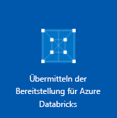

# <a name="quickstart-run-a-spark-job-on-azure-databricks-using-the-azure-portal"></a>Schnellstart: Ausführen eines Spark-Auftrags in Azure Databricks mit dem Azure-Portal

In dieser Schnellstartanleitung erfahren Sie, wie Sie einen Azure Databricks-Arbeitsbereich und in diesem Arbeitsbereich einen Apache Spark-Cluster erstellen. Außerdem lernen Sie, wie Sie einen Spark-Auftrag für den Databricks-Cluster ausführen. Weitere Informationen zu Azure Databricks finden Sie unter [Was ist Azure Databricks?](what-is-azure-databricks.md)

In dieser Schnellstartanleitung analysieren Sie im Rahmen des Spark-Auftrags Sicherheitsdaten aus Boston, um Erkenntnisse über verschiedene Methoden der Berichterstellung zu gewinnen.

Wenn Sie kein Azure-Abonnement besitzen, können Sie ein [kostenloses Konto](https://azure.microsoft.com/free/) erstellen, bevor Sie beginnen.

## <a name="sign-in-to-the-azure-portal"></a>Melden Sie sich auf dem Azure-Portal an.

Melden Sie sich beim [Azure-Portal](https://portal.azure.com) an.

## <a name="create-an-azure-databricks-workspace"></a>Erstellen eines Azure Databricks-Arbeitsbereichs

In diesem Abschnitt erstellen Sie einen Azure Databricks-Arbeitsbereich über das Azure-Portal.

1. Klicken Sie im Azure-Portal auf **Ressource erstellen** > **Analysen** > **Azure Databricks**.

    

2. Geben Sie unter **Azure Databricks-Dienst** die Werte für die Erstellung eines Databricks-Arbeitsbereichs an.

    

    Geben Sie außerdem die folgenden Werte an:
    
    |Eigenschaft  |BESCHREIBUNG  |
    |---------|---------|
    |**Arbeitsbereichsname**     | Geben Sie einen Namen für Ihren Databricks-Arbeitsbereich an.        |
    |**Abonnement**     | Wählen Sie in der Dropdownliste Ihr Azure-Abonnement aus.        |
    |**Ressourcengruppe**     | Geben Sie an, ob Sie eine neue Ressourcengruppe erstellen oder eine vorhandene Ressourcengruppe verwenden möchten. Eine Ressourcengruppe ist ein Container, der verwandte Ressourcen für eine Azure-Lösung enthält. Weitere Informationen finden Sie in der [Übersicht über den Azure Resource Manager](../azure-resource-manager/resource-group-overview.md). |
    |**Location**     | Wählen Sie **USA, Westen 2** aus. Informationen zu weiteren verfügbaren Regionen finden Sie unter [Verfügbare Produkte nach Region](https://azure.microsoft.com/regions/services/).        |
    |**Tarif**     |  Wählen Sie zwischen **Standard**, **Premium** oder **Testversion**. Weitere Informationen zu diesen Tarifen, finden Sie unter [Azure Databricks – Preise](https://azure.microsoft.com/pricing/details/databricks/).       |

    Aktivieren Sie das Kontrollkästchen **An Dashboard anheften**, und klicken Sie anschließend auf **Erstellen**.

4. Die Erstellung des Arbeitsbereichs dauert einige Minuten. Während der Erstellung des Arbeitsbereichs können Sie den Bereitstellungsstatus in **Benachrichtigungen** anzeigen.

    

## <a name="create-a-spark-cluster-in-databricks"></a>Erstellen eines Spark-Clusters in Databricks

> [!NOTE]
> Navigieren Sie vor dem Erstellen des Clusters zu Ihrem Profil, und legen Sie für Ihr Abonnement die **nutzungsbasierte Bezahlung** fest, um für die Erstellung des Azure Databricks-Clusters ein kostenloses Konto zu verwenden. Weitere Informationen finden Sie unter [Kostenloses Azure-Konto](https://azure.microsoft.com/free/).

1. Navigieren Sie im Azure-Portal zum erstellten Databricks-Arbeitsbereich, und klicken Sie auf **Launch Workspace** (Arbeitsbereich starten).

2. Sie werden zum Azure Databricks-Portal weitergeleitet. Klicken Sie im Portal auf **Neuer Cluster**.

    

3. Geben Sie auf der Seite **Neuer Cluster** die erforderlichen Werte an, um einen Cluster zu erstellen.

    

    Übernehmen Sie alle anderen Standardwerte bis auf Folgendes:

   * Geben Sie einen Namen für den Cluster ein.
   * Erstellen Sie im Rahmen dieses Artikels einen Cluster mit der Runtime **5.2**.
   * Aktivieren Sie das Kontrollkästchen **Terminate after \_\_ minutes of inactivity** (Nach \_\_ Minuten Inaktivität beenden). Geben Sie an, nach wie vielen Minuten der Cluster beendet werden soll, wenn er nicht verwendet wird.
    
     Klicken Sie auf **Cluster erstellen**. Sobald der Cluster ausgeführt wird, können Sie Notizbücher an den Cluster anfügen und Spark-Aufträge ausführen.

Weitere Informationen zum Erstellen von Clustern in Azure Databricks finden Sie unter [Creating Clusters](https://docs.azuredatabricks.net/user-guide/clusters/create.html) (Erstellen von Clustern).

## <a name="run-a-spark-sql-job"></a>Ausführen eines Spark SQL-Auftrags

Führen Sie die folgenden Aufgaben aus, um ein Notizbuch in Databricks zu erstellen, das Notizbuch zum Lesen von Daten aus einem Azure Open Datasets zu konfigurieren und anschließend einen Spark SQL-Auftrag für die Daten auszuführen:

1. Wählen Sie im linken Bereich **Azure Databricks** aus. Wählen Sie in **Allgemeine Aufgaben** die Aufgabe **Neues Notizbuch** aus.

    

2. Geben Sie im Dialogfeld **Notizbuch erstellen** einen Namen ein, wählen Sie **Python** als Sprache und dann den zuvor erstellten Spark-Cluster aus.

    

    Klicken Sie auf **Erstellen**.

3. In diesem Schritt erstellen Sie einen Spark-Datenrahmen mit Boston-Sicherheitsdaten aus [Azure Open Datasets](https://azure.microsoft.com/services/open-datasets/catalog/boston-safety-data/#AzureDatabricks) und verwenden SQL zum Abfragen der Daten.

   Der folgende Befehl legt die Informationen für den Azure-Speicherzugriff fest. Fügen Sie diesen PySpark-Code in die erste Zelle ein, und führen Sie den Code mithilfe von **UMSCHALT+EINGABE** aus.

   ```python
   blob_account_name = "azureopendatastorage"
   blob_container_name = "citydatacontainer"
   blob_relative_path = "Safety/Release/city=Boston"
   blob_sas_token = r"?st=2019-02-26T02%3A34%3A32Z&se=2119-02-27T02%3A34%3A00Z&sp=rl&sv=2018-03-28&sr=c&sig=XlJVWA7fMXCSxCKqJm8psMOh0W4h7cSYO28coRqF2fs%3D"
   ```

   Der folgende Befehl ermöglicht es Spark, remote aus dem Blobspeicher zu lesen. Fügen Sie diesen PySpark-Code in die nächste Zelle ein, und führen Sie den Code mithilfe von **UMSCHALT+EINGABE** aus.

   ```python
   wasbs_path = 'wasbs://%s@%s.blob.core.windows.net/%s' % (blob_container_name, blob_account_name, blob_relative_path)
   spark.conf.set('fs.azure.sas.%s.%s.blob.core.windows.net' % (blob_container_name, blob_account_name), blob_sas_token)
   print('Remote blob path: ' + wasbs_path)
   ```

   Der folgende Befehl erstellt einen Datenrahmen. Fügen Sie diesen PySpark-Code in die nächste Zelle ein, und führen Sie den Code mithilfe von **UMSCHALT+EINGABE** aus.

   ```python
   df = spark.read.parquet(wasbs_path)
   print('Register the DataFrame as a SQL temporary view: source')
   df.createOrReplaceTempView('source')
   ```

4. Führen Sie eine SQL-Anweisung aus, um die ersten 10 Datenzeilen aus der temporären Ansicht namens **Quelle** zurückzugeben. Fügen Sie diesen PySpark-Code in die nächste Zelle ein, und führen Sie den Code mithilfe von **UMSCHALT+EINGABE** aus.

   ```python
   print('Displaying top 10 rows: ')
   display(spark.sql('SELECT * FROM source LIMIT 10'))
   ```

5. Sie erhalten eine tabellarische Ausgabe wie im folgenden Screenshot, der allerdings nur einen Teil der Spalten zeigt:

    

6. Sie erstellen jetzt eine visuelle Darstellung dieser Daten, um zu zeigen, wie viele Sicherheitsereignisse über die Citizens Connect-App und die City Worker-App statt aus anderen Quellen gemeldet werden. Wählen Sie im unteren Bereich der tabellarischen Ausgabe das Symbol **Balkendiagramm** aus, und klicken Sie auf **Zeichnungsoptionen**.

    

8. Platzieren Sie per Drag & Drop Werte in **Customize Plot** (Zeichnung anpassen), wie im folgenden Screenshot zu sehen.

    

   * Legen Sie **Schlüssel** auf **Quelle** fest.
   * Legen Sie **Werte** auf **<\id>** fest.
   * Legen Sie **Aggregation** auf **ANZAHL** fest.
   * Legen Sie **Anzeigetyp** auf **Kreisdiagramm** fest.

     Klicken Sie auf **Anwenden**.

## <a name="clean-up-resources"></a>Bereinigen von Ressourcen

Am Ende dieses Artikels können Sie den Cluster beenden. Klicken Sie hierzu im linken Bereich des Azure Databricks-Arbeitsbereichs auf **Cluster**. Bewegen Sie den Cursor zum Beenden des Clusters auf die Auslassungspunkte in der Spalte **Aktionen**, und klicken Sie auf das Symbol **Beenden**.


Wenn Sie den Cluster nicht manuell beenden, wird er automatisch beendet, sofern Sie bei der Erstellung des Clusters das Kontrollkästchen **Terminate after \_\_ minutes of inactivity** (Nach \_\_ Minuten Inaktivität beenden) aktiviert haben. Der Cluster wird dann automatisch beendet, wenn er für den angegebenen Zeitraum inaktiv war.

## <a name="next-steps"></a>Nächste Schritte

In diesem Artikel haben Sie einen Spark-Cluster in Azure Databricks erstellt und einen Spark-Auftrag mit Daten aus Azure Open Datasets ausgeführt. Unter [Spark Data Sources](https://docs.azuredatabricks.net/spark/latest/data-sources/index.html) (Spark-Datenquellen) erfahren Sie, wie Sie Daten aus anderen Datenquellen in Azure Databricks importieren. Im nächsten Artikel erfahren Sie, wie Sie unter Verwendung von Azure Databricks einen ETL-Vorgang zum Extrahieren, Transformieren und Laden von Daten ausführen.

> [!div class="nextstepaction"]
>[Extrahieren, Transformieren und Laden von Daten mithilfe von Azure Databricks](databricks-extract-load-sql-data-warehouse.md)
