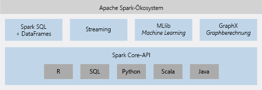

# Was ist Azure Databricks?

Azure Databricks ist eine Apache Spark-basierte Analyseplattform, die für die Microsoft Azure-Clouddienstplattform optimiert ist. Databricks wurde zusammen mit den Gründern von Apache Spark entworfen und ist in Azure integriert, um Folgendes zu ermöglichen: Einrichtung mit nur einem Klick, optimierte Workflows und einen interaktiven Arbeitsbereich für die Zusammenarbeit von Datenspezialisten, Data Engineers und Business Analysts.

## Apache Spark-basierte Analyseplattform

Azure Databricks umfasst sämtliche Open Source-Technologien und -Funktionen für Apache Spark-Cluster. Spark in Azure Databricks enthält folgende Komponenten:

* **Spark SQL und DataFrames:** Spark SQL ist das Spark-Modul für die Verwendung strukturierter Daten. Ein DataFrame ist eine verteilte Sammlung von Daten, die in benannten Spalten organisiert sind. Hierbei handelt es sich um das gleiche Konzept wie bei einer Tabelle in einer relationalen Datenbank oder bei einem Datenrahmen in R/Python.

* **Streaming:** Echtzeitdatenverarbeitung und -analyse für analytische und interaktive Anwendungen. Bietet HDFS-, Flume- und Kafka-Integration.

* **MLib:** Machine Learning-Bibliothek mit gängigen Lernalgorithmen und Hilfsprogrammen – einschließlich Klassifizierung, Regression, Clustering, kombinierten Filtern und Reduktion der Anzahl von Dimensionen sowie zugrunde liegenden Optimierungsprimitiven.

* **GraphX:** Diagramme und Diagrammberechnung für ein breites Spektrum von Anwendungsfällen – von kognitiven Analysen bis hin zu Datenuntersuchungen.

* **Spark Core-API:** Bietet Unterstützung für R, SQL, Python, Scala und Java.

## Apache Spark in Azure Databricks

Azure Databricks basiert auf den Funktionen von Spark und bietet eine verwaltungsfreie Cloudplattform mit Folgendem:

- Vollständig verwaltete Spark-Cluster
- Interaktiver Arbeitsbereich zur Untersuchung und Visualisierung
- Plattform für Ihre bevorzugten Spark-basierten Anwendungen

### Vollständig verwaltete Apache Spark-Cluster in der Cloud

Azure Databricks verfügt über eine sichere und zuverlässige Produktionsumgebung in der Cloud, die von Spark-Experten verwaltet und betreut wird. Ihre Möglichkeiten:

* Sekundenschnelle Clustererstellung
* Dynamische automatische Clusterskalierung (auch für serverlose Cluster) und teamübergreifende Clusterverwendung 
* Programmgesteuerte Verwendung von Clustern mithilfe der REST-APIs 
* Verwendung sicherer, Spark-basierter Datenintegrationsfunktionen zur Vereinheitlichung Ihrer Daten ohne Zentralisierung 
* Sofortiger Zugriff auf die neuesten Apache Spark-Features jeder neuen Version

### Databricks-Laufzeit
Die Databricks-Laufzeit basiert auf Apache Spark und ist von Grund auf für die Azure-Cloud konzipiert. 

Mit der **serverlosen** Option können Sie Ihre Dateninfrastruktur dank vollständiger Abstrahierung der Infrastrukturkomplexität ohne spezielles Fachwissen einrichten und konfigurieren. Datenspezialisten können mit der serverlosen Option Daten schnell als Team durchlaufen.

Für Data Engineers, die sich für die Leistung von Produktionsaufträgen interessieren, bietet Azure Databricks ein Spark-Modul, das dank verschiedenster Optimierungen auf E/A- und Verarbeitungsebene (Databricks-E/A) schneller und performanter ist.

### Arbeitsbereich für die Zusammenarbeit

Über eine zusammenarbeitsorientierte und integrierte Umgebung optimiert Azure Databricks das Untersuchen von Daten, das Erstellen von Prototypen sowie das Ausführen datengesteuerter Anwendungen in Spark.

* Ermitteln Sie dank unkomplizierter Datenuntersuchung, wie Sie Daten verwenden.
* Dokumentieren Sie Ihre Fortschritte in Notizbüchern in R, Python, Scala oder SQL.
* Visualisieren Sie Daten mit wenigen Mausklicks, und verwenden Sie vertraute Tools wie Matplotlib, ggoplot oder d3.
* Erstellen Sie mithilfe interaktiver Dashboards dynamische Berichte.
* Verwenden Sie Spark, und interagieren Sie gleichzeitig mit den Daten.

## Unternehmenssicherheit

Azure Databricks bietet Azure-Sicherheit für Unternehmen – einschließlich Azure Active Directory-Integration, rollenbasierter Zugriffssteuerung und SLAs zum Schutz Ihrer Daten und Ihres Unternehmens.

* Dank Azure Active Directory-Integration können Sie vollständige Azure-basierte Lösungen mit Azure Databricks ausführen.
* Die rollenbasierte Zugriffssteuerung von Azure Databricks ermöglicht die Verwendung präziser Benutzerberechtigungen für Notizbücher, Cluster, Aufträge und Daten.
* SLAs auf Unternehmensniveau. 

## Integration in Azure-Dienste

Azure Databricks ist tief in Azure-Datenbanken und -Speicher integriert: SQL Data Warehouse, Cosmos DB, Data Lake Store und Blob Storage. 

## Power BI-Integration
Dank umfangreicher Power BI-Integration können Sie mit Azure Databricks schnell und einfach wichtige Erkenntnisse gewinnen und weitergeben. Sie können aber auch andere BI-Tools wie etwa Tableau Software über JDBC-/ODBC-Clusterendpunkte verwenden.

## Nächste Schritte

* [Quickstart: Run a Spark job on Azure Databricks using the Azure portal](quickstart-create-databricks-workspace-portal.md) (Schnellstartanleitung: Ausführen eines Spark-Auftrags für Azure Databricks über das Portal)
* [Clusters](https://docs.azuredatabricks.net/user-guide/clusters/index.html) (Cluster)
* [Notebooks](https://docs.azuredatabricks.net/user-guide/notebooks/index.html) (Notizbücher)
* [Jobs](https://docs.azuredatabricks.net/user-guide/jobs.html) (Aufträge)

 

