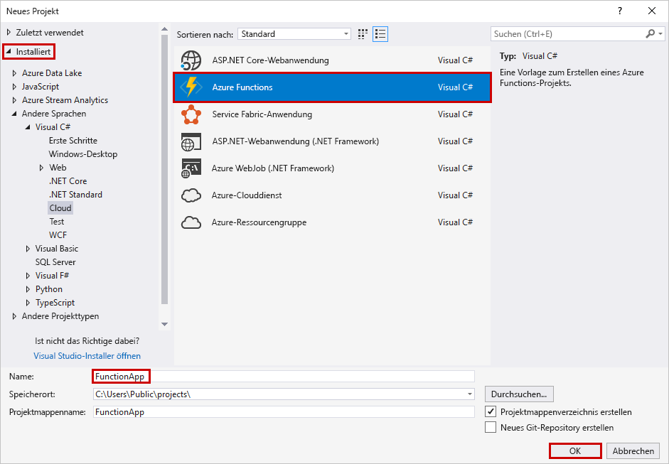
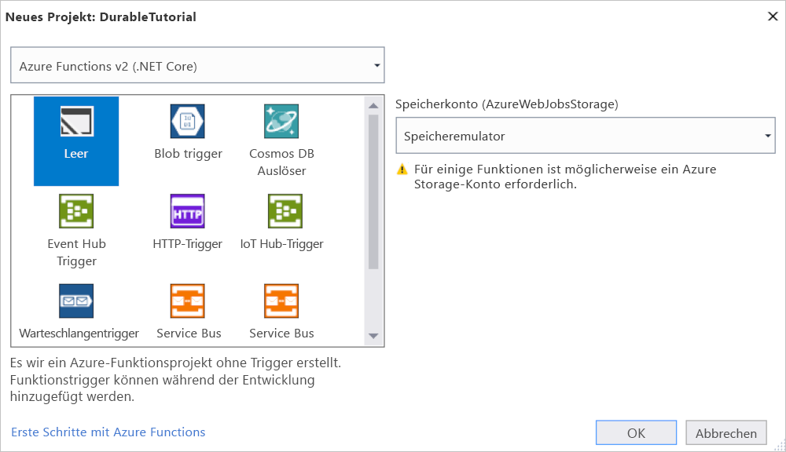
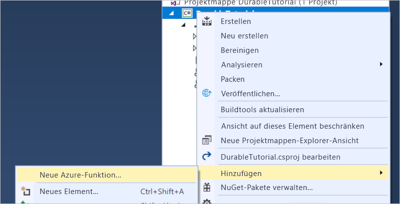
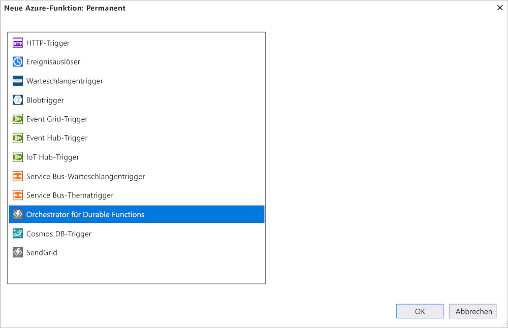

# <a name="create-your-first-durable-function-in-c"></a>Erstellen Ihrer ersten dauerhaften Funktion in C\#

*Durable Functions* ist eine Erweiterung von [Azure Functions](../functions-overview.md), mit der Sie zustandsbehaftete Funktionen in einer serverlosen Umgebung schreiben können. Die Erweiterung verwaltet Status, Prüfpunkte und Neustarts für Sie.

In diesem Artikel erfahren Sie, wie Sie die Visual Studio 2019-Tools für Azure Functions verwenden, um eine dauerhafte „hello world“-Funktion lokal zu erstellen und zu testen.  Mit dieser Funktion werden Aufrufe anderer Funktionen orchestriert und miteinander verkettet. Anschließend veröffentlichen Sie den Funktionscode in Azure. Diese Tools sind als Teil der Azure-Entwicklungsworkload in Visual Studio 2019 verfügbar.


## <a name="prerequisites"></a>Voraussetzungen

Für dieses Tutorial benötigen Sie Folgendes:

* Installieren Sie [Visual Studio 2019](https://azure.microsoft.com/downloads/). Vergewissern Sie sich, dass auch die Workload **Azure-Entwicklung** installiert ist.

* Stellen Sie sicher, dass Sie über die [neuesten Azure Functions-Tools](../functions-develop-vs.md#check-your-tools-version) verfügen.

* Vergewissern Sie sich, dass der [Azure-Speicheremulator](../../storage/common/storage-use-emulator.md) installiert ist und ausgeführt wird.

[!INCLUDE [quickstarts-free-trial-note](../../../includes/quickstarts-free-trial-note.md)]

## <a name="create-a-function-app-project"></a>Erstellen eines Funktionen-App-Projekts

Mit der Azure Functions-Vorlage wird ein Projekt erstellt, das in einer Funktions-App in Azure veröffentlicht werden kann. Sie können mit einer Funktionen-App Funktionen zu logischen Einheiten gruppieren, um die Verwaltung, Bereitstellung und Freigabe von Ressourcen zu ermöglichen.

1. Wählen Sie in Visual Studio im Menü **Datei** die Optionen **Neu** > **Projekt**.

2. Wählen Sie im Dialogfeld **Neues Projekt** die Option **Installiert**, erweitern Sie **Visual C#**  > **Cloud**, und wählen Sie **Azure Functions** aus. Geben Sie unter **Name** einen Namen für Ihr Projekt ein, und klicken Sie auf **OK**. Der Name der Funktions-App muss als C#-Namespace gültig sein, verwenden Sie daher keine Unterstriche, Bindestriche oder andere nicht alphanumerische Zeichen.

    

3. Verwenden Sie die Einstellungen, die in der Tabelle unter der Abbildung angegeben sind.

    

    | Einstellung      | Empfohlener Wert  | BESCHREIBUNG                      |
    | ------------ |  ------- |----------------------------------------- |
    | **Version** | Azure Functions 2.x <br />(.NET Core) | Erstellt ein Funktionsprojekt mit Version 2.x der Runtime von Azure Functions, die .NET Core unterstützt. Azure Functions 1.x unterstützt .NET Framework. Weitere Informationen finden Sie unter [Einstellen von Runtimeversionen von Azure Functions als Ziel](../functions-versions.md).   |
    | **Vorlage** | Leer | Erstellt eine leere Funktions-App. |
    | **Speicherkonto**  | Speicheremulator | Für die Zustandsverwaltung für dauerhafte Funktionen ist ein Speicherkonto erforderlich. |

4. Klicken Sie auf **OK**, um ein leeres Projekt für Funktionen zu erstellen. Dieses Projekt enthält die grundlegenden Konfigurationsdateien, die zum Ausführen Ihrer Funktionen benötigt werden.

## <a name="add-functions-to-the-app"></a>Hinzufügen von Funktionen zur App

In den folgenden Schritten wird eine Vorlage zum Erstellen des dauerhaften Funktionscodes in Ihrem Projekt verwendet.

1. Klicken Sie in Visual Studio mit der rechten Maustaste auf das Projekt, und wählen Sie **Hinzufügen** > **Neue Azure-Funktion**.

    

2. Vergewissern Sie sich, dass im Menü „Hinzufügen“ die Option **Azure-Funktion** ausgewählt ist, und geben Sie Ihrer C#-Datei einen Namen.  Klicken Sie auf **Hinzufügen**.

3. Wählen Sie die Vorlage **Orchestrierung für Durable Functions**, und klicken Sie auf **OK**.

      

Der App wird eine neue dauerhafte Funktion hinzugefügt.  Öffnen Sie die neue CS-Datei, um den Inhalt anzuzeigen. Diese dauerhafte Funktion ist ein einfaches Beispiel für eine Funktionsverkettung mit den folgenden Methoden:  

| Methode | FunctionName | BESCHREIBUNG |
| -----  | ------------ | ----------- |
| **`RunOrchestrator`** | `<file-name>` | Verwaltet die dauerhafte Orchestrierung. In diesem Fall wird die Orchestrierung gestartet, es wird eine Liste erstellt, und das Ergebnis der drei Funktionsaufrufe wird der Liste hinzugefügt.  Wenn die drei Funktionsaufrufe abgeschlossen sind, wird die Liste zurückgegeben. |
| **`SayHello`** | `<file-name>_Hello` | Die Funktion gibt „Hello“ zurück. Dies ist die Funktion mit der Geschäftslogik, die orchestriert wird. |
| **`HttpStart`** | `<file-name>_HttpStart` | Eine [per HTTP ausgelöste Funktion](../functions-bindings-http-webhook.md), mit der eine Instanz der Orchestrierung gestartet und eine Antwort zur Überprüfung des Status zurückgegeben wird. |

Nachdem Sie nun Ihr Funktionsprojekt und eine dauerhafte Funktion erstellt haben, können Sie sie auf Ihrem lokalen Computer testen.

## <a name="test-the-function-locally"></a>Lokales Testen der Funktion

Mit Azure Functions Core-Tools können Sie ein Azure Functions-Projekt auf dem lokalen Entwicklungscomputer ausführen. Sie werden beim ersten Starten einer Funktion in Visual Studio zum Installieren dieser Tools aufgefordert.

1. Drücken Sie F5, um Ihre Funktion zu testen. Akzeptieren Sie die entsprechende Aufforderung von Visual Studio zum Herunterladen und Installieren der Azure Functions Core (CLI)-Tools. Sie müssen möglicherweise auch eine Firewallausnahme aktivieren, damit die Tools HTTP-Anforderungen verarbeiten können.

2. Kopieren Sie die URL Ihrer Funktion aus der Azure Functions-Laufzeitausgabe.

    

3. Fügen Sie die URL der HTTP-Anforderung in die Adresszeile des Browsers ein, und führen Sie die Anforderung aus. Hier ist die Antwort des Browsers auf die von der Funktion zurückgegebene lokale GET-Anforderung abgebildet:

    

    Die Antwort ist das erste Ergebnis der HTTP-Funktion, um mitzuteilen, dass die dauerhafte Orchestrierung erfolgreich gestartet wurde.  Es ist noch nicht das Endergebnis der Orchestrierung.  Die Antwort enthält einige nützliche URLs.  Zunächst fragen wir den Status der Orchestrierung ab.

4. Kopieren Sie den URL-Wert für `statusQueryGetUri`, und fügen Sie ihn in die Adressleiste des Browsers ein. Führen Sie die Anforderung anschließend aus.

    Mit der Anforderung wird für die Orchestrierungsinstanz der Status abgefragt. Sie sollten schließlich eine Antwort erhalten, die wie unten angegeben aussieht.  Sie zeigt, dass die Instanz abgeschlossen wurde, und enthält die Ausgaben bzw. Ergebnisse der dauerhaften Funktion.

    ```json
    {
        "instanceId": "d495cb0ac10d4e13b22729c37e335190",
        "runtimeStatus": "Completed",
        "input": null,
        "customStatus": null,
        "output": [
            "Hello Tokyo!",
            "Hello Seattle!",
            "Hello London!"
        ],
        "createdTime": "2018-11-08T07:07:40Z",
        "lastUpdatedTime": "2018-11-08T07:07:52Z"
    }
    ```

5. Drücken Sie **UMSCHALT+F5**, um das Debuggen zu beenden.

Nachdem Sie sichergestellt haben, dass die Funktion auf Ihrem lokalen Computer richtig ausgeführt wird, können Sie das Projekt in Azure veröffentlichen.

## <a name="publish-the-project-to-azure"></a>Veröffentlichen des Projekts in Azure

Sie müssen in Ihrem Azure-Abonnement über eine Funktions-App verfügen, bevor Sie Ihr Projekt veröffentlichen können. Sie können eine Funktions-App direkt in Visual Studio erstellen.

[!INCLUDE [Publish the project to Azure](../../../includes/functions-vstools-publish.md)]

## <a name="test-your-function-in-azure"></a>Testen der Funktion in Azure

1. Kopieren Sie die Basis-URL der Funktions-App von der Seite „Veröffentlichungsprofil“. Ersetzen Sie den Teil `localhost:port` der URL, die Sie beim lokalen Testen der Funktion verwendet haben, durch die neue Basis-URL.

    Die URL, über die der HTTP-Trigger der dauerhaften Funktion aufgerufen wird, sollte das folgende Format haben:

        http://<APP_NAME>.azurewebsites.net/api/<FUNCTION_NAME>_HttpStart

2. Fügen Sie diese neue URL für die HTTP-Anforderung in die Adresszeile des Browsers ein. Sie sollten die gleiche Statusantwort wie zuvor erhalten, als Sie die veröffentlichte App verwendet haben.

## <a name="next-steps"></a>Nächste Schritte

Sie haben Visual Studio verwendet, um eine dauerhafte C#-Funktions-App zu erstellen und zu veröffentlichen.

> [!div class="nextstepaction"]
> [Informationen zu gängigen Mustern für dauerhafte Funktionen](durable-functions-concepts.md)
