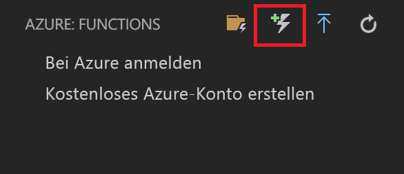
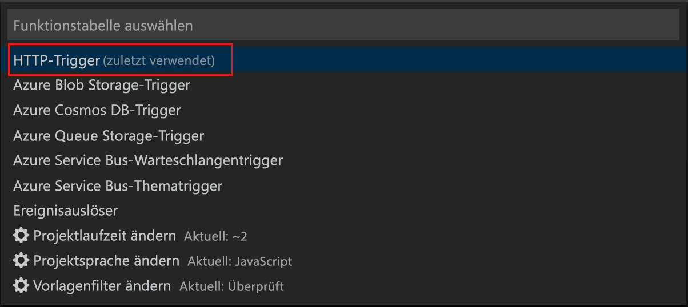
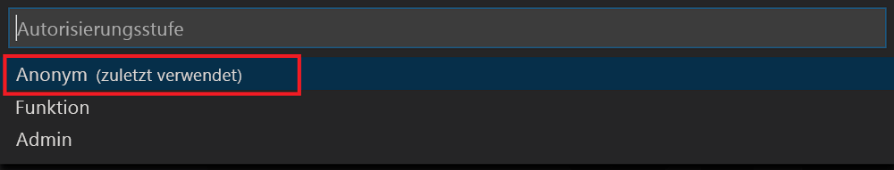

# <a name="create-your-first-durable-function-in-javascript"></a>Erstellen Ihrer ersten dauerhaften Funktion in JavaScript

*Durable Functions* ist eine Erweiterung von [Azure Functions](../functions-overview.md), mit der Sie zustandsbehaftete Funktionen in einer serverlosen Umgebung schreiben können. Die Erweiterung verwaltet Status, Prüfpunkte und Neustarts für Sie.

In diesem Artikel erfahren Sie, wie Sie die Azure Functions-Erweiterung von Visual Studio Code verwenden, um lokal eine dauerhafte Funktion namens „hello world“ zu erstellen und zu testen.  Mit dieser Funktion werden Aufrufe anderer Funktionen orchestriert und miteinander verkettet. Anschließend veröffentlichen Sie den Funktionscode in Azure.


## <a name="prerequisites"></a>Voraussetzungen

Für dieses Tutorial benötigen Sie Folgendes:

* Installieren Sie [Visual Studio Code](https://code.visualstudio.com/download).

* Stellen Sie sicher, dass Sie über die [neuesten Azure Functions-Tools](../functions-develop-vs.md#check-your-tools-version) verfügen.

* Vergewissern Sie sich bei Verwendung eines Windows-Computers, dass der [Azure-Speicheremulator](../../storage/common/storage-use-emulator.md) installiert ist und ausgeführt wird. Auf einem Mac- oder Linux-Computer muss ein echtes Azure-Speicherkonto verwendet werden.

* Vergewissern Sie sich, dass bei Ihnen mindestens die Version 8.0 von [Node.js](https://nodejs.org/) installiert ist.

[!INCLUDE [quickstarts-free-trial-note](../../../includes/quickstarts-free-trial-note.md)]

[!INCLUDE [functions-install-vs-code-extension](../../../includes/functions-install-vs-code-extension.md)]

[!INCLUDE [functions-create-function-app-vs-code](../../../includes/functions-create-function-app-vs-code.md)]

## <a name="create-a-starter-function"></a>Erstellen einer Startfunktion

Erstellen Sie zunächst eine per HTTP ausgelöste Funktion, die eine Orchestrierung für die dauerhafte Funktion startet.

1. Wählen Sie in **Azure: Funktionen** das Symbol zum Erstellen einer Funktion aus.

    

1. Wählen Sie den Ordner mit dem Funktions-App-Projekt und dann die Funktionsvorlage **HTTP-Trigger** aus.

    

1. Geben Sie als Funktionsname `HttpStart` ein, und drücken Sie die EINGABETASTE. Wählen Sie anschließend die Authentifizierung **Anonym** aus.

    

    Eine Funktion wird in Ihrer gewählten Sprache anhand der Vorlage für eine über HTTP ausgelöste Funktion erstellt.

1. Ersetzen Sie „index.js“ durch folgenden JavaScript-Code:

    ```javascript
    const df = require("durable-functions");
    
    module.exports = async function (context, req) {
        const client = df.getClient(context);
        const instanceId = await client.startNew(req.params.functionName, undefined, req.body);
    
        context.log(`Started orchestration with ID = '${instanceId}'.`);
    
        return client.createCheckStatusResponse(context.bindingData.req, instanceId);
    };
    ```

1. Ersetzen Sie „function.json“ durch folgenden JSON-Code:

    ```JSON
    {
      "bindings": [
        {
          "authLevel": "anonymous",
          "name": "req",
          "type": "httpTrigger",
          "direction": "in",
          "route": "orchestrators/{functionName}",
          "methods": ["post"]
        },
        {
          "name": "$return",
          "type": "http",
          "direction": "out"
        },
        {
          "name": "starter",
          "type": "orchestrationClient",
          "direction": "in"
        }
      ],
      "disabled": false
    }
    ```

Sie verfügen nun über einen Einstiegspunkt für Ihre dauerhafte Funktion. Fügen Sie als Nächstes einen Orchestrator hinzu.

## <a name="create-an-orchestrator-function"></a>Erstellen einer Orchestratorfunktion

Als Nächstes erstellen Sie eine weitere Funktion, die als Orchestrator fungiert. Der Einfachheit halber verwenden wir die HTTP-Triggerfunktionsvorlage. Der eigentliche Funktionscode wird durch den Orchestratorcode ersetzt.

1. Erstellen Sie mithilfe der Schritte aus dem vorherigen Abschnitt eine zweite Funktion unter Verwendung der HTTP-Triggervorlage. Nennen Sie diese Funktion `OrchestratorFunction`.

1. Öffnen Sie die Datei „index.js“ für die neue Funktion, und ersetzen Sie den Inhalt durch folgenden Code:

    [!code-json[Main](~/samples-durable-functions/samples/javascript/E1_HelloSequence/index.js)]

1. Öffnen Sie die Datei „function.json“, und ersetzen Sie sie durch folgenden JSON-Code:

    [!code-json[Main](~/samples-durable-functions/samples/javascript/E1_HelloSequence/function.json)]

Damit haben Sie einen Orchestrator für die Koordinierung von Aktivitätsfunktionen hinzugefügt. Fügen Sie als Nächstes die referenzierte Aktivitätsfunktion hinzu.

## <a name="create-an-activity-function"></a>Erstellen einer Aktivitätsfunktion

1. Erstellen Sie mithilfe der Schritte aus den vorherigen Abschnitten eine dritte Funktion unter Verwendung der HTTP-Triggervorlage. Nennen Sie diese Funktion `SayHello`.

1. Öffnen Sie die Datei „index.js“ für die neue Funktion, und ersetzen Sie den Inhalt durch folgenden Code:

    [!code-javascript[Main](~/samples-durable-functions/samples/javascript/E1_SayHello/index.js)]

1. Ersetzen Sie „function.json“ durch folgenden JSON-Code:

    [!code-json[Main](~/samples-durable-functions/samples/csx/E1_SayHello/function.json)]

Sie haben nun alle Komponenten hinzugefügt, die erforderlich sind, um eine Orchestrierung zu starten und Aktivitätsfunktionen zu verketten.

## <a name="test-the-function-locally"></a>Lokales Testen der Funktion

Mit Azure Functions Core-Tools können Sie ein Azure Functions-Projekt auf dem lokalen Entwicklungscomputer ausführen. Sie werden beim ersten Starten einer Funktion in Visual Studio Code zum Installieren dieser Tools aufgefordert.  

1. Führen Sie `npm install durable-functions` im Stammverzeichnis der Funktions-App aus, um das npm-Paket „durable-functions“ zu installieren.

1. Starten Sie bei Verwendung eines Windows-Computers den Azure-Speicheremulator, und vergewissern Sie sich, dass die Eigenschaft **AzureWebJobsStorage** von „local.settings.json“ auf `UseDevelopmentStorage=true` festgelegt ist. Bei Verwendung eines Mac- oder Linux-Computers muss die Eigenschaft **AzureWebJobsStorage** auf die Verbindungszeichenfolge eines vorhandenen Azure-Speicherkontos festgelegt werden. Ein Speicherkonto wird weiter unten in diesem Artikel erstellt.

1. Legen Sie zum Testen der Funktion einen Breakpoint im Funktionscode fest, und drücken Sie F5, um das Funktions-App-Projekt zu starten. Die Ausgabe der Core Tools wird im Bereich **Terminal** angezeigt. Falls Sie Durable Functions zuvor noch nicht verwendet haben, wird die Durable Functions-Erweiterung installiert, und der Buildvorgang dauert ggf. einige Sekunden.

1. Kopieren Sie im Bereich **Terminal** den URL-Endpunkt Ihrer über HTTP ausgelösten Funktion.

    

1. Fügen Sie die URL der HTTP-Anforderung in die Adresszeile des Browsers ein, und sehen Sie sich den Status Ihrer Orchestrierung an.

1. Drücken Sie UMSCHALT+F1, um das Debuggen zu beenden.

Nachdem Sie sichergestellt haben, dass die Funktion auf Ihrem lokalen Computer richtig ausgeführt wird, können Sie das Projekt in Azure veröffentlichen.

[!INCLUDE [functions-create-function-app-vs-code](../../../includes/functions-sign-in-vs-code.md)]

[!INCLUDE [functions-publish-project-vscode](../../../includes/functions-publish-project-vscode.md)]

## <a name="test-your-function-in-azure"></a>Testen der Funktion in Azure

1. Kopieren Sie die URL des HTTP-Triggers im Bereich **Ausgabe**. Die URL, über die Ihre per HTTP ausgelöste Funktion aufgerufen wird, sollte das folgende Format haben:

        http://<functionappname>.azurewebsites.net/api/<functionname>

1. Fügen Sie diese neue URL für die HTTP-Anforderung in die Adresszeile des Browsers ein. Sie sollten die gleiche Statusantwort wie zuvor erhalten, als Sie die veröffentlichte App verwendet haben.

## <a name="next-steps"></a>Nächste Schritte

Sie haben mit Visual Studio Code eine dauerhafte JavaScript-basierte Funktions-App erstellt und veröffentlicht.

> [!div class="nextstepaction"]
> [Informationen zu gängigen Mustern für dauerhafte Funktionen](durable-functions-overview.md)