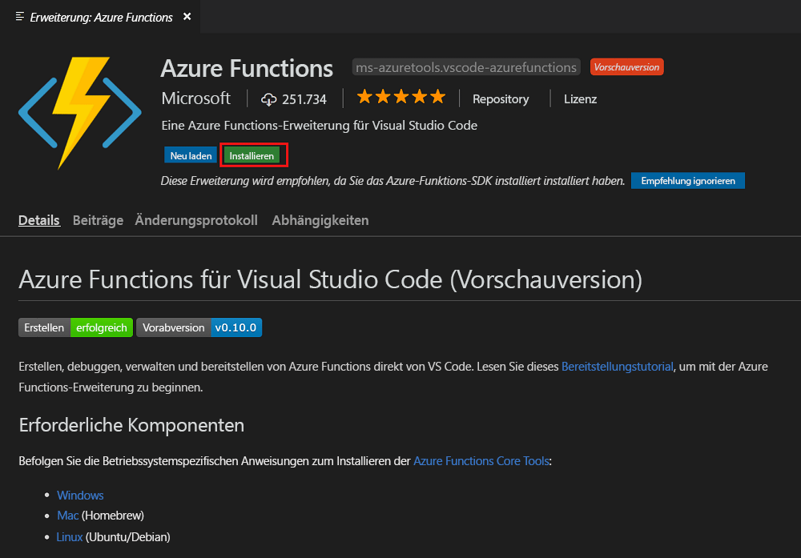
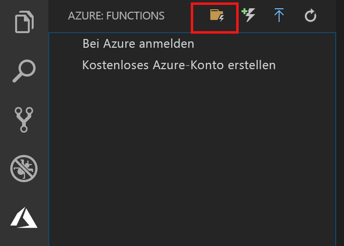
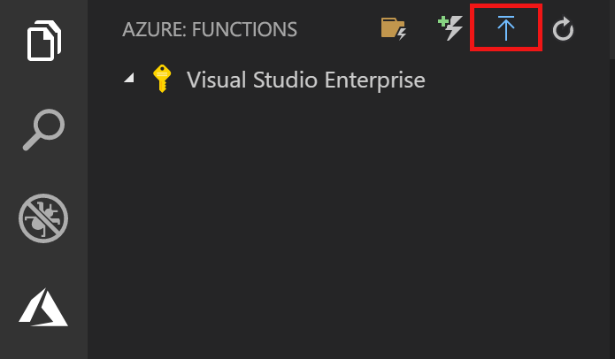
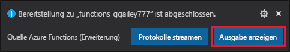
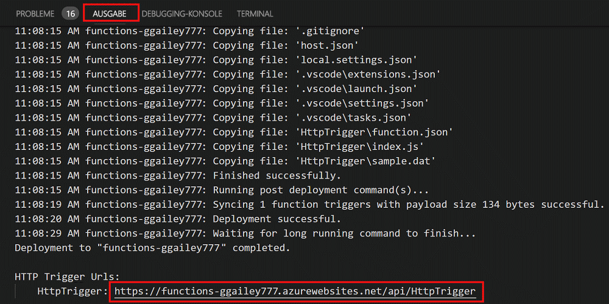

# Erstellen Ihrer ersten Funktion mit Visual Studio Code

Mit Azure Functions können Sie Code in einer [serverlosen](https://azure.microsoft.com/solutions/serverless/) Umgebung ausführen, ohne vorher eine VM erstellen oder eine Webanwendung veröffentlichen zu müssen.

In diesem Artikel erfahren Sie, wie Sie die [Azure Functions-Erweiterung für Visual Studio Code] verwenden, um auf Ihrem lokalen Computer mithilfe von Visual Studio Code die Funktion „Hello World“ zu erstellen und testen. Anschließend veröffentlichen Sie den Funktionscode über Visual Studio Code in Azure.

Die Erweiterung unterstützt derzeit C#, JavaScript und Java-Funktionen. Die Schritte in diesem Artikel variieren je nach ausgewählter Sprache für Ihr Azure Functions-Projekt. Die Erweiterung befindet sich derzeit in der Vorschauphase. Weitere Informationen finden Sie auf der Seite mit der [Azure Functions-Erweiterung für Visual Studio Code].

## Voraussetzungen

So führen Sie diesen Schnellstart durch:

* Installieren Sie [Visual Studio Code](https://code.visualstudio.com/) auf einer der [unterstützten Plattformen](https://code.visualstudio.com/docs/supporting/requirements#_platforms). Dieser Artikel wurde mithilfe eines Geräts unter macOS (High Sierra) erstellt und getestet.

* Installieren Sie Version 2.x der [Azure Functions Core Tools](functions-run-local.md#v2), die sich noch in der Vorschauphase befindet.

* Installieren Sie die erforderlichen Komponenten für die ausgewählte Sprache:

    | Sprache | Durchwahl |
    | -------- | --------- |
    | **C#** | [C# für Visual Studio Code](https://marketplace.visualstudio.com/items?itemName=ms-vscode.csharp) [Tools der .NET Core-CLI](https://docs.microsoft.com/dotnet/core/tools/?tabs=netcore2x)*   |
    | **Java** | [Debugger für Java](https://marketplace.visualstudio.com/items?itemName=vscjava.vscode-java-debug) [Java 8](https://aka.ms/azure-jdks) [Maven 3+](https://maven.apache.org/) |
    | **JavaScript** | [Node 8.0+](https://nodejs.org/)  |

    \* Ebenfalls für Core Tools erforderlich

[!INCLUDE [quickstarts-free-trial-note](../../includes/quickstarts-free-trial-note.md)]

## Installieren der Azure Functions-Erweiterung

Die Azure Functions-Erweiterung wird zum Erstellen, Testen und Bereitstellen von Funktionen in Azure verwendet.

1. Öffnen Sie in Visual Studio Code die Option **Erweiterungen**, und suchen Sie nach `azure functions`, oder öffnen Sie [diesen Link](vscode:extension/ms-azuretools.vscode-azurefunctions) in Visual Studio Code.

1. Wählen Sie **Installieren** aus, um die Erweiterung für Visual Studio Code zu installieren. 

    

1. Starten Sie Visual Studio Code neu, und wählen Sie auf der Aktivitätsleiste das Azure-Symbol aus. Auf der Seitenleiste sollte ein Azure Functions-Bereich angezeigt werden.

    

## Erstellen eines Azure Functions-Projekts

Mit der Azure Functions-Projektvorlage in Visual Studio Code wird ein Projekt erstellt, das in einer Funktions-App in Azure veröffentlicht werden kann. Sie können mit einer Funktionen-App Funktionen zu logischen Einheiten gruppieren, um die Verwaltung, Bereitstellung und Freigabe von Ressourcen zu ermöglichen.

1. Wählen Sie in Visual Studio Code das Azure-Logo aus, um den Bereich **Azure: Funktionen** anzuzeigen, und wählen Sie dann das Symbol „Neues Projekt erstellen“ aus.

    

1. Wählen Sie einen Speicherort für Ihren Projektarbeitsbereich und anschließend **Auswählen** aus.

    > [!NOTE]
    > Die Schritte in diesem Artikel sollten außerhalb eines Arbeitsbereichs ausgeführt werden. Wählen Sie in diesem Fall keinen Projektordner aus, der Teil eines Arbeitsbereichs ist.

1. Wählen Sie die Sprache für Ihr Funktions-App-Projekt aus. In diesem Artikel wird JavaScript verwendet.
    

1. Wählen Sie bei entsprechender Aufforderung die Option **Zu Arbeitsbereich hinzufügen** aus.

Visual Studio Code erstellt das Funktions-App-Projekt in einem neuen Arbeitsbereich. Dieses Projekt enthält die Konfigurationsdateien [host.json](functions-host-json.md) und [local.settings.json](functions-run-local.md#local-settings-file) sowie sprachspezifische Projektdateien. Der Projektordner enthält darüber hinaus ein neues Git-Repository.

## Erstellen einer durch HTTP ausgelösten Funktion

1. Wählen Sie in **Azure: Funktionen** das Symbol zum Erstellen einer Funktion aus.

    

1. Wählen Sie den Ordner mit dem Funktions-App-Projekt und dann die Funktionsvorlage **HTTP-Trigger** aus.

    

1. Geben Sie als Funktionsname `HTTPTrigger` ein, und drücken Sie die EINGABETASTE. Wählen Sie anschließend die Authentifizierung **Anonym** aus.

    

    Eine Funktion wird in Ihrer gewählten Sprache anhand der Vorlage für eine über HTTP ausgelöste Funktion erstellt.

    

Sie können Ihrer Funktion Eingabe- und Ausgabebindungen hinzufügen, indem Sie die Datei „function.json“ anpassen. Weitere Informationen finden Sie unter [Konzepte für Azure Functions-Trigger und -Bindungen](functions-triggers-bindings.md).

Nachdem Sie nun Ihr Funktionsprojekt und eine Funktion mit HTTP-Trigger erstellt haben, können Sie sie auf Ihrem lokalen Computer testen.

## Lokales Testen der Funktion

Mit Azure Functions Core-Tools können Sie ein Azure Functions-Projekt auf dem lokalen Entwicklungscomputer ausführen. Sie werden beim ersten Starten einer Funktion in Visual Studio Code zum Installieren dieser Tools aufgefordert.  

1. Legen Sie zum Testen der Funktion einen Breakpoint im Funktionscode fest, und drücken Sie F5, um das Funktions-App-Projekt zu starten. Die Ausgabe der Core Tools wird im Bereich **Terminal** angezeigt.

1. Kopieren Sie im Bereich **Terminal** den URL-Endpunkt Ihrer über HTTP ausgelösten Funktion.

    

1. Fügen Sie die URL der HTTP-Anforderung in die Adresszeile des Browsers ein. Hängen Sie anschließend die Abfragezeichenfolge `?name=<yourname>` an diese URL an, und führen Sie die Anforderung aus. Die Ausführung wird angehalten, wenn der Breakpoint erreicht wird.

    

1. Wenn Sie die Ausführung fortsetzen, sehen Sie nachfolgend die Antwort des Browsers auf die GET-Anforderung:

    

1. Drücken Sie UMSCHALT+F1, um das Debuggen zu beenden.

Nachdem Sie sichergestellt haben, dass die Funktion auf Ihrem lokalen Computer richtig ausgeführt wird, können Sie das Projekt in Azure veröffentlichen.

## Anmelden bei Azure

Bevor Sie Ihre App veröffentlichen können, müssen Sie sich bei Azure anmelden.

1. Wählen Sie im Bereich **Azure: Funktionen** die Option **Sign in to Azure...** (Bei Azure anmelden...) aus. Falls Sie über kein Konto verfügen, können Sie ein **kostenloses Azure-Konto erstellen**.

    

1. Wählen Sie bei entsprechender Aufforderung **Kopieren und öffnen** aus, oder kopieren Sie den angezeigten Code, und öffnen Sie <https://aka.ms/devicelogin> im Browser.

1. Fügen Sie den kopierten Code auf der Seite **Device Login** (Geräteanmeldung) ein, überprüfen Sie die Anmeldung für Visual Studio Code, und wählen Sie dann **Weiter** aus.  

1. Melden Sie sich mit den Anmeldeinformationen für Ihr Konto an. Wenn Sie sich erfolgreich angemeldet haben, können Sie den Browser schließen.

## Veröffentlichen des Projekts in Azure

Visual Studio Code ermöglicht die Veröffentlichung Ihres Funktionsprojekts direkt in Azure. Bei diesem Vorgang erstellen Sie eine Funktions-App und zugehörige Ressourcen in Ihrem Azure-Abonnement. Die Funktions-App bietet einen Ausführungskontext für Ihre Funktionen. Das Projekt wird verpackt und in der neuen Funktions-App in Ihrem Azure-Abonnement bereitgestellt. 

In diesem Artikel wird davon ausgegangen, dass Sie eine neue Funktions-App erstellen. Beim Veröffentlichen in einer vorhandenen Funktions-App wird der Inhalt dieser App in Azure überschrieben.

1. Wählen Sie im Bereich **Azure: Funktionen** das Symbol für die Bereitstellung in der Funktions-App aus.

    

1. Wählen Sie den Projektordner aus, bei dem es sich um Ihren aktuellen Arbeitsbereich handelt.

1. Wählen Sie bei mehreren Abonnements das aus, in dem Ihre Funktions-App gehostet werden soll. Wählen Sie anschließend **+ Create New Function App** (+ Neue Funktions-App erstellen) aus.

1. Geben Sie einen global eindeutigen Namen ein, der Ihre Funktions-App identifiziert, und drücken Sie die EINGABETASTE. Gültige Zeichen für den Namen einer Funktions-App sind `a-z`, `0-9` und `-`.

1. Wählen Sie **+ Neue Ressourcengruppe erstellen** aus, geben Sie einen Ressourcengruppennamen wie `myResourceGroup` ein, und drücken Sie die EINGABETASTE. Sie können auch eine vorhandene Ressourcengruppe verwenden.

1. Wählen Sie **+Neues Speicherkonto erstellen** aus, geben Sie einen global eindeutigen Namen für das neue Speicherkonto ein, das von Ihrer Funktions-App verwendet wird, und drücken Sie die EINGABETASTE. Speicherkontonamen müssen zwischen 3 und 24 Zeichen lang sein und dürfen nur Zahlen und Kleinbuchstaben enthalten. Sie können außerdem ein vorhandenes Konto verwenden.

1. Wählen Sie einen Standort in einer [Region](https://azure.microsoft.com/regions/) in Ihrer Nähe oder in der Nähe anderer Dienste aus, auf die Ihre Funktionen zugreifen.

    Mit der Erstellung der Funktions-App wird nach dem Festlegen des Standorts begonnen. Nach der Erstellung der Funktions-App wird eine Benachrichtigung angezeigt, und das Bereitstellungspaket wird angewendet.

1. Wählen Sie in den Benachrichtigungen die Option **View Output** (Ausgabe anzeigen) aus, um die Erstellungs- und Bereitstellungsergebnisse (auch für die von Ihnen erstellten Azure-Ressourcen) anzuzeigen.

    

1. Notieren Sie sich die URL der neuen Funktions-App in Azure. Sie verwenden sie zum Testen der Funktion nach der Veröffentlichung des Projekts in Azure.

    

1. Im Bereich **Azure: Funktionen** wird die neue Funktions-App unter Ihrem Abonnement angezeigt. Erweitern Sie diese Knoten, sehen Sie die Funktionen in der Funktions-App sowie Anwendungseinstellungen und Funktionsproxys.

    

    Halten Sie im Knoten der Funktions-App STRG gedrückt, und klicken Sie (mit der rechten Maustaste), um verschiedene Verwaltungs- und Konfigurationsaufgaben für die Funktions-App in Azure auszuführen. Sie können die Funktions-App auch im Azure-Portal anzeigen.

## Testen der Funktion in Azure

1. Kopieren Sie die URL des HTTP-Triggers im Bereich **Ausgabe**. Stellen Sie wie zuvor sicher, dass Sie die Abfragezeichenfolge `?name=<yourname>` am Ende dieser URL anfügen und die Anforderung ausführen.

    Die URL, über die Ihre per HTTP ausgelöste Funktion aufgerufen wird, sollte das folgende Format haben:

        http://<functionappname>.azurewebsites.net/api/<functionname>?name=<yourname> 

1. Fügen Sie diese neue URL für die HTTP-Anforderung in die Adresszeile des Browsers ein. Hier ist die Antwort des Browsers auf die von der Funktion zurückgegebene GET-Remoteanforderung abgebildet: 

    

## Nächste Schritte

Sie haben Visual Studio Code genutzt, um eine Funktions-App mit einer einfachen Funktion zu erstellen, die über HTTP ausgelöst wird. Weitere Informationen zum Entwickeln von Funktionen in einer bestimmten Sprache finden Sie in den Sprachreferenzhandbüchern für [JavaScript](functions-reference-node.md), [.NET](functions-dotnet-class-library.md) oder [Java](functions-reference-java.md).

Als Nächstes möchten Sie möglicherweise mehr über das lokale Testen und Debuggen über das Terminal oder die Eingabeaufforderung unter Verwendung der Azure Functions Core Tools erfahren.

> [!div class="nextstepaction"]
> [Lokales Codieren und Testen](functions-run-local.md)

[Azure Functions Core Tools]: functions-run-local.md
[Azure Functions-Erweiterung für Visual Studio Code]: https://marketplace.visualstudio.com/items?itemName=ms-azuretools.vscode-azurefunctions
