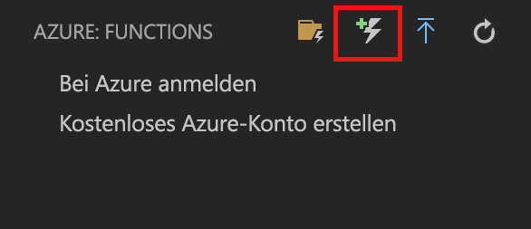
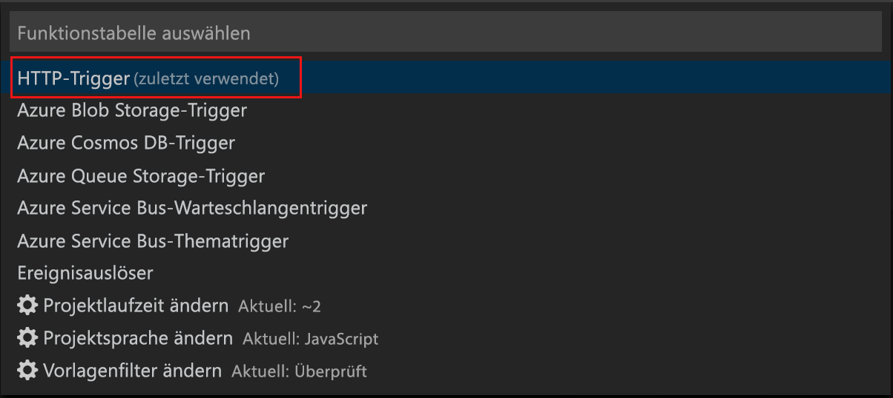
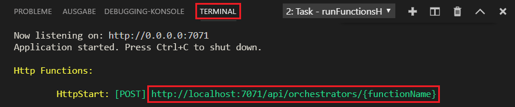

# Erstellen Ihrer ersten Funktion mit Visual Studio Code

Mit Azure Functions können Sie Code in einer [serverlosen](https://azure.microsoft.com/solutions/serverless/) Umgebung ausführen, ohne vorher eine VM erstellen oder eine Webanwendung veröffentlichen zu müssen.

In diesem Artikel erfahren Sie, wie Sie die [Azure Functions-Erweiterung für Visual Studio Code] verwenden, um auf Ihrem lokalen Computer mithilfe von Visual Studio Code die Funktion „Hello World“ zu erstellen und testen. Anschließend veröffentlichen Sie den Funktionscode über Visual Studio Code in Azure.

Die Erweiterung bietet derzeit vollständige Unterstützung für C#-, JavaScript- und Java-Funktionen. Die Unterstützung für Python befindet sich derzeit in der Vorschauphase. Die Schritte in diesem Artikel variieren je nach ausgewählter Sprache für Ihr Azure Functions-Projekt. Die Erweiterung befindet sich derzeit in der Vorschauphase. Weitere Informationen finden Sie auf der Seite mit der [Azure Functions-Erweiterung für Visual Studio Code].

## Voraussetzungen

So führen Sie diesen Schnellstart durch:

* Installieren Sie [Visual Studio Code](https://code.visualstudio.com/) auf einer der [unterstützten Plattformen](https://code.visualstudio.com/docs/supporting/requirements#_platforms). Dieser Artikel wurde mithilfe eines Geräts unter macOS (High Sierra) erstellt und getestet.

* Installieren Sie Version 2.x der [Azure Functions Core Tools](functions-run-local.md#v2), die sich noch in der Vorschauphase befindet.

* Installieren Sie die erforderlichen Komponenten für die ausgewählte Sprache:

    | Sprache | Durchwahl |
    | -------- | --------- |
    | **C#** | [C# für Visual Studio Code](https://marketplace.visualstudio.com/items?itemName=ms-vscode.csharp) [Tools der .NET Core-CLI](https://docs.microsoft.com/dotnet/core/tools/?tabs=netcore2x)*   |
    | **Java** | [Debugger für Java](https://marketplace.visualstudio.com/items?itemName=vscjava.vscode-java-debug) [Java 8](https://aka.ms/azure-jdks) [Maven 3+](https://maven.apache.org/) |
    | **JavaScript** | [Node 8.0+](https://nodejs.org/)  |

    \* Ebenfalls für Core Tools erforderlich

[!INCLUDE [quickstarts-free-trial-note](../../includes/quickstarts-free-trial-note.md)]

[!INCLUDE [functions-install-vs-code-extension](../../includes/functions-install-vs-code-extension.md)]

[!INCLUDE [functions-create-function-app-vs-code](../../includes/functions-create-function-app-vs-code.md)]

## Erstellen einer durch HTTP ausgelösten Funktion

1. Wählen Sie in **Azure Functions** das Symbol zum Erstellen einer Funktion aus.

    

1. Wählen Sie den Ordner mit dem Funktions-App-Projekt und dann die Funktionsvorlage **HTTP-Trigger** aus.

    

1. Geben Sie als Funktionsname `HTTPTrigger` ein, und drücken Sie die EINGABETASTE. Wählen Sie anschließend die Authentifizierung **Anonym** aus.

    

    Eine Funktion wird in Ihrer gewählten Sprache anhand der Vorlage für eine über HTTP ausgelöste Funktion erstellt.

    

Sie können Ihrer Funktion Eingabe- und Ausgabebindungen hinzufügen, indem Sie die Datei „function.json“ anpassen. Weitere Informationen finden Sie unter [Konzepte für Azure Functions-Trigger und -Bindungen](functions-triggers-bindings.md).

Nachdem Sie nun Ihr Funktionsprojekt und eine Funktion mit HTTP-Trigger erstellt haben, können Sie sie auf Ihrem lokalen Computer testen.

## Lokales Testen der Funktion

Mit Azure Functions Core-Tools können Sie ein Azure Functions-Projekt auf dem lokalen Entwicklungscomputer ausführen. Sie werden beim ersten Starten einer Funktion in Visual Studio Code zum Installieren dieser Tools aufgefordert.  

1. Legen Sie zum Testen der Funktion einen Breakpoint im Funktionscode fest, und drücken Sie F5, um das Funktions-App-Projekt zu starten. Die Ausgabe der Core Tools wird im Bereich **Terminal** angezeigt.

1. Kopieren Sie im Bereich **Terminal** den URL-Endpunkt Ihrer über HTTP ausgelösten Funktion.

    

1. Fügen Sie die URL der HTTP-Anforderung in die Adresszeile des Browsers ein. Hängen Sie anschließend die Abfragezeichenfolge `?name=<yourname>` an diese URL an, und führen Sie die Anforderung aus. Die Ausführung wird angehalten, wenn der Breakpoint erreicht wird.

    

1. Wenn Sie die Ausführung fortsetzen, sehen Sie nachfolgend die Antwort des Browsers auf die GET-Anforderung:

    

1. Drücken Sie UMSCHALT+F5, um das Debuggen zu beenden.

Nachdem Sie sichergestellt haben, dass die Funktion auf Ihrem lokalen Computer richtig ausgeführt wird, können Sie das Projekt in Azure veröffentlichen.

[!INCLUDE [functions-sign-in-vs-code](../../includes/functions-sign-in-vs-code.md)]

[!INCLUDE [functions-publish-project-vscode](../../includes/functions-publish-project-vscode.md)]

## Testen der Funktion in Azure

1. Kopieren Sie die URL des HTTP-Triggers im Bereich **Ausgabe**. Stellen Sie wie zuvor sicher, dass Sie die Abfragezeichenfolge `?name=<yourname>` am Ende dieser URL anfügen und die Anforderung ausführen.

    Die URL, über die Ihre per HTTP ausgelöste Funktion aufgerufen wird, sollte das folgende Format haben:

        http://<functionappname>.azurewebsites.net/api/<functionname>?name=<yourname> 

1. Fügen Sie diese neue URL für die HTTP-Anforderung in die Adresszeile des Browsers ein. Hier ist die Antwort des Browsers auf die von der Funktion zurückgegebene GET-Remoteanforderung abgebildet: 

    

## Nächste Schritte

Sie haben Visual Studio Code genutzt, um eine Funktions-App mit einer einfachen Funktion zu erstellen, die über HTTP ausgelöst wird. Als Nächstes sollten Sie sich näher über das [lokale Testen und Debuggen über das Terminal oder die Eingabeaufforderung](functions-run-local.md) unter Verwendung der Azure Functions Core Tools informieren.

> [!div class="nextstepaction"]
> [Aktivieren der Application Insights-Integration](functions-monitoring.md#manually-connect-an-app-insights-resource)

[Azure Functions Core Tools]: functions-run-local.md
[Azure Functions-Erweiterung für Visual Studio Code]: https://marketplace.visualstudio.com/items?itemName=ms-azuretools.vscode-azurefunctions
