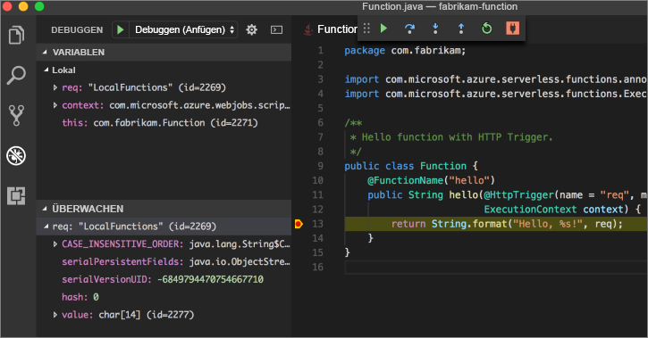

# <a name="create-your-first-function-with-java-and-maven-preview"></a>Erstellen der ersten Funktion mit Java und Maven (Vorschau)

In diesem Schnellstart wird erläutert, wie Sie mit Maven ein Projekt für eine [serverlose](https://azure.microsoft.com/overview/serverless-computing/) Funktion erstellen, diese lokal testen und in Azure Functions bereitstellen. Nach Fertigstellung haben Sie eine durch HTTP ausgelöste Funktionen-App erstellt, die in Azure ausgeführt wird.

 

[!INCLUDE [quickstarts-free-trial-note](../../includes/quickstarts-free-trial-note.md)]

## <a name="prerequisites"></a>Voraussetzungen
Um die Funktionen-App mit Java zu entwickeln, muss Folgendes installiert sein:

-  [.NET Core](https://www.microsoft.com/net/core), neueste Version
-  [Java Developer Kit](https://www.azul.com/downloads/zulu/), Version 1.8.
-  [Azure-Befehlszeilenschnittstelle](https://docs.microsoft.com/cli/azure)
-  [Apache Maven](https://maven.apache.org), Version 3.0 oder höher
-  [Node.js](https://nodejs.org/download/), Version 8.6 oder höher

> [!IMPORTANT] 
> Damit Sie diesen Schnellstart durchführen können, muss die Umgebungsvariable JAVA_HOME auf den Installationsspeicherort des JDK festgelegt sein.

## <a name="install-the-azure-functions-core-tools"></a>Installieren von Azure Functions Core Tools

Die [Azure Functions Core-Tools 2.0](https://www.npmjs.com/package/azure-functions-core-tools) bieten eine lokale Entwicklungsumgebung zum Schreiben, Ausführen und Debuggen von Azure Functions. Installieren Sie die Tools mit dem Paket-Manager [npm](https://www.npmjs.com/), der im Leistungsumfang von [Node.js](https://nodejs.org/) inbegriffen ist.

```
npm install -g azure-functions-core-tools@core
```

> [!NOTE]
> Wenn Sie Probleme mit der Installation von Azure Functions Core-Tools Version 2.0 haben, lesen Sie [Laufzeit der Version 2.x](/azure/azure-functions/functions-run-local#version-2x-runtime).

## <a name="generate-a-new-functions-project"></a>Generieren eines neuen Functions-Projekts

Führen Sie in einem leeren Ordner den folgenden Befehl aus, um das Functions-Projekt über einen [Maven-Archetyp](https://maven.apache.org/guides/introduction/introduction-to-archetypes.html) zu generieren.

### <a name="linuxmacos"></a>Linux/macOS

```bash
mvn archetype:generate \
    -DarchetypeGroupId=com.microsoft.azure \
    -DarchetypeArtifactId=azure-functions-archetype 
```

### <a name="windows-cmd"></a>Windows (CMD)
```cmd
mvn archetype:generate ^
    -DarchetypeGroupId=com.microsoft.azure ^
    -DarchetypeArtifactId=azure-functions-archetype
```

Maven fordert Sie zur Eingabe der Werte auf, die erforderlich sind, um die Generierung des Projekts abzuschließen. Informationen zu den Werten _groupId_, _artifactId_ und _version_ finden Sie in der Referenz [Maven-Benennungskonventionen](https://maven.apache.org/guides/mini/guide-naming-conventions.html). Der Wert _appName_ muss in Azure eindeutig sein. Deshalb generiert Maven standardmäßig einen App-Namen basierend auf den zuvor eingegebenen Wert _artifactId_. Der Wert _packageName_ bestimmt das Java-Paket für den generierten Funktionscode.

```Output
Define value for property 'groupId': com.fabrikam.functions
Define value for property 'artifactId' : fabrikam-functions
Define value for property 'version' 1.0-SNAPSHOT : 
Define value for property 'package': com.fabrikam.functions
Define value for property 'appName' fabrikam-functions-20170927220323382:
Confirm properties configuration: Y
```

Maven erstellt die Projektdateien in einem neuen Ordner mit dem Namen _artifactId_. Bei dem generierten Code im Projekt handelt es sich um eine einfache [durch HTTP ausgelöste](/azure/azure-functions/functions-bindings-http-webhook) Funktion, die den Text der Anforderung wiederholt:

```java
public class Function {
    @FunctionName("hello")
    public String hello(@HttpTrigger(name = "req", methods = {"get", "post"}, authLevel = AuthorizationLevel.ANONYMOUS) String req,
                        ExecutionContext context) {
        return String.format("Hello, %s!", req);
    }
}
```

## <a name="run-the-function-locally"></a>Lokales Ausführen der Funktion

Ändern Sie das Verzeichnis in den neu erstellten Projektordner. Erstellen Sie dann mit Maven die Funktion, und führen Sie sie aus:

```
cd fabrikam-function
mvn clean package 
mvn azure-functions:run
```

Wenn die Funktion ausgeführt wird, wird folgende Ausgabe angezeigt:

```Output
Listening on http://localhost:7071
Hit CTRL-C to exit...

Http Functions:

   hello: http://localhost:7071/api/hello
```

Lösen Sie mit cURL die Funktion über die Befehlszeile in einem neuen Terminal aus:

```
curl -w '\n' -d LocalFunction http://localhost:7071/api/hello
```

```Output
Hello LocalFunction!
```

Verwenden Sie `Ctrl-C` im Terminal, um den Funktionscode anzuhalten.

## <a name="deploy-the-function-to-azure"></a>Bereitstellen der Funktion in Azure

Bei dem Bereitstellungsprozess in Azure Functions werden die Anmeldeinformationen aus der Azure CLI verwendet. [Melden Sie sich bei der Azure CLI an](/cli/azure/authenticate-azure-cli?view=azure-cli-latest), und stellen Sie Ihren Code anschließend mit `azure-functions:deploy` als Maven-Ziel in einer neuen Funktionen-App bereit.

```
az login
mvn azure-functions:deploy
```

Wenn die Bereitstellung abgeschlossen ist, wird die URL angezeigt, mit der Sie auf Ihre Azure-Funktionen-App zugreifen können:

```output
[INFO] Successfully deployed Function App with package.
[INFO] Deleting deployment package from Azure Storage...
[INFO] Successfully deleted deployment package fabrikam-function-20170920120101928.20170920143621915.zip
[INFO] Successfully deployed Function App at https://fabrikam-function-20170920120101928.azurewebsites.net
[INFO] ------------------------------------------------------------------------
```

Testen Sie die mit cURL in Azure ausgeführte Funktionen-App:

```
curl -w '\n' https://fabrikam-function-20170920120101928.azurewebsites.net/api/hello -d AzureFunctions
```

```Output
Hello AzureFunctions!
```

## <a name="next-steps"></a>Nächste Schritte

Sie haben eine Java-Funktionen-App mit einem einfachen HTTP-Trigger erstellt und für Azure Functions bereitgestellt.

- Weitere Informationen zum Entwickeln von Java-Funktionen finden Sie im [Azure Functions-Java-Entwicklerhandbuch](functions-reference-java.md).
- Fügen Sie mit `azure-functions:add` als Maven-Ziel zusätzliche Funktionen mit verschiedenen Triggern zu Ihrem Projekt hinzu.
- Debuggen Sie Funktionen lokal mit Visual Studio Code. Nachdem Sie das [Java-Erweiterungspaket](https://marketplace.visualstudio.com/items?itemName=vscjava.vscode-java-pack) installiert und mit Ihrem Functions-Projekt in Visual Studio Code geöffnet haben, [fügen Sie den Debugger an Port 5005 an](https://code.visualstudio.com/Docs/editor/debugging#_launch-configurations). Legen Sie anschließend einen Breakpoint im Editor fest, und lösen Sie Ihre Funktion aus, während sie lokal ausgeführt wird: 


