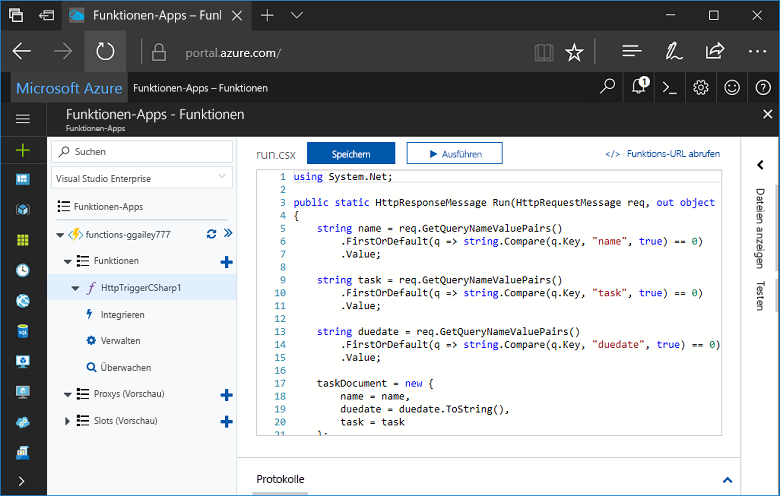
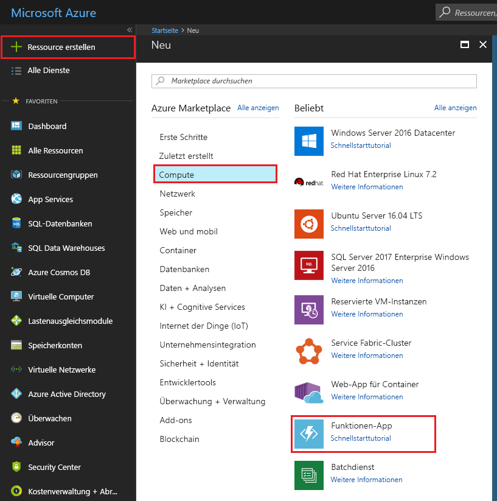
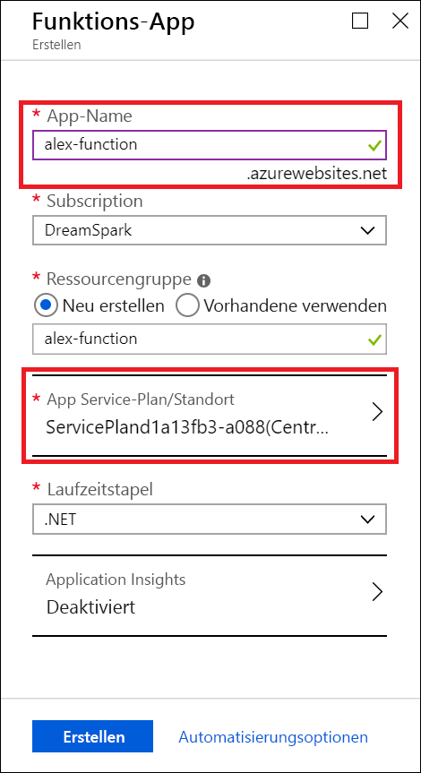
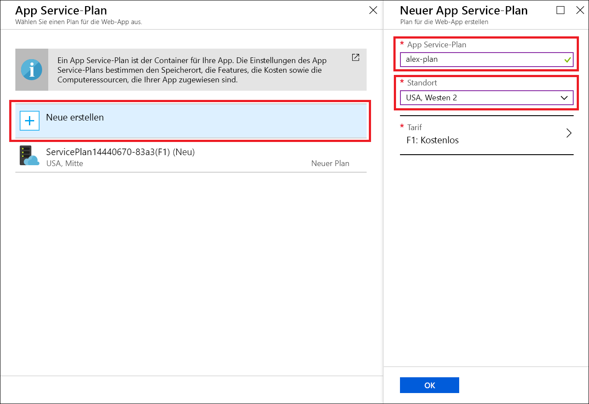
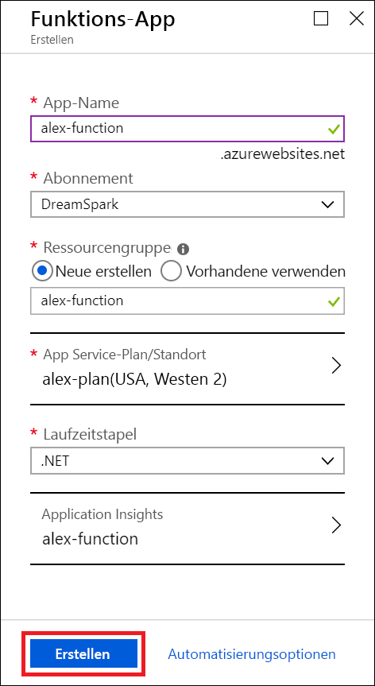
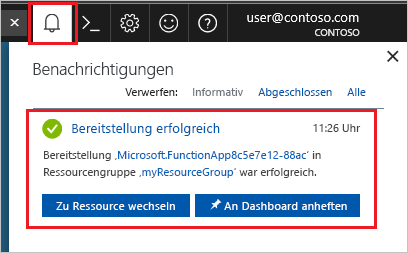
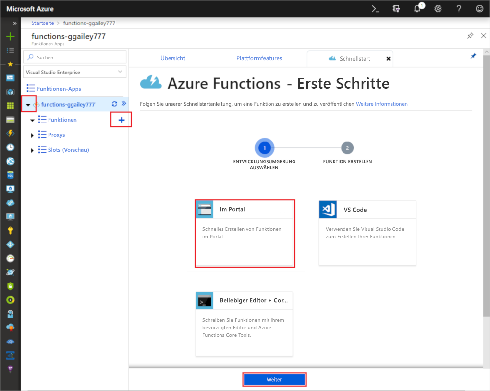
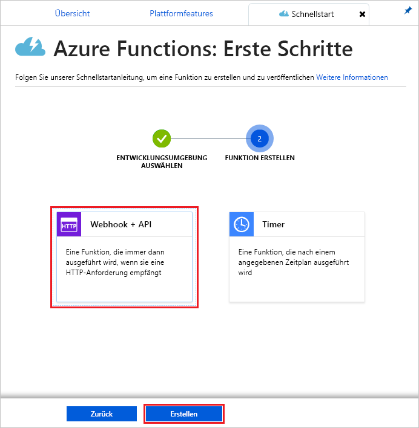
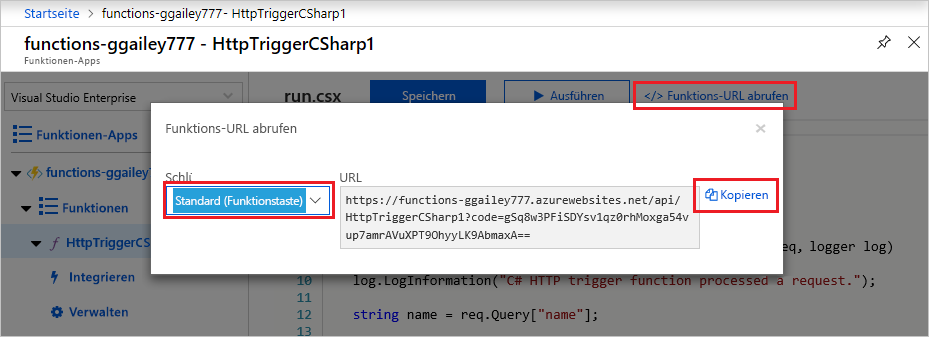
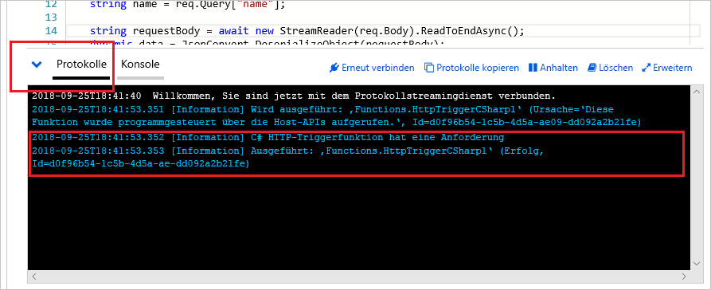

# Erstellen einer Funktion mit Azure for Students Starter

In diesem Tutorial erstellen wir eine HTTP-Funktion vom Typ „Hello World“ unter einem Azure for Students Starter-Abonnement. Außerdem wird einzeln beschrieben, welche Optionen in Azure Functions für diesen Abonnementtyp verfügbar sind.

Microsoft *Azure for Students Starter* unterstützt Sie bei Ihren ersten Schritten mit Azure-Produkten für die Entwicklung in der Cloud – und das kostenlos. [Erfahren Sie mehr zu diesem Angebot.](https://azure.microsoft.com/offers/ms-azr-0144p/)

Mit Azure Functions können Sie Code in einer [serverlosen](https://azure.microsoft.com/solutions/serverless/) Umgebung ausführen, ohne vorher eine VM erstellen oder eine Webanwendung veröffentlichen zu müssen. [Erfahren Sie mehr zu Functions.](./functions-overview.md)

## Erstellen einer Funktion

 In diesem Thema erfahren Sie, wie Sie Azure Functions verwenden können, um eine per HTTP ausgelöste „Hello World“-Funktion im Azure-Portal zu erstellen.

## Anmelden bei Azure

Melden Sie sich unter <https://portal.azure.com> mit Ihrem Azure-Konto beim Azure-Portal an.

## Erstellen einer Funktionen-App

Sie müssen über eine Funktionen-App verfügen, die die Ausführung Ihrer Funktionen in Azure hostet. Sie können mit einer Funktionen-App Funktionen zu logischen Einheiten gruppieren. Dies erleichtert die Verwaltung, Bereitstellung und Freigabe von Ressourcen. 

1. Wählen Sie in der linken oberen Ecke des Azure-Portals die Schaltfläche **Neu** und dann **Compute** > **Funktionen-App**.

    

2. Verwenden Sie die in der Tabelle unter der Abbildung angegebenen Einstellungen für die Funktions-App.

    

    | Einstellung      | Empfohlener Wert  | BESCHREIBUNG                                        |
    | ------------ |  ------- | -------------------------------------------------- |
    | **App-Name** | Global eindeutiger Name | Der Name, der Ihre neue Funktionen-App bezeichnet Gültige Zeichen sind `a-z`, `0-9` und `-`.  | 
    | **Abonnement** | Ihr Abonnement | Das Abonnement, unter dem diese neue Funktions-App erstellt wird. | 
    | **[Ressourcengruppe](../azure-resource-manager/resource-group-overview.md)** |  myResourceGroup | Der Name der neuen Ressourcengruppe, in der die Funktionen-App erstellt wird |
   | **[App Service-Plan/Standort](./functions-scale.md)** | Neu | Der Hostingplan, mit dem gesteuert wird, in welcher Region Ihre Funktions-App bereitgestellt wird und welche Dichte Ihre Ressourcen aufweisen. Wenn mehrere Funktions-Apps unter demselben Plan bereitgestellt werden, wird für alle dieselbe Instanz vom Typ „Free“ verwendet. Dies ist eine Einschränkung des Students Starter-Plans. Die vollständigen Hostingoptionen sind [hier](./functions-scale.md) beschrieben.|
    | **Laufzeitstapel** | Bevorzugte Sprache | Wählen Sie eine Runtime aus, die Ihre bevorzugte Programmiersprache für Funktionen unterstützt. Wählen Sie **.NET** für C#- und F#-Funktionen aus. |
    |**[Application Insights](./functions-monitoring.md)**| Aktiviert | Application Insights wird zum Speichern und Analysieren Ihrer Protokolle von Funktions-Apps verwendet. Die Anwendung ist standardmäßig aktiviert, wenn Sie einen Standort wählen, der Application Insights unterstützt. Application Insights kann für alle Funktionen aktiviert werden, indem manuell eine in der Nähe befindliche Region für die Bereitstellung von Application Insights gewählt wird. Ohne Application Insights können Sie nur Livestreamingprotokolle anzeigen.

3. Wählen Sie oben **App Service-Plan/Standort**, um einen anderen Standort auszuwählen.

4. Wählen Sie **Neu erstellen**, und geben Sie Ihrem Plan dann einen eindeutigen Namen.

5. Wählen Sie den Standort aus, der Ihnen am nächsten ist. [Hier finden Sie eine Karte mit allen Azure-Regionen.](https://azure.microsoft.com/global-infrastructure/regions/) 

    

6. Klicken Sie auf **Erstellen**, um die Funktionen-App bereitzustellen.

    

7. Wählen Sie oben rechts im Portal das Benachrichtigungssymbol aus, und achten Sie auf die Meldung **Bereitstellung erfolgreich**.

    

8. Wählen Sie **Zu Ressource wechseln**, um Ihre neue Funktionen-App anzuzeigen.

> [!TIP]
> Sollten Sie Ihre Funktions-Apps im Portal nicht finden, können Sie [Funktionen-Apps Ihren Favoriten im Azure-Portal hinzufügen](./functions-how-to-use-azure-function-app-settings.md#favorite).
Erstellen Sie als Nächstes in der neuen Funktionen-App eine Funktion.

## Erstellen einer Funktion mit Auslösung per HTTP

1. Erweitern Sie Ihre neue Funktions-App, klicken Sie neben **Functions** auf die Schaltfläche **+**, klicken Sie auf **Im Portal**, und klicken Sie anschließend auf **Weiter**.

    

1. Wählen Sie **Webhook + API** aus, und klicken Sie anschließend auf **Erstellen**.

    

Eine Funktion wird unter Verwendung einer sprachspezifischen Vorlage für eine Funktion mit HTTP-Trigger erstellt.

Nun können Sie die neue Funktion ausführen, indem Sie eine HTTP-Anforderung senden.

## Testen der Funktion

1. Klicken Sie in der neuen Funktion rechts oben auf **</> Funktions-URL abrufen**, wählen Sie **default (Function key)** (Standard (Funktionsschlüssel)) aus, und klicken Sie dann auf **Kopieren**. 

    

2. Fügen Sie die URL der Funktion in die Adressleiste Ihres Browsers ein. Fügen Sie den Wert der Abfragezeichenfolge `&name=<yourname>` am Ende der URL hinzu, und drücken Sie die Taste `Enter` auf Ihrer Tastatur, um die Anforderung auszuführen. Daraufhin sollte die von der Funktion zurückgegebene Antwort im Browser angezeigt werden.  

    Das folgende Beispiel zeigt die Antwort im Browser:

    

    Die Anfrage-URL enthält einen Schlüssel, der standardmäßig über HTTP auf Ihre Funktion zugreifen muss.

3. Wenn Ihre Funktion ausgeführt wird, werden Nachverfolgungsinformationen in die Protokolle geschrieben. Kehren Sie zu Ihrer Funktion im Portal zurück, und klicken Sie am unteren Bildschirmrand auf den Pfeil, um **Protokolle** zu erweitern und die Nachverfolgungsausgabe der vorherigen Ausführung anzuzeigen.

   

## Bereinigen von Ressourcen

[!INCLUDE [Clean-up resources](../../includes/functions-quickstart-cleanup.md)]

## Unterstützte Funktionen in Azure for Students Starter

In Azure for Students Starter haben Sie Zugriff auf die meisten Features der Azure Functions-Runtime. Die wichtigen Einschränkungen sind unten aufgeführt:

* Der HTTP-Trigger ist der einzige unterstützte Triggertyp.
    * Alle Eingabe- und Ausgabebindungen werden unterstützt! Die vollständige Liste finden Sie [hier](functions-triggers-bindings.md).
* Unterstützte Sprachen: 
    * C# (.NET Core 2)
    * JavaScript (Node.js 8 & 10)
    * F# (.NET Core 2)
    * [Informationen zu Sprachen, die für höhere Pläne unterstützt werden](supported-languages.md)
* Windows ist das einzige unterstützte Betriebssystem.
* Die Skalierung ist auf [eine Instanz vom Typ „Free-Tarif“](https://azure.microsoft.com/pricing/details/app-service/windows/) beschränkt, die pro Tag bis zu 60 Minuten lang ausgeführt werden kann. Sie können automatisch serverlos von 0 auf 1 Instanz skalieren, wenn HTTP-Datenverkehr empfangen wird (aber nicht höher).
* Nur die [2.x-Runtime](functions-versions.md) wird unterstützt.
* Für Bearbeitungs- und Veröffentlichungsfunktionen werden alle Entwicklertools unterstützt. Dies umfasst VS Code, Visual Studio, die Azure CLI und das Azure-Portal. Falls Sie etwas anderes als das Portal nutzen möchten, müssen Sie zuerst im Portal eine App erstellen und diese dann in Ihrem bevorzugten Tool als Bereitstellungsziel wählen.

## Nächste Schritte

Sie haben eine Funktions-App mit einer einfachen Funktion erstellt, die per HTTP ausgelöst wird. Nun können Sie die lokalen Tools, weitere Sprachen, die Überwachung und Integrationen erkunden.

 * [Erstellen Ihrer ersten Funktion mit Visual Studio](./functions-create-your-first-function-visual-studio.md)
 * [Erstellen Ihrer ersten Funktion mit Visual Studio Code](./functions-create-first-function-vs-code.md)
 * [JavaScript-Entwicklerhandbuch für Azure Functions](./functions-reference-node.md)
 * [Verwenden von Azure Functions zum Herstellen einer Verbindung mit einer Azure SQL-Datenbank-Instanz](./functions-scenario-database-table-cleanup.md)
 * [Erfahren Sie mehr zu HTTP-Bindungen von Azure Functions](./functions-bindings-http-webhook.md).
 * [Überwachen von Azure Functions](./functions-monitoring.md)
