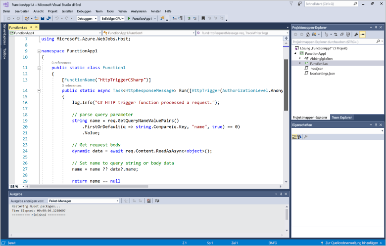
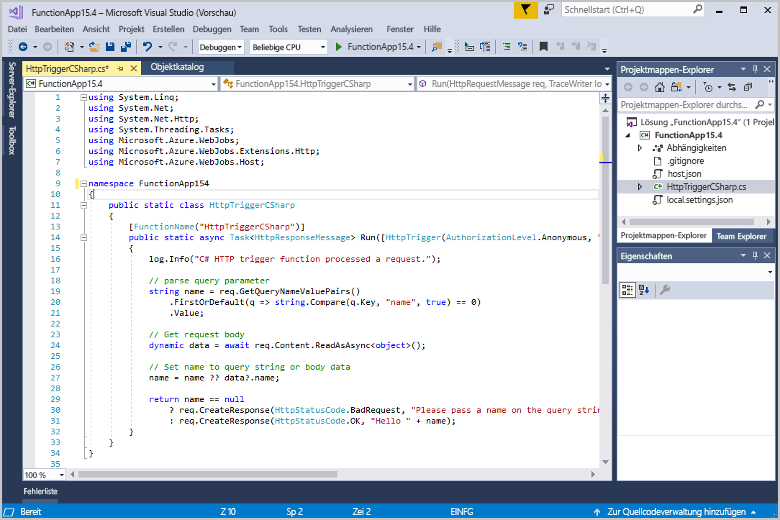

# Erstellen Ihrer ersten Funktion mit Visual Studio

Mit Azure Functions können Sie Code in einer [serverlosen](https://azure.microsoft.com/overview/serverless-computing/) Umgebung ausführen, ohne vorher eine VM erstellen oder eine Webanwendung veröffentlichen zu müssen.

In diesem Artikel erfahren Sie, wie Sie die Visual Studio 2017-Tools für Azure Functions verwenden, um eine „hello world“-Funktion lokal zu erstellen und zu testen. Anschließend veröffentlichen Sie den Funktionscode in Azure. Diese Tools sind als Teil der Azure-Entwicklungsworkload in Visual Studio 2017 verfügbar.

Dieses Thema enthält ein [Video](#watch-the-video) zu einigen grundlegenden Schritten.

## Voraussetzungen

Für dieses Tutorial benötigen Sie Folgendes:

* Installieren Sie [Visual Studio 2017 Version 15.4](https://www.visualstudio.com/vs/) oder eine höhere Version, einschließlich der Workload **Azure-Entwicklung**.

    

* Vergewissern Sie sich, dass Sie das Update auf die aktuelle Version von Azure Functions und der WebJobs-Tools durchgeführt haben. Verwenden Sie hierfür unter **Updates** > **Visual Studio Marketplace** die Option **Erweiterungen und Updates**.
    
[!INCLUDE [quickstarts-free-trial-note](../../includes/quickstarts-free-trial-note.md)] 

## Erstellen eines Funktionen-App-Projekts

[!INCLUDE [Create a project using the Azure Functions template](../../includes/functions-vstools-create.md)]

Visual Studio erstellt ein Projekt, das eine Klasse mit den Codebausteinen für den gewählten Funktionstyp enthält. Mit dem **FunctionName**-Attribut der Methode wird der Name der Funktion festgelegt. Mit dem **HttpTrigger**-Attribut wird angegeben, dass die Funktion mit einer HTTP-Anforderung ausgelöst wird. Mit Code in den Codebausteinen wird eine HTTP-Antwort gesendet, die einen Wert aus dem Anforderungstext oder der Abfragezeichenfolge enthält. Sie können Eingabe- und Ausgabebindungen einer Funktion hinzufügen, indem Sie die geeigneten Attribute auf die Methode anwenden. Weitere Informationen finden Sie im Abschnitt [Trigger und Bindungen](functions-dotnet-class-library.md#triggers-and-bindings) in der [C#-Entwicklerreferenz zu Azure Functions](functions-dotnet-class-library.md).

Nachdem Sie nun Ihr Funktionsprojekt und eine per HTTP ausgelöste Funktion erstellt haben, können Sie sie auf Ihrem lokalen Computer testen.

## Lokales Testen der Funktion

Mit Azure Functions Core-Tools können Sie ein Azure Functions-Projekt auf dem lokalen Entwicklungscomputer ausführen. Sie werden beim ersten Starten einer Funktion in Visual Studio zum Installieren dieser Tools aufgefordert.  

1. Drücken Sie F5, um Ihre Funktion zu testen. Akzeptieren Sie die entsprechende Aufforderung von Visual Studio zum Herunterladen und Installieren der Azure Functions Core (CLI)-Tools. Sie müssen möglicherweise auch eine Firewallausnahme aktivieren, damit die Tools HTTP-Anforderungen verarbeiten können.

2. Kopieren Sie die URL Ihrer Funktion aus der Azure Functions-Laufzeitausgabe.  

    

3. Fügen Sie die URL der HTTP-Anforderung in die Adresszeile des Browsers ein. Hängen Sie anschließend die Abfragezeichenfolge `?name=<yourname>` an diese URL an, und führen Sie die Anforderung aus. Hier ist die Antwort des Browsers auf die von der Funktion zurückgegebene lokale GET-Anforderung abgebildet: 

    

4. Klicken Sie zum Beenden des Debuggens in der Visual Studio-Symbolleiste auf die Schaltfläche **Beenden**.

Nachdem Sie sichergestellt haben, dass die Funktion auf Ihrem lokalen Computer richtig ausgeführt wird, können Sie das Projekt in Azure veröffentlichen.

## Veröffentlichen des Projekts in Azure

Sie müssen in Ihrem Azure-Abonnement über eine Funktions-App verfügen, bevor Sie Ihr Projekt veröffentlichen können. Sie können eine Funktions-App direkt in Visual Studio erstellen.

[!INCLUDE [Publish the project to Azure](../../includes/functions-vstools-publish.md)]

## Testen der Funktion in Azure

1. Kopieren Sie die Basis-URL der Funktions-App von der Seite „Veröffentlichungsprofil“. Ersetzen Sie den Teil `localhost:port` der URL, die Sie beim lokalen Testen der Funktion verwendet haben, durch die neue Basis-URL. Stellen Sie wie zuvor sicher, dass Sie die Abfragezeichenfolge `?name=<yourname>` an diese URL anhängen und die Anforderung ausführen.

    Die URL, über die Ihre per HTTP ausgelöste Funktion aufgerufen wird, sollte das folgende Format haben:

        http://<functionappname>.azurewebsites.net/api/<functionname>?name=<yourname> 

2. Fügen Sie diese neue URL für die HTTP-Anforderung in die Adresszeile des Browsers ein. Hier ist die Antwort des Browsers auf die von der Funktion zurückgegebene GET-Remoteanforderung abgebildet: 

    

## Video ansehen

> [!VIDEO https://www.youtube-nocookie.com/embed/DrhG-Rdm80k]

## Nächste Schritte

Sie haben Visual Studio genutzt, um eine C#-Funktions-App mit einer einfachen Funktion zu erstellen, die per HTTP ausgelöst wird. 

+ Informationen zum Konfigurieren Ihres Projekts für die Unterstützung anderer Arten von Triggern und Bindungen finden Sie unter [Azure Functions-Tools für Visual Studio](functions-develop-vs.md) im Abschnitt [Konfigurieren des Projekts für die lokale Entwicklung](functions-develop-vs.md#configure-the-project-for-local-development).
+ Weitere Informationen zum lokalen Testen und Debuggen mit den Azure Functions Core-Tools finden Sie unter [Lokales Codieren und Testen von Azure-Funktionen](functions-run-local.md). 
+ Weitere Informationen zum Entwickeln von Funktionen wie .NET-Klassenbibliotheken finden Sie unter [Using .NET class libraries with Azure Functions](functions-dotnet-class-library.md) (Verwenden von .NET-Klassenbibliotheken mit Azure Functions). 

