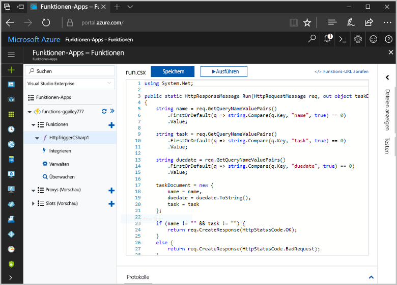
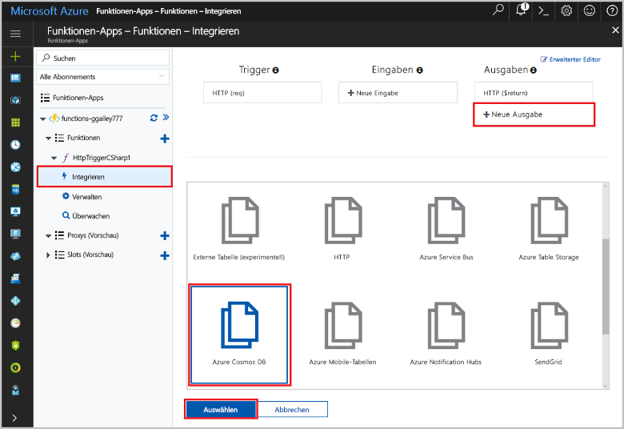
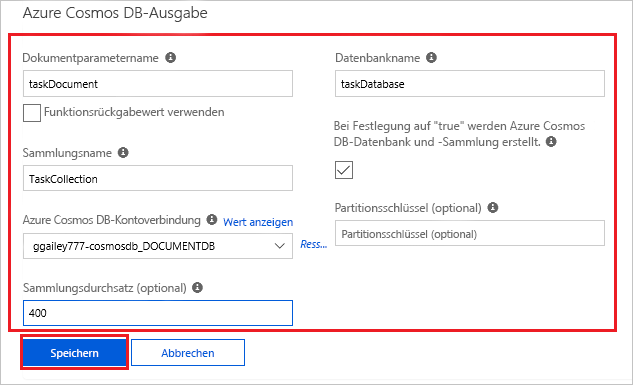
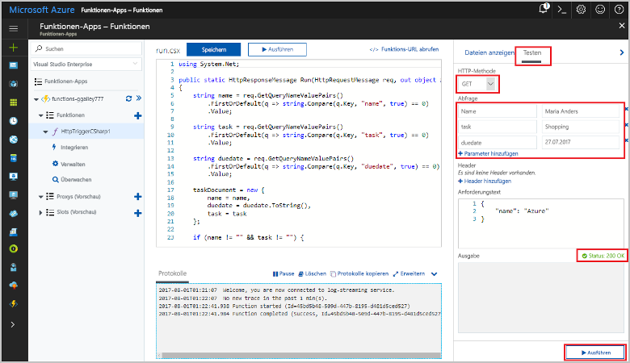
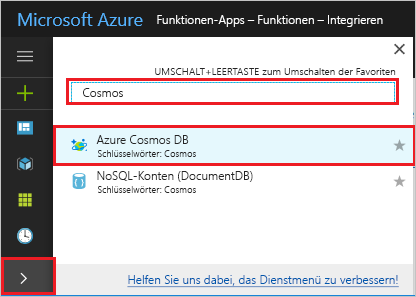
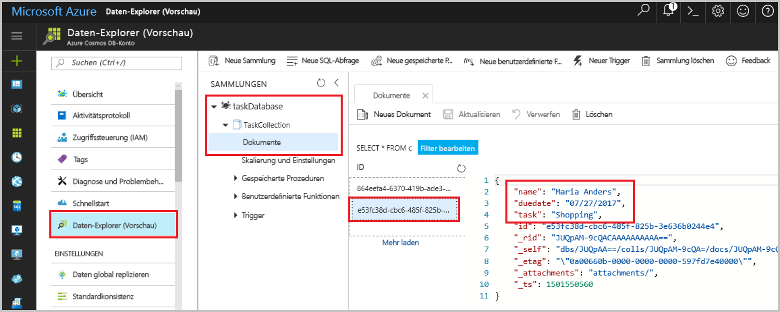

# <a name="store-unstructured-data-using-azure-functions-and-azure-cosmos-db"></a>Speichern von unstrukturierten Daten mit Azure Functions und Azure Cosmos DB

[Azure Cosmos DB](https://azure.microsoft.com/services/cosmos-db/) eignet sich hervorragend zum Speichern von unstrukturierten Daten und JSON-Daten. In Kombination mit Azure Functions ermöglicht Cosmos DB das schnelle und einfache Speichern von Daten. Dabei ist viel weniger Code erforderlich als beim Speichern von Daten in einer relationalen Datenbank.

> [!NOTE]
> Derzeit funktionieren der Azure Cosmos DB-Trigger, Eingabebindungen und Ausgabebindungen ausschließlich mit SQL- und Graph-API-Konten.

Eingabe- und Ausgabebindungen bieten in Azure Functions eine deklarative Möglichkeit, eine Verbindung mit externen Dienstdaten Ihrer Funktion herzustellen. In diesem Artikel erfahren Sie, wie Sie eine bereits vorhandene Funktion aktualisieren, um eine Ausgabebindung hinzuzufügen, die unstrukturierte Daten in einem Azure Cosmos DB-Dokument speichert.



## <a name="prerequisites"></a>Voraussetzungen

Für dieses Tutorial benötigen Sie Folgendes:

[!INCLUDE [Previous quickstart note](../../includes/functions-quickstart-previous-topics.md)]

## <a name="create-an-azure-cosmos-db-account"></a>Erstellen eines Azure Cosmos DB-Kontos

Sie müssen über ein Azure Cosmos DB-Konto verfügen, für das die SQL-API verwendet wird, bevor Sie die Ausgabebindung erstellen.

[!INCLUDE [cosmos-db-create-dbaccount](../../includes/cosmos-db-create-dbaccount.md)]

## <a name="add-an-output-binding"></a>Hinzufügen einer Ausgabebindung

1. Navigieren Sie im Portal zur Funktions-App, die Sie zuvor erstellt haben, und erweitern Sie Ihre Funktions-App und Ihre Funktion.

1. Wählen Sie **Integrieren** und anschließend **+ Neue Ausgabe** (rechts oben auf der Seite) aus. Wählen Sie **Azure Cosmos DB** aus, und klicken Sie auf **Auswählen**.

    

1. Wenn die Meldung **Erweiterungen nicht installiert** angezeigt wird, können Sie **Installieren** wählen, um die Azure Cosmos DB-Bindungserweiterung in der Funktions-App zu installieren. Die Installation kann ein oder zwei Minuten dauern.

    

1. Verwenden Sie die **Ausgabeeinstellungen für Azure Cosmos DB** wie in der folgenden Tabelle angegeben:

    

    | Einstellung      | Empfohlener Wert  | BESCHREIBUNG                                |
    | ------------ | ---------------- | ------------------------------------------ |
    | **Dokumentparametername** | taskDocument | Name, der auf das Cosmos DB-Objekt im Code verweist |
    | **Datenbankname** | taskDatabase | Name der Datenbank zum Speichern von Dokumenten |
    | **Sammlungsname** | TaskCollection | Name der Datenbanksammlung. |
    | **If true, creates the Cosmos DB database and collection** (Erstellt die Cosmos DB-Datenbank und -Sammlung, falls zutreffend) | Aktiviert | Die Sammlung ist noch nicht vorhanden und muss erstellt werden. |
    | **Azure Cosmos DB-Kontoverbindung** | Neue Einstellung | Wählen Sie **Neu** und dann Ihr **Abonnement** und das zuvor erstellte **Datenbankkonto** aus. Klicken Sie auf **Auswählen**. Eine Anwendungseinstellung für Ihre Kontoverbindung wird erstellt. Diese Einstellung wird von der Bindung verwendet, um die Verbindung mit der Datenbank herzustellen. |
    | **Sammlungsdurchsatz** |400 RU| Sie können den Durchsatz später zentral hochskalieren, wenn Sie Wartezeiten reduzieren möchten. |

1. Wählen Sie **Speichern**, um die Bindung zu erstellen.

## <a name="update-the-function-code"></a>Aktualisieren des Funktionscodes

Ersetzen Sie den vorhandenen Funktionscode durch den folgenden Code in Ihrer gewählten Sprache:

# <a name="ctabcsharp"></a>[C\#](#tab/csharp)

Ersetzen Sie die vorhandene C#-Funktion durch den folgenden Code:

```csharp
#r "Newtonsoft.Json"

using Microsoft.AspNetCore.Mvc;
using Microsoft.AspNetCore.Http;
using Microsoft.Extensions.Logging;

public static IActionResult Run(HttpRequest req, out object taskDocument, ILogger log)
{
    string name = req.Query["name"];
    string task = req.Query["task"];
    string duedate = req.Query["duedate"];

    // We need both name and task parameters.
    if (!string.IsNullOrEmpty(name) && !string.IsNullOrEmpty(task))
    {
        taskDocument = new
        {
            name,
            duedate,
            task
        };

        return (ActionResult)new OkResult();
    }
    else
    {
        taskDocument = null;
        return (ActionResult)new BadRequestResult();
    }
}
```

# <a name="javascripttabnodejs"></a>[JavaScript](#tab/nodejs)

Ersetzen Sie die vorhandene JavaScript-Funktion durch den folgenden Code:

```js
module.exports = async function (context, req) {

    // We need both name and task parameters.
    if (req.query.name && req.query.task) {

        // Set the output binding data from the query object.
        context.bindings.taskDocument = req.query;

        // Success.
        context.res = {
            status: 200
        };
    }
    else {
        context.res = {
            status: 400,
            body: "The query options 'name' and 'task' are required."
        };
    }
};
```
---

Dieses Codebeispiel liest die Abfragezeichenfolgen der HTTP-Anforderung und weist sie Feldern im `taskDocument`-Objekt zu. Die `taskDocument`-Bindung sendet die Objektdaten aus diesem Bindungsparameter zur Speicherung an die gebundene Dokumentdatenbank. Die Datenbank wird bei der erstmaligen Ausführung der Funktion erstellt.

## <a name="test-the-function-and-database"></a>Testen der Funktion und der Datenbank

1. Erweitern Sie das rechte Fenster, und wählen Sie **Test** aus. Klicken Sie unter **Abfrage** auf **+ Parameter hinzufügen**, und fügen Sie der Abfragezeichenfolge die folgenden Parameter hinzu:

    + `name`
    + `task`
    + `duedate`

1. Klicken Sie auf **Ausführen**, und vergewissern Sie sich, dass der Status „200“ zurückgegeben wird.

    

1. Erweitern Sie links im Azure-Portal die Symbolleiste, geben Sie `cosmos` in das Suchfeld ein, und wählen Sie **Azure Cosmos DB** aus.

    

1. Wählen Sie Ihr Azure Cosmos DB-Konto aus, und wählen Sie dann den **Daten-Explorer**.

1. Erweitern Sie die Knoten unter **Sammlungen**, wählen Sie das neue Dokument aus, und vergewissern Sie sich, dass es Ihre Abfragezeichenfolgen-Werte sowie einige zusätzliche Metadaten enthält.

    

Sie haben Ihrem HTTP-Trigger erfolgreich eine Bindung hinzugefügt, um unstrukturierte Daten in einer Azure Cosmos DB zu speichern.

[!INCLUDE [Clean-up section](../../includes/clean-up-section-portal.md)]

## <a name="next-steps"></a>Nächste Schritte

[!INCLUDE [functions-quickstart-next-steps](../../includes/functions-quickstart-next-steps.md)]

Weitere Informationen zu Bindungen an eine Cosmos DB-Datenbank finden Sie unter [Cosmos DB-Bindungen in Azure Functions](functions-bindings-cosmosdb.md).
