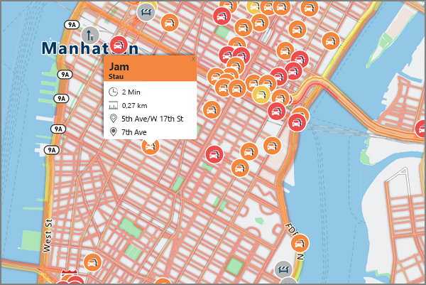

# <a name="an-introduction-to-azure-maps"></a>Einführung in Azure Maps
Bei Azure Maps handelt es sich um ein Portfolio aus Geodiensten, die Dienst-APIs für Karten, Suche, Routenplanung, Verkehrsinformationen und Zeitzonen enthalten. Das Portfolio aus Azure OneAPI-konformen Diensten ermöglicht es Ihnen, mithilfe vertrauter Entwicklungstools im Handumdrehen Lösungen für die Integration von Standortinformationen in Ihre Azure-Lösungen zu entwickeln und zu skalieren. Azure Maps stellt für Entwickler aller Branchen leistungsstarke Geofunktionen mit aktuellen Kartendaten bereit, die für einen geografischen Kontext von Webanwendungen und mobilen Anwendungen unerlässlich sind. Azure Maps umfasst verschiedene REST-APIs, die zusätzlich ein webbasiertes JavaScript-Steuerelement enthalten, um die Entwicklung auf verschiedenen Medien einfach, flexibel und portabel zu gestalten. 

Das folgende Video enthält eine Einführung zu Azure Maps:

<iframe src="https://channel9.msdn.com/Shows/Azure-Friday/Azure-Location-Based-Services/player" width="960" height="540" allowFullScreen frameBorder="0"></iframe>

Azure Maps umfasst fünf Hauptdienste für Azure-Anwendungen, für die ein geografischer Kontext erforderlich ist. Die einzelnen Dienste werden ausführlich beschrieben.

Der **Renderingdienst** ist für Entwickler konzipiert, die Web- und mobile Anwendungen mit Kartenfunktionen erstellen möchten. Für den Dienst werden entweder qualitativ hochwertige Rastergrafikbilder, die in 19 Zoomebenen verfügbar sind, oder vollständig anpassbare Vektorformat-Kartenbilder verwendet.


Der **Routendienst** umfasst stabile reale Infrastruktur-Geometrieberechnungen und Wegbeschreibungen für verschiedene Transportmodi. Entwickler können mithilfe des Diensts Wegbeschreibungen für eine Reihe von Fortbewegungsmitteln (z.B. PKW, LKW, Fahrrad oder zu Fuß) generieren. Zudem kann der Dienst Faktoren wie Verkehrslage, Gewichtsbeschränkungen oder Transport von Gefahrgütern berücksichtigen.


Der **Suchdienst** ist für Entwickler bestimmt, um nach Adressen, Orten, Geschäftseinträgen nach Name oder Kategorie und anderen geografischen Informationen zu suchen. Außerdem kann mit dem Suchdienst eine [Inverse Geocodierung](https://en.wikipedia.org/wiki/Reverse_geocoding) für Adressen und Querstraßen basierend auf dem Breiten- bzw. Längengrad durchgeführt werden. 


Mit dem **Zeitzonendienst** können Sie aktuelle, vergangene und zukünftige Zeitzoneninformationen abfragen, indem Sie entweder Breitengrad/Längengrad-Paare oder eine [IANA-ID](http://www.iana.org/) verwenden. Außerdem können Sie mit dem Zeitzonendienst Microsoft Windows-Zeitzonen-IDs in IANA-Zeitzonen konvertieren und einen Zeitzonenoffset zu UTC und die aktuelle Zeit in einer entsprechenden Zeitzone abrufen. Eine typische JSON-Antwort für eine Abfrage mit dem Zeitzonendienst sieht wie folgt aus:

```JSON
{
    "Version": "2017c",
    "ReferenceUtcTimestamp": "2017-11-20T23:09:48.686173Z",
    "TimeZones": [{
        "Id": "America/Los_Angeles",
        "ReferenceTime": {
            "Tag": "PST",
            "StandardOffset": "-08:00:00",
            "DaylightSavings": "00:00:00",
            "WallTime": "2017-11-20T15:09:48.686173-08:00",
            "PosixTzValidYear": 2017,
            "PosixTz": "PST+8PDT,M3.2.0,M11.1.0"
        }
    }]
}
```

Der **Verkehrsinfodienst** ist eine Suite von Webdiensten für Entwickler, mit denen Web- und mobile Anwendungen erstellt werden können, für die Verkehrsinformationen erforderlich sind. Der Dienst stellt zwei Typen von Daten bereit:
* Verkehrsfluss: In Echtzeit ermittelte Geschwindigkeiten und Reisezeiten für alle wichtigen Straßen des Verkehrsnetzes 
* Verkehrsunfälle: Präzise Übersicht über die Staus und Störungen bzw. Unfälle im Straßennetz



Azure Maps ist auf Mobilität ausgelegt und kann zum Betreiben von plattformübergreifenden Anwendungen verwendet werden, da das Programmiermodell agnostisch ist und die JSON-Ausgabe über REST-APIs unterstützt. Außerdem verfügt Azure Maps über ein komfortables JavaScript-Kartensteuerelement mit einem einfachen Programmiermodell zur schnellen und einfachen Entwicklung webbasierter und mobiler Anwendungen. 

Für Azure Maps wird ein schlüsselbasiertes Authentifizierungsschema verwendet. Zum Zugreifen auf die Dienste navigieren Sie also zum [Azure-Portal](http://portal.azure.com) und erstellen ein Azure Maps-Konto. Für Ihr Konto wurden zwei Schlüssel vorab generiert. Beginnen Sie damit, diese Standortfunktionen direkt in Ihre Anwendungen zu integrieren, indem Sie in den Anforderungen, die Sie an den Azure Maps-Dienst senden, einen Ihrer Schlüssel verwenden.

## <a name="unsupported-regions"></a>Nicht unterstützte Regionen
Die Azure Maps-API ist in einigen Ländern zurzeit nicht verfügbar. Überprüfen Sie Ihre aktuelle IP-Adresse, und vergewissern Sie sich, dass sie sich nicht in einem der folgenden nicht unterstützten Länder befindet:

* Argentinien
* China
* Indien
* Marokko
* Pakistan
* Südkorea

## <a name="relationship-with-bing-maps"></a>Beziehung zu Bing Maps
Die in diesem Dokument beschriebenen Karten unterscheiden sich von denen, die von Bing Maps bereitgestellt werden. Die Funktionen sind zwar größtenteils gleich, bei den beiden Diensten handelt es sich jedoch um zwei unterschiedliche, nicht zusammenhängende Dienste. Der Azure-Dienst steht nicht im Zusammenhang mit dem Produktangebot oder der Roadmap von Bing Maps.

Das Ziel von Microsoft besteht darin, der Entwicklercommunity eine Wahl bei den angebotenen Standortdiensten zu geben. Die folgende Tabelle enthält Informationen, die Entwickler bei ihrer Auswahl eines geeigneten Diensts unterstützen: 

| Szenario | Verwendung von Azure | Verwendung von Bing Maps |
| ------------- | ------------- | ------------- |
| Entwicklungsumgebung | Erstellen von Lösungen in Azure-Diensten oder Koordination mit anderen Azure-Diensten | Verwenden einer Cloud- oder anderen Entwicklungsumgebung eines Drittanbieters |
| Entwicklungsphase  | Da Azure Maps derzeit als Public Preview verfügbar ist, ist es für frühzeitige Tests und die Proof of Concept-Entwicklung optimiert. | Für eine Produktionsumgebung wird ein SLA auf Unternehmensniveau benötigt. |
| Preisoptionen | Vorläufige Preisoptionen für Entwickler ausreichend | Angepasste Preise für Unternehmen erforderlich |
| Anwendungsfallumgebung | Verwendung im Fahrzeug erforderlich | Verwendung im Fahrzeug nicht erforderlich |
| Geografische Abdeckung | Für Indien, China, Japan und Südkorea nicht erforderlich | Kartenabdeckung für Indien, China, Japan und Südkorea erforderlich |
| Karteninhalte | Standardmäßige Oberflächenkarten ausreichend | Satellitenbilder, Luftaufnahmen und Bilder auf Straßenebene erforderlich |
| Zugrunde liegende Kartenquelle | TomTom-Kartendaten bevorzugt | HERE-Kartendaten bevorzugt |

Registrieren Sie sich noch heute für ein [Azure Maps-Konto](http://aka.ms/azurelbsportal).

## <a name="next-steps"></a>Nächste Schritte

Sie haben nun einen Überblick über die Verwendung von Azure Maps erhalten. Im nächsten Schritt testen Sie eine Beispiel-App zur Veranschaulichung des Diensts.

> [!div class="nextstepaction"]
> [Demo der interaktiven Kartensuche starten](quick-demo-map-app.md)

