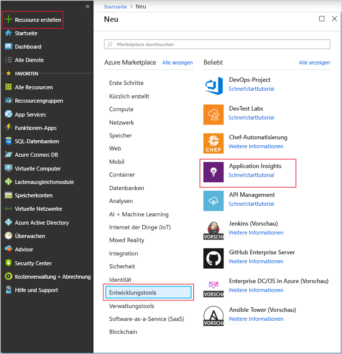
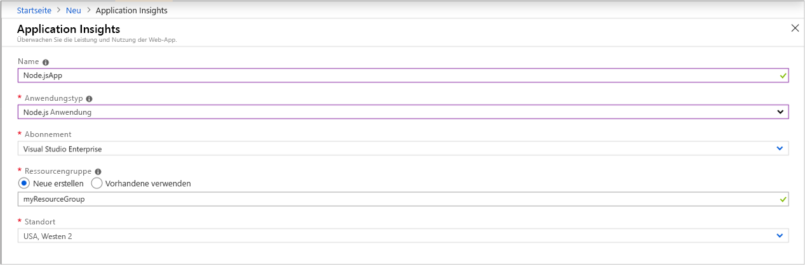
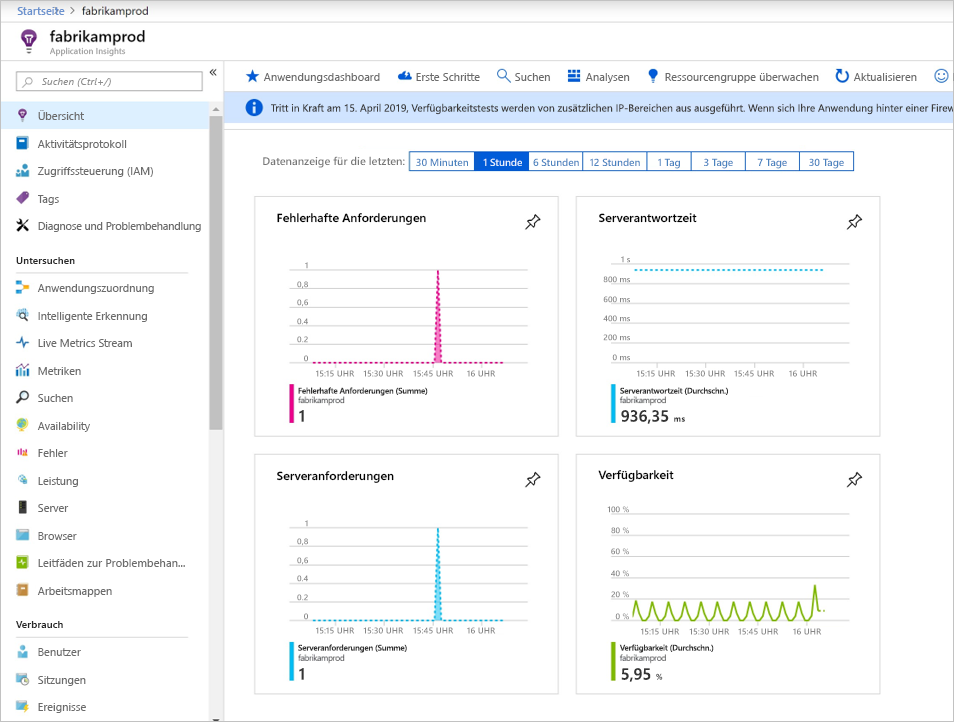
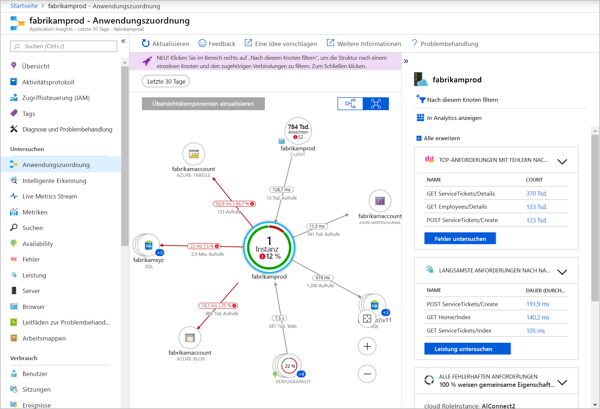
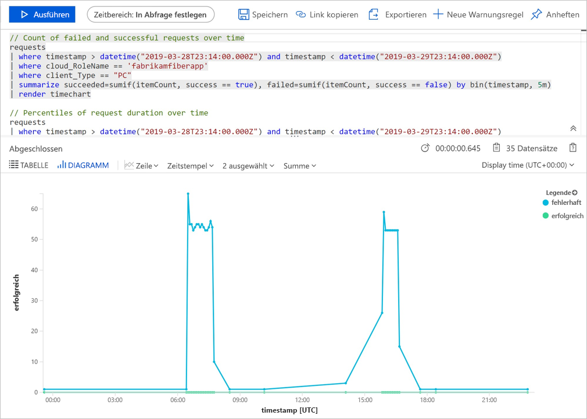
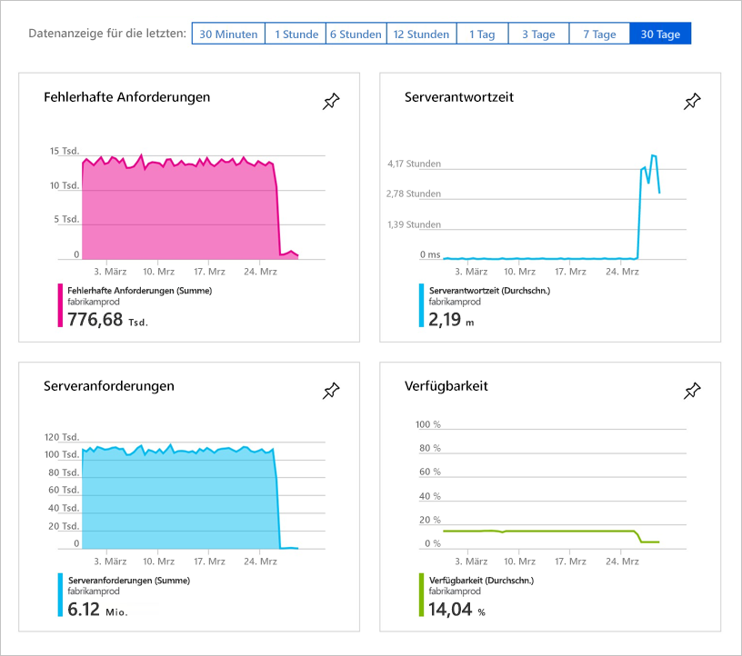
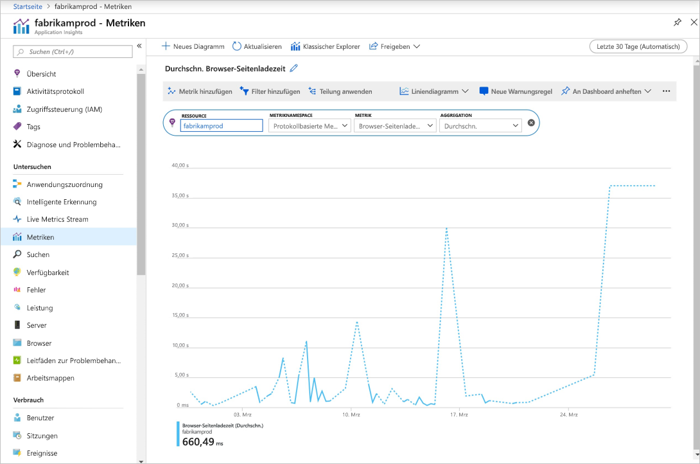

# <a name="start-monitoring-your-nodejs-web-application"></a>Starten der Überwachung Ihrer Node.js-Webanwendung

Mit Azure Application Insights können Sie die Verfügbarkeit, Leistung und Nutzung Ihrer Webanwendung ganz einfach überwachen. Sie können auch Fehler in Ihrer Anwendung schnell erkennen und diagnostizieren, ohne darauf warten zu müssen, dass diese Fehler von Benutzern gemeldet werden. Ab der SDK-Version 0.20 können Sie allgemeine Drittanbieterpakete einschließlich MongoDB, MySQL und Redis überwachen.

Diese Schnellstartanleitung führt Sie durch die notwendigen Schritte, um das Application Insights SDK für Node.js, Version 0.22, zu einer vorhandenen Node.js-Webanwendung hinzuzufügen.

## <a name="prerequisites"></a>Voraussetzungen

So führen Sie diesen Schnellstart durch:

- Sie benötigen ein Azure-Abonnement und eine vorhandene Node.js-Webanwendung.

Wenn Sie noch nicht über eine Node.js-Webanwendung verfügen, können Sie mithilfe der Schnellstartanleitung unter [Erstellen einer Node.js-Web-App](https://docs.microsoft.com/azure/app-service/app-service-web-get-started-nodejs) eine erstellen.

Wenn Sie kein Azure-Abonnement besitzen, können Sie ein [kostenloses Konto](https://azure.microsoft.com/free/) erstellen, bevor Sie beginnen.

## <a name="sign-in-to-the-azure-portal"></a>Melden Sie sich auf dem Azure-Portal an.

Melden Sie sich beim [Azure-Portal](https://portal.azure.com/) an.

## <a name="enable-application-insights"></a>Aktivieren von Application Insights

Application Insights kann Telemetriedaten von jeder mit dem Internet verbundenen Anwendung erfassen, unabhängig davon, ob die Anwendung lokal oder in der Cloud ausgeführt wird. Geben Sie folgendermaßen vor, um diese Daten anzuzeigen.

1. Klicken Sie auf **Ressource erstellen** > **Entwicklertools** > **Application Insights**.

   

   


   Ein Dialogfeld für die Konfiguration wird geöffnet. Füllen Sie die Eingabefelder anhand der Informationen in der folgenden Tabelle aus:

    | Einstellungen        | Wert           | BESCHREIBUNG  |
   | ------------- |:-------------|:-----|
   | **Name**      | Global eindeutiger Wert | Der Name, der die zu überwachende App identifiziert. |
   | **Anwendungstyp** | Node.js-Anwendung | Der Typ der zu überwachenden App. |
   | **Ressourcengruppe**     | myResourceGroup      | Der Name der neuen Ressourcengruppe, die Application Insights-Daten hosten soll. |
   | **Location** | USA (Ost) | Wählen Sie einen Standort in Ihrer Nähe oder in der Nähe des Standorts, in dem Ihre App gehostet wird. |

2. Klicken Sie auf **Create**.

## <a name="configure-app-insights-sdk"></a>Konfigurieren des Application Insights SDK

1. Wählen Sie **Übersicht** aus, und kopieren Sie den **Instrumentierungsschlüssel** Ihrer Anwendung.

   

2. Fügen Sie das Application Insights SDK für Node.js zu Ihrer Anwendung hinzu. Führen Sie folgenden Befehl im Stammverzeichnis Ihrer App aus:

   ```bash
   npm install applicationinsights --save
   ```

3. Bearbeiten Sie die erste JS-Datei Ihrer App, und fügen Sie dem obersten Teil Ihres Skripts die beiden unten stehenden Zeilen hinzu. Wenn Sie die [Node.js-Schnellstart-App](https://docs.microsoft.com/azure/app-service/app-service-web-get-started-nodejs) verwenden, bearbeiten Sie die Datei „index.js“. Ersetzen Sie &lt;instrumentation_key&gt; durch den Instrumentierungsschlüssel Ihrer Anwendung. 

   ```JavaScript
   const appInsights = require('applicationinsights');
   appInsights.setup('<instrumentation_key>').start();
   ```

4. Starten Sie die App neu.

> [!NOTE]
> Es dauert ca. 3-5 Minuten, bis die ersten Daten im Portal angezeigt werden. Wenn es sich um eine Test-App mit geringem Datenverkehr handelt, denken Sie daran, dass die meisten Metriken nur erfasst werden, wenn aktive Anforderungen oder Vorgänge vorhanden sind.

## <a name="start-monitoring-in-the-azure-portal"></a>Starten der Überwachung im Azure-Portal

1. Sie können jetzt im Azure-Portal erneut die Seite **Übersicht** für Application Insights öffnen, von der Sie den Instrumentierungsschlüssel abgerufen haben, um Details zu Ihrer aktuell ausgeführten Anwendung anzuzeigen.

   

2. Klicken Sie auf **Anwendungsübersicht**, um ein visuelles Layout der Abhängigkeitsbeziehungen zwischen den Komponenten Ihrer Anwendung zu erhalten. Jede Komponente zeigt KPIs wie z.B. Last, Leistung, Fehler und Warnungen an.

   

3. Klicken Sie auf das Symbol für die **App-Analyse**:  **In Analytics anzeigen**.  Dadurch wird die **Application Insights-Analyse** geöffnet, die eine erweiterte Abfragesprache zum Analysieren aller Daten bereitstellt, die von Application Insights gesammelt werden. In diesem Fall wird eine Abfrage für Sie generiert, die die Anzahl von Anforderungen als Diagramm darstellt. Sie können selbst Abfragen zum Analysieren anderer Daten schreiben.

   

4. Kehren Sie zur Seite **Übersicht** zurück, und untersuchen Sie die KPI-Graphen.  Dieses Dashboard zeigt Statistiken zur Integrität Ihrer Anwendung, einschließlich der Anzahl von eingehenden Anforderungen, der Dauer dieser Anforderungen und aller auftretenden Fehler.

   

   Damit das Diagramm **Ladezeit der Seitenansicht** mit **clientseitigen Telemetriedaten** aufgefüllt werden kann, fügen Sie dieses Skript zu jeder Seite hinzu, die Sie nachverfolgen möchten:

   ```HTML
   <!-- 
   To collect user behavior analytics tools about your application, 
   insert the following script into each page you want to track.
   Place this code immediately before the closing </head> tag,
   and before any other scripts. Your first data will appear 
   automatically in just a few seconds.
   -->
   <script type="text/javascript">
     var appInsights=window.appInsights||function(config){
       function i(config){t[config]=function(){var i=arguments;t.queue.push(function(){t[config].apply(t,i)})}}var t={config:config},u=document,e=window,o="script",s="AuthenticatedUserContext",h="start",c="stop",l="Track",a=l+"Event",v=l+"Page",y=u.createElement(o),r,f;y.src=config.url||"https://az416426.vo.msecnd.net/scripts/a/ai.0.js";u.getElementsByTagName(o)[0].parentNode.appendChild(y);try{t.cookie=u.cookie}catch(p){}for(t.queue=[],t.version="1.0",r=["Event","Exception","Metric","PageView","Trace","Dependency"];r.length;)i("track"+r.pop());return i("set"+s),i("clear"+s),i(h+a),i(c+a),i(h+v),i(c+v),i("flush"),config.disableExceptionTracking||(r="onerror",i("_"+r),f=e[r],e[r]=function(config,i,u,e,o){var s=f&&f(config,i,u,e,o);return s!==!0&&t["_"+r](config,i,u,e,o),s}),t
       }({
           instrumentationKey:"<insert instrumentation key>"
       });
       
       window.appInsights=appInsights;
       appInsights.trackPageView();
   </script>
   ```

5. Klicken Sie auf der linken Seite auf **Metriken**. Untersuchen Sie mithilfe des Metrik-Explorers die Integrität und Auslastung Ihrer Ressource. Sie können auf **Neues Diagramm hinzufügen** klicken, um zusätzliche benutzerdefinierte Ansichten zu erstellen, oder auf **Bearbeiten** klicken, um Typ, Höhe, Farbpalette, Gruppierungen und Metriken der vorhandenen Diagramme zu ändern. Sie können beispielsweise ein Diagramm für die durchschnittliche Seitenladezeit des Browsers erstellen, indem Sie in der Metrik-Dropdownliste die Option für die Browser-Seitenladezeit und unter „Aggregation“ die Durchschnittsoption auswählen. Weitere Informationen zum Azure-Metrik-Explorer finden Sie unter [Erste Schritte mit dem Azure-Metrik-Explorer](../../azure-monitor/platform/metrics-getting-started.md).

   

Weitere Informationen zum Überwachen von Node.js finden Sie in der [weiteren Dokumentation zu Application Insights und Node.js](../../azure-monitor/app/nodejs.md).

## <a name="clean-up-resources"></a>Bereinigen von Ressourcen

Wenn Sie die Tests abgeschlossen haben, können Sie die Ressourcengruppe und alle dazugehörigen Ressourcen löschen. Gehen Sie dazu wie folgt vor:

1. Klicken Sie im Azure-Portal im Menü auf der linken Seite auf **Ressourcengruppen** und dann auf **myResourceGroup**.
2. Klicken Sie auf der Seite mit Ihrer Ressourcengruppe auf **Löschen**, geben Sie im Textfeld **myResourceGroup** ein, und klicken Sie dann auf **Löschen**.

## <a name="next-steps"></a>Nächste Schritte

> [!div class="nextstepaction"]
> [Suchen nach und Diagnostizieren von Leistungsproblemen](https://docs.microsoft.com/azure/application-insights/app-insights-analytics)
