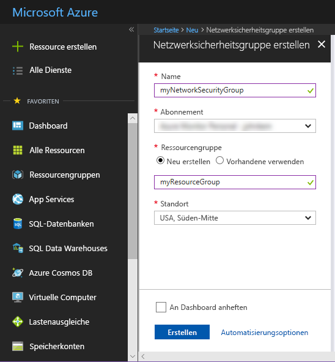
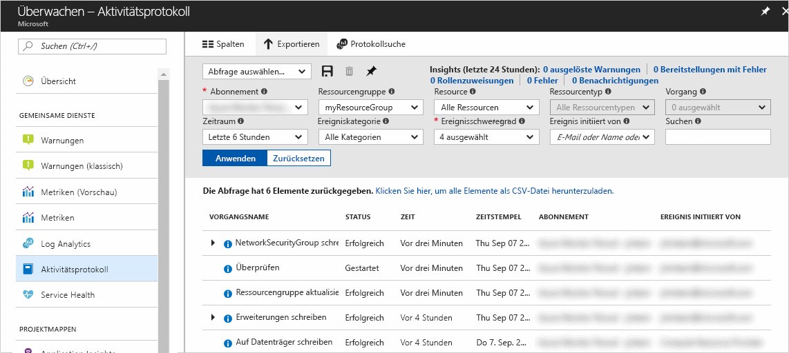
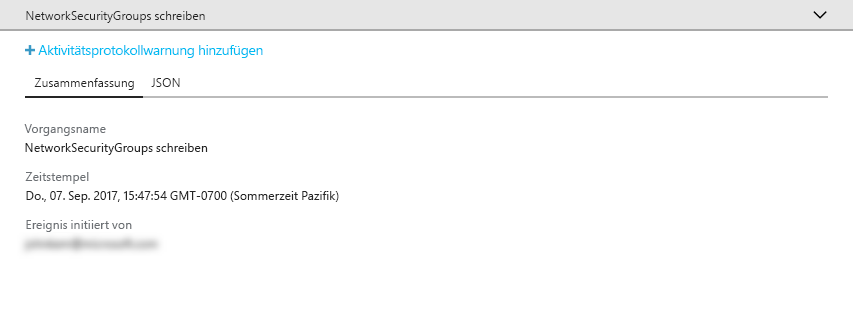
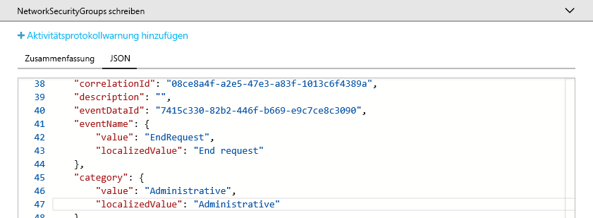
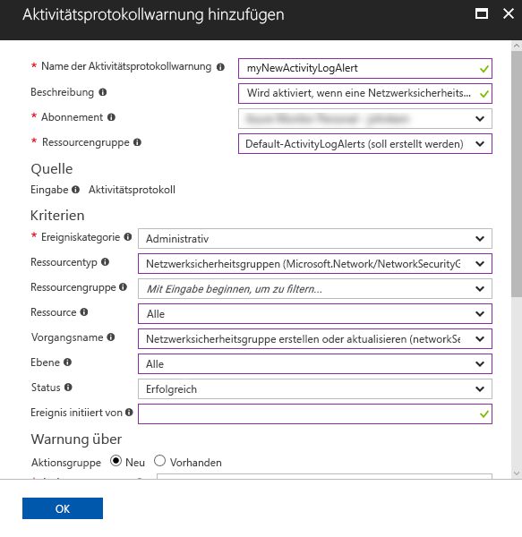
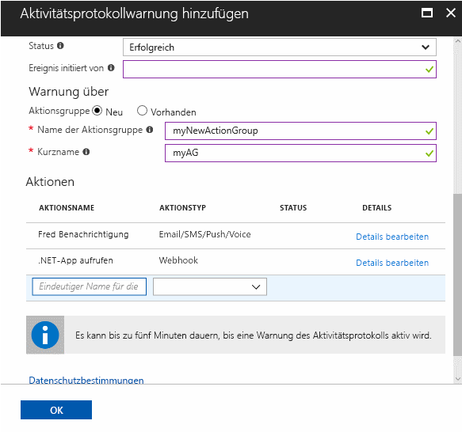

# Überwachen und Empfangen von Benachrichtigungen zu wichtigen Aktionen im Azure-Abonnement

Das **Azure-Aktivitätsprotokoll** zeigt den Verlauf der Ereignisse auf Abonnementebene in Azure an. Darüber hinaus enthält es Informationen darüber, *welche Ressourcen* von *welcher Person* zu einem bestimmten *Zeitpunkt* erstellt, aktualisiert oder gelöscht wurden. Sie können eine **Aktivitätsprotokollwarnung** erstellen, um E-Mail-, SMS- oder Webhookbenachrichtigungen zu erhalten, wenn eine Ihren Warnungsbedingungen entsprechende Aktivität auftritt. In diesem Schnellstart wird gezeigt, wie Sie eine einfache Netzwerksicherheitsgruppe erstellen, das Aktivitätsprotokoll zum Abrufen von Informationen über das aufgetretene Ereignis durchsuchen und dann eine Aktivitätsprotokollwarnung erstellen, um eine Benachrichtigung zu erhalten, wenn im weiteren Verlauf Netzwerksicherheitsgruppen erstellt werden.

Wenn Sie kein Azure-Abonnement besitzen, können Sie ein [kostenloses Konto](https://azure.microsoft.com/free/) erstellen, bevor Sie beginnen.

## Anmelden beim Azure-Portal

Melden Sie sich beim [Azure-Portal](https://portal.azure.com/)an.

## Erstellen einer Netzwerksicherheitsgruppe

1. Klicken Sie in der linken oberen Ecke des Azure-Portals auf die Schaltfläche **Ressource erstellen**.

2. Wählen Sie die Option **Netzwerk** und dann **Netzwerksicherheitsgruppe** aus.

3. Geben Sie „myNetworkSG“ als **Name** ein, und erstellen Sie eine neue Ressourcengruppe namens **myResourceGroup**. Klicken Sie auf die Schaltfläche **Erstellen** .

    

## Durchsuchen des Aktivitätsprotokolls im Portal

Ein Ereignis wurde nun zum Aktivitätsprotokoll hinzugefügt, das die Erstellung der Netzwerksicherheitsgruppe beschreibt. Befolgen Sie die nachstehenden Anweisungen zum Identifizieren des Ereignisses.

1. Klicken Sie im Navigationsbereich auf der linken Seite auf die Schaltfläche **Überwachen**. Daraufhin wird der Abschnitt „Aktivitätsprotokoll“ geöffnet. Dieser Abschnitt enthält den Verlauf sämtlicher Aktionen, die Benutzer für Ressourcen in Ihrem Abonnement durchgeführt haben. Diese können nach verschiedenen Eigenschaften wie **Ressourcengruppe**, **Zeitraum**, und **Kategorie** gefiltert werden.

2. Klicken Sie im Abschnitt **Aktivitätsprotokoll** auf die Dropdownliste **Ressourcengruppe**, und wählen Sie **myResourceGroup** aus. Wählen Sie in der Dropdownliste **Zeitraum** die Option **Letzte Stunde**. Klicken Sie auf **Anwenden**.

    

3. Klicken Sie in der Tabelle der angezeigten Ereignisse auf das Ereignis **Netzwerksicherheitsgruppen schreiben**.

## Durchsuchen eines Ereignisses im Aktivitätsprotokoll

Der angezeigte Abschnitt enthält grundlegende Informationen zum durchgeführten Vorgang, wie Name, Zeitstempel und Benutzer oder Anwendung, der bzw. die diesen Vorgang durchgeführt hat.

Klicken Sie auf die Registerkarte **JSON**, um die gesamten Ereignisdetails anzuzeigen. Hierzu zählen Details zur Art der Autorisierung des Benutzers bzw. der Anwendung für die Durchführung des Vorgangs, der Kategorie und Ebene des Ereignisses sowie dem Status des Vorgangs.

## Erstellen einer Aktivitätsprotokollwarnung

1. Klicken Sie auf die Registerkarte **Zusammenfassung**, um zur Ereigniszusammenfassung zurückzukehren.

2. Klicken Sie im Abschnitt „Zusammenfassung“, der angezeigt wird, auf **Aktivitätsprotokollwarnung hinzufügen**.

    

3. Fügen Sie im Abschnitt, der angezeigt wird, einen Namen und eine Beschreibung für die Aktivitätsprotokollwarnung hinzu.

4. Stellen Sie sicher, dass unter **Kriterien** die Option **Ereigniskategorie** auf **Administrativ**, **Ressourcentyp** auf **Netzwerksicherheitsgruppen**, **Vorgangsname** auf **Netzwerksicherheitsgruppe erstellen oder aktualisieren**, **Status** auf **Erfolgreich** festgelegt und alle anderen Kriterienfelder entweder leer oder auf **Alle** festgelegt sind. Die Kriterien definieren die Regeln, anhand derer bestimmt wird, ob die Warnung aktiviert werden soll, wenn ein neues Ereignis im Aktivitätsprotokoll angezeigt wird.

    

5. Wählen Sie unter **Warnung über** die Aktionsgruppe **Neu** aus, und geben Sie einen **Namen** und einen **Kurznamen** für die Aktionsgruppe an. Die Aktionsgruppe definiert die Gruppe von Aktionen, die durchgeführt wurde, als die Warnung aktiviert wurde (sofern die Kriterien auf ein neues Ereignis zutreffen).

6. Fügen Sie unter **Aktionen** mindestens eine Aktion hinzu, indem Sie unter **Name** einen Namen für die Aktion, unter **Aktionstyp** den Aktionstyp (beispielsweise „E-Mail“, „SMS“ oder „Webhook“) und unter **Details** Details zum jeweiligen Aktionstyp (beispielsweise eine Webhook-URL, eine E-Mail-Adresse oder eine Telefonnummer für den SMS-Versand) angeben.

    

7. Klicken Sie auf **OK**, um die Aktivitätsprotokollwarnung zu speichern.

## Testen der Aktivitätsprotokollwarnung

> [!NOTE]
> Eine Aktivitätsprotokollwarnung ist nach etwa fünf Minuten vollständig aktiviert. Bei neuen Ereignissen, die auftreten, bevor die Aktivitätsprotokollwarnung endgültig aktiviert ist, werden keine Benachrichtigungen generiert.
>
>

Um die Warnung zu testen, wiederholen Sie die im vorherigen Abschnitt **Erstellen einer Netzwerksicherheitsgruppe** beschriebenen Schritte, vergeben Sie jedoch einen anderen Namen für diese Netzwerksicherheitsgruppe, und verwenden Sie erneut die vorhandene Ressourcengruppe. Innerhalb weniger Minuten erhalten Sie eine Benachrichtigung, die besagt, dass die Netzwerksicherheitsgruppe erstellt wurde.

## Bereinigen von Ressourcen

Löschen Sie die Ressourcengruppe und Netzwerksicherheitsgruppe, wenn Sie sie nicht mehr benötigen. Geben Sie hierfür in das Suchfeld oben im Portal den Namen der erstellten Ressourcengruppe ein, und klicken Sie auf den Namen der Ressourcengruppe. Klicken Sie im Abschnitt, der angezeigt wird, auf die Schaltfläche **Ressourcengruppe löschen**, geben Sie den Namen der Ressourcengruppe ein, und klicken Sie auf **Löschen**.

## Nächste Schritte

In diesem Schnellstart haben Sie einen Vorgang zum Generieren eines Aktivitätsprotokollereignisses generiert und anschließend eine Aktivitätsprotokollwarnung erstellt, um benachrichtigt zu werden, wenn dieser Vorgang in Zukunft erneut auftreten sollte. Danach haben Sie die Warnung durch erneutes Ausführen dieses Vorgangs getestet. Azure stellt die Aktivitätsprotokollereignisse der letzten 90 Tage zur Verfügung. Falls Sie Ereignisse länger als 90 Tage beibehalten müssen, archivieren Sie Ihre Aktivitätsprotokolldaten zusammen mit anderen Überwachungsdaten.

> [!div class="nextstepaction"]
> [Archivieren von Überwachungsdaten](./../../azure-monitor/learn/tutorial-archive-data.md)

