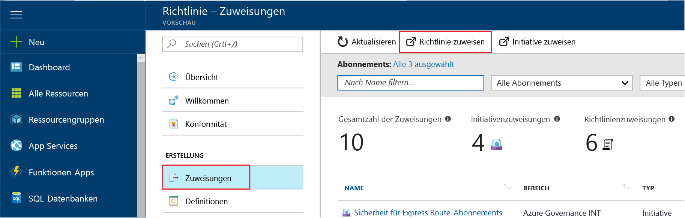
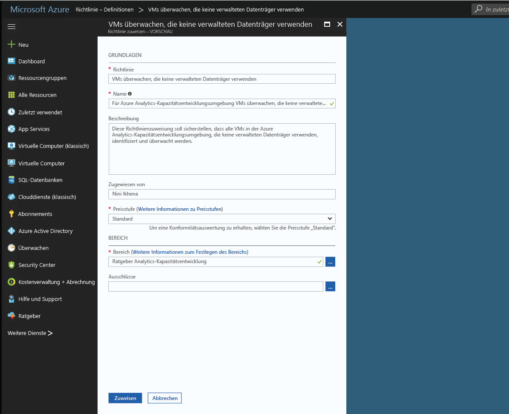
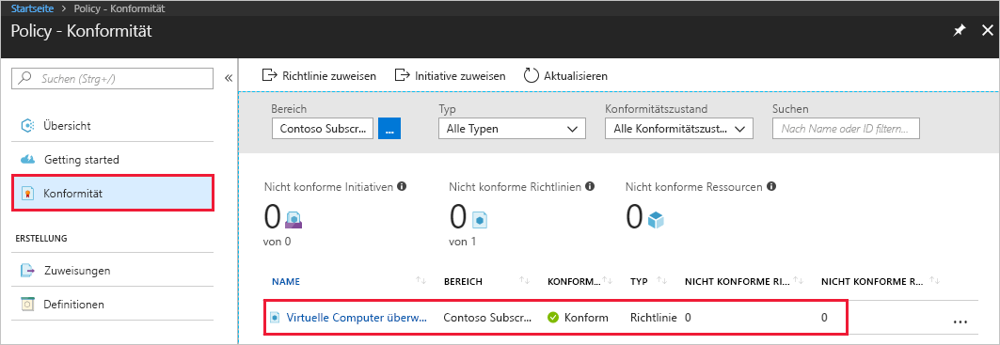
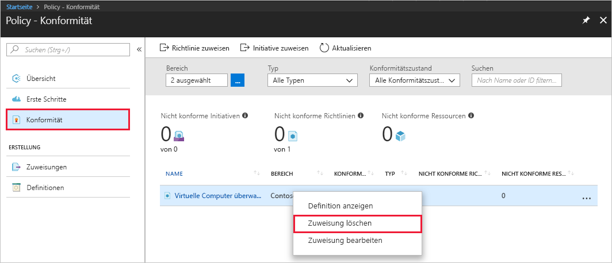

# Erstellen einer Richtlinienzuweisung zum Identifizieren nicht konformer Ressourcen in Ihrer Azure-Umgebung
Zum Verständnis der Konformität in Azure müssen Sie zunächst wissen, wo Sie derzeit mit Ihren eigenen Ressourcen stehen. Diese Schnellstartanleitung führt Sie schrittweise durch die Erstellung einer Richtlinienzuweisung zur Identifizierung von Ressourcen, die nicht die SQL Server-Version 12.0 verwenden. Am Ende dieses Prozesses haben Sie erfolgreich identifiziert, welche Server eine andere Version besitzen und somit *nicht konform* sind.

Wenn Sie kein Azure-Abonnement besitzen, können Sie ein [kostenloses Konto](https://azure.microsoft.com/free/?WT.mc_id=A261C142F) erstellen, bevor Sie beginnen.

## Registrieren für Azure Policy

Azure Policy ist jetzt in der eingeschränkten Vorschau verfügbar und kann erst nach vorheriger Registrierung verwendet werden.

1. Navigieren Sie zu Azure Policy (https://aka.ms/getpolicy), und klicken Sie im linken Bereich auf **Registrieren**.

   

2. Registrieren Sie sich für Azure Policy, indem Sie in der Abonnementliste**** die gewünschten Abonnements auswählen. Klicken Sie anschließend auf **Register** (Registrieren).

   

   Bei hoher Nachfrage kann es mehrere Tage dauern, bis wir Ihre Registrierungsanforderung akzeptieren. Wenn Ihre Anforderung akzeptiert wurde, werden Sie per E-Mail darüber informiert, dass Sie den Dienst nun verwenden können.

## Erstellen einer Richtlinienzuweisung

In dieser Schnellstartanleitung erstellen wir eine Richtlinienzuweisung und weisen die Definition *Require SQL Server version 12.0* (SQL Server-Version 12.0 fordern) zu. 

1. Klicken Sie im linken Bereich der Seite „Azure Policy“ auf **Zuweisungen**.
2. Klicken Sie im oberen Bereich der Seite **Zuweisungen** auf **Richtlinie zuweisen**.

   

3. Klicken Sie auf der Seite **Richtlinie zuweisen** neben dem Feld **Richtlinie** auf die Schaltfläche , um die Liste mit den verfügbaren Definitionen zu öffnen.

   

   Azure Policy umfasst bereits integrierte Richtliniendefinitionen, die Sie verwenden können. Ihnen werden integrierte Richtliniendefinitionen wie die folgenden angezeigt:

   - Enforce tag and its value (Tag und zugehörigen Wert erzwingen)
   - Apply tag and its value (Tag und zugehörigen Wert anwenden)
   - Require SQL Server version 12.0 (SQL Server-Version 12.0 fordern)

4. Suchen Sie in den Richtliniendefinitionen nach der Definition *Require SQL Server version 12.0* (SQL Server-Version 12.0 fordern). Klicken Sie auf diese Richtlinie und anschließend auf **Auswählen**.

   

5. Geben Sie einen Anzeigenamen**** für die Richtlinienzuweisung an. In diesem Beispiel verwenden wir *Require SQL Server version 12.0* (SQL Server-Version 12.0 fordern). Geben Sie ggf. auch eine **Beschreibung** ein. In der Beschreibung wird erläutert, dass diese Richtlinienzuweisung sicherstellt, dass in dieser Umgebung nur SQL Server-Instanzen der Version 12.0 erstellt werden.
6. Ändern Sie den Tarif in **Standard**, um sicherzustellen, dass die Richtlinie auf bereits vorhandene Ressourcen angewendet wird.

   In Azure Policy stehen zwei Tarife zur Verfügung: *Free* und *Standard*. Mit dem Free-Tarif können Richtlinien nur für zukünftige Ressourcen erzwungen werden. Mit dem Standard-Tarif können Sie Richtlinien hingegen auch für bereits vorhandene Ressourcen erzwingen und Ihren Konformitätszustand besser nachvollziehen. Da es sich hierbei um eine eingeschränkte Vorschauversion handelt, haben wir noch kein Preismodell veröffentlicht, und Ihnen entstehen durch die Wahl von *Standard* keine Kosten. Weitere Informationen zu Preisen finden Sie auf der [Preisseite für Azure Policy](https://acom-milestone-ignite.azurewebsites.net/pricing/details/azure-policy/).

7. Wählen Sie den **Bereich** aus, auf den die Richtlinie angewendet werden soll.  Ein Bereich bestimmt, für welche Ressourcen oder Ressourcengruppe die Richtlinienzuweisung erzwungen wird. Er kann von einem Abonnement bis zu Ressourcengruppen reichen.
8. Wählen Sie das Abonnement (oder die Ressourcengruppe) aus, das bzw. die Sie zuvor im Rahmen der Registrierung für Azure Policy registriert haben. In diesem Beispiel verwenden wir das Abonnement **Azure Analytics Capacity Dev**. (Ihre Optionen werden sich davon unterscheiden.)

   

9. Wählen Sie **Zuweisen** aus.

Sie können nun nicht konforme Ressourcen identifizieren, um den Konformitätszustand Ihrer Umgebung nachzuvollziehen.

## Identifizieren nicht konformer Ressourcen

Klicken Sie im linken Bereich auf **Konformität**, und suchen Sie nach der von Ihnen erstellten Richtlinienzuweisung.

Falls Ressourcen vorhanden sind, die mit dieser neuen Zuweisung nicht konform sind, werden diese auf der Registerkarte **Non-compliant resources** (Nicht konforme Ressourcen) angezeigt.

Wenn eine Bedingung für einige Ihrer vorhandenen Ressourcen als erfüllt ausgewertet wird, werden diese Ressourcen als nicht mit der Richtlinie konform markiert. Die folgende Tabelle gibt Aufschluss über das Zusammenspiel zwischen den verschiedenen derzeit verfügbaren Aktionen, dem Ergebnis der Bedingungsauswertung und dem Konformitätszustand Ihrer Ressourcen:

|Ressource  |Auswertungsergebnis für die Richtlinienbedingung  |Aktion in der Richtlinie   |Konformitätszustand  |
|-----------|---------|---------|---------|
|Exists     |true     |VERWEIGERN     |Nicht konform |
|Exists     |False    |VERWEIGERN     |Konform     |
|Exists     |true     |Anfügen   |Nicht konform |
|Exists     |False    |Anfügen   |Konform     |
|Exists     |true     |Audit    |Nicht konform |
|Exists     |False    |Audit    |Nicht konform |

## Bereinigen von Ressourcen

Andere Leitfäden in dieser Sammlung bauen auf dieser Schnellstartanleitung auf. Wenn Sie mit weiteren Tutorials fortfahren möchten, überspringen Sie die Bereinigung der Ressourcen, die im Rahmen dieser Schnellstartanleitung erstellt wurden. Falls Sie nicht fortfahren möchten, können Sie die folgenden Schritte ausführen, um alle erstellten Ressourcen dieses Schnellstarts im Azure-Portal zu löschen.
1. Klicken Sie im linken Bereich auf **Zuweisungen**.
2. Suchen Sie nach der zuvor erstellten Zuweisung.

   

3.  Klicken Sie auf **Zuweisung löschen**.

## Nächste Schritte

In dieser Schnellstartanleitung haben Sie eine Richtliniendefinition einem Bereich zugewiesen, um die Konformität aller Ressourcen in diesem Bereich sicherzustellen und nicht konforme Ressourcen zu identifizieren.

Weitere Informationen zum Zuweisen von Richtlinien, die die Konformität **zukünftig** erstellter Ressourcen sicherstellen, finden Sie im folgenden Tutorial:

> [!div class="nextstepaction"]
> [Erstellen und Verwalten von Richtlinien](./create-manage-policy.md)

